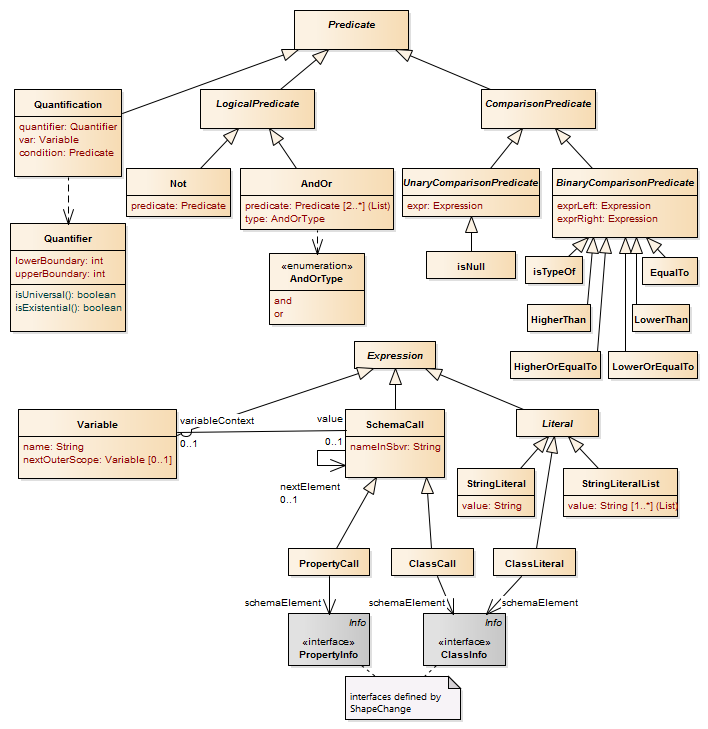

:doctype: book
:encoding: utf-8
:lang: en
:toc: macro
:toc-title: Table of contents
:toclevels: 5

:toc-position: left

:appendix-caption: Annex

:numbered:
:sectanchors:
:sectnumlevels: 5
:nofooter:

[[Constraints]]
= Constraints

[[Introduction]]
== Introduction

An application schema defines the logical structure of geographic
information and its semantics. In the context of the ISO 19100 set of
standards, the primary means to do so is object-oriented modelling as
described in UML, more specifically UML structure diagrams.

Some rules and conditions that apply to an object cannot be expressed
via a UML diagram. They can be specified in textual form using so called
_constraints_. Different languages exist to express constraints. They
vary with respect to the degree of standardization, and the degree of
formalization.

ShapeChange supports a number of constraint languages. The following
sections provide further information for each of them.

[[Common_Aspects]]
== Common Aspects

Certain parameters in the input element of a ShapeChange configuration
file control how constraints are handled while loading a model:

* checkingConstraints
* classTypesToCreateConstraintsFor
* constraintCreationForProperties
* oclConstraintTypeRegex
* folConstraintTypeRegex

(More detailed information for each of these parameters is given on
xref:../get started/The_element_input.adoc#Parameters[the element
"input"] page.)

These parameters can be used to specify for which types of model
elements constraints shall be loaded, and if constraints should be
loaded at all. They also control which types of constraints are
generated.

All constraints are expressed textually - involving more or less
formalism depending upon the chosen constraint language. While
documenting model elements, the
xref:../targets/feature catalogue/Feature_Catalogue.adoc[feature catalogue
target] will include the textual representation of constraints defined
and loaded for these elements.

[[Object_Constraint_Language_OCL]]
== Object Constraint Language (OCL)

The standardized means to express constraints for application schema
elements is OCL. It is a https://www.omg.org/spec/OCL/[standard of the
Object Management Group (OMG)]. ISO 19103 "identifies the combination of
UML static structure diagrams with its associated Object Constraint
Language [...] as the conceptual schema language for specification of
geographic information".

ShapeChange can parse OCL constraints that are defined in a schema. It
supports the derivation of Schematron rules from OCL constraints. See
the xref:../targets/xml schema/OCL_Conversion_to_Schematron_xslt2_query_binding.adoc[OCL Conversion
to Schematron] page for further information.

[[Human_Readable_Text]]
== Human Readable Text

The most simple way to express constraints is to use pure human readable
text. It is not possible to automatically derive any artifacts (e.g.
Schematron rules) from these constraints, because they do not follow a
structural convention. However, they are a means to document model
constraints, both in the UML model itself but also documentation derived
from it (such as feature catalogues). Also, they can serve as a first
step towards the definition of more formalized constraints (e.g. OCL).

ShapeChange loads constraints as pure (human readable) text constraints
whenever the type of a given constraint is unknown. OCL and FOL
constraints can be loaded as text constraints (so without further
parsing and thus also without the possibility to derive artifacts such
as Schematron rules from them) when the according regex parameters in
the input element of the ShapeChange configuration
(oclConstraintTypeRegex and folConstraintTypeRegex) are set to the empty
string.

[[First_Order_Logic_FOL]]
== First Order Logic (FOL)

(Beta)

Within the OGC Testbed 11 constraints that were represented using
structured english based on SBVR (Semantics of Business Vocabulary and
Business Rules) have been loaded and parsed by ShapeChange, and
ultimately translated to Schematron rules. While parsing the constraint
text the constraint information has been translated into an intermediate
language, the First Order Logic (FOL) language. This language is based
on predicate expressions. The following figure provides an overview of
the supported language constructs.

FOL expressions can potentially be parsed from different sources. The
currently supported source type is 'SBVR'. To learn more about the
supported SBVR grammar, see the
_https://portal.opengeospatial.org/files/?artifact_id=63794[OGC Testbed
11 Aviation - Guidance on Using SBVR Engineering Report]_.

Schematron rules can be derived from FOL constraints using the
xref:../targets/fol to schematron/First_Order_Logic_FOL_to_Schematron.adoc[FOL
to Schematron target].

 
