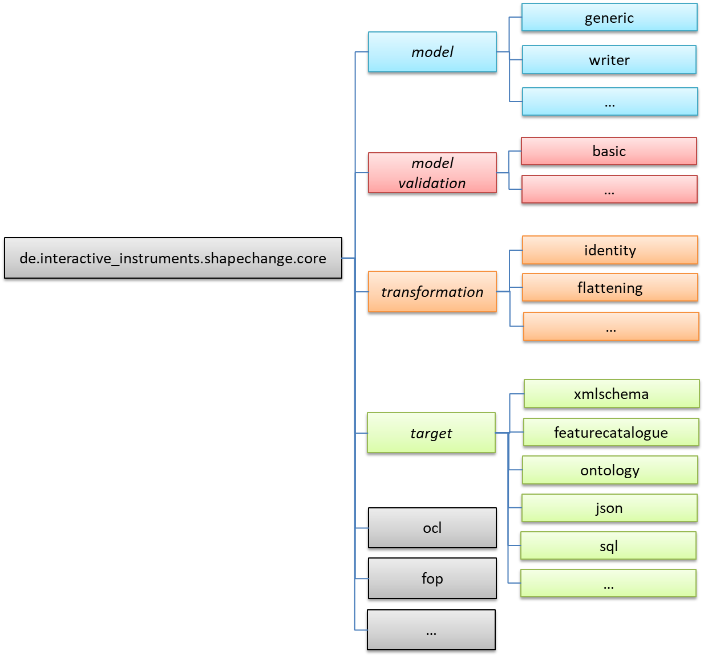
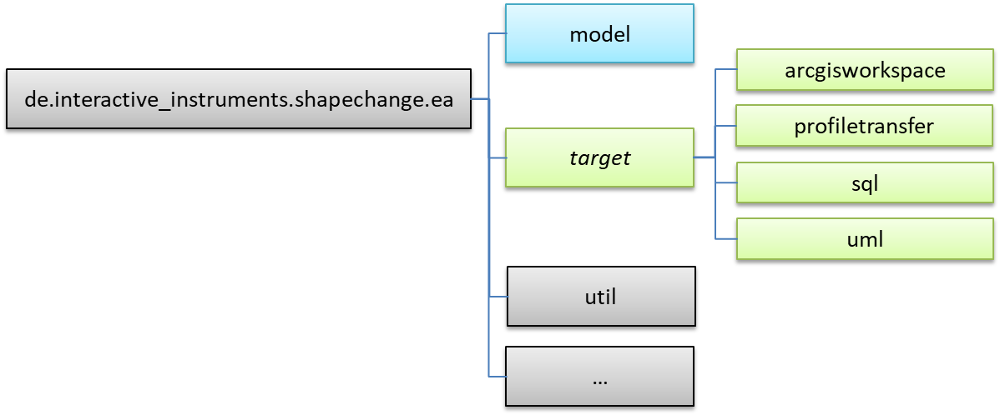

:doctype: book
:encoding: utf-8
:lang: en
:toc: macro
:toc-title: Table of contents
:toclevels: 5

:toc-position: left

:appendix-caption: Annex

:numbered:
:sectanchors:
:sectnumlevels: 5
:nofooter:

[[Packages]]
= Packages

[[Overview]]
== Overview

ShapeChange is a Java tool that can be executed as a stand-alone application 
from the command line. ShapeChange can also be
integrated in other Java applications, by adding the ShapeChange core and, 
optionally, the ShapeChange ea libraries as dependencies.

The software tool is provided with
a xref:./Configuration.adoc[configuration file] that defines the ShapeChange
workflow, including the format and location of the input file, log
settings, and output parameters (format and output directory, among
others).  When the tool is initialized, the appropriate model import facility
is first called to read the application schema in UML (whether in EA repository, SCXML, 
or another format) into internal memory. The software then processes
the model. The model can undergo a number of transformations before it
is turned into one or more target representations.
Finally, the processed model is output to the chosen target
representation(s) as specified in the configuration file, and error,
warning and informational messages are written to a xref:./The_element_log.adoc[log
file]. Before any transformer and target is executed for a given model, 
xref:./The_element_validators.adoc[validators] can be run to check the 
model content. 

[[Package_Overview]]
== Package Overview

The ShapeChange software is modular:

* The _core_ module contains all the logic for executing a ShapeChange workflow. 
It contains the code for reading SCXML and XMI formatted UML models,
model transformations, model validators, and most of the ShapeChange targets.
* The _ea_ module contains code that uses the automation interface of 
Sparx Systems _Enterprise Architect_ (EA), to read a UML model from an EA repository,
and targets to create specific models in EA repositories.
* The _app_ module contains the main Java class for executing ShapeChange
from the command line. It also contains the whole documentation,
as well as all resources and code to create the complete
xref:./Distribution_contents.adoc[distribution package].

NOTE: ShapeChange defines a number of interfaces, which allow for 
the specification of additional input formats, transformations, 
validators, and targets. For further details, see the guide on
xref:./How_to_extend_ShapeChange.adoc[how to extend ShapeChange].

The following diagram is an overview of the package dependencies within
the ShapeChange _core_ module:

The package de.interactive_instruments.shapechange.core contains the main
classes of ShapeChange.

The package de.interactive_instruments.shapechange.core.model is the main
extension point on the input side. It specifies an interface for all
sources of models that ShapeChange can process. Currently, 
three types of models supported:

* Sparx Systems Enterprise Architect models accessed via the Enterprise
Architect automation interface (requires the ShapeChange ea module, more
details given <<shapechange_ea_module,below>>)
* ShapeChange XML (SCXML) - an XML format that can be produced by the xref:../targets/Model_Export.adoc[Model export target]
* XMI 1.0 / UML 1.3 models as exported by Rational Rose (Unisys
exporter) or ArgoUML
** NOTE: Support for XMI is out of active maintenance. 

It is also possible to perform additional model transformations before
the conversion to target representations, by implementing the de.interactive_instruments.shapechange.core.transformation.Transformer interface. 
Available transformations are described in more detail
xref:../transformations/Transformations.adoc[here].

NOTE: The de.interactive_instruments.shapechange.core.model.Transformer
interface was defined before work on the general transformation
mechanism started. Nowadays, model transformations should be realized 
via the general mechanism.

The package de.interactive_instruments.shapechange.core.target is the main
extension point on the output side. It specifies an interface for all
output derived from models, e.g. XML schemas. These are described in
more detail xref:../targets/Output_Targets.adoc[here].

The package de.interactive_instruments.shapechange.core.modelvalidation 
contains the interface that model validators need to implement. They 
are described in more detail xref:../model validators/ModelValidators.adoc[here].

In addition, there are helper packages for specific purposes, e.g.
processing OCL constraints, using FOP in targets or for a graphical user
interface to edit ShapeChange configuration parameters during runtime.

The following diagram is an overview of the package dependencies within
the ShapeChange _ea_ module:

[[shapechange_ea_module]]

Package de.interactive_instruments.shapechange.ea.model contains
the classes needed for reading a UML model from an Enterprise Architect
repository.

The package de.interactive_instruments.shapechange.ea.target contains 
ShapeChange targets that write to an EA repository, e.g. an ArcGIS workspace
model, or profile information.

IMPORTANT: In order to interact with Enterprise Architect repositories, an 
application needs to include both _ShapeChange core_ and _ShapeChange ea_ as dependencies. 
Furthermore, the application also needs to put the eaapi.jar needed
by _ShapeChange ea_ on the classpath. That library can be found in the 
Enterprise Architect installation directory. It is not allowed to distribute the 
library via a maven repository. However, it can be distributed as part of a packaged 
application - which is what the standalone ShapeChange distribution does.