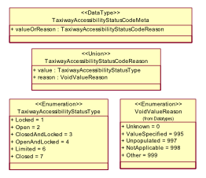

:doctype: book
:encoding: utf-8
:lang: en
:toc: macro
:toc-title: Table of contents
:toclevels: 5

:toc-position: left

:appendix-caption: Annex

:numbered:
:sectanchors:
:sectnumlevels: 5
:nofooter:

[[Support_for_nillable_and_nilReason]]
= Support for nillable and nilReason

There are two extensions related to property elements that may be set to
nil.

The conversion rule *rule-xsd-prop-nillable* is straightforward and
converts all properties with stereotype «voidable» or the tagged value
nillable set to 'true' to property elements that are nillable and which
include a nilReason property in their content model to encode metadata
about the reason for the nil value.

In addition, the conversion *rule-xsd-cls-union-direct* converts an
explicit model of a voidable/nillable property to essentially the same
encoding making use of the support for nil values in XML Schema. In this
case, the value type of the nillable property is modelled as a union
with two properties and where one property conceptually represents the
nilReason attribute of GML has a tagged value 'implementedByNilReason'
set to 'true'. This is converted as follows:

* A property that has the union type as its value receives the value
type of the property in the union that is not implementedByNilReason as
its type.
* The property element is made nillable and receives a nilReason
attribute.

As a result, the following classes

are encoded in the GML application schema as

[source,xml,linenumbers]
----------
<element name="TaxiwayAccessibilityStatusCodeMeta" type="gsip:TaxiwayAccessibilityStatusCodeMetaType" substitutionGroup="gsip:DatatypeMeta"/>
----------

[source,xml,linenumbers]
----------
<complexType name="TaxiwayAccessibilityStatusCodeMetaType">
 <annotation>
  <documentation>Taxiway Accessibility Status Code or Reason; with Metadata: A coded domain value denoting the accessibility status type of a taxiway, accompanied by the reason that the value may be absent and associated metadata.</documentation>
  <appinfo>
   <sc:taggedValue tag="primaryCode">TaxiwayAccessibilityStatusCodeMeta</sc:taggedValue>
  </appinfo>
 </annotation>
 <complexContent>
  <extension base="gsip:DatatypeMetaType">
   <sequence>
    <element name="valueOrReason" nillable="true">
     <annotation>
      <documentation>Taxiway Accessibility Status Code Value: A taxiway accessibility status code value.</documentation>
      <appinfo>
       <sc:taggedValue tag="primaryCode">value</sc:taggedValue>
      </appinfo>
     </annotation>
     <complexType>
      <simpleContent>
       <extension base="gsip:TaxiwayAccessibilityStatusTypeType">
        <attribute name="nilReason" type="gml:NilReasonType"/>
       </extension>
      </simpleContent>
     </complexType>
    </element>
   </sequence>
  </extension>
 </complexContent>
</complexType>
----------

[source,xml,linenumbers]
----------
<complexType name="TaxiwayAccessibilityStatusCodeMetaPropertyType">
 <sequence>
  <element ref="gsip:TaxiwayAccessibilityStatusCodeMeta"/>
 </sequence>
</complexType>
----------

[source,xml,linenumbers]
----------
<simpleType name="TaxiwayAccessibilityStatusTypeType">
 <annotation>
  <documentation>Taxiway Accessibility Status Type: A coded domain value denoting the accessibility status type of a taxiway.</documentation>
  <appinfo>
   <sc:taggedValue tag="primaryCode">TaxiwayAccessibilityStatusType</sc:taggedValue>
  </appinfo>
 </annotation>
 <restriction base="string">
  <enumeration value="1">
   <annotation>
    <documentation>Locked: Access is prevented by a physical barrier, requiring special means to pass (for example: a key).</documentation>
    <appinfo>
     <sc:taggedValue tag="primaryCode">Locked</sc:taggedValue>
     <sc:taggedValue tag="secondaryCode">1</sc:taggedValue>
    </appinfo>
   </annotation>
  </enumeration>
  <enumeration value="2">
   <annotation>
    <documentation>Open: Access is officially allowed. [desc] May be covered and/or blocked by a physical barrier that is temporarily passable.</documentation>
    <appinfo>
     <sc:taggedValue tag="primaryCode">Open</sc:taggedValue>
     <sc:taggedValue tag="secondaryCode">2</sc:taggedValue>
    </appinfo>
   </annotation>
  </enumeration>
  ...
  <enumeration value="7">
   <annotation>
    <documentation>Closed: Access is officially prohibited. [desc] May be covered and/or blocked by a physical barrier.</documentation>
    <appinfo>
     <sc:taggedValue tag="primaryCode">Closed</sc:taggedValue>
     <sc:taggedValue tag="secondaryCode">7</sc:taggedValue>
    </appinfo>
   </annotation>
  </enumeration>
 </restriction>
</simpleType>
----------

 
