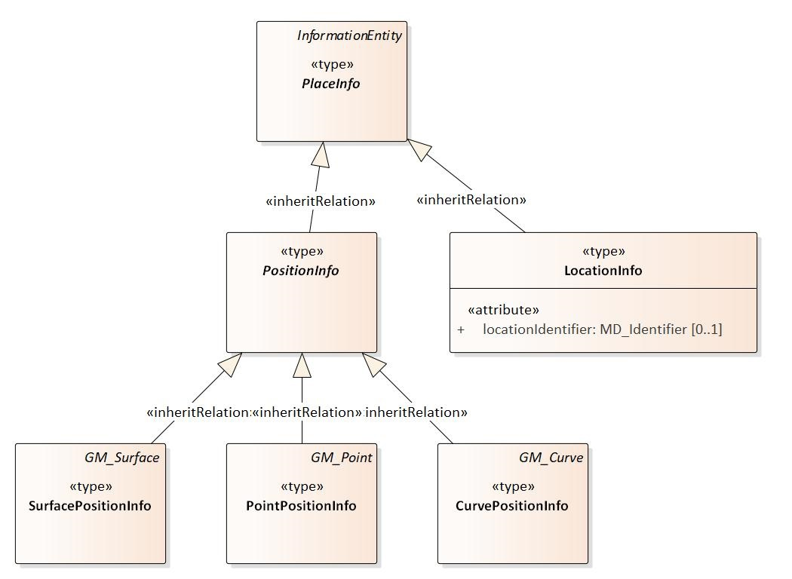

:doctype: book
:encoding: utf-8
:lang: en
:toc: macro
:toc-title: Table of contents
:toclevels: 5

:toc-position: left

:appendix-caption: Annex

:numbered:
:sectanchors:
:sectnumlevels: 5
:nofooter:

[[Constraint_Converter]]
= Constraint Converter

(since v2.4.0)

[[Introduction]]
== Introduction

The ConstraintConverter analyzes the constraints of application schema
elements and adds the resulting information to the model (in one form or
another) for subsequent processing steps.

[[Evaluating_geometry_restrictions_from_OCL_constraints]]
=== Evaluating geometry restrictions from OCL constraints

NOTE: This specific transformation has been developed in OGC Testbed 13,
to support the conversion of an application schema to a schema compliant
to the GML Simple Feature Level 0 Profile (see the
https://portal.opengeospatial.org/files/?artifact_id=42729[Geography
Markup Language (GML) simple features profile (with Corrigendum) (2.0)],
OGC document number 10-100r3). For further details, see the OGC
https://docs.ogc.org/per/17-020r1.html[NAS Profiling
Engineering Report] (OGC document number 17-020r1).

Some application schemas allow different types of geometries to be
assigned to feature types. For example, depending on the use case, a
building could be represented by a point or surface. The application
schema may actually allow the use of many different geometry types, like
curves, solids, and multi-geometries. This is typically convenient from
a modelling perspective, since a common type hierarchy for spatial
representation can be designed and used throughout the application
schema.

However, a modeller may want to restrict the geometry options for
specific feature types, either in general, or for particular use cases.
One way to achieve this is the use of OCL constraints. For example, an
OCL constraint on a feature type could be:

inv: place->forAll(p|(p.oclIsKindOf(PointPositionInfo) or
p.oclIsKindOf(SurfacePositionInfo)))

The knowledge on which geometry types are allowed for a feature type is
encoded in OCL constraints. This is a suitable approach: when deriving
an XML Schema from the application schema, a Schematron schema can be
derived from the OCL constraints, and used to check that the constraints
are fulfilled by XML instance data.

ShapeChange supports a number of model transformations, for example the
xref:./Flattener.adoc[Flattener].
Typically, a transformation does not update OCL constraints to reflect
the transformed model. The variety of OCL expressions is immense. Any
update of OCL constraints can therefore not be guaranteed to produce a
valid result that still captures the intent of the modeller who designed
the constraint.

However, transformations and targets may need information that is
encoded in OCL constraints. The geometry types that are allowed to be
used by a feature type are of interest to the Flattener
xref:./Flattener.adoc#rule-trf-prop-flatten-homogeneousgeometries[_rule-trf-prop-flatten-homogeneousgeometries_].
The Flattener expects this information to be available in the tagged
value "geometry", using specific abbreviations to identify a geometry
type. The ConstraintConverter supports rules to populate this tagged
value from the information found in OCL constraints. The rules work as
follows:

* Via the configuration parameter
xref:./Constraint_Converter.adoc#geometryRepresentationTypes[geometryRepresentationTypes],
a list of all application schema types that represent certain geometry
types is provided, together with the abbreviation to use in the
"geometry" tagged value. Example:
"SurfacePositionInfo=S;PointPositionInfo=P;CurvePositionInfo=C".
** NOTE: The parameter contains a list of key-value pairs. The list uses
the semicolon as separator. The key is a string with the name of a type
that represents a specific geometry type. The value is the abbreviation
to use when populating the "geometry" tagged value.
* For each type of the application schema, ShapeChange analyzes its
constraints. A constraint that restricts the geometry representation is
identified using a regular expression (given via configuration parameter
xref:./Constraint_Converter.adoc#geometryRepresentationConstraintRegex[_geometryRepresentationConstraintRegex_])
that matches on the constraint name:
** If no constraint was found, the type may still have a spatial
representation, with all geometry types supported by the application
schema being suitable representations. To identify such a type, and to
distinguish it from types that do not have a spatial representation, the
ConstraintConverter can use
xref:./Constraint_Converter.adoc#rule-trf-cls-constraints-geometryRestrictionToGeometryTV-typesWithoutRestriction-byValueTypeMatch[rule-trf-cls-constraints-geometryRestrictionToGeometryTV-typesWithoutRestriction-byValueTypeMatch]
(alternative rules may be added in the future).
*** NOTE: If
xref:./Constraint_Converter.adoc#rule-trf-cls-constraints-geometryRestrictionToGeometryTV-typesWithoutRestriction-byValueTypeMatch[_rule-trf-cls-constraints-geometryRestrictionToGeometryTV-typesWithoutRestriction-byValueTypeMatch_]
is not enabled, the "geometry" tagged values of types for which no
constraint was found won't be set (or overwritten, in case the tagged
value already existed).
** If a single constraint was found, it is analyzed depending on the
configured transformation rules:
*** xref:./Constraint_Converter.adoc#rule-trf-cls-constraints-geometryRestrictionToGeometryTV-inclusion[rule-trf-cls-constraints-geometryRestrictionToGeometryTV-inclusion]:
All abbreviations of types (defined by parameter
xref:./Constraint_Converter.adoc#geometryRepresentationTypes[_geometryRepresentationTypes_])
that are contained in the constraint text will be set as the "geometry"
tagged value.
*** xref:./Constraint_Converter.adoc#rule-trf-cls-constraints-geometryRestrictionToGeometryTV-exclusion[rule-trf-cls-constraints-geometryRestrictionToGeometryTV-exclusion]:
All abbreviations of types (defined by parameter
xref:./Constraint_Converter.adoc#geometryRepresentationTypes[_geometryRepresentationTypes_])
that are NOT contained in the constraint text will be set as the
"geometry" tagged value.
*** NOTE: Multiple abbreviations in tagged value "geometry" are
separated by commas.
*** NOTE: If tagged value "geometry" was already defined for the type,
then it will be overwritten.
** If multiple constraints were found, an error is logged and an
arbitrary one is used.

NOTE: Ideally, the ConstraintConverter would extract information on
allowed geometry types by actually evaluating OCL constraints defined on
(feature) types. However, as discussed before, doing so can be very
complex. The ConstraintConverter rules therefore implement a simple
approach that relies on a number of assumptions. An implementation that
supports actual evaluation of OCL constraints to determine allowed
geometry types is future work.

[[Configuration]]
== Configuration

[[Class]]
=== Class

The class of this ShapeChange Transformer is
_de.interactive_instruments.shapechange.core.transformation.constraints.ConstraintConverter_

[[Rules]]
=== Rules

[[rule-trf-cls-constraints-codeListRestrictionToTV]]
==== rule-trf-cls-constraints-codeListRestrictionToTV

(since v2.6.0)

Checks OCL constraints on classes in the schemas selected for processing
(ignoring code lists, enumerations, and basic types) to identify code
list restrictions, and to store relevant information about such
restrictions in the model (via tagged values). That information can be
used by subsequent processes (e.g. by the XmlSchema target to create
Schematron assertions with code list checks).

Supported code list restrictions follow one of the following forms:

* +++/* Documentation (optional). */ inv: prop.oclIsTypeOf(CodeListType)+++
* +++/* Documentation (optional). */ inv: prop->notEmpty() implies
prop.oclIsTypeOf(CodeListType)+++
* +++/* Documentation (optional). */ inv:
prop->forAll(x|x.oclIsTypeOf(CodeListType))+++
* +++/* Documentation (optional). */ inv: prop->notEmpty() implies
prop->forAll(x|x.oclIsTypeOf(CodeListType))+++

NOTE: "self." is allowed before the property name, so the following
works as well:

* +++/* Documentation (optional). */ inv:
self.prop.oclIsTypeOf(CodeListType)+++
* +++/* Documentation (optional). */ inv: self.prop->notEmpty() implies
self.prop.oclIsTypeOf(CodeListType)+++
* +++/* Documentation (optional). */ inv:
self.prop->forAll(x|x.oclIsTypeOf(CodeListType))+++
* +++/* Documentation (optional). */ inv: self.prop->notEmpty() implies
self.prop->forAll(x|x.oclIsTypeOf(CodeListType))+++

The transformation rule identifies the property name as well as the name
of the type from the restriction. It does this using the following
regular expressions:

* +++(?s).*inv:\s*(?:(?:self\.)?(?:\w+)->notEmpty\(\)
implies)?\s*(?:self\.)?(\w+)\.oclIsTypeOf\((\w+)\)\s*+++
* +++(?s).*inv:\s*(?:(?:self\.)?\w+->notEmpty\(\) implies
)?(?:self\.)?(\w+)->forAll\(\w+\|\w+\.oclIsTypeOf\((\w+)\)\)\s*+++

NOTE: If the text of an OCL constraint does not match one of the regular
expressions, it is ignored.

The transformation then checks if the modeled type of the property is
"CharacterString", and that the type from the restriction is a code
list. If that is the case, then a tagged value 'codeListRestriction' is
added to the property.

NOTE: Restricting the data type of a CharacterString-typed property to a
code list is allowed in metadata profiles, i.e. profiles of ISO 19115.

NOTE: This rule will NOT result in subtype specific restrictions. In a
situation where the property belongs to a supertype, and the OCL
constraint occurs on one of its subtypes, the tagged value will be
defined on the property. It thus appears as if the restriction applied
in general (i.e., for other subtypes as well), even though that may not
have been the intent. That is a known limitation of this transformation
rule.

[[rule-trf-cls-constraints-geometryRestrictionToGeometryTV-exclusion]]
==== rule-trf-cls-constraints-geometryRestrictionToGeometryTV-exclusion

(since v2.4.0)

The abbreviations from those types from parameter
xref:./Constraint_Converter.adoc#geometryRepresentationTypes[_geometryRepresentationTypes_]
that DO NOT occur in constraints selected via parameter
xref:./Constraint_Converter.adoc#geometryRepresentationConstraintRegex[_geometryRepresentationConstraintRegex_]
are set in the "geometry" tagged value.

[[rule-trf-cls-constraints-geometryRestrictionToGeometryTV-inclusion]]
==== rule-trf-cls-constraints-geometryRestrictionToGeometryTV-inclusion

(since v2.4.0)

The abbreviations from those types from parameter
xref:./Constraint_Converter.adoc#geometryRepresentationTypes[_geometryRepresentationTypes_]
that DO occur in the constraints selected via parameter
xref:./Constraint_Converter.adoc#geometryRepresentationConstraintRegex[_geometryRepresentationConstraintRegex_]
are set in the "geometry" tagged value.

[[rule-trf-cls-constraints-geometryRestrictionToGeometryTV-typesWithoutRestriction-byValueTypeMatch]]
==== rule-trf-cls-constraints-geometryRestrictionToGeometryTV-typesWithoutRestriction-byValueTypeMatch

(since v2.4.0)

Tagged value "geometry" will be set - with all the geometry types from
parameter
xref:./Constraint_Converter.adoc#geometryRepresentationTypes[_geometryRepresentationTypes_]
as value – for all types:

* for which no geometry restriction could be determined via constraints
(either via
xref:./Constraint_Converter.adoc#rule-trf-cls-constraints-geometryRestrictionToGeometryTV-exclusion[_rule-trf-cls-constraints-geometryRestrictionToGeometryTV-exclusion_]
or via
xref:./Constraint_Converter.adoc#rule-trf-cls-constraints-geometryRestrictionToGeometryTV-inclusion[_rule-trf-cls-constraints-geometryRestrictionToGeometryTV-inclusion_]),
and
* that have a property (potentially inherited) with a value type whose
name matches the regular expression given via parameter
xref:./Constraint_Converter.adoc#geometryRepresentationValueTypeRegex[_geometryRepresentationValueTypeRegex_]

[[rule-trf-cls-constraints-valueTypeRestrictionToTV-exclusion]]
==== rule-trf-cls-constraints-valueTypeRestrictionToTV-exclusion

(since v2.10.0)

An OCL constraint such as
`+++inv: place→forAll(p|not(p.oclIsKindOf(CurvePositionSpecification) or p.oclIsKindOf(SurfacePositionSpecification)))+++`,
and - for the sake of the example used to describe the transformation
rule - name "Value Type Representations Disallowed", restricts the set
of allowed value types for a property. In the example, property _place_
must not have a value of type _CurvePositionSpecification_ or
_SurfacePositionSpecification_.

With _rule-trf-cls-constraints-valueTypeRestrictionToTV-exclusion_, the
value type restrictions defined by such OCL constraints can be extracted
from the OCL expression, and converted into a tagged value, to be used
by subsequent transformation and conversion processes.

Required transformation parameter
xref:./Constraint_Converter.adoc#valueTypeRepresentationConstraintRegex[_valueTypeRepresentationConstraintRegex_]
is used to identify the relevant OCL constraints. The parameter value
contains a regular expression - for example
`+++.*Value Type Representations Disallowed.*+++`, which matches the names of
OCL constraints that define value type restrictions. The according OCL
expressions must thereby be structured as in the example (with
_oclIsTypeOf(..)_ also being supported).

The name of the property that is restricted is parsed from the begin of
the OCL expression: `+++inv: {propertyName}->forAll+++`…​ The property name
may be preceded by `+++self.+++`, i.e. `+++inv: self.{propertyName}->forAll+++`…​ is
a valid alternative way to structure the value type restricting OCL
expression.

Required transformation parameter
xref:./Constraint_Converter.adoc#valueTypeRepresentationTypes[_valueTypeRepresentationTypes_]
specifies the types that are used as value type by the UML properties
identified in the value type restricting OCL constraints. For each such
type, a list of names of the generally allowed types within the
inheritance hierarchy of that type must be provided, which may include
the type itself and abstract types. For example, the value of the
configuration parameter could be:
`+++PlaceSpecification{PointPositionSpecification, CurvePositionSpecification, SurfacePositionSpecification, LocationSpecification}+++`.
The transformation will automatically add all subtypes of generally
allowed types to the set of generally allowed types. That is important
for creating a tagged value that explicitly lists the types that are
allowed for a property, regardless of inheritance structures, because
the OCL constraint may exclude a specific subtype of a generally allowed
supertype.

The transformation will parse a value type restricting OCL constraint in
order to determine the (potentially inherited) UML property to which the
constraint applies. The OCL expression is structured so that any type
mentioned in the expression is disallowed/excluded. The transformation
can therefore determine the value types that are disallowed - also
taking into account all subtypes of a type that is mentioned within an
_oclIsKindOf(..)_. The set of disallowed types will then be subtracted
from the set of generally allowed types, resulting in the set of types
that are allowed as value types of the property.

The allowed types for the property are documented in the model by adding
(also: overwriting, if it already exists) tagged value
_valueTypeOptions_ to the class on which the UML property is defined.
The tagged value is structured as follows:

`+++{propertyName}(\(associationClassRole\))?={allowedTypeName}(,{allowedTypeName})(;{propertyName}(\(associationClassRole\))?={allowedTypeName}(,{allowedTypeName}))*+++`

For the example OCL constraint, that would result in:
`+++place(associationClassRole)=PointPositionSpecification,LocationSpecification+++`

The example shows that the tagged value may contain a qualifier -
_associationClassRole_ - for a property, which, if set, indicates that
the property is an association role whose association actually is an
association class. That information can be relevant for subsequent
processes, for example the JSON Schema encoding, when a previous model
transformation has transformed association classes as defined by the GML
3.3 encoding rules.

[[Parameters]]
=== Parameters

[[geometryRepresentationConstraintRegex]]
==== geometryRepresentationConstraintRegex

+++Alias+++: _none_

+++Required / Optional+++: optional

+++Type+++: String with regular expression (using the
https://docs.oracle.com/javase/8/docs/api/java/util/regex/Pattern.html[syntax
supported by Java])

+++Default Value+++: _none_

+++Explanation+++: Regular expression to identify relevant constraints
by matching on the constraint name.

+++Applies to Rule(s)+++:

* xref:./Constraint_Converter.adoc#rule-trf-cls-constraints-geometryRestrictionToGeometryTV-exclusion[rule-trf-cls-constraints-geometryRestrictionToGeometryTV-exclusion]
* xref:./Constraint_Converter.adoc#rule-trf-cls-constraints-geometryRestrictionToGeometryTV-inclusion[rule-trf-cls-constraints-geometryRestrictionToGeometryTV-inclusion]

[[geometryRepresentationTypes]]
==== geometryRepresentationTypes

+++Alias+++: _none_

+++Required / Optional+++: optional

+++Type+++: String with list of key-value pairs. The list uses the
semicolon as separator between key-value pairs. The key is a string with
the name of a type that represents a specific geometry type. The value
is the abbreviation to use when populating the "geometry" tagged value

+++Default Value+++: _none_

+++Explanation+++: Provides a list of all application schema types that
represent certain geometry types, together with the abbreviation to use
in the "geometry" tagged value. Example:
"SurfacePosi-tionInfo=S;PointPositionInfo=P;CurvePositionInfo=C".

+++Applies to Rule(s)+++:

* xref:./Constraint_Converter.adoc#rule-trf-cls-constraints-geometryRestrictionToGeometryTV-exclusion[rule-trf-cls-constraints-geometryRestrictionToGeometryTV-exclusion]
* xref:./Constraint_Converter.adoc#rule-trf-cls-constraints-geometryRestrictionToGeometryTV-inclusion[rule-trf-cls-constraints-geometryRestrictionToGeometryTV-inclusion]
* xref:./Constraint_Converter.adoc#rule-trf-cls-constraints-geometryRestrictionToGeometryTV-typesWithoutRestriction-byValueTypeMatch[rule-trf-cls-constraints-geometryRestrictionToGeometryTV-typesWithoutRestriction-byValueTypeMatch]

[[geometryRepresentationValueTypeRegex]]
==== geometryRepresentationValueTypeRegex

+++Alias+++: _none_

+++Required / Optional+++: optional

+++Type+++: String with regular expression (using the
https://docs.oracle.com/javase/8/docs/api/java/util/regex/Pattern.html[syntax
supported by Java])

+++Default Value+++: _none_

+++Explanation+++: Regular expression to match on the name of property
value types.

+++Applies to Rule(s)+++:

* xref:./Constraint_Converter.adoc#rule-trf-cls-constraints-geometryRestrictionToGeometryTV-typesWithoutRestriction-byValueTypeMatch[rule-trf-cls-constraints-geometryRestrictionToGeometryTV-typesWithoutRestriction-byValueTypeMatch]

[[valueTypeRepresentationConstraintRegex]]
==== valueTypeRepresentationConstraintRegex

+++Alias+++: _none_

+++Required / Optional+++: required

+++Type+++: String with regular expression (using the
https://docs.oracle.com/javase/8/docs/api/java/util/regex/Pattern.html[syntax
supported by Java])

+++Default Value+++: _none_

+++Explanation+++: Identifies the relevant OCL constraints. The
parameter value contains a regular expression - for example
`+++.*Value Type Representations Disallowed.*+++`, which matches the names of
OCL constraints that define value type restrictions.

+++Applies to Rule(s)+++:
xref:./Constraint_Converter.adoc#rule-trf-cls-constraints-valueTypeRestrictionToTV-exclusion[_rule-trf-cls-constraints-valueTypeRestrictionToTV-exclusion_]

[[valueTypeRepresentationTypes]]
==== valueTypeRepresentationTypes

+++Alias+++: _none_

+++Required / Optional+++: required

+++Type+++: String

+++Default Value+++: _none_

+++Explanation+++: Specifies the types that are used as value type by
the UML properties identified in the value type restricting OCL
constraints. For each such type, a list of names of the generally
allowed types within the inheritance hierarchy of that type must be
provided, which may include the type itself and abstract types.

Example:
`+++PlaceSpecification{PointPositionSpecification, CurvePositionSpecification, SurfacePositionSpecification, LocationSpecification}+++`

NOTE: If multiple value types need to be described by the parameter,
then a semicolon is used to separate the descriptions in the parameter
value.

+++Applies to Rule(s)+++:
xref:./Constraint_Converter.adoc#rule-trf-cls-constraints-valueTypeRestrictionToTV-exclusion[_rule-trf-cls-constraints-valueTypeRestrictionToTV-exclusion_]

[[Map_Entries]]
=== Map Entries

Currently, no specific map entries are defined for the
ConstraintConverter.

[[Advanced_Process_Configuration]]
=== Advanced Process Configuration

The ConstraintConverter does not make use of the advanced process
configuration facility.

[[Sample_Configuration]]
== Sample Configuration

[source,xml,linenumbers]
----------
<Transformer
  class="de.interactive_instruments.shapechange.core.transformation.constraints.ConstraintConverter"
  id="TRF_GEOMETRY_RESTRICTION_TO_GEOMETRY_TAGGEDVALUE" input="TRF_X" mode="enabled">
  <parameters>
   <ProcessParameter name="geometryRepresentationTypes"
    value="PointPositionInfo = P; CurvePositionInfo = C; SurfacePositionInfo = S"/>
   <ProcessParameter name="geometryRepresentationConstraintRegex"
    value=".*Place Representations Disallowed.*"/>
   <ProcessParameter name="geometryRepresentationValueTypeRegex" value="PlaceInfo"/>
  </parameters>
  <rules>
   <ProcessRuleSet name="trf">
    <rule name="rule-trf-cls-constraints-geometryRestrictionToGeometryTV-exclusion"/>
    <rule
     name="rule-trf-cls-constraints-geometryRestrictionToGeometryTV-typesWithoutRestriction-byValueTypeMatch"
    />
   </ProcessRuleSet>
  </rules>
 </Transformer>
----------
