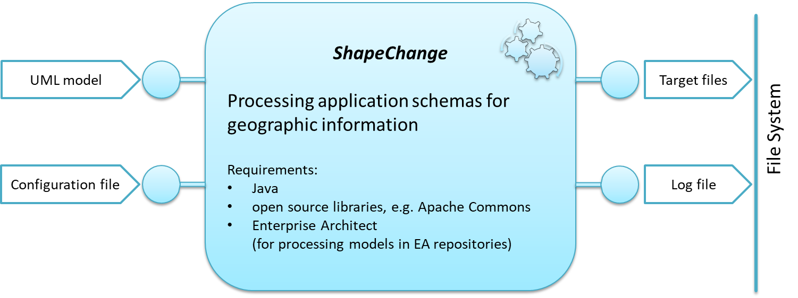

:doctype: book
:encoding: utf-8
:lang: en
:toc: macro
:toc-title: Table of contents
:toclevels: 5

:toc-position: left

:appendix-caption: Annex

:numbered:
:sectanchors:
:sectnumlevels: 5

[[About]]
= About

*ShapeChange* is a Java tool that takes application schemas constructed
according to ISO 19109 from a UML model and derives implementation
representations.

The most commonly used target representation is *XML Schema* and the
following standardised encoding rules are supported:

* GML 3.2 encoding rule for GML application schemas
* GML 3.3 extensions
* ISO/TS 19139 encoding rule
* INSPIRE encoding rule

In addition to the generation of XML Schema documents, the generation
of *Schematron* documents from OCL constrains in the UML model is
supported.

Other target representations include *feature catalogues* in DOCX and
HTML, *RDF* schemas, and *code list dictionaries* in GML and SKOS.

These targets and the associated encoding rules are
described xref:../targets/Output_Targets.adoc[here].

ShapeChange directly accesses *Enterprise Architect* models via their
Java API. It can also read *XMI 1.0*. Information on these models and
the *UML profile* supported by ShapeChange can be
found xref:../application schemas/Application_schemas.adoc[here].

Information on installation and use of the ShapeChange tool can be
found xref:../get started/Get_Started.adoc[here].

The source code of ShapeChange is available under
the http://www.gnu.org/copyleft/gpl.html[GNU General Public License].

#TBD# update the figure

