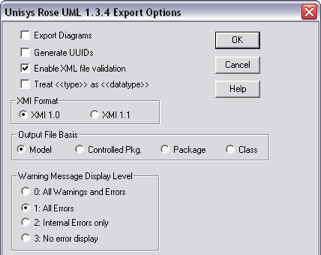
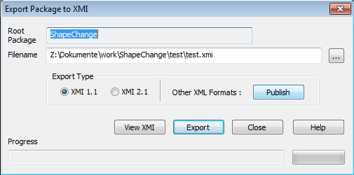
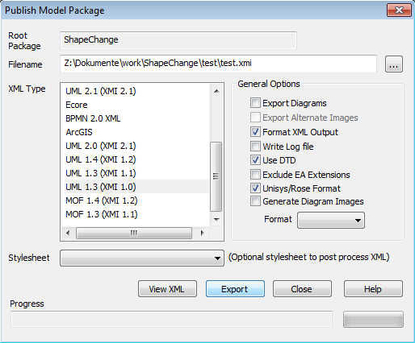

:doctype: book
:encoding: utf-8
:lang: en
:toc: macro
:toc-title: Table of contents
:toclevels: 5

:toc-position: left

:appendix-caption: Annex

:numbered:
:sectanchors:
:sectnumlevels: 5

[[XMI_10_models]]
= XMI 1.0 models

WARNING: [red]#The code for loading model information from XMI 1.0 is not up-to-date with all of the enhancements in ShapeChange v2.x. It is recommended to use xref:./Enterprise_Architect_models.adoc[Enterprise Architect] or xref:./SCXML_models.adoc[SCXML] models as input for ShapeChange.#

[[Overview]]
== Overview

XMI (XML Metadata Interchange) is an OMG standard for exchanging MOF
(Meta-Object Facility) metamodels via XML. In the context of
ShapeChange, an XMI 1.0 file representing an application schema can be
exported from Rational Rose or Enterprise Architect, and serve as an
input into ShapeChange. This page describes the considerations for this
input option.

[[Specific_Requirements]]
== Specific Requirements

To be valid input into the mapping process, an XMI 1.0 representation of
an AS-in-UML must conform to the following:

* The UML model containing the application schema and all other required
model elements shall be stored in a **single XMI document**__.__
* The XMI document shall be *well-formed*.
* The XMI document shall conform with *XMI version 1.0.*
* The XMI document shall be *valid*-i.e. contain a DOCTYPE declaration
and the document must validate against this document type definition.
This DTD must be the normative
https://shapechange.net/resources/example/DTDX13.dtd[DTD] that is part
of UML 1.3.

Within the XMI file, only the contents of the <XMI.header> and the
<XMI.content> elements are read by ShapeChange.  All other elements,
including tool-specific extensions, will be ignored.

[[Generating_XMI_10]]
== Generating XMI 1.0

XMI 1.0 files for use with ShapeChange may be generated either using
IBM's Rational Rose, or Enterprise Architect.  This section describes
the processes by which an AS-in-UML may be exported as XMI from either
of these tools.

[[Rational_Rose]]
=== Rational Rose

XMI 1.0 files may be exported from Rational Rose (2003) using the Unisys
Rose UML Plugin (most recent version 1.3.4).  This plugin exports UML
models as XMI 1.0 or 1.1 documents. This screenshot depicts the export
options that must be chosen when exporting an XMI 1.0 file for use with
ShapeChange:

 

[[Enterprise_Architect]]
=== Enterprise Architect

Enterprise Architect also allows for export of UML models to XMI 1.0
format.  This dialog shows the EA "Export Package to XMI" dialog, where
the "Other XML Formats" "Publish" button has to be clicked.

This opens the following dialog where the options must be selected as
shown:

NOTE: Apparently, when exporting to XMI (XMI1.0/UML1.3) EA uses 0..* as
the default multiplicity for association ends where the multiplicity has
not been defined. Also, when exporting to XMI, EA encodes a
bi-directional association - where the navigability is unspecified on
both ends - as if it was directed from source to target. Therefore, in
order for the exported XMI to be consistent with the model, it is highly
recommended to explicitly set the navigability and multiplicity for all
associations before exporting to XMI.

[[Known_Issues_with_XMI_10_Import]]
=== Known Issues with XMI 1.0 Import

Several issues have been observed in ShapeChange output when starting
from an XMI 1.0 model generated using the Rational Rose Unisys XMI
Plugin:

* The Unisys plugin does not appear to be able to recognize large
numbers of OCL Constraints applied to a single modelling element.  In
Rose, constraints for a model element are concatenated into a string and
stored in the "oclExpressions" tagged value.  If large numbers of
constraints are present, the string grows to a length beyond what the
Unisys Plugin appears to be able to handle, resulting in the contents of
the string being dropped on export.  *_There is no known workaround for this issue._*
* The Unisys plugin does not export attribute multiplicity correctly. 
This appears to occur when the attribute's type class is in a package
not explicitly imported by the package containing the attribute's
containing class-including when the attribute's containing class and
type are in the same package.

It is not known if these same issues occur in XMI 1.0 files exported from Enterprise Architect. 

*_For these reasons, the Rose-Unisys-XMI 1.0 input option is considered deprecated and should not be used, if there is an alternative available._*
