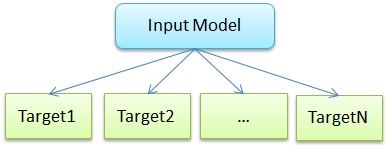
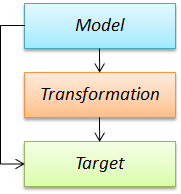
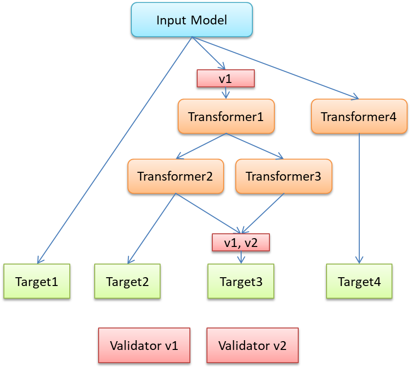

:doctype: book
:encoding: utf-8
:lang: en
:toc: macro
:toc-title: Table of contents
:toclevels: 5

:toc-position: left

:appendix-caption: Annex

:numbered:
:sectanchors:
:sectnumlevels: 5
:nofooter:

[[Configuration]]
= Configuration

[[Overview]]
== Overview

The primary mechanism for providing arguments to ShapeChange is the
*configuration file*.  A ShapeChange configuration file is an XML file
which conforms to a custom XML Schema
(https://shapechange.net/resources/schema/ShapeChangeConfiguration.xsd[ShapeChangeConfiguration.xsd]).

The root element of the configuration file is the
<ShapeChangeConfiguration> element.  The file is then divided into
various "functional elements" which are discussed separately in
subpages.

The names of the elements are suggestive of their function:

* The xref:./The_element_input.adoc[*<input>
element*] defines the source of the model and some parameters
controlling its interpretation.
* The *optional
xref:./The_element_dialog.adoc[<dialog> element]*
specifies a GUI if one is present.
* The *optional*
xref:./The_element_transformers.adoc[*<transformers>
element*] defines which transformations shall be applied on the input
model before target representations are created.
* The xref:./The_element_targets.adoc[*<targets>
element*] contains the configurations of each target format, such as XML
Schema.
** NOTE: Even though <targets> is typically used in a ShapeChange configuration, ShapeChange does not actually require the element to be present. An example where <targets> has been omitted is simply loading and thereby checking the input model.
* The xref:./The_element_log.adoc[*<log> element*]
defines logging parameters.

ShapeChange supports XInclude, which allows for modularization of the
configuration files.  XInclude is by default used to incorporate various
standardized sections (map entries, namespaces, stereotype aliases,
etc.) into the configuration.

[[Processing_Behavior]]
== Processing Behavior

Per default, ShapeChange reads an input model and creates one or more
target representations of it, for example XML Schema and feature
catalogues.

ShapeChange also offers to optionally perform a number of
transformations on the input model, before creating the target
representations on the result of these transformations.

Transformations are not restricted to a single sequence. In fact,
multiple transformations can be applied on the input model, and
transformations can also be applied on the result of other
transformations. Targets can be applied on the input model and/or the
output of transformations. This results in a kind of tree-based
processing model.

A sample configuration stub for the model shown in this diagram can look
like this:

[source,xml,linenumbers]
----------
<ShapeChangeConfiguration>
    <input>
        <!-- ... -->
    </input>
    <transformers>
        <Transformer class="..."
            id="Transformer1" mode="enabled">
            <!-- ... -->
        </Transformer>
        <Transformer class="..."
            id="Transformer2" input="Transformer1" mode="enabled">
            <!-- ... -->
        </Transformer>
        <Transformer class="..."
            id="Transformer3" input="Transformer1" mode="enabled">
            <!-- ... -->
        </Transformer>
        <Transformer class="..."
            id="Transformer4" mode="enabled">
            <!-- ... -->
        </Transformer>
    </transformers>
    <targets>
        <Target class="..." mode="enabled">
            <!-- Target 1 ... -->
        </Target>
        <Target class="..." inputs="Transformer2"
            mode="enabled">
            <!-- Target 2 ... -->
        </Target>
        <TargetXmlSchema class="..."
            inputs="Transformer2 Transformer3" mode="enabled">
            <!-- Target 3 ... -->
        </TargetXmlSchema>
        <Target class="..." inputs="Transformer4"
            mode="enabled">
            <!-- Target 4 ... -->
        </Target>
    </targets>
</ShapeChangeConfiguration>
----------
