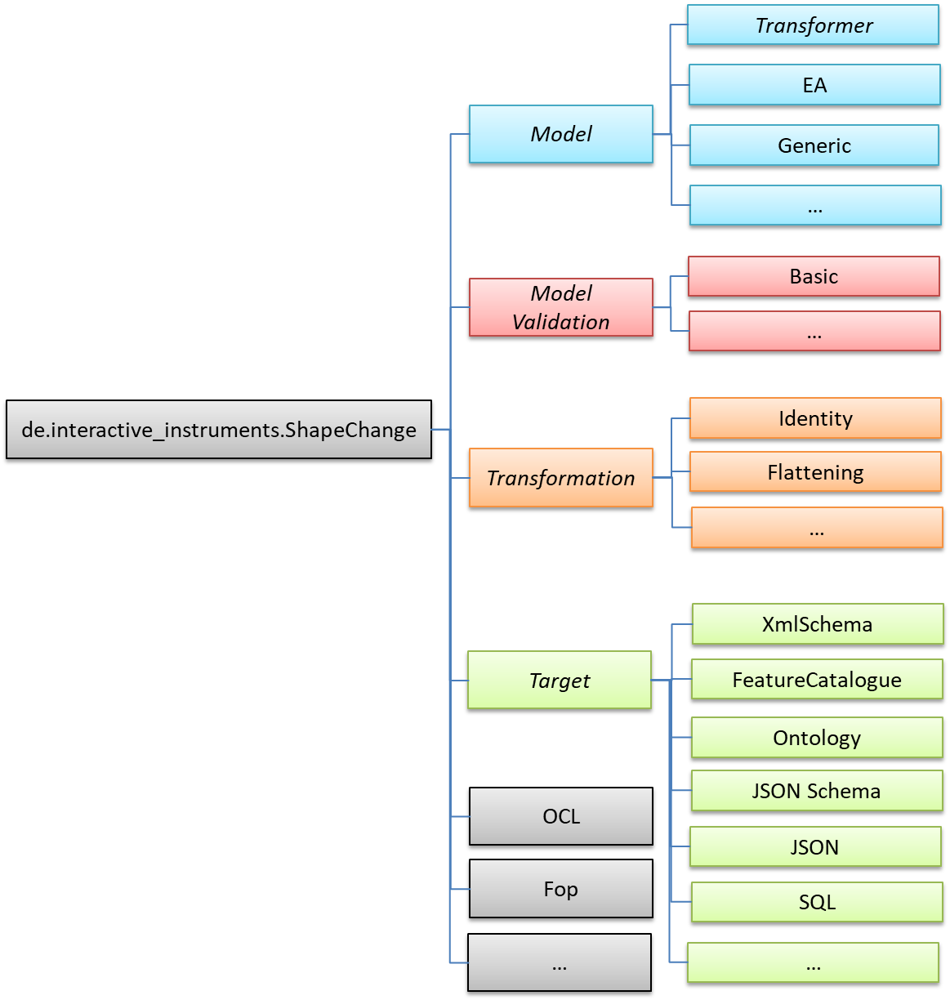

:doctype: book
:encoding: utf-8
:lang: en
:toc: macro
:toc-title: Table of contents
:toclevels: 5

:toc-position: left

:appendix-caption: Annex

:numbered:
:sectanchors:
:sectnumlevels: 5

[[Packages]]
= Packages

[[Overview]]
== Overview

ShapeChange is a Java application distributed as
a xref:./Distribution_contents.adoc[ZIP archive].

The software, run from the command-line, is provided with
a xref:./Configuration.adoc[configuration file] that defines the parameters of the
transformation, including the format and location of the input file, log
settings, and output parameters (format and output directory, among
others).  When the utility is initialized, the appropriate import module
is first called to read the application schema in UML (whether in EAP, SCXML, 
or another format) into internal memory. The software then processes
the model. The model can undergo a number of transformations before it
is turned into one or more target representations (the default being a
GML application schema consisting of a set of XML Schema documents).
Finally, the processed model is output to the chosen target
representation(s) as specified in the configuration file, and error,
warning and informational messages are written to a xref:./The_element_log.adoc[log
file].

[[Package_Overview]]
== Package Overview

The ShapeChange software is modular, allowing for the specification of
additional input formats, transformations or targets by implementing the
underlying interfaces in
the _de.interactive_instruments.ShapeChange.Model_ package.

The following diagram is an overview of the package dependencies within
ShapeChange:

The package de.interactive_instruments.ShapeChange contains the main
classes of ShapeChange.

The package de.interactive_instruments.ShapeChange.Model is the main
extension point on the input side. It specifies an interface for all
sources of models that ShapeChange can process. Currently there are
three types of models supported:

* Sparx Systems Enterprise Architect models accessed via the Enterprise
Architect Java API
* ShapeChange XML (SCXML), which is an XML format that can be produced by the xref:../targets/Model_Export.adoc[Model export target]
* XMI 1.0 / UML 1.3 models as exported by Rational Rose (Unisys
exporter) or ArgoUML

NOTE: Additional model types can be added by third-party libraries. See 
xref:./How_to_extend_ShapeChange.adoc[How to extend ShapeChange] for further details.

It is also possible to perform additional model transformations before
the conversion to target representations, by implementing the
de.interactive_instruments.ShapeChange.Transformation.Transformer
interface. Available transformations are described in more detail
xref:../transformations/Transformations.adoc[here].

NOTE: The de.interactive_instruments.ShapeChange.Model.Transformer
interface was defined before work on the general transformation
mechanism started. Model transformations should be realized via the
general mechanism.

The package de.interactive_instruments.ShapeChange.Target is the main
extension point on the output side. It specifies an interface for all
output derived from models, e.g. XML schemas. These are described in
more detail xref:../targets/Output_Targets.adoc[here].

In addition, there are helper packages for specific purposes, e.g.
processing OCL constraints, using FOP in targets or for a graphical user
interface to edit ShapeChange configuration parameters during runtime.