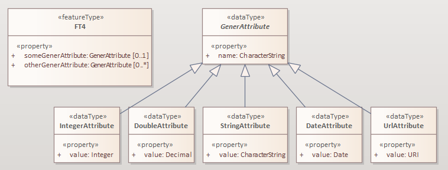

:doctype: book
:encoding: utf-8
:lang: en
:toc: macro
:toc-title: Table of contents
:toclevels: 5

:toc-position: left

:appendix-caption: Annex
:listing-caption: Listing

:numbered:
:sectanchors:
:sectnumlevels: 5

[[JSON_Schema]]
= JSON Schema

(since v2.10.0)

[[Overview]]
== Overview

This target derives a JSON Schema representation from an application
schema in UML.

NOTE: A number of configuration options and extensions have been
implemented. They are documented in detail in the
_https://docs.ogc.org/per/20-012.html[OGC UGAS-2020 Engineering
Report]_. Another source of information is the 
https://github.com/Geonovum/uml2json[UML to JSON Encoding Rules] 
specification. The documents also explain which model transformations may need
to be applied before executing this target, for example to transform
association classes. Therefore, if you are looking for a complete
introduction of the conversion from UML to JSON Schema, read the
according chapter in the OGC Engineering Report as well as the other 
specification first. 
This page provides a quick reference of the available conversion rules,
parameters, and configuration elements.

[[Configuration]]
== Configuration

[[Class]]
=== Class

The class for the Target implementation is
_de.interactive_instruments.ShapeChange.Target.JSON.JsonSchemaTarget._

[[Conversion_Rules]]
=== Conversion Rules

The behavior for processing a model is primarily controlled through
conversion rules. In addition, parameters and other configuration
elements (like map entries) influence the way a schema is processed. An
encoding rule represents a specific set of conversion rules.

An encoding rule is defined by an <EncodingRule> element.

Example:

[source,xml,linenumbers]
----------
<EncodingRule name="myGeoJson" extends="defaultGeoJson">
 <rule name="rule-json-cls-basictype"/>
 <rule name="rule-json-cls-codelist-uri-format"/>
 <rule name="rule-json-cls-name-as-entityType"/>
 <rule name="rule-json-cls-union-propertyCount"/>
 <rule name="rule-json-cls-valueTypeOptions"/>
</EncodingRule>
----------

The *name* attribute of the <EncodingRule> element defines the
identifier of the encoding rule to be used in the
xref:./JSON_Schema.adoc#defaultEncodingRule[defaultEncodingRule]
parameter.

NOTE: The encoding rules 'defaultGeoJson' and 'defaultPlainJson' are
pre-configured in ShapeChange. They can thus be used as-is, without the
need to explicitly define them in the configuration. They can also be
extended as required (see the example).

The optional *extends* attribute of the <EncodingRule> element includes
all rules from the referenced encoding rule in this encoding rule, too.

Each *<rule>* references either a conversion rule or - possibly in the
future - a xref:../application schemas/UML_profile.adoc[requirement
or recommendation] to be tested before the conversion process.

This target supports the rules defined in the following subsections.


[[rule-json-all-documentation]]
==== rule-json-all-documentation

(since v2.14.0)

With __rule-json-all-documentation__, descriptive information of application schema elements (packages, classes, and properties) can be encoded via JSON Schema _annotations_.

[NOTE]
======
_Annotations_ represent one category of JSON Schema keywords. _Annotations_ attach information that applications may use as they see fit. The other categories are _assertions_, which validate that a JSON instance satisfies constraints, and _applicators_, which apply subschemas to parts of the instance and combine their results.

======

Descriptive information of a model element in ShapeChange, i.e., properties (attributes and association roles), classes, and packages, includes the pieces of information, called _descriptors_, that are documented in <<table_descriptors>>.

NOTE: A model element can have all, a subset, or none of these descriptors.

[#table_descriptors,reftext='{table-caption} {counter:table-num}']
.Well-known descriptors
[cols="1,3a",options="header"]
|====================
| Descriptor Name +
(and ID) | Explanation
| Name +
(name) | The name of the model element (as named in the source UML, i.e., using upper and lower camel case).
| Alias +
(alias) | An alternative, human-readable name for the model element.
| Definition +
(definition) | The normative specification of the model element.
| Description +
(description) | Additional information about the model element.
| Documentation +
(documentation) | The overall documentation of the model element. May be structured, containing other descriptors (such as definition and description).
| Example(s) +
(example) | Example(s) illustrating the model element.
| Global identifier +
(globalIdentifier) | The globally unique identifier of the model element; that is, unique across models.
| Legal basis +
(legalBasis) | The legal basis for the model element.
| Data capture statement(s) +
(dataCaptureStatement) | Statement(s) describing how to capture instances of this model element from the real world.
| Primary code +
(primaryCode) | The primary code for this model element. +

NOTE: The main code for a model element should be assigned to this descriptor. The primary code may be the only one. Optional additional tagged values may be added for other codes.
|====================

NOTE: The descriptor ID is used in ShapeChange configuration elements that define JSON Schema annotations.

Typically, a community has a preferred way to model and encode this information. For example, one community may want to encode the description of a model element via the "description" annotation, while another may prefer to encode the values of multiple descriptors of a model element within a single "description" annotation.

ShapeChange can support this type of diversity through _JSON Schema annotation_ elements. An annotation element specifies how the content of a specific JSON Schema annotation (that shall be generated while converting a model element) shall be constructed. The annotation element takes into account that a UML model element may not have an actual value for a descriptor, and that some descriptors can have multiple values, e.g., the descriptor _example_.

In addition to the well-known descriptors (see <<table_descriptors,previous table>>), additional descriptive information can be incorporated through UML tagged values from the application schema.

For details about configuring JSON Schema annotation elements, see <<Annotations>>.


[[rule-json-all-featureRefs]]
==== rule-json-all-featureRefs

(since v2.14.0)

This conversion rule overrides the default behavior of ShapeChange 
when encoding property values by reference. The rule is meant to 
support the encoding of feature references as proposed for 
_OGC API - Features - Part 5: Schemas_. 

NOTE: The proposal for _OGC API - Features - Part 5: Schemas_ is 
subject to change, and thus the conversion rule, as implemented, 
may not fully reflect what is defined by that specification.

The conversion rule supports the following profiles, which define 
how a feature reference is encoded in actual JSON data:

* rel-as-link - The feature reference is encoded as a link object. 
ShapeChange automatically creates an _SCLinkObject_ definition in
every generated JSON Schema where such a feature reference is used.
The definition only requires the "href" member to be present in 
actual JSON data.
* rel-as-uri - Encodes a feature reference as a simple string, with
the format being defined by target parameter 
xref:./JSON_Schema.adoc#byReferenceFormat[byReferenceFormat].
* rel-as-key - Encodes feature references with plain feature identifier,
possibly adding information about the collection id and a title.

The profile(s) to use are configured via target parameter 
xref:./JSON_Schema.adoc#featureRefProfiles[featureRefProfiles].

Feature reference schema definitions for profile `rel-as-key` are constructed as follows:

* First, ShapeChange determines if the feature reference is for an
external collection. This is indicated either via map entry <<Parameter_collectionInfos>>,
for cases in which the value type of a property is mapped, or via 
tagged value `collectionUriTemplate` (defined on the property value type).
If a URI template is available, ShapeChange creates a JSON Schema
definition for an external feature reference.
* ShapeChange then determines the collection ids applicable for the
property value type, i.e., the referenced feature type. If the type is 
mapped, collection infos must be defined by the map entry. If these infos
are missing, the by reference encoding will be omitted (with a suitable 
error message in the log). The collection infos define the collection ids
via characteristic `collectionIds`. If the type is not mapped, the collection
ids are given by the names of all non-abstract classes that are in the 
subtype hierarchy of the type (including the type itself), with these
names being converted to lower case. Note that in the future, additional
methods for determining the collection ids can be designed and implemented.
* The type(s) of feature identifiers in these collections must also be
determined. For a mapped type, the identifier types are defined by map
entry characteristic `collectionIdTypes`. For all other cases, the applicable
identifier types are defined by target parameter 
xref:./JSON_Schema.adoc#featureRefIdTypes[featureRefIdTypes].
* With all this information available, ShapeChange can create the right
schema definition for a feature reference (all such definitions include
member "x-ogc-role": "reference"; examples are shown below):
** If a URI template is available:
*** If the template does not contain variable 
`{collectionId}`, then a schema for a simple external reference is 
created. The schema contains a type definition with the determined 
feature identifier types. The schema also contains the "x-ogc-uriTemplate"
member, with the template as value.
*** Otherwise, i.e. the template does contain variable 
`{collectionId}`, then a more complex external reference schema is created,
defining a JSON object with required "collectionId" member (whose values
are restricted if one or more collection ids have been determined before),
required "featureId" member (whose type definition contains the determined
feature identifier types), and an optional "title" member (of type string).
The schema will also contain the "x-ogc-uriTemplate" member, with 
the template as value.
** Otherwise, i.e. no URI template is available:
*** If a single collection id was determined, and target parameter 
xref:./JSON_Schema.adoc#featureRefWithAnyCollectionId[featureRefWithAnyCollectionId]
is not set to true, then a schema for a simple feature reference is created.
The schema contains a type definition with the determined 
feature identifier types. It also contains the "x-ogc-collectionId"
member, with the determined collection id as value.
*** Otherwise, a more complex reference schema is created,
defining a JSON object with required "collectionId" member (whose values
are restricted if target parameter 
xref:./JSON_Schema.adoc#featureRefWithAnyCollectionId[featureRefWithAnyCollectionId]
is not set to true, and one or more collection ids have been determined before),
required "featureId" member (whose type definition contains the determined
feature identifier types), and an optional "title" member (of type string).

*Examples*

_Simple reference schema_:

```json
{
  "type": "integer",
  "x-ogc-role": "reference",
  "x-ogc-collectionId": "buildings"
}
```

_Simple external reference schema_:
```json
{
  "type": "string",
  "x-ogc-role": "reference",
  "x-ogc-uriTemplate": "https://example.com/foo/bar/{featureId}"
}
```

_Reference schema_:
```json
{
  "type": "object",
  "x-ogc-role": "reference",
  "required": [
    "collectionId",
    "featureId"
  ],
  "properties": {
    "collectionId": {
      "type": "string",
      "enum": [
        "roads",
        "railways",
        "waterways"
      ]
    },
    "featureId": {
      "type": [
        "integer",
        "string"
      ]
    },
    "title": {
      "type": "string"
    }
  }
}
```

_External reference schema_:
```json
{
  "type": "object",
  "x-ogc-role": "reference",
  "x-ogc-uriTemplate": "https://example.com/foo/{collectionId}/bar/{featureId}",
  "required": [
    "collectionId",
    "featureId"
  ],
  "properties": {
    "collectionId": {
      "type": "string"
    },
    "featureId": {
      "type": "integer"
    },
    "title": {
      "type": "string"
    }
  }
}
```


[[rule-json-all-notEncoded]]
==== rule-json-all-notEncoded

This conversion rule suppresses the conversion to JSON Schema of any
model elements (more specifically: application schemas, classes, and
properties) for which the "jsonEncodingRule" tag is set to "notEncoded".

NOTE: The encoding rule "notEncoded" is defined in the standard rules,
which can be included in the target configuration via:

<xi:include
href="https://shapechange.net/resources/config/StandardRules.xml" />

[[rule-json-cls-basictype]]
==== rule-json-cls-basictype

If a direct or indirect supertype of an application schema class is
mapped to one of the simple JSON Schema types _string_, _number_,
_integer_, or _boolean_, then under _rule-json-cls-basictype_ that class
represents a so called _basic type_.

NOTE: Uses of the stereotype «BasicType» with application schema classes are ignored by this conversion rule.

A basic type does not define a JSON object. It represents a simple data
value, e.g. a string. The JSON Schema definition of a basic type thus
defines a simple JSON Schema type. A basic type can be restricted using
a number of JSON Schema keywords. The following table defines which
tagged values can be used to define these restrictions for a basic type,
and which restrictions are available for which simple JSON Schema type.

[width="100%",cols="2,3,2",options="header",]
|===
|JSON Schema keyword |tagged value to define the restriction |applicable
JSON Schema type(s)
|format |_jsonFormat_ |string, number, integer

|maxLength |_length_, _maxLength_, or _size_ |string

|minLength |_minLength_ |string

|pattern |_jsonPattern_ |string

|minimum +
(inclusive) |_rangeMinimum_ or _minInclusive_ |number, integer

|exclusiveMinimum |_minExclusive_ |number, integer

|maximum +
(inclusive) |_rangeMaximum_ or _maxInclusive_ |number, integer

|exclusiveMaximum |_maxExclusive_ |number, integer

|===

[[rule-json-cls-codelist-link]]
==== rule-json-cls-codelist-link

This rule results in the conversion of a code list as a reference to the
JSON Schema defining a link object. That reference must explicitly be
configured using the target parameter
xref:./JSON_Schema.adoc#linkObjectUri[linkObjectUri].

[[rule-json-cls-codelist-uri-format]]
==== rule-json-cls-codelist-uri-format

With this rule, all code lists are represented by a JSON Schema that
restricts the type to "string", and states that the "format" is "uri"
(as defined by
https://tools.ietf.org/html/draft-handrews-json-schema-validation-02#section-7.3.5[JSON
Schema validation, section 7.3.5]).

[[rule-json-cls-collectionsBasedOnEntityType]]
==== rule-json-cls-collectionsBasedOnEntityType

(since v2.14.0)

This rule creates collection schemas for feature types.

NOTE: Object types are ignored. Such types can be transformed to feature types 
(using the TypeConverter 
xref:../transformations/Type_Converter.adoc#rule-trf-objectTypesToFeatureTypes[rule-trf-objectTypesToFeatureTypes]),
if they should be treated like feature types in the JSON encoding.

CAUTION: It is assumed that the content model of all relevant feature types contains an
entity type member (e.g., "featureType", "type", "properties/type"), which 
identifies the name of the type of the encoded object. If no such entity type
member is available for one of the feature types of a collection definition,
ShapeChange will log an error and ignore that feature type when creating the
collection definition. The collection definition is not created if all of the
feature types are ignored.

[NOTE]
======

* The entity type member can be defined via a MapEntry for one of the 
supertypes for a class, via target parameter xref:./JSON_Schema.adoc#baseJsonSchemaDefinitionForFeatureTypes_encodingInfos[baseJsonSchemaDefinitionForFeatureTypes_encodingInfos], 
or generated via xref:./JSON_Schema.adoc#rule-json-cls-name-as-entityType[rule-json-cls-name-as-entityType].
* The collection encoding supports objects with different entity type
member paths.
* Via xref:./JSON_Schema.adoc#rule-json-cls-collectionsWithTopLevelEntityType[rule-json-cls-collectionsWithTopLevelEntityType], the conversion
can be altered to support cases in which the entity type member is
not set per object, but on the collection level for all objects. Of
course, this only makes sense if all objects in a collection are of the
same type.

======

The rule creates the following collection schema definitions:

* A general "FeatureCollection" schema for all non-abstract feature types.
* One collection schema for each feature type (abstract and non-abstract).
Each of these schemas defines a uniform collection, i.e. a collection
that only has objects of a specific feature type (or subtypes thereof). 
The collection name is `{feature type name} + 'Collection'`. Example: BuildingCollection.

NOTE: The generation of the uniform collections can be suppressed using
target parameter xref:./JSON_Schema.adoc#featureCollectionOnly[featureCollectionOnly].

The JSON Schema files to which the collection definitions are 
added are determined as follows:

* By default, the FeatureCollection schema will be added to the JSON Schema document 
that is created for the main schema package (for further details, see the
description of input parameter xref:../get started/The_element_input.adoc#mainAppSchema[mainAppSchema]).
The other collection schemas will be added to the JSON Schema documents that contain 
the definition of the respective feature type. If only a single application
schema is processed, and all classes are encoded in a single JSON Schema document,
then all collection schemas will be defined in that document.
* If target parameter 
xref:./JSON_Schema.adoc#collectionSchemaFileName[collectionSchemaFileName]
has a non-empty value, all collection schema definitions are added
to a new JSON Schema document with the name given by the parameter. The file
will be located in the same directory as determined for the main schema package.
The $id of the new JSON Schema document is created using the $id for
the main schema package as a basis. If that id ends with ".json", only the substring
until the last "/" is used as basis. The value of target parameter 
collectionSchemaFileName is appended (using "/" as join character, unless the basis
already ends with that character).

Two aspects play an important role when creating the collection schema:
a base collection schema as well as how the actual member checks are defined.

The base collection schema is determined as follows:

* The conversion is based upon the assumption that the members of a collection are
encoded in a JSON array.
* The target parameter xref:./JSON_Schema.adoc#baseJsonSchemaDefinitionForCollections[baseJsonSchemaDefinitionForCollections], 
if set, gives a reference to the base collection schema (which will be included
in a particular collection schema using the "allOf" member). An example value would be
https://geojson.org/schema/FeatureCollection.json - to reference the GeoJSON 
feature collection schema. 
** If the parameter is not set, or has no value, it is
assumed that collections are encoded as simple JSON arrays, without any
further structure (which can be useful in a plain JSON encoding).
** If the parameter is set, then it is assumed that the JSON member that contains
the array of collection members is the top-level "features" member. This is
compatible with the GeoJSON feature collection. In the future, the path to that
JSON member can be made configurable.

The member check is realized as follows:

* Within the general "FeatureCollection", the check is realized using an "allOf", which bundles a number of if-then-constraints:
** One if-then-constraint per non-abstract feature type. The if-part checks the value of the entity type member against the name of the feature type. The then-part references the JSON Schema definition of the feature type.
** By default, the FeatureCollection allows objects of unknown type. 
Such objects are not validated, since none of the previously described if-constraints
will match them. 
In order to forbid unknown members in a collection, set target parameter
xref:./JSON_Schema.adoc#preventUnknownTypesInFeatureCollection[preventUnknownTypesInFeatureCollection]
to "true". In that case, another if-then-constraint is added:
*** if-part:
**** If the paths to the entity type members of all the feature types are equal: not-constraint
with the path to the entity type member and enum with the names of the feature types.
**** Otherwise, i.e. the entity type member paths are not all equal: not-constraint with oneOf,
with one schema per entity type member path, and an enum with the names of the feature types
whose entity type member is at that path.
*** then-part: simply `false`.
* For uniform collections, it depends on the represented feature type:
** In case the feature type is a supertype:
*** The member check is created using an "allOf" with a number of if-then-constraints,
one per non-abstract class (in the set consisting of the feature types as
well as its direct and indirect subtypes) - much like it is done for the 
general "FeatureCollection".
*** An additional if-then-constraint is used to validate objects of unknown type.
However, other than for the general "FeatureCollection", here we have an actual
schema to work with: that of the collection's feature type.
** Otherwise, the feature type is a leaf class. In that case, the collection
member check simply consists of a reference to the JSON Schema definition of
the feature type.


[[rule-json-cls-collectionsWithTopLevelEntityType]]
==== rule-json-cls-collectionsWithTopLevelEntityType

(since v2.14.0)

Extends xref:./JSON_Schema.adoc#rule-json-cls-collectionsBasedOnEntityType[rule-json-cls-collectionsBasedOnEntityType] 
to support cases in which the entity type member is not set per object, 
but on the collection level for all objects. This rule should only be
applied if the assumption then is that all objects in the collection 
are of the same type.

NOTE: In order for rule-json-cls-collectionsWithTopLevelEntityType 
to work as expected,
xref:./JSON_Schema.adoc#rule-json-cls-collectionsBasedOnEntityType[rule-json-cls-collectionsBasedOnEntityType]
should be part of the encoding rule as well.

This rule further assumes that 
xref:./JSON_Schema.adoc#baseJsonSchemaDefinitionForCollections[baseJsonSchemaDefinitionForCollections]
is set, and that the base collection schema contains a top-level
"featureType" member, which, if set, identifies the type of all
collection members. In the following, that member is called
__collection-featuretype-member__.

In order for the assumed mechanism to work in practice, it is
necessary that both the collection-featuretype-member as well 
as the entity type members of collection member feature types 
are optional.

The implementation of the collection schemas created by 
xref:./JSON_Schema.adoc#rule-json-cls-collectionsBasedOnEntityType[rule-json-cls-collectionsBasedOnEntityType]
for the general "FeatureCollection" and the uniform collections for supertypes
is extended. In the collection definition, the first "allOf" schema -
which links the base schema defined by parameter 
xref:./JSON_Schema.adoc#baseJsonSchemaDefinitionForCollections[baseJsonSchemaDefinitionForCollections]
with the member checks - is modified, so that the second schema 
consists of an if-then-else constraint:

* The if-part checks via `"required": ["featureType"]` if the 
collection-featuretype-member is present in a given collection object. Note
that the actual value is not checked here, including if the value is null.
The mere presence of the collection-featuretype-member is assumed to
indicate that it conveys the feature type name of all collection members.
* The then-part contains an "allOf" with a number of if-then-constraints:
** For each relevant non-abstract feature type, an if-then-constraint
is created, which checks the value of the collection-featuretype-member
against the name of the feature type. The then-part contains a 
reference to the JSON Schema definition created for that feature type.
** Similar to xref:./JSON_Schema.adoc#rule-json-cls-collectionsBasedOnEntityType[rule-json-cls-collectionsBasedOnEntityType],
a final if-then-constraint is created (though for the general "FeatureCollection",
only if target parameter 
xref:./JSON_Schema.adoc#preventUnknownTypesInFeatureCollection[preventUnknownTypesInFeatureCollection] 
is set to "true"). The constraint checks in the if-part that the 
collection-featuretype-member value is not equal to a name of one
of the feature types. In the case of the general "FeatureCollection" 
(with target parameter preventUnknownTypesInFeatureCollection 
not being "true"), the then-part is then simply `false`. In case 
of a uniform collection for a supertype, the then-part is a
reference to the schema of the collection feature type.
* The else part of the if-then-else constraint contains the member
check as created by 
xref:./JSON_Schema.adoc#rule-json-cls-collectionsBasedOnEntityType[rule-json-cls-collectionsBasedOnEntityType]
(assuming that the entity type member is present for each
collection member).

NOTE: The encoding of uniform collections for leaf classes in 
rule-json-cls-collectionsBasedOnEntityType does not need to be
extended, since it is completely independent of any entity type 
member checks.


[[rule-json-cls-defaultGeometry-multipleGeometryProperties]]
==== rule-json-cls-defaultGeometry-multipleGeometryProperties

This conversion rule is typically used in case that a) a GeoJSON
compliant encoding shall be created, and b) for application schemas with
classes that have multiple geometry properties.

With this rule, a geometry property is identified as default geometry by
setting tagged value _defaultGeometry_ on the property to the value
`true`. That property will then be encoded as a top-level "geometry"
member. If multiple such properties exist (potentially inherited), none
of them is selected as default geometry (because no informed choice can
be made) and an error will be logged.

NOTE: (since v2.14.0) If the default geometry property is optional or voidable, 
then the schema restriction for the "geometry" member will define a choice
- using the "oneOf" JSON Schema keyword - between a null value and
the geometry schema definition for the value type of the geometry property
(e.g., a GeoJSON Polygon in case of the property value type being GM_Surface).

NOTE: (since v2.14.0) If the geometry type of the default geometry property is NOT
one of those defined by target parameter 
xref:./JSON_Schema.adoc#geoJsonCompatibleGeometryTypes[geoJsonCompatibleGeometryTypes],
then the constraint for the "geometry" member will NOT be created. 

[[rule-json-cls-defaultGeometry-singleGeometryProperty]]
==== rule-json-cls-defaultGeometry-singleGeometryProperty

This conversion rule is typically used in case that a) a GeoJSON
compliant encoding shall be created, and b) for application schemas with
classes that have at most one geometry property.

With this rule, the geometry property of a class represents the default
geometry, and is encoded as the top-level "geometry" member. If a class
has multiple - potentially inherited - geometry properties with
different names, none of them is selected as default geometry (because
no informed choice can be made) and ShapeChange will log an error.

NOTE: (since v2.14.0) If the default geometry property is optional or voidable, 
then the schema restriction for the "geometry" member will define a choice
- using the "oneOf" JSON Schema keyword - between a null value and
the geometry schema definition for the value type of the geometry property
(e.g., a GeoJSON Polygon in case of the property value type being GM_Surface).

NOTE: (since v2.14.0) If the geometry type of the default geometry property is NOT
one of those defined by target parameter 
xref:./JSON_Schema.adoc#geoJsonCompatibleGeometryTypes[geoJsonCompatibleGeometryTypes],
then the constraint for the "geometry" member will NOT be created. 

[[rule-json-cls-documentation-enumDescription]]
==== rule-json-cls-documentation-enumDescription

(since v2.14.0)

This rule extends 
_xref:./JSON_Schema.adoc#rule-json-all-documentation[rule-json-all-documentation]_
by creating a new "enumDescription" annotation within the JSON Schema definition
of an enumeration, with one member per encoded enum. The name of such a member
is the initial value of the enum, if available, otherwise the enum name. The 
member value is a JSON object with annotation members created by applying the
configured xref:./JSON_Schema.adoc#Annotations[JSON Schema annotations] to the
enum. Note that if none of the annotation definitions creates an annotation 
value for the enum, then the JSON object will be empty.

[[rule-json-cls-genericValueType]]
==== rule-json-cls-genericValueType

(since v2.14.0)

Some domains use constructs like the one shown in 
<<img_jsonschema_generic_value_types>> 
to add extension points to their feature types. The generic attributes
shown in this example contain a name and a (simple) value. They provide
a specific place for additional key-value-pair based information.

[#img_jsonschema_generic_value_types,reftext='{figure-caption} {counter:figure-num}']
.Example schema with generic value types


There is a specific solution for supporting such structures in JSON.

The according conversion is enabled using __rule-json-cls-genericValueType__.
The conversion rule is applied for a \<<dataType>> whose name is contained in the
(comma-separated) value of target parameter 
xref:./JSON_Schema.adoc#genericValueTypes[genericValueTypes]. 
The subtypes will automatically be taken into account as well. 
For example: `genericValueTypes=GenerAttribute`

The JSON Schema definition for GenerAttribute, in plain JSON encoding, would be as follows:

[source,JSON,linenumbers]
----
{
  "$schema": "https://json-schema.org/draft/2019-09/schema",
  "$defs": {
    "GenerAttribute": {
      "type": "object",
      "properties": {
        "name": {
          "type": "string"
        },
        "value": {
          "type": ["string", "integer", "number"]
        }
      },
      "required": [
        "name",
        "value"
      ]
    }
  }
}
----

Only the plain type information from the value types of the common value
property of the subtypes contributes to the type definition of the according
JSON property. Any JSON Schema format keywords, defined for such value types,
are ignored.

NOTE: __rule-json-cls-genericValueType__ only looks for a single attribute that
is common to all subtypes of the classes identified by target 
parameter _genericValueTypes_. Additional properties of these subtypes are ignored!
Also, if multiple common properties exist, all will be ignored (and an error logged)!

The resulting JSON definition of GenerAttribute supports encoding of 
values for any of the actual subtypes of GenerAttribute.

NOTE: The JSON Schema definition allows for type checks and is more 
expressive than the definition that would be created by default for just 
GenerAttribute (with only the "name" attribute defined).


[[rule-json-cls-identifierForTypeWithIdentity]]
==== rule-json-cls-identifierForTypeWithIdentity

With _rule-json-cls-identifierForTypeWithIdentity_, an identifier JSON
member will be added to the JSON object that represents a type with
identity (feature type or object type). The key and value type of that
member can be configured using ShapeChange JSON Schema target
parameters:

* _xref:./JSON_Schema.adoc#objectIdentifierName[objectIdentifierName]_:
"id" (the default) or any other suitable string that does not conflict
with other member names);
* _xref:./JSON_Schema.adoc#objectIdentifierType[objectIdentifierType]_:
"string" (the default), "number", or "string, number";
* _xref:./JSON_Schema.adoc#objectIdentifierRequired[objectIdentifierRequired]_:
"false" (the default) or "true" is used to define if the property is
optional or required.

[[rule-json-cls-identifierStereotype]]
==== rule-json-cls-identifierStereotype

This conversion rule assumes that all types with identity (feature type
or object type) have an attribute with stereotype «identifier»
(directly, or inherited from a supertype). That attribute is used to
encode the identifier. The rule is typically used in conjunction with
xref:./JSON_Schema.adoc#rule-json-cls-ignoreIdentifier[rule-json-cls-ignoreIdentifier],
in order to detect identifier properties and not encode them (e.g.
because a JSON Schema that applies to all types with identity already
defines an identifier member).

NOTE: If the maximum multiplicity of an «identifier» attribute is
greater than 1, ShapeChange will log an error.

[[rule-json-cls-ignoreIdentifier]]
==== rule-json-cls-ignoreIdentifier

With this rule, the identifier of a type with identity (feature type or
object type) will be encoded using an identifier member that is provided
by a common base type (e.g. the "id" member of a GeoJSON Feature, to
which a generalization relationship exists for a given feature type -
see
_xref:./JSON_Schema.adoc#rule-json-cls-virtualGeneralization[rule-json-cls-virtualGeneralization]_).
That means that no additional identifier property is created.
_xref:./JSON_Schema.adoc#rule-json-cls-identifierForTypeWithIdentity[rule-json-cls-identifierForTypeWithIdentity]_
is therefore overridden by
_xref:./JSON_Schema.adoc#rule-json-cls-ignoreIdentifier[rule-json-cls-ignoreIdentifier]_.
Also, all identifier properties that are identified by
_xref:./JSON_Schema.adoc#rule-json-cls-identifierStereotype[rule-json-cls-identifierStereotype]_
- if also included in the encoding rule - will simply be ignored when
encoding the type with identity.

[[rule-json-cls-jsonFgGeometry]]
==== rule-json-cls-jsonFgGeometry

(since v2.14.0)

This rule takes into account the different options for encoding 
geometry values in JSON-FG features. The primary geometry property 
(identified via 
xref:./JSON_Schema.adoc#rule-json-cls-primaryGeometry[rule-json-cls-primaryGeometry], 
xref:./JSON_Schema.adoc#rule-json-cls-defaultGeometry-multipleGeometryProperties[rule-json-cls-defaultGeometry-multipleGeometryProperties], 
or xref:./JSON_Schema.adoc#rule-json-cls-defaultGeometry-singleGeometryProperty[rule-json-cls-defaultGeometry-singleGeometryProperty]) 
is encoded as JSON Schema constraints for the geometry and / or place members as follows: 

* If the geometry type of the primary geometry property is one of those defined
by target parameter xref:./JSON_Schema.adoc#geoJsonCompatibleGeometryTypes[geoJsonCompatibleGeometryTypes]: 
The JSON Schema constraint for the geometry type is created for both the 
"geometry" and the "place" member. A null value is allowed for both members.
* Otherwise: The JSON Schema constraint for the geometry type is only created for
the "place" member. A null value is only allowed for that member, if the primary
geometry property is optional.
** NOTE: In this case, no specific constraints are created for the "geometry" member.
When publishing data, for example in the GeoJSON compatibility mode, the 
publisher can thus choose a suitable way of deriving a value for the "geometry"
member from the geometry that is encoded in the "place" member.

WARNING: At the moment, this rule is only applicable for application schemas that 
do not define a secondary geometry! Issue 
https://github.com/ShapeChange/ShapeChange/issues/344[344] documents how the rule
can be enhanced to support schemas with secondary geometry as well. That approach
has not been implemented yet.


[[rule-json-cls-name-as-anchor]]
==== rule-json-cls-name-as-anchor

With _rule-json-cls-name-as-anchor_, the name of a class is encoded as
an "$anchor", which is added at the start of the schema definition of
the class (within the definitions schema). Schema definitions that have
an "$anchor" can be referenced using the plain text value of the anchor
as fragment identifier, instead of using a more complex JSON Pointer.
However, pay attention to target parameter 
xref:./JSON_Schema.adoc#useAnchorsInLinksToGeneratedSchemaDefinitions[useAnchorsInLinksToGeneratedSchemaDefinitions]
and what is written in its documentation about the support of anchors
in schema references.

NOTE: The "$anchor" keyword was added in JSON Schema draft 2019-09. It
replaces the somewhat ambiguous use of the "$id" keyword in JSON Schema
draft 07 to define plain name fragment identifiers for subschemas.

[[rule-json-cls-name-as-entityType]]
==== rule-json-cls-name-as-entityType

The rule adds another JSON member to the JSON object which represents
the class (a feature or object type) that is being converted. The
name of the JSON member can be configured using the target parameter
_xref:./JSON_Schema.adoc#entityTypeName[entityTypeName]_.
The JSON member is required and string-valued. It should be used to
encode the name of the type that is represented by the JSON object.

NOTE: Since ShapeChange v2.14.0, this rule no longer applies to data types.
The change was made for GeoJSON based applications where data type values
are not converted to RDF/OWL using JSON-LD, and no entity type member checks 
are needed/encoded for JSON objects that represent data types.
However, by adding 
_xref:./JSON_Schema.adoc#rule-json-cls-name-as-entityType-dataType[rule-json-cls-name-as-entityType-dataType]_
to the encoding rule, entity type members can still be created for data types.

An example for the benefit of encoding the type name in JSON objects is
given in
http://docs.opengeospatial.org/per/18-091r2.html#JSON_LD[chapter 6 of
the OGC Testbed-14: Application Schemas and JSON Technologies
Engineering Report]: Having a key within a JSON object with a string
value that identifies the type of the object allows that object to be
mapped to RDF. More specifically, the string value can be mapped to an
IRI that identifies the type of an RDFS resource.

There are also some cases in which
_xref:./JSON_Schema.adoc#rule-json-cls-name-as-entityType[rule-json-cls-name-as-entityType]_
is ignored or conditional:

* To prevent the addition of unnecessary JSON members (here: because the
JSON member would already be inherited), the rule is ignored for a type
T if T is a subtype and
_xref:./JSON_Schema.adoc#rule-json-cls-name-as-entityType[rule-json-cls-name-as-entityType]_
already applies to one of its supertypes.
* By default, the rule does not apply to mixins, data types, unions, enumerations, and code
lists. +
However, if
_xref:./JSON_Schema.adoc#rule-json-cls-name-as-entityType-union[rule-json-cls-name-as-entityType-union]_
is enabled together with
_xref:./JSON_Schema.adoc#rule-json-cls-name-as-entityType[rule-json-cls-name-as-entityType]_,
then the latter also applies to unions. Likewise for data types (with 
_xref:./JSON_Schema.adoc#rule-json-cls-name-as-entityType-dataType[rule-json-cls-name-as-entityType-dataType]_).
* Since v2.14.0, encoding infos from external schemas - either from a base schema or from 
a supertype that is mapped to an external schema - can inform about the presence of an
entity type member in the external schema. If such an external schema applies to a given
type, then this conversion rule is ignored for that type.
** The base schema assignment is enabled via _xref:./JSON_Schema.adoc#rule-json-cls-virtualGeneralization[rule-json-cls-virtualGeneralization]_ (and the target parameters identified there), and encoding infos for the base schema can be given via the target parameters _xref:./JSON_Schema.adoc#baseJsonSchemaDefinitionForDataTypes_encodingInfos[baseJsonSchemaDefinitionForDataTypes_encodingInfos]_,
_xref:./JSON_Schema.adoc#baseJsonSchemaDefinitionForObjectTypes_encodingInfos[baseJsonSchemaDefinitionForObjectTypes_encodingInfos]_, and _xref:./JSON_Schema.adoc#baseJsonSchemaDefinitionForFeatureTypes_encodingInfos[baseJsonSchemaDefinitionForFeatureTypes_encodingInfos]_.
** Type mappings are documented xref:./JSON_Schema.adoc#Map_Entries[here]. The encoding infos of a mapped type
are conveyed via map entry parameter xref:./JSON_Schema.adoc#Parameter_encodingInfos[encodingInfos].

[[rule-json-cls-name-as-entityType-dataType]]
==== rule-json-cls-name-as-entityType-dataType

(since v2.14.0)

If this rule is enabled together with
_xref:./JSON_Schema.adoc#rule-json-cls-name-as-entityType[rule-json-cls-name-as-entityType]_,
then the latter also applies to data types.


[[rule-json-cls-name-as-entityType-union]]
==== rule-json-cls-name-as-entityType-union

If this rule is enabled together with
_xref:./JSON_Schema.adoc#rule-json-cls-name-as-entityType[rule-json-cls-name-as-entityType]_,
then the latter also applies to unions.

NOTE: _xref:./JSON_Schema.adoc#rule-json-cls-name-as-entityType-union[rule-json-cls-name-as-entityType-union]_
has been implemented because with
_xref:./JSON_Schema.adoc#rule-json-cls-union-propertyCount[rule-json-cls-union-propertyCount]_
unions are converted to JSON objects. The
xref:../targets/ontology/UML_to_RDF_OWL_based_on_ISO_IS_19150_2.adoc[ontology
target of ShapeChange] encodes a union as a class, with cardinality
restrictions to ensure that only one option (defined by the union) is
used. For further details, also see the
http://docs.opengeospatial.org/per/16-020.html#rdf_cr_class_union[OGC
Testbed-12 ShapeChange Engineering Report]. This is an argument for
applying
_xref:./JSON_Schema.adoc#rule-json-cls-name-as-entityType[rule-json-cls-name-as-entityType]_
to unions, because it would support a JSON-LD based mapping to the union
class in RDF/OWL.

[[rule-json-cls-nestedProperties]]
==== rule-json-cls-nestedProperties

By default, the properties of a type with identity (feature type or
object type) are converted to first-level properties of the resulting
JSON object. In GeoJSON, feature properties are encoded within the
GeoJSON "properties" member. Notable exceptions from that rule are the
GeoJSON members "id", "geometry", and "bbox". In order to produce a JSON
Schema that converts the properties of a type with identity to be
encoded within a nested "properties" member - minus any properties that
are mapped to the other aforementioned GeoJSON keys - the conversion
rule _rule-json-cls-nestedProperties_ needs to be included in the
encoding rule.

[[rule-json-cls-primaryGeometry]]
==== rule-json-cls-primaryGeometry

(since v2.14.0)

This rule can be used to identify which UML property of a
«FeatureType» should be encoded as a schema constraint for
the top-level "geometry" member, and to create such a constraint. 
The rule can be applied when creating a GeoJSON-compliant encoding.

If a UML property has tag _jsonPrimaryGeometry_ with value 
equal to, ignoring case, "true", and the property is directly 
owned (i.e., not inherited) by a «FeatureType», then that property 
is encoded as the _primary geometry_ of the feature type.

If the set of (direct and inherited, but ignoring redefined) 
UML properties of a «FeatureType» only contains a single UML 
property with a geometric type, and that property is directly 
owned by the feature type, and that property does not have tag 
_jsonPrimaryGeometry_ with value equal to, ignoring case, "false", 
then that property is encoded as the primary geometry of the 
feature type.

NOTE: That a property has a geometric type, i.e., a geometry as
value type, can be determined if the 
property value type is mapped, and the map entry contains parameter 
_xref:./JSON_Schema.adoc#Parameter_geometry[geometry]_.

In the JSON Schema definition of the «FeatureType», the primary 
geometry property is encoded as a type restriction for the top-level 
"geometry" member. The primary geometry property itself is then
not encoded within the normal properties of the JSON object.

NOTE: If the primary geometry property is optional or voidable, 
then the schema restriction for the "geometry" member will define a choice
- using the "oneOf" JSON Schema keyword - between a null value and
the geometry schema definition for the value type of the geometry property
(e.g., a GeoJSON Polygon in case of the property value type being GM_Surface).

NOTE: If the geometry type of the primary geometry property is NOT
one of those defined by target parameter 
xref:./JSON_Schema.adoc#geoJsonCompatibleGeometryTypes[geoJsonCompatibleGeometryTypes],
then the constraint for the "geometry" member will NOT be created. 

In instance data, the value of the primary geometry property 
must be encoded within the (GeoJSON) top-level "geometry" member 
of the JSON object that represents the «FeatureType».

NOTE: This rule overrides 
_xref:./JSON_Schema.adoc#rule-json-cls-defaultGeometry-multipleGeometryProperties[rule-json-cls-defaultGeometry-multipleGeometryProperties]_ and
_xref:./JSON_Schema.adoc#rule-json-cls-defaultGeometry-singleGeometryProperty[rule-json-cls-defaultGeometry-singleGeometryProperty]_ 
for cases in which the encoded type is a feature type. 

[[rule-json-cls-primaryPlace]]
==== rule-json-cls-primaryPlace

(since v2.14.0)

This rule is useful to restrict the value of the JSON-FG
"place" member. The conversion behavior is as follows:

A UML property that is owned by a 
«FeatureType» and that has tag _jsonPrimaryPlace_ with 
value equal to, ignoring case, "true", is encoded 
as a type restriction for the top-level "place" member. 
The UML property is not encoded within the normal properties
of the JSON object.

NOTE: If the UML property is optional or voidable, 
then the schema restriction for the "place" member will define a choice
- using the "oneOf" JSON Schema keyword - between a null value and
the geometry schema definition for the value type of the UML property
(e.g., a JSON-FG Polygon in case of the property value type being GM_Surface).

NOTE: In instance data, the value of such a property must be
encoded within the (JSON-FG) top-level "place" member of the 
JSON object that represents the «FeatureType».


[[rule-json-cls-primaryTime]]
==== rule-json-cls-primaryTime

(since v2.14.0)

This rule is useful to restrict the value of the JSON-FG
feature "time" member. The conversion rule identifies the primary
instant and interval properties of a «FeatureType».
Depending upon the characteristics of the identified properties,
a JSON Schema restriction is created for the top-level "time" member.

**Primary instant determination:**

A UML property that is owned by a «FeatureType» and 
that has tag _jsonPrimaryInstant_ with value equal to, 
ignoring case, "true", shall not be encoded within the 
"properties" member. Instead, it shall be encoded as a 
restriction for the top-level "time" member. How the
restriction is encoded also depends on the presence of
a primary interval (as explained in the following). 
The details for the "time" restriction encoding are given
further below.

NOTE: In instance data, the value of such a property must be
encoded within the (JSON-FG) top-level time/date or time/timestamp
member of the JSON object that represents the «FeatureType».

**Primary interval determination:**

A UML property that is owned by a «FeatureType» and that has 
tag _jsonPrimaryInterval_ with value equal to, ignoring case, 
one of the allowed values "start", "end", or "interval", must 
not be encoded within the "properties" member. Instead, it is
encoded as a restriction for the top-level "time" member. How the
restriction is encoded also depends on the presence of
a primary instant (as explained before). 
The details for the "time" restriction encoding are given
further below.

NOTE: The value types of UML properties that represent 
or contribute to the primary interval should be compatible 
with that use. For example, properties marked as primary 
interval start or end can have value type "Date", "DateTime", 
or "TM_Instant", whereas a property marked as primary interval 
can have value type "TM_Period". However, the target does not
check or enforce these value types (because of the possibility of
suitable custom value types being used in an application schema).

NOTE: In instance data, the value of properties that represent 
or constitute to the primary interval must be encoded within 
the (JSON-FG) time/interval member of the JSON object that 
represents the «FeatureType».

**Constraints of a «FeatureType» regarding primary instant and interval:**

A «FeatureType» must satisfy the following conditions:

* At most one of the direct properties has tag _jsonPrimaryInstant_ = "true".
* At most one of the direct properties has tag _jsonPrimaryInterval_ = "interval".
* At most one of the direct properties has tag _jsonPrimaryInterval_ = "start".
* At most one of the direct properties has tag _jsonPrimaryInterval_ = "end".
* The use of "interval" and "start"/"end" are mutually exclusive within 
the direct properties of the «FeatureType»: If one direct property has 
tag _jsonPrimaryInterval_ = "interval", none of the direct properties 
must have tag _jsonPrimaryInterval_ equal to "start" or "end". 
Likewise, if one direct property has tag _jsonPrimaryInterval_ equal 
to "start" or "end", none of the direct properties must have 
tag _jsonPrimaryInterval_ = "interval".

The target will log errors if these conditions are not fulfilled.

**Restriction of the "time" member:**

The restriction encoding depends upon the characteristics of the
primary instant and interval properties, more specifically, whether
they are optional or required.

If the primary interval is given via interval start and/or end properties,
the optionality of the primary interval is determined as follows:

|===
3+h| Primary Interval Start 3+h| Primary Interval End .2+h| Result (primary interval is optional or required)
| undefined | optional | required | undefined | optional | required
| x |   |   |   | x |   | optional
| x |   |   |   |   | x | required
|   | x |   | x |   |   | optional
|   | x |   |   | x |   | optional
|   | x |   |   |   | x | required
|   |   | x | x |   |   | required
|   |   | x |   | x |   | required
|   |   | x |   |   | x | required
|===


The encoding - depending upon the optionality of
primary instant and primary interval - is identified 
in the following table.

|===
3+h| Primary Instant 3+h| Primary Interval .2+h| Encoding
| undefined | optional | required | undefined | optional | required	
| x |   |   | x |   |   | no restriction is necessary
| x |   |   |   | x |   | oneof: (null, required time/interval)
| x |   |   |   |   | x | required time/interval
|   | x |   | x |   |   | oneof: (null, required time/date, required time/timestamp)
|   |   | x | x |   |   | oneof: (required time/date, required time/timestamp)
|   | x |   |   | x |   | no restriction is necessary
|   | x |   |   |   | x | required time/interval
|   |   | x |   | x |   | oneof: (required time/date, required time/timestamp)
|   |   | x |   |   | x | allof: (required time/interval, (oneof: required time/date, required time/timestamp))
|===


[[rule-json-cls-restrictExternalEntityTypeMember]]
==== rule-json-cls-restrictExternalEntityTypeMember

(since v2.14.0)

This rule can be used to restrict the entity type member that 
the JSON Schema definition of a class (feature, object, or data type) 
receives through an external JSON Schema definition, 
either through mapping of a direct supertype to such a schema definition, or by 
_xref:./JSON_Schema.adoc#rule-json-cls-virtualGeneralization[rule-json-cls-virtualGeneralization]_.

The only restriction right now is to make the entity type member
a required property. 

[NOTE]
======
The according constraint is only defined for the last 
segment of the entity type member path. 

The restrictions are only defined in
the JSON Schema definition of the class that directly "inherits" the 
external JSON Schema definition (thereby avoiding duplicate constraints 
in JSON Schema definitions of potentially existing subtypes of that class).

The restriction of the entity type member will not be encoded in 
case that the encoding infos for the external JSON
Schema definition (given via map entry or the target parameters
_xref:./JSON_Schema.adoc#baseJsonSchemaDefinitionForFeatureTypes_encodingInfos[baseJsonSchemaDefinitionForFeatureTypes_encodingInfos]_,
_xref:./JSON_Schema.adoc#baseJsonSchemaDefinitionForObjectTypes_encodingInfos[baseJsonSchemaDefinitionForObjectTypes_encodingInfos]_, or
_xref:./JSON_Schema.adoc#baseJsonSchemaDefinitionForDataTypes_encodingInfos[baseJsonSchemaDefinitionForDataTypes_encodingInfos]_) 
indicate that the restriction would be superfluous. 
The log will inform the user about such a situation.

The rule does not apply if the entity type member was generated by 
_xref:./JSON_Schema.adoc#rule-json-cls-name-as-entityType[rule-json-cls-name-as-entityType]_.

======

[[rule-json-cls-restrictExternalIdentifierMember]]
==== rule-json-cls-restrictExternalIdentifierMember

(since v2.14.0)

This rule can be used to restrict the identifier member that 
the JSON Schema definition of a class (feature, object, or data type) 
receives through an external JSON Schema definition, 
either through mapping of a direct supertype to such a schema definition, or by 
_xref:./JSON_Schema.adoc#rule-json-cls-virtualGeneralization[rule-json-cls-virtualGeneralization]_.
The restrictions are defined by parameter _xref:./JSON_Schema.adoc#idMemberEncodingRestrictions[idMemberEncodingRestrictions]_. 

[NOTE]
======
The restrictions are only defined in the JSON Schema definition of 
the class that directly "inherits" the external JSON Schema 
definition (thereby avoiding duplicate constraints in JSON Schema 
definitions of potentially existing subtypes of that class).

Restrictions for the identifier member (concerning its type, format, obligation),
defined by target parameter _idMemberEncodingRestrictions_,
will not be encoded in case that the encoding infos for the external JSON
Schema definition (given via map entry or the target parameters
_xref:./JSON_Schema.adoc#baseJsonSchemaDefinitionForFeatureTypes_encodingInfos[baseJsonSchemaDefinitionForFeatureTypes_encodingInfos]_,
_xref:./JSON_Schema.adoc#baseJsonSchemaDefinitionForObjectTypes_encodingInfos[baseJsonSchemaDefinitionForObjectTypes_encodingInfos]_, or
_xref:./JSON_Schema.adoc#baseJsonSchemaDefinitionForDataTypes_encodingInfos[baseJsonSchemaDefinitionForDataTypes_encodingInfos]_)
indicate that such restrictions would be incompatible or superfluous. 
The log will inform the user about such a situation.

The rule does not apply if the identifier member was generated by 
_xref:./JSON_Schema.adoc#rule-json-cls-identifierForTypeWithIdentity[rule-json-cls-identifierForTypeWithIdentity]_ or
_xref:./JSON_Schema.adoc#rule-json-cls-identifierStereotype[rule-json-cls-identifierStereotype]_.
But note that both of these rules are ignored if _xref:./JSON_Schema.adoc#rule-json-cls-ignoreIdentifier[rule-json-cls-ignoreIdentifier]_ applies, in case of which
_rule-json-cls-restrictExternalIdentifierMember_ indeed does apply.

======

[[rule-json-cls-union-propertyCount]]
==== rule-json-cls-union-propertyCount

With this rule, a «union» is converted to the JSON Schema definition
of a JSON object. Each union option is represented as an optional member
of the JSON object. The choice between the options defined by the union
is encoded using "maxProperties" = "minProperties" = 1. That is, the
number of members that are allowed for the JSON object is restricted to
exactly one.

An `"additionalProperties": false` is used to prevent any undefined
properties.

[[rule-json-cls-union-typeDiscriminator]]
==== rule-json-cls-union-typeDiscriminator

With this rule, a «union» is converted to a JSON Schema definition
that represents a choice between the value types of the union
properties.

* If the value types are only simple, without a specific format
definition, then the JSON Schema will only contain a "type" member, with
an array of the simple types.
* Otherwise, a "oneOf" member is added to the JSON Schema definition,
with:
** one "$ref" per non-simple type,
** one "type" for all simple types without specific format, and
** one "type" per simple type with specific format.

[[rule-json-cls-valueTypeOptions]]
==== rule-json-cls-valueTypeOptions

This rule looks for tagged value _valueTypeOptions_ on a class (that is
not a basic type, enumeration, or code list). If the tag exists and has
a value, it defines which types are allowed as value type for a given
UML property of the class. Note that this UML property can be directly
defined on the class but also be inherited from a supertype. The
property can also originally have been an association role that belonged
to an association class. The conversion rule ensures that instead of the
actual value type of the property, only one of the allowed types is
encoded as type definition in the JSON Schema. The conversion also takes
into account that the property may have been a role of an association
class. The restriction to a set of allowed types uses an if-then-else
construct, which depends on the presence of a type identifying member in
property values, and thus _rule-json-cls-valueTypeOptions_ should always
be used in combination
with _rule-xref:./JSON_Schema.adoc#rule-json-cls-name-as-entityType[json-cls-name-as-entityType]_.
Note that value type restrictions (defined on a subtype) of inherited
UML properties will result in these properties being explicitly defined
in the JSON Schema definition of the subtype.

NOTE: Value type options can be parsed from OCL constraints using
transformation
xref:../transformations/Constraint_Converter.adoc#rule-trf-cls-constraints-valueTypeRestrictionToTV-exclusion[rule-trf-cls-constraints-valueTypeRestrictionToTV-exclusion]
of the Constraint Converter.

[[rule-json-cls-virtualGeneralization]]
==== rule-json-cls-virtualGeneralization

It is often useful to encode all classes with a certain stereotype with
a common base type. The generalization relationship to such a base type
is often implied with the stereotype, for a given encoding. In GML, for
example, the common base type for classes with stereotype
«featureType» is gml:AbstractFeature. Rather than explicitly modeling
such a base type (e.g. _AnyFeature_ defined by ISO 19109), as well as
explicitly modeling generalization relationships to the base type, the
encoding rule typically takes care of adding that relationship to
relevant schema types.

This kind of virtual generalization is supported via
_rule-json-cls-virtualGeneralization_. The rule adds generalization
relationships to specific kinds of classes - if a) according ShapeChange
JSON Schema target parameters have been set, and b) the class does not
already have that generalization relationship via one of its supertypes:

* feature type - configuration parameter
xref:./JSON_Schema.adoc#baseJsonSchemaDefinitionForFeatureTypes[_baseJsonSchemaDefinitionForFeatureTypes_]
* object type - configuration parameter
xref:./JSON_Schema.adoc#baseJsonSchemaDefinitionForObjectTypes[_baseJsonSchemaDefinitionForObjectTypes_]
* data type - configuration parameter
xref:./JSON_Schema.adoc#baseJsonSchemaDefinitionForDataTypes[_baseJsonSchemaDefinitionForDataTypes_]

The parameter value shall be a URI to reference the JSON Schema that
defines the common base type. For example, in order for all feature
types to use the GeoJSON Feature definition as common base, set
`baseJsonSchemaDefinitionForFeatureTypes = https://geojson.org/schema/Feature.json`.

NOTE: The parameters do not have a default value. If a parameter is not
set or does not have a value, then _rule-json-cls-virtualGeneralization_
will not have an effect for the kind of class (feature, object, or data
type) for which the parameter applies.

The virtual generalization relationship is implemented by converting the
class to a JSON Schema that consists of an "allOf" with two subschemas:
the first being a "$ref" with the URI defined by the target parameter,
the second being the schema produced by applying the other conversion
rules to the class (the only exception being
_xref:./JSON_Schema.adoc#rule-json-cls-name-as-anchor[rule-json-cls-name-as-anchor]_,
because the "$anchor" created by that rule is not encoded in the second
subschema, but in the schema that contains the "allOf").

[[rule-json-prop-derivedAsReadOnly]]
==== rule-json-prop-derivedAsReadOnly

With this rule, a UML property marked as derived will be encoded with
`"readOnly": true`.

[[rule-json-prop-initialValueAsDefault]]
==== rule-json-prop-initialValueAsDefault

With this rule, the JSON Schema definition of a UML attribute that has
an initial value, is not owned by an enumeration or code list, and whose
value type is mapped to "string", "number", or "boolean", will include
the "default" annotation with that value.

NOTE: The value of the annotation can have any JSON value type. The
initial value is encoded accordingly: quoted, if the property type is
"string", unquoted if the property type is "number", and true if the
property type is "boolean" and the initial value is equal to, ignoring
case, "true"; otherwise the value will be false. Theoretically, the
default value can also be a JSON array or object, but that cannot be
represented in UML and thus is not a relevant use case.

[[rule-json-prop-inlineOrByReferenceTag]]
==== rule-json-prop-inlineOrByReferenceTag

(since v2.14.0)

This rule overrides target parameter 
_xref:./JSON_Schema.adoc#inlineOrByReferenceDefault[inlineOrByReferenceDefault]_,
by defining the default value for tag _inlineOrByReference_ of
a UML property, for cases in which the tag is undefined or has an 
empty value, and the value type is a type with identity that is
not implemented as a simple JSON Schema type. The default tag value then is:

* _inline_, in case that the UML property is an attribute, and
* _byReference_, in case that the UML property is an association role.


[[rule-json-prop-measure]]
==== rule-json-prop-measure

(since v2.14.0)

With this rule, a property whose value type is one of the ISO 19103 
measure types - as indicated via map entries with parameter
_xref:./JSON_Schema.adoc#Parameter_measure[measure]_ - is encoded
as follows:

* If tagged value _unit_ is defined on the UML property, with a 
non-blank value, then member "type" with value "number", and 
member "unit", with value being the value of tag _unit_, are encoded 
in the JSON Schema definition of the property.
* Otherwise, i.e., tag _unit_ is undefined on the property, 
member "$ref" is added to the definition, with value being defined by
target parameter
_xref:./JSON_Schema.adoc#measureObjectUri[measureObjectUri]_. The
referenced schema defines the structure of a measure object.


[[rule-json-prop-readOnly]]
==== rule-json-prop-readOnly

With this rule, the JSON Schema definition of a UML property that is
read only or fixed will include the "readOnly" annotation with JSON
value true.

[[rule-json-prop-voidable]]
==== rule-json-prop-voidable

With this rule, the JSON Schema of a UML property with stereotype
«voidable», or with tagged value _nillable_ = true, is defined in a
way that only allows either a null value or a(n array of) actual
value(s).

* If the UML property has maximum multiplicity 1, then a simple "type"
restriction with value "null" is added to the type definition that is
produced for the property.
* Otherwise - the maximum multiplicity is greater than 1 - a choice
(encoded using the "oneOf" keyword) between a "null" value and an array
of actual values will be created.

[[Rule_execution_priority_and_dependencies]]
=== Rule execution priority and dependencies

Some of the conversion rules supported by this target address the same
conversion aspects. When conflicting conversion rules are included in
the encoding rule, ShapeChange usually only executes one of them. This
section documents the execution priorities and dependencies of rules
that address the same conversion aspects.

[[Code_lists]]
==== Code lists

The default behavior for encoding code lists is overridden whenever
either
xref:./JSON_Schema.adoc#rule-json-cls-codelist-link[rule-json-cls-codelist-link]
or
xref:./JSON_Schema.adoc#rule-json-cls-codelist-uri-format[rule-json-cls-codelist-uri-format]
is in the encoding rule.

These conversion rules are executed with the following priority:

. xref:./JSON_Schema.adoc#rule-json-cls-codelist-uri-format[rule-json-cls-codelist-uri-format]
. xref:./JSON_Schema.adoc#rule-json-cls-codelist-link[rule-json-cls-codelist-link]

[[Identifier]]
==== Identifier

With
xref:./JSON_Schema.adoc#rule-json-cls-identifierForTypeWithIdentity[rule-json-cls-identifierForTypeWithIdentity],
an identifier member can be added to the JSON Schema representation of a
type with identity (feature type or object type). That rule will be
ignored if
xref:./JSON_Schema.adoc#rule-json-cls-ignoreIdentifier[rule-json-cls-ignoreIdentifier]
also applies to the type with identity.

[[Union]]
==== Union

The rules for converting unions are executed with the following
priority:

* xref:./JSON_Schema.adoc#rule-json-cls-union-typeDiscriminator[rule-json-cls-union-typeDiscriminator]
* xref:./JSON_Schema.adoc#rule-json-cls-union-propertyCount[rule-json-cls-union-propertyCount]

[[Geometry]]
==== Geometry

When determining if a UML property of a «FeatureType» should 
be encoded as a restriction of the top-level "geometry" member, 
and otherwise be ignored (i.e., not encoded in the normal properties of
the JSON object), 
_xref:./JSON_Schema.adoc#rule-json-cls-primaryGeometry[rule-json-cls-primaryGeometry]_
overrides (i.e., has a higher priority than)
_xref:./JSON_Schema.adoc#rule-json-cls-defaultGeometry-multipleGeometryProperties[rule-json-cls-defaultGeometry-multipleGeometryProperties]_ and
_xref:./JSON_Schema.adoc#rule-json-cls-defaultGeometry-singleGeometryProperty[rule-json-cls-defaultGeometry-singleGeometryProperty]_.


[[Parameters]]
=== Parameters

This target supports the parameters defined in the following
subsections.

[[baseJsonSchemaDefinitionForCollections]]
==== baseJsonSchemaDefinitionForCollections

(since v2.14.0)

Required / Optional: optional

Type: URI

Default Value: _none_

Explanation: Reference to the JSON Schema definition which shall be
used as base schema for collection definitions generated by 
_xref:./JSON_Schema.adoc#rule-json-cls-collectionsBasedOnEntityType[rule-json-cls-collectionsBasedOnEntityType]_.

Applies to Rule(s):
_xref:./JSON_Schema.adoc#rule-json-cls-collectionsBasedOnEntityType[rule-json-cls-collectionsBasedOnEntityType]_


[[baseJsonSchemaDefinitionForDataTypes]]
==== baseJsonSchemaDefinitionForDataTypes

Required / Optional: optional

Type: URI

Default Value: _none_

Explanation: Reference to the JSON Schema definition which shall be
added to a data type in order to represent an additional generalization
relationship under
_xref:./JSON_Schema.adoc#rule-json-cls-virtualGeneralization[rule-json-cls-virtualGeneralization]_.

Applies to Rule(s):
_xref:./JSON_Schema.adoc#rule-json-cls-virtualGeneralization[rule-json-cls-virtualGeneralization]_


[[baseJsonSchemaDefinitionForDataTypes_encodingInfos]]
==== baseJsonSchemaDefinitionForDataTypes_encodingInfos

(since v2.14.0)

Required / Optional: optional

Type: String

Default Value: _none_

Explanation: Provides additional information about the JSON structure 
that is represented by the JSON Schema definition given by parameter 
_xref:./JSON_Schema.adoc#baseJsonSchemaDefinitionForDataTypes[baseJsonSchemaDefinitionForDataTypes]_.
The additional information can be relevant for creating a JSON encoding
for data types (e.g., restricting an entity type member).

The value of this parameter follows the structure of the the map entry 
parameter _xref:./JSON_Schema.adoc#Parameter_encodingInfos[encodingInfos]_.
The semicolon is used as separator. However, no curly braces are used. Example: 

`<TargetParameter name="baseJsonSchemaDefinitionForDataTypes_encodingInfos" value="entityTypeMemberPath=type;entityTypeMemberRequired=false"/>`

Applies to Rule(s):

* _xref:./JSON_Schema.adoc#rule-json-cls-name-as-entityType[rule-json-cls-name-as-entityType]_
* _xref:./JSON_Schema.adoc#rule-json-cls-restrictExternalEntityTypeMember[rule-json-cls-restrictExternalEntityTypeMember]_
* _xref:./JSON_Schema.adoc#rule-json-cls-restrictExternalIdentifierMember[rule-json-cls-restrictExternalIdentifierMember]_


[[baseJsonSchemaDefinitionForFeatureTypes]]
==== baseJsonSchemaDefinitionForFeatureTypes

Required / Optional: optional

Type: URI

Default Value: _none_

Explanation: Reference to the JSON Schema definition which shall be
added to a feature type in order to represent an additional
generalization relationship under
_xref:./JSON_Schema.adoc#rule-json-cls-virtualGeneralization[rule-json-cls-virtualGeneralization]_.

Applies to Rule(s):
_xref:./JSON_Schema.adoc#rule-json-cls-virtualGeneralization[rule-json-cls-virtualGeneralization]_

[[baseJsonSchemaDefinitionForFeatureTypes_encodingInfos]]
==== baseJsonSchemaDefinitionForFeatureTypes_encodingInfos

(since v2.14.0)

Required / Optional: optional

Type: String

Default Value: _none_

Explanation: Provides additional information about the JSON structure 
that is represented by the JSON Schema definition given by parameter 
_xref:./JSON_Schema.adoc#baseJsonSchemaDefinitionForFeatureTypes[baseJsonSchemaDefinitionForFeatureTypes]_.
The additional information can be relevant for creating a JSON encoding
for feature types (e.g., restricting an entity type member).

The value of this parameter follows the structure of the the map entry 
parameter _xref:./JSON_Schema.adoc#Parameter_encodingInfos[encodingInfos]_.
The semicolon is used as separator. However, no curly braces are used. Example: 

`<TargetParameter name="baseJsonSchemaDefinitionForFeatureTypes_encodingInfos" value="entityTypeMemberPath=featureType;entityTypeMemberRequired=false;idMemberPath=id;idMemberTypes=string,number;idMemberRequired=false"/>`

Applies to Rule(s):

* _xref:./JSON_Schema.adoc#rule-json-cls-name-as-entityType[rule-json-cls-name-as-entityType]_
* _xref:./JSON_Schema.adoc#rule-json-cls-restrictExternalEntityTypeMember[rule-json-cls-restrictExternalEntityTypeMember]_
* _xref:./JSON_Schema.adoc#rule-json-cls-restrictExternalIdentifierMember[rule-json-cls-restrictExternalIdentifierMember]_

[[baseJsonSchemaDefinitionForObjectTypes]]
==== baseJsonSchemaDefinitionForObjectTypes

Required / Optional: optional

Type: URI

Default Value: _none_

Explanation: Reference to the JSON Schema definition which shall be
added to an object type in order to represent an additional
generalization relationship under
_xref:./JSON_Schema.adoc#rule-json-cls-virtualGeneralization[rule-json-cls-virtualGeneralization]_.

Applies to Rule(s):
_xref:./JSON_Schema.adoc#rule-json-cls-virtualGeneralization[rule-json-cls-virtualGeneralization]_

[[baseJsonSchemaDefinitionForObjectTypes_encodingInfos]]
==== baseJsonSchemaDefinitionForObjectTypes_encodingInfos

(since v2.14.0)

Required / Optional: optional

Type: String

Default Value: _none_

Explanation: Provides additional information about the JSON structure 
that is represented by the JSON Schema definition given by parameter 
_xref:./JSON_Schema.adoc#baseJsonSchemaDefinitionForObjectTypes[baseJsonSchemaDefinitionForObjectTypes]_.
The additional information can be relevant for creating a JSON encoding
for object types (e.g., restricting an entity type member).

The value of this parameter follows the structure of the the map entry 
parameter _xref:./JSON_Schema.adoc#Parameter_encodingInfos[encodingInfos]_.
The semicolon is used as separator. However, no curly braces are used. Example: 

`<TargetParameter name="baseJsonSchemaDefinitionForObjectTypes_encodingInfos" value="entityTypeMemberPath=type;entityTypeMemberRequired=false;idMemberPath=id;idMemberTypes=string;idMemberRequired=false"/>`

Applies to Rule(s):

* _xref:./JSON_Schema.adoc#rule-json-cls-name-as-entityType[rule-json-cls-name-as-entityType]_
* _xref:./JSON_Schema.adoc#rule-json-cls-restrictExternalEntityTypeMember[rule-json-cls-restrictExternalEntityTypeMember]_
* _xref:./JSON_Schema.adoc#rule-json-cls-restrictExternalIdentifierMember[rule-json-cls-restrictExternalIdentifierMember]_

[[byReferenceFormat]]
==== byReferenceFormat

(since v2.14.0)

Required / Optional: optional

Type: Enum (one of "uri" and "uri-reference")

Default Value: "uri"

Explanation: Defines the format for the "by reference" encoding
of a UML property, in case that target parameter
xref:./JSON_Schema.adoc#byReferenceJsonSchemaDefinition[byReferenceJsonSchemaDefinition]
is not set.

Applies to Rule(s): The parameter applies both for the 
_default behavior_ of encoding "by reference", as well as for
xref:./JSON_Schema.adoc#rule-json-all-featureRefs[rule-json-all-featureRefs].

[[byReferenceJsonSchemaDefinition]]
==== byReferenceJsonSchemaDefinition

Required / Optional: optional

Type: URI

Default Value: _none_

Explanation: References a JSON Schema definition which shall be used to
encode the value of a UML property "by reference", i.e. somehow link to
the actual value. That is relevant for cases in which tag
_inlineOrByReference_ of the UML property (taking into account target
parameter
xref:./JSON_Schema.adoc#inlineOrByReferenceDefault[inlineOrByReferenceDefault])
has value _byReference_ or _inlineOrByReference_. By setting this
parameter, the default encoding for the "by reference" case - which is
"type": "string", and "format" with value defined by
parameter
xref:./JSON_Schema.adoc#byReferenceFormat[byReferenceFormat] -
can be overridden.

Applies to Rule(s): _none - default behavior_


[[collectionSchemaFileName]]
==== collectionSchemaFileName

(since v2.14.0)

Required / Optional: optional

Type: String

Default Value: _none_

Explanation: The name of the file to which all collection definitions
shall be added, for example "collections.json". 
If the file name does not end with ".json", that suffix
is added to the file name.

NOTE: If target parameter xref:./JSON_Schema.adoc#featureCollectionOnly[featureCollectionOnly]
is set to "true", then only the general feature collection is generated.
In that case, also a "$ref" to the definition of the general feature 
collection is added to the collection schema (when encoded in a separate
file using target parameter _collectionSchemaFileName_).

Applies to Rule(s): 
_xref:./JSON_Schema.adoc#rule-json-cls-collectionsBasedOnEntityType[rule-json-cls-collectionsBasedOnEntityType]_


[[defaultEncodingRule]]
==== defaultEncodingRule

Required / Optional: optional

Type: String

Default Value: *

Explanation: The identifier of the default encoding rule governing the
conversion to JSON Schema. To use a custom encoding rule defined in the
configuration, simply provide the name of the custom encoding rule via
this parameter.

Applies to Rule(s): _none_ - default behavior

[[entityTypeName]]
==== entityTypeName

Required / Optional: optional

Type: String

Default Value: "entityType"

Explanation: The name of the JSON member to be added to a JSON object in
order to encode the type represented by that object.

Applies to Rule(s):
_xref:./JSON_Schema.adoc#rule-json-cls-name-as-entityType[rule-json-cls-name-as-entityType]_

[[featureCollectionOnly]]
==== featureCollectionOnly

(since v2.14.0)

Required / Optional: optional

Type: Boolean

Default Value: false

Explanation: If this parameter is set to "true", then only
the general feature collection is created. The uniform 
collections (one per feature type) are not created.

Applies to Rule(s): 
_xref:./JSON_Schema.adoc#rule-json-cls-collectionsBasedOnEntityType[rule-json-cls-collectionsBasedOnEntityType]_

[[featureRefIdTypes]]
==== featureRefIdTypes

(since v2.14.0)

Required / Optional: optional

Type: String - one of "string", "integer", or a (comma-separated)
combination thereof.

Default Value: "integer"

Explanation: The type of feature identifiers in non-external collection(s).

NOTE: In future, more sophisticated ways of determining the feature 
identifier type can be designed and implemented.

Applies to Rule(s): 
_xref:./JSON_Schema.adoc#rule-json-all-featureRefs[rule-json-all-featureRefs]_


[[featureRefProfiles]]
==== featureRefProfiles

(since v2.14.0)

Required / Optional: optional

Type: String - one of "rel-as-link", "rel-as-uri", "rel-as-key", or a (comma-separated)
combination thereof.

Default Value: "rel-as-link"

Explanation: Defines the profiles to support for encoding 
feature references. If multiple profiles are chosen, a choice
using the "oneOf" JSON Schema keyword is created.

WARNING: Pay attention that when "rel-as-uri" and "rel-as-key" are combined,
then there is a danger of overlapping type definitions, in case that key-based
references only consist of the feature id and the type of that id also is a
string. In that case, JSON data may not be valid against the resulting JSON Schema,
since the oneOf would not be satisfied for each case of a string-encoded feature id.

Applies to Rule(s): 
_xref:./JSON_Schema.adoc#rule-json-all-featureRefs[rule-json-all-featureRefs]_

[[featureRefWithAnyCollectionId]]
==== featureRefWithAnyCollectionId

(since v2.14.0)

Required / Optional: optional

Type: Boolean

Default Value: false

Explanation: True if non-external feature references shall not restrict the value
of the "collectionId" member, else false.

Applies to Rule(s): 
_xref:./JSON_Schema.adoc#rule-json-all-featureRefs[rule-json-all-featureRefs]_


[[genericValueTypes]]
==== genericValueTypes

(since v2.14.0)

Required / Optional: optional

Type: (comma-separated list of) string(s)

Default Value: _none_

Explanation: Identifies the classes that represent the roots of generic 
value type inheritance trees, which shall be encoded as defined by
__rule-json-cls-genericValueType__.

Applies to Rule(s): 
_xref:./JSON_Schema.adoc#rule-json-cls-genericValueType[rule-json-cls-genericValueType]_

[[geoJsonCompatibleGeometryTypes]]
==== geoJsonCompatibleGeometryTypes

(since v2.14.0)

Required / Optional: optional

Type: (comma-separated list of) String(s)

Default Value: GM_Point, GM_Curve, GM_Surface, GM_MultiPoint, GM_MultiCurve, GM_MultiSurface

Explanation: Set of types (typically from ISO 19107), that are defined 
as being compatible with GeoJSON geometry types. Geometric properties 
that have one of these types can be encoded as JSON Schema constraints 
for the geometry-member.

Applies to Rule(s): 

* _xref:./JSON_Schema.adoc#rule-json-cls-defaultGeometry-singleGeometryProperty[rule-json-cls-defaultGeometry-singleGeometryProperty]_
* _xref:./JSON_Schema.adoc#rule-json-cls-defaultGeometry-multipleGeometryProperties[rule-json-cls-defaultGeometry-multipleGeometryProperties]_
* _xref:./JSON_Schema.adoc#rule-json-cls-primaryGeometry[rule-json-cls-primaryGeometry]_
* _xref:./JSON_Schema.adoc#rule-json-cls-jsonFgGeometry[rule-json-cls-jsonFgGeometry]_

[[idMemberEncodingRestrictions]]
==== idMemberEncodingRestrictions

(since v2.14.0)

Required / Optional: optional

Type: 

Default Value: _none_

Explanation: Can be used to restrict the identifier member
that is incorporated from an external JSON Schema definition.
The value is a semicolon-separated list of restrictions:

* typeRestriction: For restricting the type of the
ID member. The value is either "string", "number", or "integer".
* formatRestriction: For restricting the format of the
ID member. The value is a comma-separated list of values for
JSON Schema keyword "format".
* memberRequired: The presence of this key (i.e., without a specific value)
defines that the ID member shall be declared as a required property.
Note that the according constraint is only defined for the last 
segment of the ID member path.

Example: `<TargetParameter name="idMemberEncodingRestrictions" value="typeRestriction=string;formatRestriction=uuid;memberRequired"/>`

Applies to Rule(s): _xref:./JSON_Schema.adoc#rule-json-cls-restrictExternalIdentifierMember[rule-json-cls-restrictExternalIdentifierMember]_


[[inlineOrByReferenceDefault]]
==== inlineOrByReferenceDefault

Required / Optional: optional

Type: Enumeration, one of "inline", "byReference", "inlineOrByReference"

Default Value: "byReference"

Explanation: Defines the default value for tag _inlineOrByReference_ of
a UML property, in case that tag is undefined or has an empty value for
the property.

NOTE: (since v2.14.0) This parameter is ignored for a given UML property, if
_xref:./JSON_Schema.adoc#rule-json-prop-inlineOrByReferenceTag[rule-json-prop-inlineOrByReferenceTag]_ is in the encoding rule that applies to that
property.


Applies to Rule(s): _none - default behavior_

[[jsonBaseUri]]
==== jsonBaseUri

Required / Optional: optional

Type: URI

Default Value: http://example.org/FIXME

Explanation: The base URI, used to construct the value of the "$id"
members of resulting JSON Schemas.

NOTE: If the tagged value _jsonBaseUri_ of an application schema has a
non empty value, then that value will be used as base URI for all JSON
Schemas produced for the content of that application schema.

[IMPORTANT]
======

(since v2.14.0) If the application schema has tagged value _jsonId_ with a
non empty value, then that value will be used as value of the "$id"
member, *overruling* the default mechanism of constructing that value
using the template `{jsonBaseUri}/{jsonDirectory}/{jsonDocument}`. 

Also:

* The file name given in tag _jsonDocument_ should match the file 
name in the _jsonId_ (if the path of the URI given there contains 
a file name). However, it is not required to do this, if the file is 
re-named during the publication process.
* If tag _jsonDocument_ is set on sub-packages of the application 
schema, then tag _jsonId_ should also be set for those packages. 
Otherwise, the fallback of schema-ID creation using the template
(see above) would be applied.

======

Applies to Rule(s): _none - default behavior_

[[jsonSchemaVersion]]
==== jsonSchemaVersion

Required / Optional: optional

Type: Enumeration, one of "2020-12", "2019-09", "draft-07", "OpenApi30"

Default Value: "2019-09"

Explanation: Specifies the version of the resulting JSON Schemas.

Applies to Rule(s): _none - default behavior_

[[linkObjectUri]]
==== linkObjectUri

Required / Optional: optional

Type: URL

Default Value: _none_

Explanation: Reference to the JSON Schema of the "Link" object.

Applies to Rule(s):
_xref:./JSON_Schema.adoc#rule-json-cls-codelist-link[rule-json-cls-codelist-link]_

[[measureObjectUri]]
==== measureObjectUri

(since v2.14.0)

Required / Optional: optional

Type: URL

Default Value: _FIXME_

Explanation: Reference to the JSON Schema of the "Measure" object.

Applies to Rule(s):
_xref:./JSON_Schema.adoc#rule-json-prop-measure[rule-json-prop-measure]_


[[objectIdentifierName]]
==== objectIdentifierName

Required / Optional: optional

Type: String

Default Value: "id"

Explanation: Name of the JSON member to be added to a JSON object that
represents the type with identity.

Applies to Rule(s):
_xref:./JSON_Schema.adoc#rule-json-cls-identifierForTypeWithIdentity[rule-json-cls-identifierForTypeWithIdentity]_

[[objectIdentifierRequired]]
==== objectIdentifierRequired

Required / Optional: optional

Type: Boolean

Default Value: false

Explanation: "false", if the new object identifier member shall not be
required, else "true"

Applies to Rule(s):
_xref:./JSON_Schema.adoc#rule-json-cls-identifierForTypeWithIdentity[rule-json-cls-identifierForTypeWithIdentity]_

[[objectIdentifierType]]
==== objectIdentifierType

Required / Optional: optional

Type: String - one of "string", "number", or a (comma-separated)
combination thereof

Default Value: "string"

Explanation: Value type of the JSON member to be added to a JSON object
that represents the type with identity.

Applies to Rule(s):
_xref:./JSON_Schema.adoc#rule-json-cls-identifierForTypeWithIdentity[rule-json-cls-identifierForTypeWithIdentity]_

[[outputDirectory]]
==== outputDirectory

Required / Optional: optional

Type: String

Default Value: <the current run directory>

Explanation: The path to which the JSON Schema file(s) will be written.

Applies to Rule(s): _none_ - this is a common target parameter

[[prettyPrint]]
==== prettyPrint

Type: Boolean

Default Value: true

Explanation: True if the resulting json schemas shall be pretty printed,
else false.

Applies to Rule(s): _none_ – default behavior

[[preventUnknownTypesInFeatureCollection]]
==== preventUnknownTypesInFeatureCollection

(since v2.14.0)

Required / Optional: optional

Type: Boolean

Default Value: false

Explanation: "false", if objects of unknown type shall be allowed (and ignored) in 
the general "FeatureCollection"; "true", if such objects shall cause the validation
to fail.

Applies to Rule(s):
_xref:./JSON_Schema.adoc#rule-json-cls-collectionsBasedOnEntityType[rule-json-cls-collectionsBasedOnEntityType]_


[[sortedOutput]]
==== sortedOutput

Type: String

Default Value: "false"

Explanation:

* If "false", the types in a schema will be processed in random order.
* If "true", the types will be processed alphabetically.
* If "taggedValue=<tag>", the types will be processed in the order of
the values of the tagged value with name "<tag>".

Applies to Rule(s): _none_ - this is a common target parameter

[[useAnchorsInLinksToGeneratedSchemaDefinitions]]
==== useAnchorsInLinksToGeneratedSchemaDefinitions

(since v2.14.0)

Required / Optional: optional

Type: Boolean

Default Value: true

Explanation: If set to "false", then the fragment identifier of a link
to a schema definition that is generated by the target is always created 
as a JSON Pointer (e.g., `#/$defs/XYZ`). Setting this parameter to "true"
means that the fragment identifier should use the anchor of the 
referenced schema definition (e.g., `#xyz`). However, that is only
possible if the definition has an anchor (for further details, see
xref:./JSON_Schema.adoc#rule-json-cls-name-as-anchor[rule-json-cls-name-as-anchor]).
If a given schema definition has no anchor, ShapeChange will 
automatically use a JSON Pointer when referencing that schema definition.

The reason why there is a configuration option to control whether 
JSON Pointers or anchors should be used in fragment identifiers of 
schema references is that anchors may not always be supported.
In theory, anchors are only supported as fragment identifier if 
the schema is served with content type `application/schema+json`. A
JSON Schema validator may not be able to handle a schema reference with
anchor as fragment identifier, if the schema is not served with
that content type (a reason could be that the validator then thinks
that the fragment identifier has to be a JSON Pointer, and parses
the fragment identifier as such). 

So, even if the referenced schema 
definition has an anchor, it may still be served with a content 
type that does not support anchors, which requires schema references 
to be created using JSON Pointers. Target parameter
useAnchorsInLinksToGeneratedSchemaDefinitions supports 
controlling the generation of fragment identifiers. If the generated
schemas will be published with a content type other than `application/schema+json`,
or if it is known that JSON Schema validators that need to work with the
generated schemas only support JSON Pointers as fragment identifiers
(for whatever reason), or if in doubt, then set parameter 
useAnchorsInLinksToGeneratedSchemaDefinitions to "false".

NOTE: If the schemas are generated for OpenAPI 3.0 (value of target parameter
xref:./JSON_Schema.adoc#jsonSchemaVersion[jsonSchemaVersion]
is "OpenApi30"), then anchors are not supported at all, and JSON
Pointers will always be used as fragment identifier.

NOTE: For references to external schema definitions, the link given 
in the map entry defines the syntax to use.

Applies to Rule(s): _none_ - this is a common target parameter


[[writeMapEntries]]
==== writeMapEntries

Required / Optional: optional

Type: Boolean

Default Value: false

Explanation: If set to "true", a map entry file will be written for each
processed schema, containing a map entry for each encoded type from that
schema.

Applies to Rule(s): _none_ - this is a common target parameter

[[Map_Entries]]
== Map Entries

<mapEntries> contain individual <MapEntry> elements, which for this
target contain information for mapping specific types (classes) from the
UML model to either JSON Schema simple types, or using references to
specific JSON Schema definitions.

Examples:

[source,xml,linenumbers]
----------
<mapEntries>
 <MapEntry type="CharacterString" rule="*" targetType="string" param=""/>
 <MapEntry type="URI" rule="*" targetType="string" param="keywords{format=uri}"/>
 <MapEntry type="Boolean" rule="*" targetType="boolean" param=""/>
 <MapEntry type="Integer" rule="*" targetType="integer" param=""/>
 <MapEntry type="Real" rule="*" targetType="number" param=""/>
 <MapEntry type="Measure" rule="*" targetType="number" param=""/>
 <MapEntry type="DateTime" rule="*" targetType="string" param="keywords{format=date-time}"/>
 <MapEntry type="GM_Point" rule="*" targetType="https://geojson.org/schema/Point.json" param="geometry"/>
</mapEntries>
----------

A <MapEntry> element contains the attributes described in the following
sections.

NOTE: StandardMapEntries_JSON.xml defines standard mappings for a number
of types of the ISO Harmonized Model. This file can be included in
ShapeChange configuration files (via XInclude - see the configuration
example). Additional XInclude files, or individual <MapEntry> elements
added to the <mapEntries> section of the configuration file, may be used
to customize the map entries to support additional pre-defined
conceptual UML classes.

[[type]]
=== type

Required / Optional: Required

Explanation: The unqualified UML type/class name to be mapped. Should be
unique within the model (if it is not unique, this can lead to
unexpected results).

[[rule]]
=== rule

Required / Optional: Required

Explanation: The encoding rule to which this mapping applies. May be "*"
to indicate that the mapping applies to all encoding rules.

[[targetType]]
=== targetType

Required / Optional: Required

Explanation: Name of a simple JSON Schema type (boolean, number,
integer, or string), or a reference to a particular JSON Schema,
typically expressed as a URL.

[[param]]
=== param

Required / Optional: Optional

Explanation: Defines one or more parameters for the mapping. If no
parameter is provided (leaving the 'param' attribute empty) then the map
entry contains a straightforward mapping.

Each parameter has a name. A list of parameters is separated by commas.
Each parameter can also have characteristics defined for it, providing
even further information for the conversion. Characteristics for a
parameter are provided within curly braces. A characteristic usually is
provided by a key-value pair, with the key being the identification of
the characteristic.

Examples:

* geometry
* keywords{format=date}

Supported parameters, their interpretation as well as characteristics
are described in the following sections.

[[Parameter_collectionInfos]]
==== Parameter: collectionInfos

Explanation: Provides additional information about the feature
 collection(s) in which data for the mapped type is stored.

Characteristics:

* collectionIds: Identifiers of the collections in which data for the mapped type
is stored. Can be a comma-separated list of identifiers, in case that the data may
be spread across multiple collections (e.g. if the type has subtypes). Can also be
omitted, which can be useful for cases in which the collection identifiers are not
fully defined at schema creation time.
* collectionIdTypes: The type of the feature identifiers used in the collection(s).
"string", "integer", or a (comma-separated) list thereof. Optional; default is "integer".
* uriTemplate: This characteristic is required for the map entry parameter _collectionInfos_.
The value is a URI - typically a URL - template for links that reference the members of 
OGC API Features collection(s). 
The template must contain variable `(featureId)`. It may also contain variable `(collectionId)`.
If the latter variable is not present, then the template must necessarily address only 
a single collection, and the characteristic `collectionIds` will be ignored by ShapeChange.
Note that ShapeChange will convert the parentheses of the variables to curly brackets.
The parentheses are only necessary because the encoding of a map entry parameter 
uses curly brackets for its characteristics, too.


[[Parameter_keywords]]
==== Parameter: keywords

Explanation: Indicates that the simple JSON type (boolean, number,
integer, string) that is the target of the map entry has one or more
restrictions defined by JSON Schema keywords. The following keywords are
supported - they also represent the characteristics of the parameter:

* for any simple JSON type: keyword _format_
* for JSON type _string_: keywords _enum_, _const_, _pattern_,
_maxLength_, _minLength_
** NOTE: Complex regular expressions intended to be used as _pattern_
may need to be base64 encoded, in order to avoid problems with syntax
rules of the map entry parameter. For base64 encoded regular
expressions, use the _patternBase64_ characteristic (instead of
_pattern_).
* for JSON types _integer_ and _number_: keywords _enum_, _const_,
_multipleOf_, _maximum_, _minimum_, _exclusiveMaximum_,
_exclusiveMinimum_

NOTE: Multiple keywords may be specified as a semicolon-delimited list, e.g.: "keywords{minimum=0;maximum=3}".

[[Parameter_encodingInfos]]
==== Parameter: encodingInfos

Explanation: Provides additional information about the JSON encoding of
the type, which is relevant for creating a JSON encoding that uses that
type.

Characteristics:

* entityTypeMemberPath: The path to the JSON member that is used to
encode the type name. Only used if the JSON encoding actually has such a
member. Examples:
** a plain JSON encoding: "@type"
** a nested JSON encoding, e.g. GeoJSON encoding: "properties/@type"
** JSON-FG encoding: "featureType"
* entityTypeMemberRequired (supported since v2.14.0): true, if the property identified by characteristic
_entityTypeMemberPath_ is declared as required in the referenced JSON Schema
definition, else false (the default). Example(s):
** JSON-FG encoding: "false"
* idMemberPath (supported since v2.14.0): The path to the JSON member that is used to encode the ID.
Only used if the JSON encoding actually has such a member. Examples:
** GeoJSON encoding: "id"
** JSON-FG encoding: "id"
* idMemberRequired (supported since v2.14.0): true, if the property identified by characteristic
_idMemberPath_ is declared as required in the referenced JSON Schema
definition, else false (the default). Examples:
** GeoJSON encoding: "false"
** JSON-FG encoding: "false"
* idMemberTypes (supported since v2.14.0): (comma-separated) list of simple JSON Schema types, in which
the value of the ID member (identified by _idMemberPath_) can be encoded.
Allowed values are _string_, _integer_, _number_. The default value for this
characteristic is _string_. Examples:
** GeoJSON encoding: "string,number"
** JSON-FG encoding: "string,number"
* idMemberFormats (supported since v2.14.0): (comma-separated) list of format identifiers, which are
assigned to keyword _format_ for the ID member in the referenced JSON Schema
definition. This characteristic has no default value.


[[Parameter_geometry]]
==== Parameter: geometry

Explanation: Indicates that the map entry contains a mapping for a
geometry type (specifically from ISO 19107). IMPORTANT: If geometry
types are not identified via map entries containing this parameter then
ShapeChange cannot determine geometry typed properties, which is
relevant for default geometry encoding!

Characteristics: _no specific characteristics are defined for this
parameter_

[[Parameter_ignoreForTypeFromSchemaSelectedForProcessing]]
==== Parameter: ignoreForTypeFromSchemaSelectedForProcessing

Explanation: Set this parameter on map entries for types from external
schemas, whose type name is the same as one of the types from the
schemas selected for processing. For example, the SWE Common 2.0 schema
defines a type called 'Boolean' - which is the same name as a type from
ISO 19103 ('Boolean'). If the parameter is set on a map entry for
'Boolean', then the type from the schema selected for processing is
still encoded and used - otherwise it would not be encoded and instead
mapped as defined by the map entry.

Characteristics: _no specific characteristics are defined for this
parameter_

[[Parameter_measure]]
==== Parameter: measure

(since v2.14.0)

Explanation: Indicates that the map entry contains a mapping for a
measure type (specifically from ISO 19103). 

IMPORTANT: If measure types are not identified via map entries 
containing this parameter then ShapeChange cannot determine measure 
typed properties, which is relevant for 
xref:./JSON_Schema.adoc#rule-json-prop-measure[rule-json-prop-measure].

Characteristics: _no specific characteristics are defined for this
parameter_


[[Annotations]]
== JSON Schema Annotations

(since v2.14.0)

The target supports two types of configuration elements for defining JSON Schema annotations.

* SimpleAnnotation - For annotations with a simple JSON value, or an array thereof.
* TemplateAnnotation - For annotations with a JSON string as value, or an array thereof, defined via a template that can include multiple descriptors and tagged values.

NOTE: Annotations are only created for a model element if xref:./JSON_Schema.adoc#rule-json-all-documentation[rule-json-all-documentation] is part of the applicable encoding rule.

NOTE: The JSON Schema annotation "examples" is an example for an annotation that has a JSON array as value, with the type of array items being unrestricted. In other words, the array can contain mixed value types. The "examples" annotation can thus have an array of strings (e.g., ["abc","xyz"]), numbers (e.g., [4,2]), booleans (e.g., [true, true]), and a mix thereof (e.g., ["abc", 2, true]) as value.

NOTE: ShapeChange JSON Schema annotation elements are not designed to support the creation of annotations with complex JSON arrays or objects as value. Only simple values, or an array thereof, can be created. So far, no use cases have been identified that require a more complex annotation value. In the future, if such use cases were identified, ShapeChange could be extended to support them.

The following two tables document the structure of the two ShapeChange JSON Schema annotation elements. <<example_shapechange_jsonschema_annotation_elements>>, <<example_shapechange_advancedprocessconfigurations_with_xinclude>>, and <<example_shapechange_myJsonSchemaAnnotations>> provide configuration examples.

[#table_jsonschema_annotation_element1,reftext='{table-caption} {counter:table-num}']
.SimpleAnnotation
[cols="1,1,1,1,6a",options="header"]
|===
| Configuration Information Item | Datatype & Structure | Required / Optional | Default Value | Description
| annotation | string | Required | _not applicable_ | Name of the JSON Schema annotation keyword that shall be added to the JSON Schema element which represents the UML model element.
5+| A number of attributes are used to select relevant model elements. They
are the same as described
xref:../transformations/Common_Transformer_Functionality.adoc#Model_element_filter_criteria[here].
| arrayValue | boolean | Optional | _false_ | If true, then the annotation value will always be encoded as an array, even if only a single value is present. Otherwise, the default behavior is to only encode multiple values within a JSON array.
| descriptorOr TaggedValue | string | Required | _not applicable_ | Either a _descriptor-ID_, identifying one of the <<table_descriptors,well-known descriptors>>, or a string identifying a tagged value.

In order to identify a tagged value, add prefix "TV:" to the name of the tagged value. If a tagged value is known to contain a list of values, combined in a string using a specific separator, and these values shall be used as individual values, rather than using the whole string as value, use the prefix "TV(_separator_):," followed by the tag name. ShapeChange will then split the tagged value around matches of the given separator (which is treated as a literal).
| noValueBehavior | enum: _ignore_ or _populateOnce_ | Optional | _ignore_ | Determines the behavior in case that no value is available for the descriptor or tagged value. +

* _ignore_: No annotation is created.
* _populateOnce_: A single annotation is created, with the _noValueValue_ being used as value.
| noValueValue | string | Optional | _the empty string_ | If the descriptor or tagged value has no value, then this information item provides the value to use instead (e.g., 0, or true).
| type | enum: _string_, _integer_, _number_, _boolean_ | Optional | _string_ | Defines how ShapeChange will encode the values of the descriptor / tagged value. +

* type = string: each value will be quoted
* type = integer: each value will be parsed as an integer (invalid values will be ignored, and a warning logged); values will not be quoted
* type = number: each value will be parsed as a double (invalid values will be ignored, and a warning logged); values will not be quoted
* type = boolean: if the value is "true" (ignoring case") or 1, the value will be encoded as the JSON value __true__; otherwise, it will be encoded as the JSON value __false__.

|===

[#table_jsonschema_annotation_element2,reftext='{table-caption} {counter:table-num}']
.TemplateAnnotation
[cols="1,1,1,1,6a",options="header"]
|===
| Information Item | Datatype & Structure | Required / Optional | Default Value | Description
| annotation 4+| as defined in the <<table_jsonschema_annotation_element1,previous table>>
5+| model element selection attributes, as defined in the <<table_jsonschema_annotation_element1,previous table>>
| arrayValue 4+| as defined in the <<table_jsonschema_annotation_element1,previous table>>
| valueTemplate | string | Required | _not applicable_ | Textual template where an occurrence of the field "[[_descriptor-ID_]]" is replaced with the value(s) of that descriptor. The IDs of supported descriptors are listed in <<table_descriptors>>. +

An occurrence of the field "\[[TV:name]]" is replaced with the value(s) of the UML tagged value with the given name from the input schema.

The content of a tagged value can also be split into multiple parts. In that case, use field "[[TV(_separator_):name]]." The tagged value will be split around matches of the given separator (which is treated as a literal).
| noValueBehavior | enum: _ignore_ or _populateOnce_ | Optional | _ignore_ | Determines the behavior in case that no value is available for any of the fields (tagged values and descriptors) contained in the template. +

* _ignore_: No annotation is created.
* _populateOnce_: A single annotation is created, with the _noValueValue_ being used for all fields.
| noValueValue | string | Optional | _the empty string_ | If a descriptor used in a template has no value, then this information item provides the value to use instead (e.g., "N/A" or "FIXME").
| multiValueBehavior | enum: either _connectInSingle_ +
_AnnotationValue_ or _createMultiple_ +
_AnnotationValues_ (note that the two enums are only split in this table cell for presentation purposes) | Optional | _connectInSingle_ +
_AnnotationValue_ | Specifies how a case where one or more of the descriptors and tagged values contained in the template have multiple values, shall be encoded. +

* _connectInSingleAnnotationValue_: Multiple values of a descriptor or tagged value contained in the template are combined in a single string value, using the _multiValueConnectorToken_ to connect them.
* _createMultipleAnnotationValues_: Multiple values for one or more descriptor or tagged value result in an array of annotation values, with one value for each combination of multi-valued descriptors / tagged values (resulting in a permutation of the values of each descriptor / tagged value contained in the template).
| multiValue ConnectorToken | string | Optional | _a single space character_ | If a descriptor or tagged value used in the _valueTemplate_ has multiple values, and the _multiValueBehavior_ is set to _connectInSingleAnnotationValue_, then the values are concatenated to a single string value using this token as connector between two values.
|===

NOTE: Conversion rules exist to populate the annotations "default" and "readOnly" (see 
xref:./JSON_Schema.adoc#rule-json-prop-initialValueAsDefault[rule-json-prop-initialValueAsDefault], 
xref:./JSON_Schema.adoc#rule-json-prop-derivedAsReadOnly[rule-json-prop-derivedAsReadOnly], and 
xref:./JSON_Schema.adoc#rule-json-prop-readOnly[rule-json-prop-readOnly]).

The annotation elements are configured within the `<advancedProcessConfigurations>` element of the JSON Schema target, as shown in <<#example_shapechange_jsonschema_annotation_elements>>.

[#example_shapechange_jsonschema_annotation_elements,reftext='{listing-caption} {counter:listing-num}']
.Configuration example for JSON Schema annotation elements
[source,xml,linenumbers]
----
<Target class="de.interactive_instruments.ShapeChange.Target.JSON.JsonSchemaTarget" mode="enabled" inputs="model">
  <advancedProcessConfigurations>
    <JsonSchemaAnnotations>
      <annotations>
        <SimpleAnnotation annotation="title" descriptorOrTaggedValue="alias" noValueBehavior="ignore"/>
        <TemplateAnnotation annotation="description" valueTemplate="Definition: [[definition]]  Description: [[description]]" noValueValue="[None Specified]" noValueBehavior="populateOnce"/>
        <SimpleAnnotation annotation="unit" descriptorOrTaggedValue="TV:unit" noValueBehavior="ignore"/>
        <SimpleAnnotation annotation="label" descriptorOrTaggedValue="TV(|):aliasList" arrayValue="false"/>
        <SimpleAnnotation annotation="label2" descriptorOrTaggedValue="TV(|):aliasList" arrayValue="true"/>
        <SimpleAnnotation annotation="deprecated" descriptorOrTaggedValue="TV:deprecated" type="boolean"/>
        <SimpleAnnotation annotation="code" descriptorOrTaggedValue="TV:codeNumber" noValueBehavior="populateOnce" noValueValue="0" type="integer" modelElementType="Class"/>
        <SimpleAnnotation annotation="code" descriptorOrTaggedValue="TV:codeNumber" noValueBehavior="populateOnce" noValueValue="0" type="integer" modelElementType="Property"/>
        <TemplateAnnotation annotation="isDefinedBy" valueTemplate="http://example.org/view?i=[[TV(,):item]]" multiValueBehavior="createMultipleAnnotationValues"/>
        <SimpleAnnotation annotation="examples" descriptorOrTaggedValue="example" arrayValue="true"/>
      </annotations>
    </JsonSchemaAnnotations>
  </advancedProcessConfigurations>
  <targetParameter name="outputDirectory" value="testResults/json/documentation/json_schemas/plainjson"/>
  <targetParameter name="sortedOutput" value="true"/>
  <targetParameter name="jsonBaseUri" value="https://example.org/baseuri_from_config"/>
  <targetParameter name="linkObjectUri" value="http://example.org/jsonschema/link.json"/>
  <targetParameter name="byReferenceJsonSchemaDefinition" value="https://example.org/jsonschema/byreference.json"/>
  <targetParameter name="defaultEncodingRule" value="myPlainJson"/>
  <rules>
    <EncodingRule name="myPlainJson" extends="defaultPlainJson">
      <rule name="rule-json-all-documentation"/>
    </EncodingRule>
  </rules>
  <xi:include href="src/main/resources/config/StandardMapEntries_JSON.xml"/>
</Target>

----

The `<advancedProcessConfigurations>` element can also reference another XML file that contains the annotation definitions via an include element. That can be useful, in case that multiple JSON Schema target configurations use the same set of annotations.

[#example_shapechange_advancedprocessconfigurations_with_xinclude,reftext='{listing-caption} {counter:listing-num}']
.Example of advancedProcessConfigurations element with include statement
[source,xml,linenumbers]
----
<advancedProcessConfigurations>
  <xi:include href="./config/myJsonSchemaAnnotations.xml"/>
</advancedProcessConfigurations>

----

[#example_shapechange_myJsonSchemaAnnotations,reftext='{listing-caption} {counter:listing-num}']
.Example of included XML file with JSON Schema annotation elements
[source,xml,linenumbers]
----
<?xml version="1.0" encoding="UTF-8"?>
<JsonSchemaAnnotations xmlns="http://www.interactive-instruments.de/ShapeChange/Configuration/1.1">
  <annotations>
    <SimpleAnnotation annotation="title" descriptorOrTaggedValue="alias" noValueBehavior="ignore"/>
    <TemplateAnnotation annotation="description" valueTemplate="Definition: [[definition]]  Description: [[description]]" noValueValue="[None Specified]" noValueBehavior="populateOnce"/>
    <SimpleAnnotation annotation="unit" descriptorOrTaggedValue="TV:unit" noValueBehavior="ignore"/>
    <SimpleAnnotation annotation="label" descriptorOrTaggedValue="TV(|):aliasList" arrayValue="false"/>
    <SimpleAnnotation annotation="label2" descriptorOrTaggedValue="TV(|):aliasList" arrayValue="true"/>
    <SimpleAnnotation annotation="deprecated" descriptorOrTaggedValue="TV:deprecated" type="boolean"/>
    <SimpleAnnotation annotation="code" descriptorOrTaggedValue="TV:codeNumber" noValueBehavior="populateOnce" noValueValue="0" type="integer" modelElementType="Class"/>
    <SimpleAnnotation annotation="code" descriptorOrTaggedValue="TV:codeNumber" noValueBehavior="populateOnce" noValueValue="0" type="integer" modelElementType="Property"/>    
    <TemplateAnnotation annotation="isDefinedBy" valueTemplate="http://example.org/view?i=[[TV(,):item]]" multiValueBehavior="createMultipleAnnotationValues" />
    <SimpleAnnotation annotation="examples" descriptorOrTaggedValue="example" arrayValue="true"/>
  </annotations>
</JsonSchemaAnnotations>

----

[[Configuration_Example]]
== Configuration Example

[source,xml,linenumbers]
----------
<Target class="de.interactive_instruments.ShapeChange.Target.JSON.JsonSchemaTarget" mode="enabled">
 <targetParameter name="outputDirectory" value="results/json_schema/2019-09"/>
 <targetParameter name="sortedOutput" value="true"/>
 <targetParameter name="jsonBaseUri" value="https://example.org/baseuri"/>
 <targetParameter name="byReferenceJsonSchemaDefinition" value="https://example.org/jsonschema/byreference.json"/>
 <targetParameter name="entityTypeName" value="@type"/>
 <targetParameter name="defaultEncodingRule" value="myGeoJson"/>
 <rules>
  <EncodingRule name="myGeoJson" extends="defaultGeoJson">
   <rule name="rule-json-cls-basictype"/>
   <rule name="rule-json-cls-codelist-uri-format"/>
   <rule name="rule-json-cls-name-as-entityType"/>
   <rule name="rule-json-cls-union-propertyCount"/>
   <rule name="rule-json-cls-valueTypeOptions"/>
  </EncodingRule>
 </rules>
 <xi:include href="https://shapechange.net/resources/config/StandardMapEntries_JSON.xml"/>
</Target>
----------
