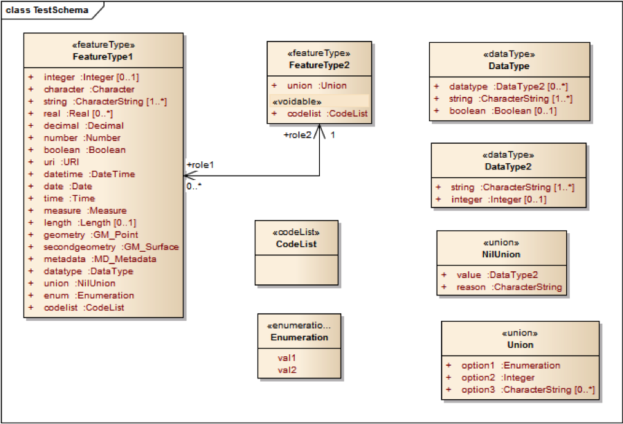

:doctype: book
:encoding: utf-8
:lang: en
:toc: macro
:toc-title: Table of contents
:toclevels: 5

:toc-position: left

:appendix-caption: Annex

:numbered:
:sectanchors:
:sectnumlevels: 5

[[JSON_Schema_deprecated_target]]
= JSON Schema (deprecated target)

*[red]#DEPRECATED#* - The conversion to JSON Schema has been revised. The xref:./JSON Schema.adoc[new version]
is available with ShapeChange v2.10.

[[Background_and_conversion_rules]]
== Background and conversion rules

[[General_approach]]
=== General approach

Three basic options for encoding features in JSON have been considered
in the OWS-9 testbed of OGC (see the
https://portal.opengeospatial.org/files/?artifact_id=51784[Engineering
Report] for more details):

. Use the feature and geometry encoding of the GeoServices JSON encoding
specified by the GeoServices REST API.
. Use the feature and geometry encoding of the GeoJSON encoding.
. Derive a JSON encoding from the GML encoding using one of the existing
XML-to-JSON-mappings.

As a basis for a decision on the general approach, a simple
BuildingGeopoint feature following the Topographic Dataset (TDS)
application schema is used to analyze at the different options. The
feature encoded in GML is shown below:

[source,xml,linenumbers]
----------
<tds:BuildingGeopoint gml:id="StructurePoints8" xmlns:tds="http://metadata.dod.mil/mdr/ns/GSIP/3.0/tds/3.0" xmlns:gml="http://www.opengis.net/gml/3.2">
  <tds:geometry>
    <gml:Point gml:id="StructurePoints8.Geom_0" srsName="http://metadata.ces.mil/mdr/ns/GSIP/crs/WGS84E_2D">
      <gml:pos>36.732821045 -121.633961892</gml:pos>
    </gml:Point>
  </tds:geometry>
  <tds:address>No Information</tds:address>
  <tds:aeroObstacleLightPresent>false</tds:aeroObstacleLightPresent>
  <tds:angleOfOrientation>115.00000000</tds:angleOfOrientation>
  <tds:area>568.99756643</tds:area>
  <tds:conditionOfFacility>fullyFunctional</tds:conditionOfFacility>
  <tds:controllingAuthority>noInformation</tds:controllingAuthority>
  <tds:featureFunction-1>education</tds:featureFunction-1>
  <tds:featureFunction-2>noInformation</tds:featureFunction-2>
  <tds:featureFunction-3>noInformation</tds:featureFunction-3>
  <tds:floorCount>-999999</tds:floorCount>
  <tds:geointAssuranceMetadata.processStep.source.resourceContentOrigin>noInformation </tds:geointAssuranceMetadata.processStep.source.resourceContentOrigin>
  <tds:geoNameCollection.memberGeoName.fullName>No Information</tds:geoNameCollection.memberGeoName.fullName>
  <tds:geoNameCollection.memberGeoName.nameIdentifier>-999999</tds:geoNameCollection.memberGeoName.nameIdentifier>
  <tds:heightAboveSurfaceLevel>33.00000000</tds:heightAboveSurfaceLevel>
  <tds:highestElevation>-999999.00000000</tds:highestElevation>
  <tds:length>29.60813040</tds:length>
  <tds:manufacturingInfo.byProduct-1>noInformation</tds:manufacturingInfo.byProduct-1>
  <tds:manufacturingInfo.byProduct-2>noInformation</tds:manufacturingInfo.byProduct-2>
  <tds:manufacturingInfo.byProduct-3>noInformation</tds:manufacturingInfo.byProduct-3>
  <tds:manufacturingInfo.product-1>noInformation</tds:manufacturingInfo.product-1>
  <tds:manufacturingInfo.product-2>noInformation</tds:manufacturingInfo.product-2>
  <tds:manufacturingInfo.product-3>noInformation</tds:manufacturingInfo.product-3>
  <tds:manufacturingInfo.rawMaterial-1>noInformation</tds:manufacturingInfo.rawMaterial-1>
  <tds:manufacturingInfo.rawMaterial-2>noInformation</tds:manufacturingInfo.rawMaterial-2>
  <tds:manufacturingInfo.rawMaterial-3>noInformation</tds:manufacturingInfo.rawMaterial-3>
  <tds:navigationLandmark>false</tds:navigationLandmark>
  <tds:note.memorandum>No Information</tds:note.memorandum>
  <tds:religiousInfo.religiousDesignation>noInformation </tds:religiousInfo.religiousDesignation>
  <tds:religiousInfo.religiousFacilityType>noInformation </tds:religiousInfo.religiousFacilityType>
  <tds:restriction.securityAttributesGroup_resClassification>U </tds:restriction.securityAttributesGroup_resClassification>
  <tds:restriction.securityAttributesGroup_resNonIntelComMarkings>No Information</tds:restriction.securityAttributesGroup_resNonIntelComMarkings>
  <tds:restriction.securityAttributesGroup_resOwnerProducer>No Information</tds:restriction.securityAttributesGroup_resOwnerProducer>
  <tds:roofShape-1>noInformation</tds:roofShape-1>
  <tds:roofShape-2>noInformation</tds:roofShape-2>
  <tds:roofShape-3>noInformation</tds:roofShape-3>
  <tds:specifiedEnumerants>No Information</tds:specifiedEnumerants>
  <tds:uniqueEntityIdentifier>No Information</tds:uniqueEntityIdentifier>
  <tds:verticalConstMaterial-1>noInformation</tds:verticalConstMaterial-1>
  <tds:verticalConstMaterial-2>noInformation</tds:verticalConstMaterial-2>
  <tds:verticalConstMaterial-3>noInformation</tds:verticalConstMaterial-3>
  <tds:verticalObstIdentifier>No Information</tds:verticalObstIdentifier>
  <tds:width>19.29426795</tds:width>
  <tds:wirelessTelecomInfo.wirelessTelecomType>noInformation </tds:wirelessTelecomInfo.wirelessTelecomType>
</tds:BuildingGeopoint>
----------

A straightforward mapping to GeoServices JSON of this feature would be:

[source,json,linenumbers]
----------
{
"geometry":{
  "x":-121.633961892,
  "y":36.732821045,
  "spatialReference":{"wkid":4326}
},
"attributes":{
  "objectId":8,
  "address":"No Information",
  "aeroObstacleLightPresent":"false",
  "angleOfOrientation":115.00000000,
  "area":568.99756643,
  "conditionOfFacility":"fullyFunctional",
  "controllingAuthority":"noInformation",
  "featureFunction-1":"education",
  "featureFunction-2":"noInformation",
  "featureFunction-3":"noInformation",
  "floorCount":-999999,
  "geointAssuranceMetadata.processStep.source.resourceContentOrigin":"noInformation",
  "geoNameCollection.memberGeoName.fullName":"No Information",
  "geoNameCollection.memberGeoName.nameIdentifier":-999999,
  "heightAboveSurfaceLevel":33.00000000,
  "highestElevation":-999999.00000000,
  "length":29.60813040,
  "manufacturingInfo.byProduct-1":"noInformation",
  "manufacturingInfo.byProduct-2":"noInformation",
  "manufacturingInfo.byProduct-3":"noInformation",
  "manufacturingInfo.product-1":"noInformation",
  "manufacturingInfo.product-2":"noInformation",
  "manufacturingInfo.product-3":"noInformation",
  "manufacturingInfo.rawMaterial-1":"noInformation",
  "manufacturingInfo.rawMaterial-2":"noInformation",
  "manufacturingInfo.rawMaterial-3":"noInformation",
  "navigationLandmark":"false",
  "note.memorandum":"No Information",
  "religiousInfo.religiousDesignation":"noInformation",
  "religiousInfo.religiousFacilityType":"noInformation",
  "restriction.securityAttributesGroup_resClassification":"U",
  "restriction.securityAttributesGroup_resNonIntelComMarkings":"No Information",
  "restriction.securityAttributesGroup_resOwnerProducer":"No Information",
  "roofShape-1":"noInformation",
  "roofShape-2":"noInformation",
  "roofShape-3":"noInformation",
  "specifiedEnumerants":"No Information",
  "uniqueEntityIdentifier":"No Information",
  "verticalConstMaterial-1":"noInformation",
  "verticalConstMaterial-2":"noInformation",
  "verticalConstMaterial-3":"noInformation",
  "verticalObstIdentifier":"No Information",
  "width":19.29426795,
  "wirelessTelecomInfo.wirelessTelecomType":"noInformation"
}}
----------

In this mapping, the following conversion of primitive types from ISO/TS
19103 to JSON Schema types is used:

* CharacterString, Character: string
* Integer: integer
* Real, Decimal, Number: number
* Boolean: boolean
* URI: string with format "uri"
* DateTime: string with format "date-time" or integer with format
"utc-millisec"
* Date: string with format "date" or integer with format "utc-millisec"
* Time: string with format "time"

The benefit of using this option is that a GeoServices REST API Feature
Service would provide the feature using this representation and all the
existing clients that are able to handle features encoded in GeoServices
JSON would be immediately able to process and display such features.

One aspect to note here is that this representation does not include
information that states that this is a BuildingGeopoint feature as in
the GeoServices REST API this information would be implicit. For
example, the feature is a sub-ordinate resource to the feature
type/layer "BuildingGeopoint". This is discussed in more detail below.

Note that the coordinate reference system information could also be
specified using a WKT representation, if this is desired.

Encoding the same feature encoded in GeoJSON would result in a very
similar JSON:

[source,json,linenumbers]
----------
{
"type":"Feature",
"geometry":{
  "type":"Point",
  "coordinates":[-121.633961892,36.732821045]
},
"properties":{
  "id":8,
  "address":"No Information",
  "aeroObstacleLightPresent":"false",
  "angleOfOrientation":115.00000000,
  "area":568.99756643,
  "conditionOfFacility":"fullyFunctional",
  "controllingAuthority":"noInformation",
  "featureFunction-1":"education",
  "featureFunction-2":"noInformation",
  "featureFunction-3":"noInformation",
  "floorCount":-999999,
  "geointAssuranceMetadata.processStep.source.resourceContentOrigin":"noInformation",
  "geoNameCollection.memberGeoName.fullName":"No Information",
  "geoNameCollection.memberGeoName.nameIdentifier":-999999,
  "heightAboveSurfaceLevel":33.00000000,
  "highestElevation":-999999.00000000,
  "length":29.60813040,
  "manufacturingInfo.byProduct-1":"noInformation",
  "manufacturingInfo.byProduct-2":"noInformation",
  "manufacturingInfo.byProduct-3":"noInformation",
  "manufacturingInfo.product-1":"noInformation",
  "manufacturingInfo.product-2":"noInformation",
  "manufacturingInfo.product-3":"noInformation",
  "manufacturingInfo.rawMaterial-1":"noInformation",
  "manufacturingInfo.rawMaterial-2":"noInformation",
  "manufacturingInfo.rawMaterial-3":"noInformation",
  "navigationLandmark":"false",
  "note.memorandum":"No Information",
  "religiousInfo.religiousDesignation":"noInformation",
  "religiousInfo.religiousFacilityType":"noInformation",
  "restriction.securityAttributesGroup_resClassification":"U",
  "restriction.securityAttributesGroup_resNonIntelComMarkings":"No Information",
  "restriction.securityAttributesGroup_resOwnerProducer":"No Information",
  "roofShape-1":"noInformation",
  "roofShape-2":"noInformation",
  "roofShape-3":"noInformation",
  "specifiedEnumerants":"No Information",
  "uniqueEntityIdentifier":"No Information",
  "verticalConstMaterial-1":"noInformation",
  "verticalConstMaterial-2":"noInformation",
  "verticalConstMaterial-3":"noInformation",
  "verticalObstIdentifier":"No Information",
  "width":19.29426795,
  "wirelessTelecomInfo.wirelessTelecomType":"noInformation"
}}
----------

Like in the GeoServices JSON, the GeoJSON representation does not
include the name of the feature type "BuildingGeopoint".

A third option for a JSON representation could be to ignore the existing
work on JSON feature and geometry representations and generically map
the GML to JSON. There are several attempts at general XML-to-JSON
mappings. Here is an example of how an instance could look like:

[source,json,linenumbers]
----------
{
"BuildingGeopoint":{
"id":"StructurePoints8",
"geometry":{
  "Point":{
    "id":"StructurePoints8.Geom_0",
    "srsName":"http://metadata.ces.mil/mdr/ns/GSIP/crs/WGS84E_2D",
    "pos":[36.732821045,-121.633961892]
  }
},
"address":"No Information",
"aeroObstacleLightPresent":"false",
"angleOfOrientation":115.00000000,
"area":568.99756643,
"conditionOfFacility":"fullyFunctional",
"controllingAuthority":"noInformation",
"featureFunction-1":"education",
"featureFunction-2":"noInformation",
"featureFunction-3":"noInformation",
"floorCount":-999999,
"geointAssuranceMetadata.processStep.source.resourceContentOrigin":"noInformation",
"geoNameCollection.memberGeoName.fullName":"No Information",
"geoNameCollection.memberGeoName.nameIdentifier":-999999,
"heightAboveSurfaceLevel":33.00000000,
"highestElevation":-999999.00000000,
"length":29.60813040,
"manufacturingInfo.byProduct-1":"noInformation",
"manufacturingInfo.byProduct-2":"noInformation",
"manufacturingInfo.byProduct-3":"noInformation",
"manufacturingInfo.product-1":"noInformation",
"manufacturingInfo.product-2":"noInformation",
"manufacturingInfo.product-3":"noInformation",
"manufacturingInfo.rawMaterial-1":"noInformation",
"manufacturingInfo.rawMaterial-2":"noInformation",
"manufacturingInfo.rawMaterial-3":"noInformation",
"navigationLandmark":"false",
"note.memorandum":"No Information",
"religiousInfo.religiousDesignation":"noInformation",
"religiousInfo.religiousFacilityType":"noInformation",
"restriction.securityAttributesGroup_resClassification":"U",
"restriction.securityAttributesGroup_resNonIntelComMarkings":"No Information",
"restriction.securityAttributesGroup_resOwnerProducer":"No Information",
"roofShape-1":"noInformation",
"roofShape-2":"noInformation",
"roofShape-3":"noInformation",
"specifiedEnumerants":"No Information",
"uniqueEntityIdentifier":"No Information",
"verticalConstMaterial-1":"noInformation",
"verticalConstMaterial-2":"noInformation",
"verticalConstMaterial-3":"noInformation",
"verticalObstIdentifier":"No Information",
"width":19.29426795,
"wirelessTelecomInfo.wirelessTelecomType":"noInformation"
}}
----------

While the last option is the most general approach, it ignores the
existence of the existing JSON representations for features and
geometries in the geospatial community. It seems preferable to build on
the existing and widely supported representations, GeoServices JSON and
GeoJSON.

Both GeoJSON and GeoServices JSON have been developed in parallel. They
are both used heavily in practice and very likely will both continue to
be used in the future and supported by multiple products. As a
consequence, in general it would make sense to support both JSON
encodings for features and both encodings are very similar, too. At the
current stage, only the GeoServices JSON support is implemented in
ShapeChange, mainly because there is no JSON Schema for GeoJSON. In
general, both variants are very similar.

One amendment to the existing GeoServices JSON and GeoJSON feature
encoding is that the information about the feature type should be part
of the JSON representation. Since this is not a regular feature property
an additional top-level JSON property "entityType" with a string value,
e.g. "BuildingGeopoint", has been added. The use of "entityType" instead
of "featureType" is deliberate as it supports also types that are
objects with identity, but not features.

An id property will be added to each object. To keep with the naming
conventions, "objectId" will be used in the GeoServices encoding rule
and "id" in the GeoJSON encoding rule. The type will be an integer.

[[More_complex_instances]]
=== More complex instances

The example used above is simple and restricted in several ways:

* properties have a maximum multiplicity of 1
* properties have simple values only
* no relationships with other features
* only one geometry property per feature
* only limited support for ISO 19100 types used in application schemas

We will look at these issues one-by-one.

In most cases we will support two different encoding rule options:

* Extended: A representation that maps concepts to JSON and extends the
base JSON schemas, but makes full use of the JSON capabilities.
* Simple: A representation that maps concepts to a JSON representation
consistent with the GeoServices REST API feature representation and the
GeoServices REST API Feature Service; this simplified representation
supports a larger range of clients due to the restrictions on the
complexity of the JSON encoding.

Both approaches are supported as separate encoding rules of the JSON
Schema target.

Unless noted, there would be no difference in the GeoServices JSON and
GeoJSON instances.

[[Properties_with_a_maximum_multiplicity_greater_than_1]]
==== Properties with a maximum multiplicity greater than 1

Extended: Value of the JSON property is an array and each item in the
array represents one value in the value collection.

Example:

[source,json,linenumbers]
----------
"featureFunction":["education","medical"]
----------

Simple: Like in the TDS example, multiple properties are created, i.e.
"property-1", "property-2" and "property-3".

Example:

[source,json,linenumbers]
----------
"featureFunction-1":"education",
"featureFunction-2":"medical"
----------

The number of properties is a global option of the conversion process,
the default is 3.

[[Properties_with_values_that_are_data_types]]
==== Properties with values that are data types

Examples are properties where the value type is a data type (including
unions) defined in an application schema.

Extended: Value of the JSON property is an object and each property of
the data type is represented as a property of that object.

Example:

[source,json,linenumbers]
----------
"geoNameCollection":{
  "memberGeoName":{
    "fullName":"some name",
    "nameIdentifier":null
  }
}
----------

Simple: Like in the TDS example, the type hierarchy is flattened. This
requires that also the flattening approach is used for multiplicities >
1.

Example:

[source,json,linenumbers]
----------
"geoNameCollection.memberGeoName.fullName":"some name", 
"geoNameCollection.memberGeoName.nameIdentifier":null,
----------

Note that this flattening approach can result in quite long lists of
properties, if any of the properties contains properties with a
multiplicity > 1. So this option has to be used with care with complex
models.

[[Properties_that_allow_nil_values_and_metadata_on_those_nil_values]]
==== Properties that allow nil values and metadata on those nil values

Extended: Basically a nil value would be a null in JSON. However, if the
equivalent of a nilReason value should be encoded in JSON, too, then we
need something different, i.e. a special nil-metadata-object.

Example (nil value without a reason):

[source,json,linenumbers]
----------
"geoNameCollection":{
  "memberGeoName":{
    "fullName":null,
    "nameIdentifier":null
  }
}
----------

Example (nil value with a reason):

[source,json,linenumbers]
----------
"geoNameCollection":{
  "memberGeoName":{
    "fullName":{"nilReason":"No information"},
    "nameIdentifier":{"nilReason":"No information"}
  }
}
----------

This is not entirely satisfying as - unlike in the XML Schema case - the
information is lost that it is a nil value whenever reason metadata
about the nil value is provided.

Therefore, the following approach is used, where additional properties
are added as shown in the next example.

Example (nil value with a reason, alternative approach):

[source,json,linenumbers]
----------
"geoNameCollection":{
  "memberGeoName":{
    "fullName":null,
    "fullName_nilReason":"No information",
    "nameIdentifier":null,
    "nameIdentifier_nilReason":"No information"
  }
}
----------

Simple: Like in the TDS example, nil and nilReason values are mapped to
special values (that are documented outside of the schema).

Example:

[source,json,linenumbers]
----------
"geoNameCollection.memberGeoName.fullName":"No Information", 
"geoNameCollection.memberGeoName.nameIdentifier":-999999
----------

[[Properties_with_values_that_are_enumerants]]
==== Properties with values that are enumerants

The value is a string with a constraints that the valid values are from
a fixed list.

Example:

[source,json,linenumbers]
----------
"controllingAuthority":"military"
----------

[[Properties_with_values_that_are_code_list_values]]
==== Properties with values that are code list values

Extended: Value of the JSON property is a URI identifying the code list
value. It is assumed that the URI can be dereferenced and provides a
representation of the code list value (GML, SKOS, JSON).

Example:

[source,json,linenumbers]
----------
"conditionOfFacility":"http://metadata.ces.mil/mdr/ns/GSIP/conditionOfFacility/fullyFunctional"
----------

Simple: Like in the TDS example, the value would be a code. The link
with the underlying code list would be specified outside of the schema.

Example:

[source,json,linenumbers]
----------
"conditionOfFacility":"fullyFunctional"
----------

[[Properties_with_values_that_are_of_types_Date_Time_or_DateTime]]
==== Properties with values that are of types Date, Time or DateTime

Extended: The value of the JSON property is a string with a format
constraint. The format constraints specified by JSON Schema match the
data types specified in 19103 (DateTime: date-time, Date: date, Time:
time). The formats are defined as (see
http://tools.ietf.org/html/draft-zyp-json-schema-03#section-5.23):

* date-time: YYYY-MM-DDThh:mm:ssZ in UTC time
* date: YYYY-MM-DD
* time: hh:mm:ss

I.e., the date and time representations are somewhat more restricted
than the basic types from 19103.

Example:

[source,json,linenumbers]
----------
"lastUpdate":"2012-06-05T10:26:34Z"
----------

Simple: The GeoServices REST API JSON encodes timestamps as an integer
representing the milliseconds, between the specified time and midnight,
00:00 of January 1, 1970 UTC, i.e. they follow the "utc-millisec"
pattern.

Example:

[source,json,linenumbers]
----------
"lastUpdate":1338891994000
----------

As a consequence, there is no option to appropriately represent Time or
Date values and these would be represented as strings, too.

In the "simple" GeoJSON encoding rule the string representation could
be used, too.

[[Properties_with_values_that_are_of_type_Measure_or_any_of_its_subtypes]]
==== Properties with values that are of type Measure or any of its subtypes

Extended: The value of the JSON property is an object with two
properties, "value" and "unit". The unit values follow the pattern
supported in the uom attributes in GML.

Example:

[source,json,linenumbers]
----------
"width":{"value":19.29426795,"unit":"m"}
----------

Simple: There are two ways which could be used. One is like in the TDS
example, where the unit is fixed to some unit.

Example (fixed unit):

[source,json,linenumbers]
----------
"width":19.29426795
----------

The other option would be to add an additional property for the unit:

Example (variable unit):

[source,json,linenumbers]
----------
"width":19.29426795,
"width_unit":"m"
----------

The second option is more general, but avoiding unit conversions in
clients by fixing the unit (and requiring that the conversion, if
necessary, is done on the server side) may also be a benefit. Therefore,
the fixed unit approach is implemented in the target.

[[String_properties_with_regular_expression_patterns]]
==== String properties with regular expression patterns

In this case, the question is rather how this will be represented in the
UML model. In some application schemas such regular expression patterns
have been expressed in an OCL constraint using the syntax
_property.matches(regex)_.

JSON Schema supports specifying patterns on string properties using the
regular expression pattern in the ECMA 262/Perl 5 format which includes
– according to current knowledge – the patterns supported by XPath 2.0.

Currently, this is not supported by ShapeChange.

[[Properties_with_values_that_are_featuresobjects]]
==== Properties with values that are features/objects

Extended: Value of the JSON property is a URI identifying the object. It
is assumed that the URI can be dereferenced and provides a
representation of the object.

Example:

[source,json,linenumbers]
----------
"owner":"http://example.com/Person/123"
----------

Simple: In GeoJSON a URI will be used, too. In the GeoServices REST API,
relationships to other objects are documented separate from the schema
using joins. The objects will contain properties that represent foreign
and primary keys.

Example:

[source,json,linenumbers]
----------
"owner":123
----------

Here, 123 is the foreign key that references a Person object with the
objectId 123.

For cases, where the URI scheme of the server where the data will be
deployed is known at schema creation time, we can also encode the
relationship in the schema. An example: Assume we have feature types
BuildingGeopoint and Person and they would be available at
_http://example.com/TDS/FeatureServer/1/\{objectId}?f=json_ and
_http://example.com/TDS/FeatureServer/2/\{objectId}?f=json_
respectively. Then the link to the owner could be expressed using the
link concept in JSON schema shown below. Of course that requires that
the URI scheme is known at the time the schema is created. If this is
acceptable, then we could perhaps think of a way in which to encode this
information also in the simple encoding rule.

[source,json,linenumbers]
----------
{
"$schema":"http://json-schema.org/draft-03/schema#",
"id":"http://example.com/schema/tds/BuildingGeopoint.json",
"title":"Building feature with point geometry",
"type":"object",
"properties":{
  "entityType":{
    "type":"string",
    "title":"type of the feature type",
    "enum":["BuildingGeopoint"]
  },
  "geometry":{
    "title":"feature geometry",
    "$ref":"http://schemas.opengis.net/gsr/1.0/point.json"},
    "attributes":{
      "title":"feature attributes",
      "type":"object","properties":{
        "objectId":{
          "type":"integer",
          "description":"Object identifier",
          "required":true
        },
        "owner":{
          "description":"Owner of the buidling",
          "type":"integer"
        }
      }
    },
    "links":[{"rel":"related","href":"http://example.com/TDS/FeatureServer/2/{#/attributes/owner}?f=json"}]
  }
}
----------

[[Multiple_geometry_properties_per_feature]]
==== Multiple geometry properties per feature

The restriction to one geometry is a limitation of both GeoServices JSON
and GeoJSON and is very much part of the foundation of these feature
representations as expressed by the specific "geometry" property,
separate from the rest of the feature properties. Therefore, the two
obvious options to allow for additional geometry properties (additional
geometry properties as part of the "attribute"/"properties" object or
additional geometry properties like "geometry-2" etc.) do seem to go
against the basic concepts of these JSON encodings.

Therefore, the encoding rule includes a statement in the application
schema requirements that each feature should not have more than one
geometry property. ShapeChange reports a warning, if a feature type has
multiple geometry properties.

[[Types_without_geometry_properties]]
==== Types without geometry properties

Instances of these types will simply lack the "geometry" property.

[[Support_for_ISO_19100_types_used_in_application_schemas]]
==== Support for ISO 19100 types used in application schemas

As the encoding rule does not aim at defining JSON schemas for base
types specified in the ISO 19100 series, the encoding rule will only
support types from the ISO 19100 standards for which a JSON encoding
exists as part of GeoServices JSON and GeoJSON, or where a conversion
has been defined above.

The encoding rule includes a list of all supported ISO 19100 types in
the application schema requirements. For properties with other types a
warning is issued and the type is mapped to object (in the extended
encoding rule) or string (in the simple encoding rule).

"Other types" include the types, for example, from ISO 19108 (e.g.
TM_Instant), ISO 19115 (e.g. LI_Lineage, CI_ResponsibleParty, DQ_Result)
and ISO 19123 (e.g. CV_RectifiedGrid) as well as those from ISO 19107
that go beyond the spatial geometries supported by ISO 19125 (e.g.
GM_Solid, TP_Edge).

[[Configuration]]
== Configuration

[[Class]]
=== Class

The class for the target implementation is
_de.interactive_instruments.ShapeChange.Target.JSON.JsonSchema_

[[Rules]]
=== Rules

[[rule-json-all-notEncoded]]
==== rule-json-all-notEncoded

(since v2.4.0)

This conversion rule suppresses the conversion to JSON Schema of any
model elements (more specifically: application schemas, classes, and
properties) for which the "jsonEncodingRule" tag is set to "notEncoded".

NOTE: The encoding rule "notEncoded" is defined in the standard rules,
which can be included in the target configuration via:

[source,xml,linenumbers]
----------
<xi:include href="https://shapechange.net/resources/config/StandardRules.xml" />
----------

[[Parameters]]
=== Parameters

This target supports the parameters defined in the following
subsections.

[[defaultEncodingRule]]
==== defaultEncodingRule

Type: String

Default Value: _none_

Explanation:

The identifier of the default encoding rule governing the conversion to
JSON Schema. This default value may be overridden by tagged values set
on individual modeling elements.

[[documentationNoValue]]
==== documentationNoValue

(since 2.0.2)

Type: String

Default Value: _the empty string_

Explanation:

If a descriptor is used in the
xref:./JSON_Schema_deprecated.adoc#documentationTemplate[documentation
template], but has no value, this parameter will be used. See
xref:../get started/The_element_input.adoc#Descriptor_sources[here]
for more information about descriptors.

[[documentationTemplate]]
==== documentationTemplate

(since 2.0.2)

Type: String

Default Value: \[[definition]]

Explanation:

The template for the documentation that is placed in the notes field in
the EA model. The patterns "\[[descriptor]]" will be replaced by the
value of the descriptor, or the value of
xref:./JSON_Schema_deprecated.adoc#documentationNoValue[documentationNoValue],
if the descriptor has no value for the model element. See
xref:../get started/The_element_input.adoc#Descriptor_sources[here]
for more information about descriptors.

[[includeDocumentation]]
==== includeDocumentation

Type: Boolean

Default Value: true

Explanation:

If not set to _false_, and if the documentation derived by applying the
xref:./JSON_Schema_deprecated.adoc#documentationTemplate[documentation
template] is not empty, _descriptions_ are created for model elements
encoded in JSON Schema. Otherwise, descriptions are omitted.

[[jsonBaseURI]]
==== jsonBaseURI

Type: String

Default Value: the string 'FIXME'

Explanation:

Base of the URI that is used as value of the 'id' field of a JSON Schema
file generated by ShapeChange. For each type from the application schema
that is converted, a single file is created. The URI is constructed as
follows:

[source,text,linenumbers]
----------
<base-URI>/<subdirectory>/<type-name>.json
----------

Where:

* <base-URI> is the value of the jsonBaseURI; NOTE that a tagged value
'jsonBaseURI' defined on the schema that the type belongs to takes
precedence over the jsonBaseURI defined via the target configuration
parameter
* <subdirectory> is the value of the tagged value 'jsonDirectory'
defined on the schema that the type belongs to; if that tagged value is
undefined, the value of the 'xmlns' tagged value is used; if that tagged
value is also not defined, then the string 'default' is used
* <type-name> is the name of the type that is being converted

[[jsonSchemaURI]]
==== jsonSchemaURI

Type: Boolean

Default Value: http://json-schema.org/draft-03/schema#

Explanation:

Value of the '$schema' field of a JSON Schema file generated by
ShapeChange. Another recognized value is
_http://json-schema.org/draft-04/schema#_

[[outputDirectory]]
==== outputDirectory

Type: String

Default Value: <the current run directory>

Explanation:

The path to which the ontology file(s) will be written.

[[Example_application_schema]]
== Example application schema

A test application schema has been set up in Enterprise Architect that
includes the different aspects discussed in the previous sub-clause.

The application schema is part of the ShapeChange distribution and unit
tests. In the unit test, the schema documents are compared against the
JSON Schema documents included in the next sub-clauses.

[[Simple_GeoServices_JSON_encoding_rule]]
=== Simple GeoServices JSON encoding rule

The conversion results in the following schemas.

FeatureType1:

[source,json,linenumbers]
----------
{
  "$schema":"http://json-schema.org/draft-03/schema#",
  "id":"http://portele.de/ows9/test/FeatureType1.json",
  "title":"FeatureType1",
  "description":"This is a feature type.",
  "type":"object",
  "properties":{
    "entityType":{
      "title":"feature/object type",
      "type":"string",
      "default":"FeatureType1"
    },
    "geometry":{
      "$ref":"http://schemas.opengis.net/gsr/1.0/point.json"
    },
    "attributes":{
      "title":"feature attributes",
      "type":"object",
      "properties":{
        "integer":{
          "title":"integer",
          "description":"This is an integer.",
          "type":"integer"
        },
        "character":{
          "title":"character",
          "type":"string",
          "required":true
        },
        "string-1":{
          "title":"string",
          "description":"This is a string.",
          "type":"string",
          "required":true
        },
        "string-2":{
          "title":"string",
          "description":"This is a string.",
          "type":"string"
        },
        "string-3":{
          "title":"string",
          "description":"This is a string.",
          "type":"string"
        },
        "real-1":{
          "title":"real",
          "type":"number"
        },
        "real-2":{
          "title":"real",
          "type":"number"
        },
        "real-3":{
          "title":"real",
          "type":"number"
        },
        "decimal":{
          "title":"decimal",
          "type":"number",
          "required":true
        },
        "number":{
          "title":"number",
          "type":"number",
          "required":true
        },
        "boolean":{
          "title":"boolean",
          "type":"boolean",
          "required":true
        },
        "uri":{
          "title":"uri",
          "type":"string",
          "format":"uri",
          "required":true
        },
        "datetime":{
          "title":"datetime",
          "type":"integer",
          "format":"utc-millisec",
          "required":true
        },
        "date":{
          "title":"date",
          "type":"string",
          "format":"time",
          "required":true
        },
        "time":{
          "title":"time",
          "type":"string",
          "format":"time",
          "required":true
        },
        "measure":{
          "title":"measure",
          "type":"number",
          "required":true
        },
        "length":{
          "title":"length",
          "type":"number"
        },
        "metadata":{
          "title":"metadata",
          "type":"string",
          "required":true
        },
        "datatype.datatype-1.string-1":{
          "title":"string",
          "type":"string"
        },
        "datatype.datatype-1.string-2":{
          "title":"string",
          "type":"string"
        },
        "datatype.datatype-1.string-3":{
          "title":"string",
          "type":"string"
        },
        "datatype.datatype-1.integer":{
          "title":"integer",
          "type":"integer"
        },
        "datatype.datatype-2.string-1":{
          "title":"string",
          "type":"string"
        },
        "datatype.datatype-2.string-2":{
          "title":"string",
          "type":"string"
        },
        "datatype.datatype-2.string-3":{
          "title":"string",
          "type":"string"
        },
        "datatype.datatype-2.integer":{
          "title":"integer",
          "type":"integer"
        },
        "datatype.datatype-3.string-1":{
          "title":"string",
          "type":"string"
        },
        "datatype.datatype-3.string-2":{
          "title":"string",
          "type":"string"
        },
        "datatype.datatype-3.string-3":{
          "title":"string",
          "type":"string"
        },
        "datatype.datatype-3.integer":{
          "title":"integer",
          "type":"integer"
        },
        "datatype.string-1":{
          "title":"string",
          "type":"string",
          "required":true
        },
        "datatype.string-2":{
          "title":"string",
          "type":"string"
        },
        "datatype.string-3":{
          "title":"string",
          "type":"string"
        },
        "datatype.boolean":{
          "title":"boolean",
          "type":"boolean"
        },
        "union.value.string-1":{
          "title":"string",
          "type":"string"
        },
        "union.value.string-2":{
          "title":"string",
          "type":"string"
        },
        "union.value.string-3":{
          "title":"string",
          "type":"string"
        },
        "union.value.integer":{
          "title":"integer",
          "type":"integer"
        },
        "union.reason":{
          "title":"reason",
          "type":"string"
        },
        "enum":{
          "title":"enum",
          "type":"string",
          "enum":[
            "val1",
            "val2"
          ],
          "required":true
        },
        "codelist":{
          "title":"codelist",
          "type":"string",
          "required":true
        },
        "role2":{
          "title":"role2",
          "type":"integer",
          "required":true
        }
      }
    },
    "_links":{
      "title":"links",
      "type":"object",
      "patternProperties":{
        "\\w*":{
          "type":"object",
          "properties":{
            "href":{
              "required":true,
              "type":"string",
              "format":"uri"
            }
          }
        }
      }
    }
  },
  "links":[
    {
      "rel":"related",
      "href":"http://example.com/TDS/FeatureServer/2/{#/attributes/owner}?f=json"
    }
  ]
}
----------

FeatureType2:

[source,json,linenumbers]
----------
{
  "$schema":"http://json-schema.org/draft-03/schema#",
  "id":"http://portele.de/ows9/test/FeatureType2.json",
  "title":"FeatureType2",
  "type":"object",
  "properties":{
    "entityType":{
      "title":"feature/object type",
      "type":"string",
      "default":"FeatureType2"
    },
    "attributes":{
      "title":"feature attributes",
      "type":"object",
      "properties":{
        "codelist":{
          "title":"codelist",
          "type":"string",
          "required":true
        },
        "union.option1":{
          "title":"option1",
          "type":"string",
          "enum":[
            "val1",
            "val2"
          ]
        },
        "union.option2":{
          "title":"option2",
          "type":"integer"
        },
        "union.option3-1":{
          "title":"option3",
          "type":"string"
        },
        "union.option3-2":{
          "title":"option3",
          "type":"string"
        },
        "union.option3-3":{
          "title":"option3",
          "type":"string"
        },
        "role1-1":{
          "title":"role1",
          "type":"integer"
        },
        "role1-2":{
          "title":"role1",
          "type":"integer"
        },
        "role1-3":{
          "title":"role1",
          "type":"integer"
        }
      }
    },
    "_links":{
      "title":"links",
      "type":"object",
      "patternProperties":{
        "\\w*":{
          "type":"object",
          "properties":{
            "href":{
              "required":true,
              "type":"string",
              "format":"uri"
            }
          }
        }
      }
    }
  },
  "links":[
    {
      "rel":"related",
      "href":"http://example.com/TDS/FeatureServer/1/{#/attributes/owner}?f=json"
    }
  ]
}
----------

The ShapeChange configuration file used in the conversion is:

[source,xml,linenumbers]
----------
<ShapeChangeConfiguration xmlns:xi="http://www.w3.org/2001/XInclude" xmlns="http://www.interactive-instruments.de/ShapeChange/Configuration/1.1" xmlns:sc="http://www.interactive-instruments.de/ShapeChange/Configuration/1.1" xmlns:xsi="http://www.w3.org/2001/XMLSchema-instance" xsi:schemaLocation="http://www.interactive-instruments.de/ShapeChange/Configuration/1.1 https://shapechange.net/resources/schema/ShapeChangeConfiguration.xsd">
<input>
<parameter name="inputModelType" value="EA7"/>
<parameter name="inputFile" value="src/test/resources/test.eap"/>
<parameter name="appSchemaName" value="Test Schema"/>
<parameter name="publicOnly" value="true"/>
<parameter name="checkingConstraints" value="disabled"/>
<parameter name="sortedSchemaOutput" value="true"/>
<xi:include href="https://shapechange.net/resources/config/StandardAliases.xml"/>
</input>
<log>
<parameter name="reportLevel" value="INFO"/>
<parameter name="logFile" value="testResults/ea/log_JsonGsr.xml"/>
</log>
<targets>
<Target class="de.interactive_instruments.ShapeChange.Target.JSON.JsonSchema" mode="enabled">
<targetParameter name="outputDirectory" value="testResults/ea/json/geoservices"/>
<targetParameter name="defaultEncodingRule" value="geoservices"/>
<xi:include href=" https://shapechange.net/resources/config/StandardJsonMapEntries.xml"/>
</Target>
</targets>
</ShapeChangeConfiguration>
----------

[[Extended_GeoServices_JSON_encoding_rule]]
=== Extended GeoServices JSON encoding rule

The conversion results in the following schemas.

FeatureType1:

[source,json,linenumbers]
----------
{
  "$schema":"http://json-schema.org/draft-03/schema#",
  "id":"http://portele.de/ows9/test/FeatureType1.json",
  "title":"FeatureType1",
  "description":"This is a feature type.",
  "type":"object",
  "properties":{
    "entityType":{
      "title":"feature/object type",
      "type":"string",
      "default":"FeatureType1"
    },
    "geometry":{
      "$ref":"http://schemas.opengis.net/gsr/1.0/point.json"
    },
    "attributes":{
      "title":"feature attributes",
      "type":"object",
      "properties":{
        "integer":{
          "title":"integer",
          "description":"This is an integer.",
          "type":"integer"
        },
        "character":{
          "title":"character",
          "type":"string",
          "required":true
        },
        "string":{
          "title":"string",
          "description":"This is a string.",
          "type":"array",
          "items":{
            "type":"string",
            "minItems":"1"
          }
        },
        "real":{
          "title":"real",
          "type":"array",
          "items":{
            "type":"number"
          }
        },
        "decimal":{
          "title":"decimal",
          "type":"number",
          "required":true
        },
        "number":{
          "title":"number",
          "type":"number",
          "required":true
        },
        "boolean":{
          "title":"boolean",
          "type":"boolean",
          "required":true
        },
        "uri":{
          "title":"uri",
          "type":"string",
          "format":"uri",
          "required":true
        },
        "datetime":{
          "title":"datetime",
          "type":"string",
          "format":"date-time",
          "required":true
        },
        "date":{
          "title":"date",
          "type":"string",
          "format":"time",
          "required":true
        },
        "time":{
          "title":"time",
          "type":"string",
          "format":"time",
          "required":true
        },
        "measure":{
          "title":"measure",
          "$ref":"http://portele.de/ows9/measure.json"
        },
        "length":{
          "title":"length",
          "$ref":"http://portele.de/ows9/measure.json"
        },
        "metadata":{
          "title":"metadata",
          "type":"any",
          "required":true
        },
        "datatype":{
          "title":"datatype",
          "description":"This is a data type.",
          "$ref":"http://portele.de/ows9/test/DataType.json"
        },
        "union":{
          "title":"union",
          "$ref":"http://portele.de/ows9/test/NilUnion.json"
        },
        "enum":{
          "title":"enum",
          "type":"string",
          "enum":[
            "val1",
            "val2"
          ],
          "required":true
        },
        "codelist":{
          "title":"codelist",
          "type":"string",
          "format":"uri",
          "required":true
        },
        "role2":{
          "title":"role2",
          "type":"string",
          "format":"uri",
          "required":true
        }
      }
    },
    "_links":{
      "title":"links",
      "type":"object",
      "patternProperties":{
        "\\w*":{
          "type":"object",
          "properties":{
            "href":{
              "required":true,
              "type":"string",
              "format":"uri"
            }
          }
        }
      }
    }
  }
}
----------

FeatureType2:

[source,json,linenumbers]
----------
{
  "$schema":"http://json-schema.org/draft-03/schema#",
  "id":"http://portele.de/ows9/test/FeatureType2.json",
  "title":"FeatureType2",
  "type":"object",
  "properties":{
    "entityType":{
      "title":"feature/object type",
      "type":"string",
      "default":"FeatureType2"
    },
    "attributes":{
      "title":"feature attributes",
      "type":"object",
      "properties":{
        "codelist":{
          "title":"codelist",
          "type":[
            "string",
            "null"
          ],
          "format":"uri",
          "required":true
        },
        "codelist_nullReason":{
          "title":"Reason for null value in property codelist",
          "type":"string"
        },
        "union":{
          "title":"union",
          "$ref":"http://portele.de/ows9/test/Union.json"
        },
        "role1":{
          "title":"role1",
          "type":"array",
          "items":{
            "type":"string",
            "format":"uri"
          }
        }
      }
    },
    "_links":{
      "title":"links",
      "type":"object",
      "patternProperties":{
        "\\w*":{
          "type":"object",
          "properties":{
            "href":{
              "required":true,
              "type":"string",
              "format":"uri"
            }
          }
        }
      }
    }
  }
}
----------

DataType:

[source,json,linenumbers]
----------
{
  "$schema":"http://json-schema.org/draft-03/schema#",
  "id":"http://portele.de/ows9/test/DataType.json",
  "title":"DataType",
  "type":"object",
  "properties":{
    "attributes":{
      "title":"feature attributes",
      "type":"object",
      "properties":{
        "datatype":{
          "title":"datatype",
          "description":"This is another data type.",
          "type":"array",
          "items":{
            "$ref":"http://portele.de/ows9/test/DataType2.json"
          }
        },
        "string":{
          "title":"string",
          "type":"array",
          "items":{
            "type":"string",
            "minItems":"1"
          }
        },
        "boolean":{
          "title":"boolean",
          "type":"boolean"
        }
      }
    }
  }
}
----------

DataType2:

[source,json,linenumbers]
----------
{
  "$schema":"http://json-schema.org/draft-03/schema#",
  "id":"http://portele.de/ows9/test/DataType2.json",
  "title":"DataType2",
  "type":"object",
  "properties":{
    "attributes":{
      "title":"feature attributes",
      "type":"object",
      "properties":{
        "string":{
          "title":"string",
          "type":"array",
          "items":{
            "type":"string",
            "minItems":"1"
          }
        },
        "integer":{
          "title":"integer",
          "type":"integer"
        }
      }
    }
  }
}
----------

UnionType:

[source,json,linenumbers]
----------
{
  "$schema":"http://json-schema.org/draft-03/schema#",
  "id":"http://portele.de/ows9/test/Union.json",
  "title":"Union",
  "type":"object",
  "properties":{
    "attributes":{
      "title":"feature attributes",
      "type":"object",
      "properties":{
        "option1":{
          "title":"option1",
          "type":"string",
          "enum":[
            "val1",
            "val2"
          ]
        },
        "option2":{
          "title":"option2",
          "type":"integer"
        },
        "option3":{
          "title":"option3",
          "type":"array",
          "items":{
            "type":"string"
          }
        }
      }
    }
  }
}
----------

NilUnionType:

[source,json,linenumbers]
----------
{
  "$schema":"http://json-schema.org/draft-03/schema#",
  "id":"http://portele.de/ows9/test/NilUnion.json",
  "title":"NilUnion",
  "type":"object",
  "properties":{
    "attributes":{
      "title":"feature attributes",
      "type":"object",
      "properties":{
        "value":{
          "title":"value",
          "$ref":"http://portele.de/ows9/test/DataType2.json"
        },
        "reason":{
          "title":"reason",
          "type":"string"
        }
      }
    }
  }
}
----------

The ShapeChange configuration file used in the conversion is:

[source,xml,linenumbers]
----------
<ShapeChangeConfiguration xmlns:xi="http://www.w3.org/2001/XInclude" xmlns="http://www.interactive-instruments.de/ShapeChange/Configuration/1.1" xmlns:sc="http://www.interactive-instruments.de/ShapeChange/Configuration/1.1" xmlns:xsi="http://www.w3.org/2001/XMLSchema-instance" xsi:schemaLocation="http://www.interactive-instruments.de/ShapeChange/Configuration/1.1 https://shapechange.net/resources/schema/ShapeChangeConfiguration.xsd">
<input>
<parameter name="inputModelType" value="EA7"/>
<parameter name="inputFile" value="src/test/resources/test.eap"/>
<parameter name="appSchemaName" value="Test Schema"/>
<parameter name="publicOnly" value="true"/>
<parameter name="checkingConstraints" value="disabled"/>
<parameter name="sortedSchemaOutput" value="true"/>
<xi:include href="https://shapechange.net/resources/config/StandardAliases.xml"/>
</input>
<log>
<parameter name="reportLevel" value="INFO"/>
<parameter name="logFile" value="testResults/ea/log_JsonGsrExtended.xml"/>
</log>
<targets>
<Target class="de.interactive_instruments.ShapeChange.Target.JSON.JsonSchema" mode="enabled">
<targetParameter name="outputDirectory" value="testResults/ea/json/geoservices_extended"/>
<targetParameter name="defaultEncodingRule" value="geoservices_extended"/>
<xi:include href=" https://shapechange.net/resources/config/StandardJsonMapEntries.xml"/>
</Target>
</targets>
</ShapeChangeConfiguration>
----------
