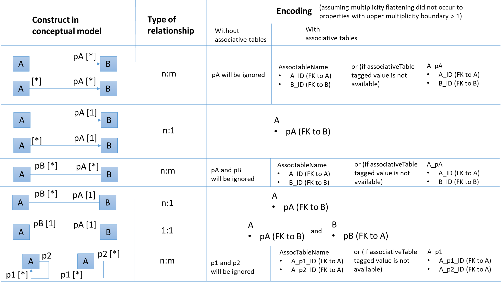
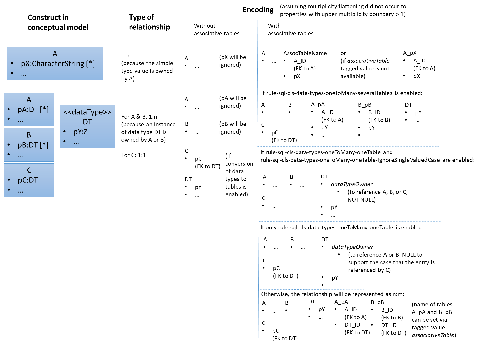

:doctype: book
:encoding: utf-8
:lang: en
:toc: macro
:toc-title: Table of contents
:toclevels: 5

:toc-position: left

:appendix-caption: Annex

:numbered:
:sectanchors:
:sectnumlevels: 5

[[SQL_DDL]]
= SQL DDL

This target derives a SQL structure from an application schema. The
structure is typically translated to a Data Definition Language (DDL)
schema, which can be used to set up an SQL database which can store
application data compliant to the schema. The structure can also be
translated into a replication schema.

NOTE: The target currently supports conversion of feature types, object
types, data types, enumerations, and code lists. Conversion of unions is
currently not supported.

The overall workflow consists of five steps:

. Loading the model with the application schema
. Flattening the schema
. Executing additional transformations (e.g. for handling keywords)
. Deriving SQL structure from the schema
. Translating to a DDL script or a replication schema

Steps 2-5 are described in the following sections.

[[Pre-Processing_Flattening]]
== Pre-Processing: Flattening

In order to achieve a simple structure of tables, and also in order to
cope with the potential complexity of the application schema, a number
of flattening rules need to be executed:

* *rule-trf-cls-flatten-inheritance*
* *rule-trf-prop-flatten-multiplicity*
** if associative tables shall be created, also enable the following
subrules:
*** rule-trf-prop-flatten-multiplicity-keepBiDirectionalAssociations
*** rule-trf-prop-flatten-multiplicity-withMaxMultiplicityThreshold
* *rule-trf-prop-flatten-types*
* *rule-trf-all-flatten-name*

NOTE: The flattening rules and parameters are documented in detail on
the xref:../transformations/Flattener.adoc[Flattener
transformation] page.

The following parameters should be set for the flattening
transformation:

* maxOccurs: set the default value for representing properties with
maximum cardinality > 1 (and a type that is not represented by a
separate table)
* flattenObjectTypes: setting this parameter to false will result in
object types not being flattened, thus allowing the SQL DDL derivation
process to generate instructions for creating tables not only for
feature types but also for object types.
* flattenDataTypesExcludeRegex: if the SQL DDL target shall create
tables for particular data types, these data types can be excluded from
type flattening.
* codeByTaggedValue: setting this parameter allows you to indicate that
the code to replace the name of a model element should not be looked up
in the alias of that model element, but in the tagged value identified
by the value of this parameter

[[Pre-Processing_Additional_Transformations]]
== Pre-Processing: Additional Transformations

Before the SQL DDL target is executed, additional transformations can be
applied to the model.

For example, if the application schema contains classes whose name is a
SQL keyword (see
http://www.postgresql.org/docs/current/static/sql-keywords-appendix.html[this
list], for example), the
xref:../transformations/Naming_Modifier.adoc[Naming
Modifier] transformation can be applied to change the names of these
classes. The transformation simply adds a suffix to the class name, thus
preventing a conflict with reserved SQL keywords.

NOTE: The same applies to property names.

[[Deriving_SQL_Structure_from_the_Schema]]
== Deriving SQL Structure from the Schema

[[Overview]]
=== Overview

In general, the target creates SQL statements for:

* creating tables
* altering tables
** to add foreign key constraints
** to add check constraints
* adding geometry metadata update statements
* creating geometry indexes
* documentation of model elements via comment statements

Statements are created with one particular database system in mind. The
user chooses – by setting the configuration parameter
xref:./SQL_DDL.adoc#databaseSystem[_databaseSystem_]
– whether statements shall be created for PostgreSQL, Oracle, or SQL
Server.

[[Tables]]
=== Tables

For each type that is to be converted (as defined by the
xref:./SQL_DDL.adoc#Rules[encoding rule]) the
target generates CREATE TABLE statements:

* The (normalized) name of the type is used as the table name.
** NOTE: Database schema assignment is supported for PostgreSQL DDL via
xref:./SQL_DDL.adoc#rule-sql-all-schemas[rule-sql-all-schemas]
* Primary key:
** If an \<<identifier>> attribute is defined for a type in the
conceptual schema (see
xref:./SQL_DDL.adoc#rule-sql-cls-identifierStereotype[_rule-sql-cls-identifierStereotype_])
then the column that represents that attribute will be the primary key
of the table that represents the type. The data type of foreign key
columns that reference that table will be set accordingly.
** Otherwise:
*** The SQL DDL target generates a primary key column. The name of the
that column is defined via the
xref:./SQL_DDL.adoc#idColumnName[_idColumnName_]
parameter.
*** The data type of the generated primary key column depends upon the
database system:
**** PostgreSQL: bigserial
**** Oracle: integer
**** SQL Server: bigint
**** SQLite: integer
*** The configuration parameters
xref:./SQL_DDL.adoc#primaryKeySpecification[_primaryKeySpecification_]
and
xref:./SQL_DDL.adoc#primaryKeySpecificationCodelist[_primaryKeySpecificationCodelist_]
can be used to influence the specification of primary keys.
*** NOTE: For an associative table that represents an n:m relationship
between two types, the primary key is constructed using all columns of
that table. Parameters
xref:./SQL_DDL.adoc#primaryKeySpecification[_primaryKeySpecification_]
and xref:./SQL_DDL.adoc#primaryKeySpecificationCodelist[_primaryKeySpecificationCodelist_]
are ignored for these primary keys.
* The conversion of properties into column definition statements is
described in the following section.

Associative tables can also be created. The behavior for encoding
various model constructs when creation of associative tables is enabled
(and assuming that multiplicity was not totally flattened) are depicted
in the following figures:

[[Property_Conversion]]
=== Property Conversion

This section describes the conversion of properties.

NOTE: Not each and every nuance of property conversion may be covered
here. The conversion depends on the encoding rule, and the conversion
rules it includes (for further details, see section
xref:./SQL_DDL.adoc#Rules[Rules]).

* A property will not be encoded if:
** It is derived, and
xref:./SQL_DDL.adoc#rule-sql-prop-exclude-derived[rule-sql-prop-exclude-derived]
is enabled,
** xref:./SQL_DDL.adoc#rule-sql-all-notEncoded[rule-sql-all-notEncoded]
applies to it,
** The value type of the property is contained in the application schema
but no map entry is defined for that type and the type itself is not
converted (e.g. because it is abstract, or because no rule is set that
is a pre-requisite to convert the kind of type, like
xref:./SQL_DDL.adoc#rule-sql-cls-object-types[rule-sql-cls-object-types]).
* The conversion of code list properties is handled via
xref:./SQL_DDL.adoc#rule-sql-cls-code-lists[rule-sql-cls-code-lists].
* If the maximum cardinality of the property equals 1 a column
definition statement is created; otherwise:
** If the property belongs to a bi-directional association and the
reverse property has maximum cardinality of 1 then we have an n:1
relationship in the model which can be represented.
** Otherwise:
*** If
xref:./SQL_DDL.adoc#rule-sql-all-associativetables[rule-sql-all-associativetables]
is enabled we can represent the relationship via an associative table.
*** Otherwise the property is ignored.
* The data type for a column is defined as follows:
** If the value type of the property is a type represented by a table,
then the column contains a foreign key. The data type of the column is
the same as that of the primary key column of the referenced table.
*** NOTE: In order for a type to be recognized as being represented by a
table, the following rules apply:
**** a map entry is defined for the type, containing the table
parameter,
**** or: the type is a feature, object, data type, or code list that:
***** is part of the model AND
***** table creation for the type is allowed (defined by the encoding
rule) AND
***** the type is part of the schema OR
xref:./SQL_DDL.adoc#rule-sql-cls-references-to-external-types[rule-sql-cls-references-to-external-types]
is in effect
*** NOTE: Via the
xref:./SQL_DDL.adoc#createReferences[_createReferences_]
parameter one can omit the creation of foreign key constraints. These
constraints ensure referential integrity. For performance reasons (such
as on insert or update, or to allow temporarily inconsistent data) a
user may choose to omit the creation of these constraints.
** If a type mapping is available via the map entries set for this
target (for further details, see the
xref:./SQL_DDL.adoc#Map_Entries[Map Entries
section]) then the type defined by the mapping is used.
*** A type mapping can provide additional information, for example how
to encode default values and if the target type is a geometry type. For
further details, see the
xref:./SQL_DDL.adoc#Map_Entries[map entries
section].
*** If the property has tagged value _precision_ and, optionally, tagged
value _scale_ (both with integer value), an according suffix is added to
the datatype declaration, resulting in, for example, 'number(5,2)'
instead of just 'number'.
** If no type mapping is available then for properties with the value
type being an enumeration, codelist, data, object or feature type (if
the encoding rule does not cover the type) a textual data type is
applied.
** Otherwise "unknown" is set as data type.
* If an initial value is set for the property in the UML model, this
value is set as the DEFAULT (for further details on encoding of default
values, see the
xref:./SQL_DDL.adoc#Default_Values[Default Values
section]).
* If the property is NOT optional (minimum cardinality < 1), voidable,
or nillable then "NOT NULL" is added to the column definition statement.
* Schema elements can be documented as described in section
xref:./SQL_DDL.adoc#Documentation[Documentation].

[[Textual_Data_Type_with_Limited_or_Unlimited_Length]]
=== Textual Data Type with Limited or Unlimited Length

Database systems usually support textual data types with limited and
unlimited length for table columns.

NOTE: SQLite is a bit different, because it maps data types to a small
set of general data types, based upon type affinity. For further
details, see https://www.sqlite.org/datatype3.html.

In order to identify whether a UML property should be represented by a
column with a textual data type of limited length or by a textual data
type of unlimited length, the target reviews the map entry that applies
for the value type of the property:

* If the xref:./SQL_DDL.adoc#targetType[target type
of the map entry (MapEntry/@targetType)] specifies conditional type
selection (via the value 'cond:textOrCharacterVarying'), then the target
evaluates the 'size' defined for the property. The value of 'size' is
defined by, in order of precedence, (1) the tagged value 'size' on the
property, (2) the value of the configuration parameter
xref:./SQL_DDL.adoc#size[size] and (3) a default
value. If 'size' is 0 or negative, the textual data type with unlimited
length is chosen. If 'size' is positive, the textual data type with
limited length is chosen, with the limit being defined by the value of
'size'.
* If the xref:./SQL_DDL.adoc#targetType[target type
of the map entry (MapEntry/@targetType)] does not specify conditional
type selection, then the data type of the column is defined by the map
entry. For a textual data type, the length may be specified via a
parameterization of the data type in MapEntry/@targetType. Example:
@targetType = 'VARCHAR2(25)'. In order to indicate that the data type
parameter provides a value for length – and not, for example, for
xref:./SQL_DDL.adoc#Parameter_precision[precision]
– xref:./SQL_DDL.adoc#param[MapEntry@param] must
define the xref:./SQL_DDL.adoc#Parameter_length[map
entry parameter 'length'].

NOTE (since v2.9.0): For the Oracle
xref:./SQL_DDL.adoc#databaseSystem[database
system], it is also possible to qualify the length of a data type with
limited length. The value of this qualifier is defined by, in order of
precedence, (1) the characteristic 'lengthQualifier' of the
xref:./SQL_DDL.adoc#Parameter_length[map entry
parameter 'length'] and (2) the target parameter
xref:./SQL_DDL.adoc#lengthQualifier[lengthQualifier].
The value of the Oracle initialization parameter
https://docs.oracle.com/apps/search/search.jsp?q=NLS_LENGTH_SEMANTICS&category=database[NLS_LENGTH_SEMANTICS]
decides the default length semantics of the database if no qualifier is
specified.

Map entry examples for the Oracle database system:

[source,xml,linenumbers]
----------
<MapEntry type="CharacterString" rule="*" targetType="cond:textOrCharacterVarying" param="defaultValue{quoted=true},length{lengthQualifier=BYTE}"/>

<MapEntry type="CountryCode" rule="*" targetType="VARCHAR2(3)" param="length{lengthQualifier=CHAR}"/>

<MapEntry type="MyEnumeration" rule="*" targetType="VARCHAR2(8)" param="length{lengthQualifier=NONE}"/><!-Overrides target parameter lengthQualifier -->

<MapEntry type="MyEnumeration2" rule="*" targetType="VARCHAR2(10)" param="length"/><!-Values of NLS_LENGTH_SEMANTICS determines whether VARCHAR2(10) is equivalent to VARCHAR2(10 CHAR) or to VARCHAR2(10 BYTE). -->
----------

[[Foreign_Key_Constraint_Options]]
=== Foreign Key Constraint Options

(since v2.6.0)

A foreign key option defines behaviour for a table with foreign key, in
case that the primary key of the record that is referenced by the
foreign key has been updated or deleted. For further details, see the
documentation of the relevant database system.

ShapeChange supports defining these options for properties that
represent foreign keys. To define the behaviour for updates, set the
tagged value 'sqlOnUpdate' to the desired option. The tagged value would
be set on an attribute, an association role, or the association the role
belongs to (if ShapeChange does not find a definition for a foreign key
option on an association role, it tries to look a foreign key option up
in the association). Likewise, for deletions, set tagged value
'sqlOnDelete'. In general, ShapeChange knows the following foreign key
options:

* Cascade
* No Action
* Restrict
* Set Default
* Set Null

NOTE: When parsing the tagged value 'sqlOnDelete' and 'sqlOnUpdate',
case as well as leading, trailing, and intermediate (i.e. between words)
whitespace is ignored. ShapeChange can parse, for example, the values
'set null', 'setnull', 'Set Null', and '   set     Null   '. However,
'se t null' would not be parsed.

Which options are supported depends on the chosen database system, as
well as the intended behaviour (delete or update). The following table
gives an overview:

[cols=",,,,,,",options="header"]
|===
2+| |Cascade |No Action |Restrict |Set Default |Set Null
.2+|*Oracle* |*On Delete* |x |x |- |- |x
|*On Update* |- |- |- |- |-
.2+|*PostgreSQL* |*On Delete* |x |x |x |x |x
|*On Update* |x |x |x |x |x
.2+|*SQL Server* |*On Delete* |x |x |- |x |x
|*On Update* |x |x |- |x |x
.2+|*SQLite* |*On Delete* |x |x |x |x |x
|*On Update* |x |x |x |x |x
|===

ShapeChange checks if the chosen database supports a given option. If
that is not the case, an info message is logged, informing the user that
the option is ignored.

ShapeChange also validates the option. At the moment, there is only one
check (additional checks can be added in the future):

* If the option is 'Set Null' then the foreign key field must not be
defined as 'NOT NULL'.

If the option is invalid, a warning is logged to inform the user.

[[Naming]]
=== Naming

Database systems typically have specific requirements regarding the
names of tables, columns, constraints, etc.:

* There may be restrictions on the length of names.
* Names of certain types of SQL objects must be unique.

In addition, communities typically have specific naming conventions
which can specify, for example:

* The case of names (upper, lower, or mixed).
* The way that names of constraints (e.g. check and foreign key
constraints) are constructed.
* How conflicting names shall be made unique.

The following sections describe the features and configuration options
supported by ShapeChange with respect to naming.

[[Normalization_of_Names]]
==== Normalization of Names

Database systems may enforce certain restrictions on names, for example
table names. The SQL DDL target therefore normalizes names taken from
the model when using them in DDL statements. Normalization is applied to
names of: schemas, tables, columns, indexes, and constraints (check and
foreign key).

In general, all occurrences of +++"."+++ and +++"-"+++ are replaced by +++"_"+++. Further
normalization is performed depending upon the configured conversion
rules:

* xref:./SQL_DDL.adoc#rule-sql-all-normalizing-lower-case[rule-sql-all-normalizing-lower-case]
- Switch to lower case. By default, the name length is not restricted.
** However, a length limit can be defined using target parameter
xref:./SQL_DDL.adoc#maxNameLength[maxNameLength].
This rule, together with a length limit for names of 63 characters, is
used as default when the targetParameter "databaseSystem" is specified
to be PostgreSQL. NOTE: If the length of the normalized name is
different to the original one, a debug message will be logged.
* xref:./SQL_DDL.adoc#rule-sql-all-normalizing-oracle[rule-sql-all-normalizing-oracle]
- Restrict name length to 30 characters and switch to upper case.
Default for Oracle database system. NOTE: If the length of the
normalized name is different to the original one, a warning will be
logged.
* xref:./SQL_DDL.adoc#rule-sql-all-normalizing-sqlserver[rule-sql-all-normalizing-sqlserver]
- Restrict name length to 128 characters (case is not modified). Default
for SQL Server database system. NOTE: If the length of the normalized
name is different to the original one, a warning will be logged.
* xref:./SQL_DDL.adoc#rule-sql-all-normalizing-upper-case[rule-sql-all-normalizing-upper-case]
- Switch to upper case. By default, the name length is not restricted.
** However, a length limit can be defined using target parameter
xref:./SQL_DDL.adoc#maxNameLength[maxNameLength].
NOTE: If the length of the normalized name is different to the original
one, a debug message will be logged.

As we can see, normalization involves limiting the length of a name and
changing case (to lower or upper). The latter can be switched off by
including
xref:./SQL_DDL.adoc#rule-sql-all-normalizing-ignore-case[_rule-sql-all-normalizing-ignore-case_].

[[Unique_Naming]]
==== Unique Naming

The naming scheme of a database system typically requires that the names
of certain types of SQL objects are unique.

ShapeChange supports a naming scheme that ensures that the names of
constraints generated by the target (check, foreign key, and unique
constraints) are unique. Additional naming schemes can be added if
required.

NOTE: The SqlDdl target currently does not check whether the names of
schemas, tables, columns, or indexes are unique.

The default strategy to ensure that a constraint name is unique is to
replace the end of the name with an integer suffix. For example, if the
name CHK_PROPERTY already exists, a new constraint with that name would
receive the name CHK_PROPERT0. The range of the integer is 0-9999. If
this range does not suffice to ensure unique naming, ShapeChange will
log an error. Additional strategies can be added in the future, if
required.

[[Naming_of_Foreign_Key_Constraints]]
==== Naming of Foreign Key Constraints

By default, ShapeChange constructs the name of a foreign key constraint
as follows:

"fk_" + tableName + +++"_"+++ + fieldName

This behavior can be changed via conversion rules:

* xref:./SQL_DDL.adoc#rule-sql-all-foreign-key-oracle-naming-style[rule-sql-all-foreign-key-oracle-naming-style]
* xref:./SQL_DDL.adoc#rule-sql-all-foreign-key-pearsonhash-naming[rule-sql-all-foreign-key-pearsonhash-naming]

NOTE: Once the name of a foreign key constraint has been created, it is
normalized and may also be made unique, depending upon the unique naming
strategy employed by the naming scheme. If the resulting name is
different to the original one, a warning will be logged.

[[Naming_of_Check_Constraints]]
==== Naming of Check Constraints

The way that names of check constraints are created can be configured
using the following conversion rules:

* xref:./SQL_DDL.adoc#rule-sql-all-check-constraint-naming-oracle-default[rule-sql-all-check-constraint-naming-oracle-default]
* xref:./SQL_DDL.adoc#rule-sql-all-check-constraint-naming-pearsonhash[rule-sql-all-check-constraint-naming-pearsonhash]
* xref:./SQL_DDL.adoc#rule-sql-all-check-constraint-naming-postgresql-default[rule-sql-all-check-constraint-naming-postgresql-default]
* xref:./SQL_DDL.adoc#rule-sql-all-check-constraint-naming-sqlserver-default[rule-sql-all-check-constraint-naming-sqlserver-default]

If none of these rules is included in the configuration, then default
rules apply, depending upon the chosen database system (the rule name
indicates if the rule is a default for a specific database system or
not).

NOTE: Once the name of a check constraint has been created, it is
normalized and may also be made unique, depending upon the unique naming
strategy employed by the naming scheme. If the resulting name is
different to the original one, a warning will be logged.

[[Naming_of_Unique_Constraints]]
==== Naming of Unique Constraints

Unique constraints can be produced using
xref:./SQL_DDL.adoc#rule-sql-prop-uniqueConstraints[rule-sql-prop-uniqueConstraints].

Currently, the naming scheme for unique constraints depends on the
database system:

* +++Oracle: "uk_" + tableName (restricted to the first 13 characters) +
"_" + columnName (restricted to the first 13 characters)+++
* PostgreSQL and SQLite: "uk_" + tableName + "_" + columnName
* SQLServer: "uk_" + {tableName + "_" + columnName} (restricted to the
first 125 characters)

NOTE: Once the name of a unique constraint has been created, it is
normalized and may also be made unique, depending upon the unique naming
strategy employed by the naming scheme. If the resulting name is
different to the original one, a warning will be logged.

[[Naming_of_Geometry_Indexes]]
==== Naming of Geometry Indexes

By default, ShapeChange constructs the name of a geometry index
statement as follows:

"idx_" + tableName + +++"_"+++ + fieldName

Currently there are no rules to change this behaviour.

[[Default_Values]]
=== Default Values

The conceptual model may define an initial value for a property.

If the property belongs to a code list or enumeration, then the initial
value typically provides the code/enum value to use for encoding data.
The name of the property then provides the human readable name of the
code/enum.

If, however, the property does NOT belong to a code list or enumeration,
then the initial value defines the default value for the property. In
that case, the value type of the property maps to a simple type, for
example CharacterString, Boolean, or Real.

In SQL, the default value defined for a column must be quoted if the
column has a textual type. Single quotes in a default value must be
escaped with another single quote. Furthermore, initial values for type
Boolean can be implemented in different ways, depending upon conventions
of the given database system and user community.

Map entries define how a specific type from the conceptual model is
implemented in a given encoding. For example, type Boolean may be
implemented as an integer in Oracle, as a boolean in PostgreSQL, and as
a bit in SQL Server. A map entry can also specify how default values
shall be encoded. The according parameter is called "defaultValue". The
specification of the default value includes if the value shall be
quoted, and how the boolean values 'true' and 'false' shall be encoded.

Examples (taken from standard map entries [linked in the
xref:./SQL_DDL.adoc#Map_Entries[map entries
section]]):

[source,xml,linenumbers]
----------
<MapEntry type="Boolean" rule="*" targetType="INTEGER" param="defaultValue{true=1;false=0}"/>

<MapEntry type="Boolean" rule="*" targetType="boolean" param="defaultValue{true=TRUE;false=FALSE}"/>

<MapEntry type="Boolean" rule="*" targetType="bit" param="defaultValue{true=1;false=0}"/>

<MapEntry type="Date" rule="*" targetType="DATE" param="defaultValue{quoted=true}"/>

<MapEntry type="CharacterString" rule="*" targetType="cond:textOrCharacterVarying" param="defaultValue{quoted=true}"/>
----------

[[Geometry_Metadata]]
=== Geometry Metadata

NOTE: This section applies to the Oracle database system only.

When the DDL contains tables with spatial columns, the view
USER_SDO_GEOM_METADATA must be updated before creating spatial indexes.

Up until v2.3.0, ShapeChange created statements like the following:

[source,sql,linenumbers]
----------
INSERT INTO USER_SDO_GEOM_METADATA (TABLE_NAME, COLUMN_NAME, DIMINFO, SRID) VALUES ('MYTABLE', 'MYCOLUMN', MDSYS.SDO_DIM_ARRAY(FIXME), 31467);
----------

The SDO_DIM_ARRAY value needed to be specified by the user in a separate
postprocessing step.

Since v2.4.0, ShapeChange supports the configuration parameter
xref:./SQL_DDL.adoc#sdoDimElements[_sdoDimElements_].
The parameter can be used to provide a global value for SDO_DIM_ARRAY.
With this parameter, statements like the following can be created:

[source,sql,linenumbers]
----------
INSERT INTO USER_SDO_GEOM_METADATA (TABLE_NAME, COLUMN_NAME, DIMINFO, SRID) VALUES ('MYTABLE', 'MYCOLUMN', MDSYS.SDO_DIM_ARRAY(MDSYS.SDO_DIM_ELEMENT('dim1', -1, 1, 1.1), MDSYS.SDO_DIM_ELEMENT('dim2', -2, 2.2, 2), MDSYS.SDO_DIM_ELEMENT('dim3', -3.3, 3, 3)), 31467);
----------

NOTE: In the future, the functionality to specify the value of
SDO_DIM_ARRAY can be extended to define the actual value per spatial
column, for example via a tagged value on the according property from
the conceptual model.

[[Indexes]]
=== Indexes

The target creates indexes for fields with a geometry value.

If needed, indexes for other fields must be added later on.

[[Documentation]]
=== Documentation

By default, the SQL DDL target creates inline comments for columns that
represent application schema elements (attributes and association
roles). The creation of inline comments can be prevented by including
_xref:./SQL_DDL.adoc#rule-sql-all-suppressDocumentationViaInlineComments[rule-sql-all-suppressDocumentationViaInlineComments]._

Some database systems support explicit COMMENT statements to document
schema elements, which can be useful for documentation of the DDL in a
more tool-friendly manner. Such statements can be created by including
xref:./SQL_DDL.adoc#rule-sql-all-documentationViaExplicitCommentStatements[_rule-sql-all-documentationViaExplicitCommentStatements_]
in the encoding rule.

[[Translation_to_a_DDL_script_Replication_Schema_or_Database_Model]]
== Translation to a DDL script, Replication Schema, or Database Model

[[Database_DDL]]
=== Database DDL

The typical output of the SQL DDL target is a DDL script. To produce
this script, the SQL structure created in the previous processing step
is simply written to a text file.

The output can be amended as follows:

* Add text from an external file to the top or bottom of the output; see
parameters
xref:./SQL_DDL.adoc#fileDdlTop[fileDdlTop] and
xref:./SQL_DDL.adoc#fileDdlBottom[fileDdlBottom]
for further details.
* Empty lines that would normally created in the output to make it more
readable can be removed, see parameter
xref:./SQL_DDL.adoc#removeEmptyLinesInDdlOutput[removeEmptyLinesInDdlOutput]
for further details.

[[Database_Model]]
=== Database Model

(since v2.5.0)

In addition to creating a DDL script, the target can create an
Enterprise Architect (EA) repository that contains an EA Database Model
representation of the database objects defined by that script. This is
useful for further processing the database model using EA, for example
for generating documentation or for working with the EA Database
Builder.

To create the database model, include
xref:./SQL_DDL.adoc#rule-sql-all-databaseModel[_rule-sql-all-databaseModel_]
in the encoding rule.

NOTE: For SQLite database models: SpatiaLite uses SELECT statements to
add geometry columns and spatial indexes. The Enterprise Architect
database model does not support modeling of SELECT statements, thus when
a database model in UML is created from an SQLite SQL structure,
geometry columns are defined on tables, and spatial indexes are encoded
as operations (the same as for database models created from SQL
structures of  other database systems). Enterprise Architect supports
SQLite but not SpatiaLite. Accordingly, an EA database model in UML can
be used for documenting the logical content of an SQLite database, but
it cannot be used to generate correct SpatiaLite DDL. For example,
spatial indexes and geometry columns will not result in the creation of
the SELECT statements that SpatiaLite requires.

[[Replication_Schema]]
=== Replication Schema

The SQL DDL target can also create a so called replication (XML) schema,
instead of a DDL script. This functionality has been introduced to
support a data publication scenario:

A data publisher may want to share (parts of) data in his database.
Sharing of data involves publication of data available at a certain
point in time, and publication of subsequent changes to the data.
Authorized parties shall thus be enabled to replicate the content of the
publisher's database.

In such a scenario, a replication (XML) schema defines the structure of
datasets that are distributed by the data publisher. The replication
schema has a simple structure that is identical to the database objects
defined in the DDL. The resulting high degree of correspondence between
database and replication schema facilitates the publication of data and
changes (from the database) in XML (conforming to the replication
schema).

The identical structure is achieved by deriving the replication schema
from the same internal SQL structure that is built by the SQL DDL target
when creating the DDL.

If
xref:./SQL_DDL.adoc#rule-sql-all-replicationSchema[rule-sql-all-replicationSchema]
is included in the encoding rule, the output of the SQL DDL target will
be a replication schema instead of DDL The schema is derived as follows:

* One replication schema file is created for each conceptual schema that
has been selected for processing:
** The file encoding is UTF-8.
** The file name is automatically computed from the name of the
conceptual schema package.
** The XML namespace prefix defined for the conceptual schema is used
for the replication schema as well.
** The target namespace defined for the conceptual schema is used for
the replication schema as well. However, it can be modified by appending
a suffix. The value of this suffix can be defined via the configuration
(see parameter
xref:./SQL_DDL.adoc#replicationSchemaTargetNamespaceSuffix[_replicationSchemaTargetNamespaceSuffix_]).
* An enumeration is converted into a global simple type declaration,
like for GML application schemas.
** NOTE: Enumerations may reside in another schema/namespace and are
usually not flattened. The target can create imports of replication
schemas (derived from other application schemas), if these schemas are
contained in the input model.
* A database table is represented by a global XML element and XML
complex type.
** NOTE: Tables representing code lists are ignored.
* A database column is represented by a local XML element (that belongs
to the global type that represents the table the column belongs to).
** The type of the XML element is defined as follows:
*** If the column is an automatically created object identifier column,
the type of the element is defined via the configuration parameter
xref:./SQL_DDL.adoc#replicationSchemaObjectIdentifierFieldType[_replicationSchemaObjectIdentifierFieldType_].
*** Otherwise, if a map entry is defined for the value type of the
property that is represented by the column, the target type of the map
entry is used as element type.
*** Otherwise, if the value type of the represented property is an
enumeration, the global type of the enumeration is used as element type.
*** Otherwise, if the value type of the represented property is a code
list, the element type will be _string_.
*** If none of the aforementioned cases applies, the value of
configuration parameter
xref:./SQL_DDL.adoc#replicationSchemaObjectIdentifierFieldType[_replicationSchemaObjectIdentifierFieldType_]
will be used as fallback.
** If the property that is represented by the column is optional (i.e.,
it has minimum multiplicity 0) or if the table is not an associative
table, and
xref:./SQL_DDL.adoc#rule-sql-prop-replicationSchema-optional[rule-sql-prop-replicationSchema-optional]
is part of the encoding rule, the XML element will have minOccurs=0.
** If the column can be NULL and
xref:./SQL_DDL.adoc#rule-sql-prop-replicationSchema-nillable[rule-sql-prop-replicationSchema-nillable]
is part of the encoding rule, then the XML element will have
nillable=true.
** Elements that may contain very large strings can receive an
annotation to document this fact (for further details, see
xref:./SQL_DDL.adoc#rule-sql-prop-replicationSchema-documentation-fieldWithUnlimitedLengthCharacterDataType[rule-sql-prop-replicationSchema-documentation-fieldWithUnlimitedLengthCharacterDataType]).
** If the value type of the property that is represented by the column
has a name starting with "GM_" (typically an ISO 19107 type, for example
GM_Surface) and
xref:./SQL_DDL.adoc#rule-sql-prop-replicationSchema-geometryAnnotation[_rule-sql-prop-replicationSchema-geometryAnnotation_]
is enabled, then the following appinfo annotations are added to the XML
element:
*** <sc:geometryType>{name of the property type, e.g.
GM_Surface}</sc:geometryType>
*** <sc:srid>{value of the
xref:./SQL_DDL.adoc#srid[srid] target
parameter}</sc:srid>
** The maximum length of the XML element may also be restricted (for
further details, see
xref:./SQL_DDL.adoc#rule-sql-prop-replicationSchema-maxLength-from-size[rule-sql-prop-replicationSchema-maxLength-from-size]).
* The XML elements are annotated with global identifier information that
is taken from the corresponding elements of the conceptual model.
** NOTE: Global identifiers (see
xref:../get started/The_element_input.adoc#Descriptor_sources[descriptor
sources]) allow the consumer of a replication dataset to automatically
relate the content of a replication XML document (i.e., an XML instance
that is valid against the replication schema) to the types and
properties of the original application schema.
* The names of replication schema elements equal the names of the
corresponding database tables and columns. However, when including
xref:./SQL_DDL.adoc#rule-sql-all-normalizing-ignore-case[rule-sql-all-normalizing-ignore-case]
in the encoding rule, conversion to upper or lower case can be
prevented. The names of the replication schema would then have a
capitalisation following the input model of the target

NOTE: DDL statements that have no equivalent in the replication schema
are ignored, for example foreign key constraints.

[[Configuration]]
== Configuration

[[Class]]
=== Class

The class for the target implementation is
_de.interactive_instruments.ShapeChange.Target.SQL.SqlDdl._

[[Rules]]
=== Rules

An <EncodingRule> element defines an encoding rule.

Example 1:

[source,xml,linenumbers]
----------
<EncodingRule name="sql">
  <rule name="rule-sql-cls-feature-types"/>
</EncodingRule>
----------

The *name* attribute of the <EncodingRule> element defines the
identifier of the encoding rule to be used. The value of the target
parameter link:#defaultEncodingRule[_defaultEncodingRule_] must contain
this name.

NOTE: The encoding rule with name 'sql' is pre-configured in
ShapeChange. It can thus be used as-is, without the need to explicitly
define it in the configuration. It can also be extended as required (see
example 2).

The optional *extends* attribute (shown in example 2) of the
<EncodingRule> element includes all rules from the referenced encoding
rule in this encoding rule, too.

Example 2:

[source,xml,linenumbers]
----------
<EncodingRule name="my_sql_rule" extends="sql">
  <rule name="rule-sql-all-associativetables"/>
  <rule name="rule-sql-prop-exclude-derived"/>
  <rule name="rule-sql-cls-data-types"/>
  <rule name="rule-sql-cls-object-types"/>
  <rule name="rule-sql-prop-check-constraints-for-enumerations"/>
</EncodingRule>
----------

Each *<rule>* references either a conversion rule or - possibly in the
future - a xref:../application schemas/UML_profile.adoc[requirement
or recommendation] to be tested during the validation before the
conversion process.

The default behavior of this target is described in the
<<Deriving_SQL_Structure_from_the_Schema,conversion section>>.

The following sections list the rules that are supported by this target.

[[rule-sql-all-associativetables]]
==== rule-sql-all-associativetables

This rule ensures that associative tables are created for cases in which
an n:m relationship exists between types.

The name of the associative table is taken from the tagged
value _associativeTable_ - which exists either on an association or an
attribute. If the tagged value is not present or empty, the name is
created as follows:

* If the table represents an n:m relationship represented by an
association, then:
** for a bi-directional association: the name of the class (from both
ends of the association) that is lower in alphabetical order is used,
concatenated with the according property name
** for a uni-directional association: the name of the inClass of the
navigable property is used, concatenated with the property name
* If the table represents an n:m relationship that is caused by an
attribute with max multiplicity greater than one, then the name of the
class that the attribute belongs to is used, concatenated with the
property name

[[rule-sql-all-check-constraint-naming-oracle-default]]
==== rule-sql-all-check-constraint-naming-oracle-default

(since v2.4.0)

Under this rule, check constraint identifiers are generated as follows:

tableName + "_" + propertyName + "_ck" where:

* tableName is the name of the table the check constraint applies to,
clipped to the first thirteen characters
* propertyName is the name of the property that the check constraint
targets, clipped to the first thirteen characters

NOTE: The total length of the check constraint will not exceed 30
characters.

[[rule-sql-all-check-constraint-naming-pearsonhash]]
==== rule-sql-all-check-constraint-naming-pearsonhash

(since v2.4.0)

Under this rule, check constraint identifiers are generated as follows:

"ck_" + tableName + "_" + propertyName + pearsonHash, where:

* tableName is the name of the table the check constraint applies to,
clipped to the first eleven characters
* propertyName is the name of the property that the check constraint
targets, clipped to the first eleven characters
* pearsonHash is the pearson hash (see
https://en.wikipedia.org/wiki/Pearson_hashing and the original paper:
Pearson, Peter K. (June 1990), "Fast Hashing of Variable-Length Text
Strings", Communications of the ACM, 33 (6): 677,
doi:10.1145/78973.78978) of the concatenation of tableName and
propertyName, padded with zeros so it has a length of 3

NOTE: The total length of the check constraint will not exceed 29
characters.

[[rule-sql-all-check-constraint-naming-postgresql-default]]
==== rule-sql-all-check-constraint-naming-postgresql-default

(since v2.4.0)

Under this rule, check constraint identifiers are generated as follows:

tableName + "_" + propertyName + "_chk"

[[rule-sql-all-check-constraint-naming-sqlserver-default]]
==== rule-sql-all-check-constraint-naming-sqlserver-default

(since v2.4.0)

Under this rule, check constraint identifiers are generated as follows:

tableName + "_" + propertyName + "_CK" where:

* tableName is the name of the table the check constraint applies to
* propertyName is the name of the property that the check constraint
targets
* The total length of the first three components of the name (tableName
+ "_" + fieldName) is restricted to 125 characters, so that the total
name length does not exceed 128 characters.

[[rule-sql-all-constraintNameUsingShortName]]
==== rule-sql-all-constraintNameUsingShortName

(since v2.6.0)

Construct the name of a constraint (primary key, foreign key, check,
unique) from the short name(s) of the represented model element(s). For
example, a table can represent a class, a property, or an association,
and a column can represent a property. The short name of such a model
element can be defined via a tagged value, which can be identified
through the configuration parameter
xref:./SQL_DDL.adoc#shortNameByTaggedValue[_shortNameByTaggedValue_].
If no short name is specified, the usual naming conventions apply.

[[rule-sql-all-databaseModel]]
==== rule-sql-all-databaseModel

(since v2.5.0)

If this rule is included, the target creates a database model inside an
Enterprise Architect repository.

[[rule-sql-all-documentationViaExplicitCommentStatements]]
==== rule-sql-all-documentationViaExplicitCommentStatements

(since v2.4.0)

Creates COMMENT statements to document tables and columns that represent
application schema elements.

NOTE: For the SQLite database system: Explicit COMMENT statements are not
supported by SQLite (the SQLite syntax is documented at
https://www.sqlite.org/lang.html). Therefore, this rule should not be
used when producing DDL for SQLite.

[[rule-sql-all-exclude-abstract]]
==== rule-sql-all-exclude-abstract

If this rule is enabled, abstract classes will be ignored by the target.

[[rule-sql-all-foreign-key-oracle-naming-style]]
==== rule-sql-all-foreign-key-oracle-naming-style

(since v2.3.0)

Under this rule, foreign key identifiers are generated as follows:

+++"fk_" + tableNameForFK + "_" + targetTableNameForFK + "_" +
fieldNameForFK + count+++

where:

* tableNameForFK is the name of the table that contains the field with
the foreign key, clipped to the first eight characters
* targetTableNameForFK is the name of the table that the field with
foreign key references, clipped to the first eight characters
* fieldNameForFK is the name of the field that contains the foreign key,
clipped to the first eight characters
* count is the number of times the foreign key identifier has been
assigned; it ranges from 0-9 and can also be omitted, thus supporting
eleven unambiguous uses of the foreign key identifier
** NOTE 1: If the foreign key identifier is used more than eleven times,
ShapeChange logs a warning.
** NOTE 2: The unique naming strategy employed by the naming scheme may
still ensure that the name is unique.

[[rule-sql-all-foreign-key-pearsonhash-naming]]
==== rule-sql-all-foreign-key-pearsonhash-naming

(since v2.4.0)

Under this rule, foreign key identifiers are generated as follows:

+++"fk_" + tableName + "_" + targetTableName + "_" + fieldName +
pearsonHash+++

where:

* tableName is the name of the table that contains the field with the
foreign key, clipped to the first seven characters
* targetTableName is the name of the table that the field with foreign
key references, clipped to the first seven characters
* fieldName is the name of the field that contains the foreign key,
clipped to the first seven characters
* pearsonHash is the pearson hash (see
https://en.wikipedia.org/wiki/Pearson_hashing and the original paper:
Pearson, Peter K. (June 1990), "Fast Hashing of Variable-Length Text
Strings", Communications of the ACM, 33 (6): 677,
doi:10.1145/78973.78978) of the concatenation of tableName,
targetTableName, and fieldName, padded with zeros so it has a length of
3

NOTE: The total length of the foreign key constraint will not exceed 29
characters.

[[rule-sql-all-indexNameUsingShortName]]
==== rule-sql-all-indexNameUsingShortName

(since v2.6.0)

Construct the name of an index from the short name(s) of the represented
model element(s). For example, a table can represent a class, a
property, or an association, and a column can represent a property. The
short name of such a model element can be defined via a tagged value,
which can be identified through the configuration parameter
xref:./SQL_DDL.adoc#shortNameByTaggedValue[_shortNameByTaggedValue_].
If no short name is specified, the usual naming conventions apply.

[[rule-sql-all-normalizing-ignore-case]]
==== rule-sql-all-normalizing-ignore-case

(since v2.4.0)

If this rule is included, case is not changed when normalizing names.

[[rule-sql-all-normalizing-lower-case]]
==== rule-sql-all-normalizing-lower-case

(since v2.4.0)

If this rule is included, normalization of names is performed as
follows:

* Replace all occurrences of "." and "-" with +++"_"+++.
* Switch to lower case (can be ignored by including
xref:./SQL_DDL.adoc#rule-sql-all-normalizing-ignore-case[rule-sql-all-normalizing-ignore-case]).

NOTE: By default, the name length is not restricted. However, since
v2.10.0, target
parameter xref:./SQL_DDL.adoc#maxNameLength[maxNameLength]
can be used to define a length restriction. Any name that exceeds this
limit will be truncated.

[[rule-sql-all-normalizing-oracle]]
==== rule-sql-all-normalizing-oracle

(since v2.4.0)

If this rule is included, normalization of names is performed as
follows:

* Replace all occurrences of "." and "-" with +++"_"+++.
* Switch to upper case (can be ignored by including
xref:./SQL_DDL.adoc#rule-sql-all-normalizing-ignore-case[rule-sql-all-normalizing-ignore-case]).
* Restrict name length to 30 characters.

[[rule-sql-all-normalizing-sqlserver]]
==== rule-sql-all-normalizing-sqlserver

(since v2.4.0)

If this rule is included, normalization of names is performed as
follows:

* Replace all occurrences of "." and "-" with +++"_"+++.
* Restrict name length to 128 characters.

NOTE: Case is not modified.

[[rule-sql-all-normalizing-upper-case]]
==== rule-sql-all-normalizing-upper-case

(since v2.4.0)

If this rule is included, normalization of names is performed as
follows:

* Replace all occurrences of "." and "-" with +++"_"+++.
* Switch to upper case (can be ignored by including
xref:./SQL_DDL.adoc#rule-sql-all-normalizing-ignore-case[rule-sql-all-normalizing-ignore-case]).

NOTE: By default, the name length is not restricted. However, since
v2.10.0, target
parameter xref:./SQL_DDL.adoc#maxNameLength[maxNameLength]
can be used to define a length restriction. Any name that exceeds this
limit will be truncated.

[[rule-sql-all-notEncoded]]
==== rule-sql-all-notEncoded

(since v2.4.0)

This conversion rule suppresses the conversion to SQL DDL of any model
elements (more specifically: application schemas, classes, and
properties) for which the "sqlEncodingRule" tag is set to "notEncoded".

NOTE: The encoding rule "notEncoded" is defined in the standard rules,
which can be included in the target configuration via:

<xi:include
href="https://shapechange.net/resources/config/StandardRules.xml" />

[[rule-sql-all-precisionAndScale]]
==== rule-sql-all-precisionAndScale

(since v2.4.0)

For properties or numerically valued code lists with tagged value
'precision' and 'scale' (both with integer value), an according suffix
is added to the datatype declaration, resulting in, for example,
'number(5,2)' instead of just 'number'. Scale can be omitted. If scale
is provided but precision is omitted, a warning is logged and the
datatype is not changed.

[[rule-sql-all-replicationSchema]]
==== rule-sql-all-replicationSchema

(since v2.4.0)

If this rule is included, the target creates an internal SQL structure.
However, instead of deriving DDL from this structure, a replication
schema is derived.

[[rule-sql-all-representTaggedValues]]
==== rule-sql-all-representTaggedValues

(since v2.6.0)

Tagged values of associations or classes that are represented by a
table, or of a property that is represented by a column, and which are
also identified by the input parameter
xref:../get started/The_element_input.adoc#representTaggedValues[_representTaggedValues_],
are added to the according model element in the database model. This
rule can be useful if additional tagged values that are not
automatically written by ShapeChange are needed in a database model.

[[rule-sql-all-schemas]]
==== rule-sql-all-schemas

(since v2.10)

Supports database schemas when creating DDL for PostgreSQL databases.
Database schemas are defined using tagged value _sqlSchema_ on
application schema packages and potentially also on associations that
represent n:m relationships between classes that belong to different
application schemas.

Adds statements at the start of the resulting DDL script (but after any
kind of header defined using parameter
xref:./SQL_DDL.adoc#fileDdlTop[fileDdlTop]),
to drop resulting database schemas if they exist, to then create these
schemas, and to alter a PostgreSQL role (defined by target parameter
xref:./SQL_DDL.adoc#postgreSqlRole[postgreSqlRole]),
as shown in the following example (with database schemas s1 and s2):

[source,sql,linenumbers]
----------
DROP SCHEMA IF EXISTS s1, s2 CASCADE;

CREATE SCHEMA s1;
CREATE SCHEMA s2;

ALTER ROLE postgres SET search_path TO s1,s2,public;
----------

NOTE: Supporting database schemas for database systems other than
PostgreSQL, or when creating artifacts other than DDL (so a replication
schema or database UML model) are not supported (yet - this would be
future work).

[[rule-sql-all-suppressDocumentationViaInlineComments]]
==== rule-sql-all-suppressDocumentationViaInlineComments

(since v2.4.0)

Prevents creation of documentation of schema elements via inline
comments. This rule overrides parameter
xref:./SQL_DDL.adoc#createDocumentation[_createDocumentation_].

[[rule-sql-cls-check-constraint-for-range]]
==== rule-sql-cls-check-constraint-for-range

(since v2.6.0)

Create a check constraint for a property that has tagged values
_rangeMinimum_ and/or _rangeMaximum_. Each boundary is inclusive. If one
of the tagged values is not provided, the default value for that
boundary is used (min: -1000000000, max: 1000000000). If both tagged
values are empty, the check constraint is not created.

[[rule-sql-cls-code-lists]]
==== rule-sql-cls-code-lists

Tables are generated for code lists. The first column will contain the
initial value of the code, if set – otherwise, it will contain the code
name. Other columns will contain descriptor information (see
xref:../get started/The_element_input.adoc#Descriptor_sources[this
page] on further information on descriptors). Which descriptors are
represented is controlled via the parameter
xref:./SQL_DDL.adoc#descriptorsForCodelist[descriptorsForCodelist].

The name of the column containing the code name (or initial value) can
be controlled via the parameter
xref:./SQL_DDL.adoc#codeNameColumnName[codeNameColumnName].
By default, the type of this column will be textual with unlimited
length. The parameter
xref:./SQL_DDL.adoc#codeNameSize[codeNameSize] can
be used to restrict the text length. However, setting the tagged value
'numericType' on the code list indicates that the codes are numeric. The
tagged value should specify the name of the conceptual type that
represents the code values best, for example 'Number' or 'Integer'. The
SQL data type of the column will then be determined by mapping that type
using the map entries defined in the configuration, resulting in a DBMS
specific implementation of the SQL data type. For example, if
'numericType=Number', and standard mappings apply, then for Oracle the
data type would be 'NUMBER', while for both PostgreSQL and SQL Server it
would be 'numeric'. Scale and precision can also be defined for a
numerically valued code list (for further details, see
xref:./SQL_DDL.adoc#rule-sql-all-precisionAndScale[_rule-sql-all-precisionAndScale_]).

NOTE: The name and length of columns with descriptor information can be
controlled via a specific metadata syntax of the
xref:./SQL_DDL.adoc#descriptorsForCodelist[descriptorsForCodelist]
parameter value.

NOTE: The column containing the code name (or initial value) is a
primary key of the table. The primary key specification can be
configured via parameter
xref:./SQL_DDL.adoc#primaryKeySpecificationCodelist[_primaryKeySpecificationCodelist_].

Insert statements are created for the codes of a code list. As mentioned
before, the first column (whose name can be controlled via the
configuration parameter
xref:./SQL_DDL.adoc#codeNameColumnName[codeNameColumnName])
contains the initial value of the code, if defined by the application
schema, otherwise the name of the code. Properties with a code list as
value type will be converted to foreign key fields (with a type that is
appropriate for the given code list).

[[rule-sql-cls-code-lists-pods]]
==== rule-sql-cls-code-lists-pods

(since v2.3.0)

This rule extends the behavior of
xref:./SQL_DDL.adoc#rule-sql-cls-code-lists[_rule-sql-cls-code-lists_].
If a code list is encoded as a table, then the following columns are
added (complementing those already created by rule-sql-cls-code-lists):

* CODE_STATUS_CL
** Definition: Status of the code (defined by another code list that is
identified via parameter
xref:./SQL_DDL.adoc#codeStatusCLType[_codeStatusCLType_]).
** The name of this column can be configured via parameter
xref:./SQL_DDL.adoc#nameForCodeStatusCLColumn[_nameForCodeStatusCLColumn_]
** The documentation of this column can be configured via parameter
xref:./SQL_DDL.adoc#codeStatusCLColumnDocumentation[_codeStatusCLColumnDocumentation_].
** The type of the column is configured via parameter
_xref:./SQL_DDL.adoc#codeStatusCLType[codeStatusCLType]_
(name of the code list from the model that contains the status codes).
** This column can be NULL.
* CODE_STATUS_NOTES
** Definition: Additional human readable text to describe the code
status.
** The name of this column can be configured via parameter
xref:./SQL_DDL.adoc#nameForCodeStatusNotesColumn[_nameForCodeStatusNotesColumn_].
** The documentation of this column can be configured via parameter
xref:./SQL_DDL.adoc#codeStatusNotesColumnDocumentation[_codeStatusNotesColumnDocumentation_].
** The type of the column is text with at most 255 characters.
** This column can be NULL.
* CODE_SUPERCEDES
** Definition: Code that has been superceded by the code.
** The name of this column can be configured via parameter
xref:./SQL_DDL.adoc#nameForCodeSupercedesColumn[_nameForCodeSupercedesColumn_].
** The documentation of this column can be configured via parameter
xref:./SQL_DDL.adoc#codeSupercedesColumnDocumentation[_codeSupercedesColumnDocumentation_].
** The type of the column is the same as that of the code column.
** This column can be NULL.

NOTE: These columns are not added to the table that represents the type
identified by the configuration parameter
xref:./SQL_DDL.adoc#codeStatusCLType[_codeStatusCLType_].

[[rule-sql-cls-data-types]]
==== rule-sql-cls-data-types

Ensures that table creation statements are generated for data types.

[[rule-sql-cls-data-types-oneToMany-oneTable]]
==== rule-sql-cls-data-types-oneToMany-oneTable

(since v2.4.0)

Specific implementation of a one to many relationship to a data type
(that is not mapped to a database specific type via map entries): the
table that represents the data type contains an additional column that
references other tables (which represent classes that have a one-to-many
relationship with the data type). The type of the column is configured
via parameter
xref:./SQL_DDL.adoc#foreignKeyColumnDatatype[_foreignKeyColumnDataType_].
The name of the column is set via tagged value
_oneToManyReferenceColumnName_ on the data type or, if the tagged value
is not available, via the configuration parameter
xref:./SQL_DDL.adoc#oneToManyReferenceColumnName[oneToManyReferenceColumnName].

NOTE: The column is optional (to support cases in which an attribute with
max cardinality 1 has the datatype as value type). That can be changed using
xref:./SQL_DDL.adoc#rule-sql-cls-data-types-oneToMany-oneTable-ignoreSingleValuedCase[rule-sql-cls-data-types-oneToMany-oneTable-ignoreSingleValuedCase].

NOTE: This approach does not support specification of a foreign key
constraint for the column, since the data type may be used as property
value type in multiple other types. Thus, in this approach, one cannot
directly identify which table is referenced by the column, for a given
row of the data type table.

NOTE: This rule has lower priority than
rule-sql-cls-data-types-oneToMany-severalTables.

[[rule-sql-cls-data-types-oneToMany-oneTable-ignoreSingleValuedCase]]
==== rule-sql-cls-data-types-oneToMany-oneTable-ignoreSingleValuedCase

(since v2.4.0)

Extends
xref:./SQL_DDL.adoc#rule-sql-cls-data-types-oneToMany-oneTable[rule-sql-cls-data-types-oneToMany-oneTable]
to prevent creation of a field for an attribute with a data type - for
which a table is created - as type, when the attribute has max
cardinality 1. The 'dataTypeOwner' field on the data type table can be
used to establish the relationship. That field will be encoded as NOT
NULL. Note that the 'dataTypeOwner' could be misused in such a case,
when more than one entry references the table that represents the class
with the attribute. That would result in multiple values for the
attribute, which is not allowed by the conceptual model.

[[rule-sql-cls-data-types-oneToMany-severalTables]]
==== rule-sql-cls-data-types-oneToMany-severalTables

(since v2.4.0)

Specific implementation of a relationship (one to many AND one to one)
between a type A and a data type B (that is not mapped to a database
specific type via map entries): for each such relationship, a new table
is created for the data type (as defined by
xref:./SQL_DDL.adoc#rule-sql-cls-data-types[rule-sql-cls-data-types]).
The name of such a table is constructed as follows: name of type A (that
references the data type) + "_" + name of the property with the data
type as value type. A column is added to the table to reference the
table that represents type A. The column is defined as "NOT NULL".

NOTE: The resulting database schema implements a 1:n relationship for
these properties - which is not entirely correct for properties with a
maximum multiplicity of 1, but a) keeps the datatype semantics, and b)
is a tradeoff similar to the one in
xref:./SQL_DDL.adoc#rule-sql-cls-data-types-oneToMany-oneTable-ignoreSingleValuedCase[rule-sql-cls-data-types-oneToMany-oneTable-ignoreSingleValuedCase].

NOTE: This rule has higher priority than
xref:./SQL_DDL.adoc#rule-sql-cls-data-types-oneToMany-oneTable[rule-sql-cls-data-types-oneToMany-oneTable]

[[rule-sql-cls-feature-types]]
==== rule-sql-cls-feature-types

Ensures that table creation statements are generated for feature types.

[[rule-sql-cls-identifierStereotype]]
==== rule-sql-cls-identifierStereotype

(since v2.4.0)

Enables use of stereotype \<<identifier>> on class attributes. If an
attribute with that stereotype belongs to a class, then the column to
represent that attribute will be used as primary key (and no extra
identifier column will be generated).

NOTE: Multiple \<<identifier>> attributes per class are not supported. In
such a case, ShapeChange will log a warning and use only one of them as
primary key. If the maximum multiplicity of an \<<identifier>> attribute
is greater than 1, ShapeChange will log an error.

[[rule-sql-cls-object-types]]
==== rule-sql-cls-object-types

Ensures that table creation statements are generated for object types.

[[rule-sql-cls-references-to-external-types]]
==== rule-sql-cls-references-to-external-types

If this rule is enabled, then a property whose type is neither covered
by a type mapping entry nor contained in the currently processed schema
- but in the overall model - is still encoded as a field with a foreign
key - if other rules allow table creation for this type. Otherwise the
field is encoded using a textual data type.

[[rule-sql-prop-check-constraint-for-range]]
==== rule-sql-prop-check-constraint-for-range

(since v2.6.0)

Creates CHECK constraints restricting the range of properties based upon
their tagged values 'rangeMinimum' and 'rangeMaximum'. Each boundary is
inclusive. If one of the tagged values is not provided, the default
value for that boundary is used (default min: -1000000000, default max:
1000000000). If both tagged values are empty, a CHECK constraint is not
created.

[[rule-sql-prop-check-constraints-for-enumerations]]
==== rule-sql-prop-check-constraints-for-enumerations

Ensures that CHECK constraints are created for fields representing
enumeration values.

[[rule-sql-prop-check-constraint-restrictTimeOfDate]]
==== rule-sql-prop-check-constraint-restrictTimeOfDate

(since v2.4.0)

If the value type of a property is ISO 19103 "Date", and "Date" is
mapped to a database system type that contains date as well as time,
then a check constraint is created to ensure that the time is set to
zero. This rule can be used to prevent unintentionally setting a
specific time value (other than zero) which would indicate a higher
temporal precision than what is specified by the conceptual model.

For Oracle, check constraints with the following structure are created:

ALTER TABLE <table_name> ADD CONSTRAINT <constraint_name> CHECK
(to_char(<column_name>,'HH24:MI:SS')='00:00:00');

NOTE: This conversion rule is currently only applicable when deriving
DDL for the Oracle database system.

[[rule-sql-prop-exclude-derived]]
==== rule-sql-prop-exclude-derived

If this rule is enabled derived properties will be ignored.

[[rule-sql-prop-replicationSchema-documentation-fieldWithUnlimitedLengthCharacterDataType]]
==== rule-sql-prop-replicationSchema-documentation-fieldWithUnlimitedLengthCharacterDataType

(since v2.4.0)

If this rule is included, and the size of the property represented by a
column is unlimited, an annotation is added to the XML element to
document this fact. The documentation value is determined via the
configuration parameter
xref:./SQL_DDL.adoc#replicationSchemaDocumentationForFieldWithUnlimitedLengthCharacterDataType[_replicationSchemaDocumentationForFieldWithUnlimitedLengthCharacterDataType_].

[[rule-sql-prop-replicationSchema-geometryAnnotation]]
==== rule-sql-prop-replicationSchema-geometryAnnotation

(since v2.7.0)

If the value type of a property that is represented by a column has a
name starting with "GM_" (typically an ISO 19107 type, for example
GM_Surface), then the following appinfo annotations are added to the XML
element of the replication schema that represents that column:

* <sc:geometryType>{name of the property type, e.g.
GM_Surface}</sc:geometryType>
* <sc:srid>{value of the
xref:./SQL_DDL.adoc#srid[srid] target
parameter}</sc:srid>

[[rule-sql-prop-replicationSchema-maxLength-from-size]]
==== rule-sql-prop-replicationSchema-maxLength-from-size

(since v2.4.0)

If this rule is enabled then the length of properties with a size > 0 is
restricted using a maxLength restriction.

[[rule-sql-prop-replicationSchema-nillable]]
==== rule-sql-prop-replicationSchema-nillable

(since v2.4.0)

If this rule is included, the attribute nillable=true will be added to
elements that represent columns without a NOT NULL restriction
(excluding columns that do not represent a property from the model).

[[rule-sql-prop-replicationSchema-optional]]
==== rule-sql-prop-replicationSchema-optional

(since v2.4.0)

If this rule is enabled all elements that represent properties from the
conceptual schema will have minOccurs=0. This does not apply to elements
that were generated by the target, for example object identifier
elements.

[[rule-sql-prop-uniqueConstraints]]
==== rule-sql-prop-uniqueConstraints

(since v2.5.0)

If this rule is included, unique constraints are created for fields
representing a property with tagged value _sqlUnique_ = true.

[[Parameters]]
=== Parameters

The <targetParameters> recognized for this target are described in the
following sections.

[NOTE]
======
The following parameter(s) should be set in the <input> element of
the ShapeChange configuration:

* addTaggedValues - If the parameter 'codeByTaggedValue' is set for the
flattening transformation then the tagged value identified by the
parameter value should be added via the input parameter
'addTaggedValues'.
======

[[codeNameColumnDocumentation]]
==== codeNameColumnDocumentation

(since v2.5.0)

+++Required / Optional:+++ optional

+++Type:+++ String

+++Default Value:+++ _none (i.e., no documentation would be set for the
column)_

+++Explanation:+++ This parameter controls the documentation of the
column that contains the name or – if available – the initial value of a
code.

+++Applies to Rule(s):+++
xref:./SQL_DDL.adoc#rule-sql-cls-code-lists[rule-sql-cls-code-lists]

[[codeNameColumnName]]
==== codeNameColumnName

Alias: _none_

Required / Optional: optional

Type: String

Default Value: 'name'

Explanation: This parameter controls the name of the column that
contains the name or - if available - the initial value of a code. NOTE:
The column name will be normalized according to the rules of the chosen
database system.

Applies to Rule(s):
xref:./SQL_DDL.adoc#rule-sql-cls-code-lists[rule-sql-cls-code-lists]

[[codeNameSize]]
==== codeNameSize

Alias: _none_

Required / Optional: optional

Type: Integer

Default Value: _none (meaning that the name can have any length)_

Explanation: This parameter controls the maximum length that a code name
may have. This influences the type of the required field of a code list
table that contains the name of a code.

Applies to Rule(s):
xref:./SQL_DDL.adoc#rule-sql-cls-code-lists[rule-sql-cls-code-lists]

[[codeStatusCLColumnDocumentation]]
==== codeStatusCLColumnDocumentation

(since v2.5.0)

+++Required / Optional:+++ optional

+++Type:+++ String

+++Default Value:+++ _none (i.e., no documentation would be set for the
column)_

+++Explanation:+++ This parameter controls the documentation of the
column CODE_STATUS_CL column added by
xref:./SQL_DDL.adoc#rule-sql-cls-code-lists-pods[rule-sql-cls-code-lists-pods].

+++Applies to Rule(s):+++
xref:./SQL_DDL.adoc#rule-sql-cls-code-lists-pods[rule-sql-cls-code-lists-pods]

[[codeStatusCLLength]]
==== codeStatusCLLength

(since v2.5.0)

+++Required / Optional:+++ optional

+++Type:+++ String

+++Default Value:+++ 50

+++Explanation:+++ Specify the length of a codeStatusCL column added by
xref:./SQL_DDL.adoc#rule-sql-cls-code-lists-pods[rule-sql-cls-code-lists-pods],
in case that the code status type is an enumeration.

+++Applies to Rule(s):+++
xref:./SQL_DDL.adoc#rule-sql-cls-code-lists-pods[rule-sql-cls-code-lists-pods]

[[codeStatusCLType]]
==== codeStatusCLType

+++Required / Optional:+++ optional

+++Type:+++ Boolean

+++Default Value:+++ "CodeStatusCL"

+++Explanation:+++ Specify the conceptual type that applies to the
CODE_STATUS_CL column added by
xref:./SQL_DDL.adoc#rule-sql-cls-code-lists-pods[rule-sql-cls-code-lists-pods].

+++Applies to Rule(s):+++
xref:./SQL_DDL.adoc#rule-sql-cls-code-lists-pods[rule-sql-cls-code-lists-pods]

[[codeStatusNotesColumnDocumentation]]
==== codeStatusNotesColumnDocumentation

(since v2.5.0)

+++Required / Optional:+++ optional

+++Type:+++ String

+++Default Value:+++ _none (i.e., no documentation would be set for the
column)_

+++Explanation:+++ This parameter controls the documentation of the
column CODE_STATUS_NOTES column added by
xref:./SQL_DDL.adoc#rule-sql-cls-code-lists-pods[rule-sql-cls-code-lists-pods].

+++Applies to Rule(s):+++
xref:./SQL_DDL.adoc#rule-sql-cls-code-lists-pods[rule-sql-cls-code-lists-pods]

[[codeSupercedesColumnDocumentation]]
==== codeSupercedesColumnDocumentation

(since v2.6.0)

+++Required / Optional:+++ optional

+++Type:+++ String

+++Default Value:+++ _none (i.e., no documentation would be set for the
column)_

+++Explanation:+++ This parameter controls the documentation of the
column CODE_SUPERCEDES column added by
xref:./SQL_DDL.adoc#rule-sql-cls-code-lists-pods[rule-sql-cls-code-lists-pods].

+++Applies to Rule(s):+++
xref:./SQL_DDL.adoc#rule-sql-cls-code-lists-pods[rule-sql-cls-code-lists-pods]

[[createDocumentation]]
==== createDocumentation

Alias: _none_

Required / Optional: optional

Type: Boolean

Default Value: true

Explanation: True if model documentation shall be added to the DDL via
comments, else false. This behavior can be overridden via
xref:./SQL_DDL.adoc#rule-sql-all-suppressDocumentationViaInlineComments[rule-sql-all-suppressDocumentationViaInlineComments].

Applies to Rule(s): _none_ - default behavior

[[createReferences]]
==== createReferences

Alias: _none_

Required / Optional: optional

Type: Boolean

Default Value: false

Explanation: True if the creation of foreign key constraints is desired,
else false. The constraints are used to ensure referential integrity.
However, in some cases it can be advantageous to omit them to improve
performance.

NOTE: For the SQLite database system: If foreign key constraints are
created, then for an SQLite database the pragma "PRAGMA foreign_keys =
ON;" is automatically added at the front of the resulting DDL. For
further details on SQLite foreign key support, see
https://www.sqlite.org/foreignkeys.html.

Applies to Rule(s): _none_ - default behavior

[[dataModelEapPath]]
==== dataModelEapPath

(since v2.5.0)

+++Required / Optional:+++ optional

+++Type:+++ String

+++Default Value:+++ none (a new EAP would be created in the output
directory)

+++Explanation:+++ This parameter can be used to provide the path to the
EAP file in which the data model shall be created. If the value is a
URL, the file will be copied to the output directory. If the value is a
path to a local file, that file will be used. If the local file
(including the directory structure) does not exist yet, it will be
created. The parameter can be used to write data models for different
DBMSs into the same EAP file, rather than having them written into
different EAPs. To achieve this, simply specify a local .eap file using
this parameter in the SQL DDL target configurations via which the DBMS
specific data models are created.

+++Applies to Rule(s):+++
xref:./SQL_DDL.adoc#rule-sql-all-databaseModel[rule-sql-all-databaseModel]

[[dataModelEstablishPackageHierarchy]]
==== dataModelEstablishPackageHierarchy

(since v2.5.0)

+++Required / Optional:+++ optional

+++Type:+++ Boolean

+++Default Value:+++ false

+++Explanation:+++ By default, all table elements of the database model
will be created as direct children of the table package defined by the
database model pattern. If this parameter is set to true, then a package
hierarchy will be created inside that table package, corresponding to
the hierarchy of packages that the class represented by a table is in
within its application schema. If the number of encoded schemas is
greater than 1, then the application schema packages are included in the
hierarchy. Tables that do not represent a specific class (example:
associative tables) will still be created inside the tables package.

+++Applies to Rule(s):+++
xref:./SQL_DDL.adoc#rule-sql-all-databaseModel[rule-sql-all-databaseModel]

[[dataModelPatternPath]]
==== dataModelPatternPath

(since v2.5.0)

+++Required / Optional:+++ optional

+++Type:+++ String

+++Default Value:+++
"https://shapechange.net/resources/dataModelPatterns"

+++Explanation:+++Path (without a trailing "/") to the directory that
contains the database model pattern XMI templates

+++Applies to Rule(s):+++
xref:./SQL_DDL.adoc#rule-sql-all-databaseModel[rule-sql-all-databaseModel]

[[databaseSystem]]
==== databaseSystem

Alias: _none_

Required / Optional: optional

Type: String

Default Value: PostgreSQL

Explanation: Identifier of the database system for which SQL DDL shall
be created. Supported systems - and also relevant identifiers - are:

* PostgreSQL
** NOTE: The geometry format used in the generated DDL requires PostGIS
2 or higher
* Oracle
** NOTE: The DDL produced by ShapeChange has been tested with Oracle
version 12.1. (Oracle Database 12c Enterprise Edition Release 12.1.0.2.0, 64bit Production)
* SQLServer
** NOTE: The DDL produced by ShapeChange has been tested with SQL Server
2012.
* SQLite
** Since ShapeChange v2.9.0
** NOTE: The DDL produced by ShapeChange has been tested with SQLite
v3.28.0 and SpatiaLite v4.3.0a.

Applies to Rule(s): _none_ - default behavior

[[dbOwner]]
==== dbOwner

(since v2.5.0)

+++Required / Optional:+++ optional

+++Type:+++ String

+++Default Value:+++ _none_

+++Explanation:+++ This optional parameter can be used to specify the
database owner. For example, for PostgreSQL, one could set this to
"public".

+++Applies to Rule(s):+++
xref:./SQL_DDL.adoc#rule-sql-all-databaseModel[rule-sql-all-databaseModel]

[[dbVersion]]
==== dbVersion

(since v2.5.0)

+++Required / Optional:+++ optional

+++Type:+++ String

+++Default Value:+++ _none_

+++Explanation:+++ This optional parameter can be used to specify the
database version. For example, for Oracle, one could set this to
"12.01.0020".

+++Applies to Rule(s):+++
xref:./SQL_DDL.adoc#rule-sql-all-databaseModel[rule-sql-all-databaseModel]

[[defaultEncodingRule]]
==== defaultEncodingRule

Alias: _none_

Required / Optional: optional

Type: String

Default Value: sql

Explanation: The identifier of the default encoding rule governing the
conversion into SQL DDL or a replication schema. To use a custom
encoding rule defined in the configuration, simply provide the name of
the custom encoding rule via this parameter.

Applies to Rule(s): _none_ - default behavior

[[deletePreExistingDataModelPackage]]
==== deletePreExistingDataModelPackage

(since v2.5.0)

+++Required / Optional:+++ optional

+++Type:+++ Boolean (true or false)

+++Default Value:+++ false

+++Explanation:+++ When creating a database model, ShapeChange loads
DBMS specific templates into an EA repository (which is either created
on the fly, or taken from a configured location). These templates add
\<<DataModel>> packages with specific names to the repository. If such a
package already exists, ShapeChange will create another package with the
same name (but different GUIDs for its contents). This could cause
confusion. To avoid any confusion, ShapeChange can delete a pre-existing
data model package that has the same name as the one that would be added
via the template. To do so, set this parameter to true.

+++Applies to Rule(s):+++
xref:./SQL_DDL.adoc#rule-sql-all-databaseModel[rule-sql-all-databaseModel]

[[descriptorsForCodelist]]
==== descriptorsForCodelist

Alias: _none_

Required / Optional: optional

Type: String (with specific syntax)

Default Value: 'documentation'

Explanation: Comma-separated list of descriptors that shall be encoded
as individual columns in a table representing a code list. The
descriptors are specified by their identifier ('alias', 'definition',
'description', 'example', 'legalBasis', 'dataCaptureStatement',
'primaryCode'). In addition to the descriptors, the following
identifiers can be used:

* 'documentation' - to include documentation that is derived from
descriptors using the parameters
xref:./SQL_DDL.adoc#documentationTemplate[documentationTemplate]
and
xref:./SQL_DDL.adoc#documentationNoValue[documentationNoValue]
* 'name' - to include the name of the code again, if necessary

An identifier can have metadata attached to it (in parentheses). Each
metadata item is given as a key-value-pair. Metadata items are separated
by a semicolon.

IMPORTANT: In order for the parameter value to be processed correctly,
the value of a metadata item MUST escape any occurrence of "," ";" and
")" with "\"! The example below illustrates how this would look like.

The following metadata keys are supported:

* columnName – alternative name to be used as name for the column
representing the specific identifier
* columnDocumentation – documentation of the column representing the
specific identifier
* size – the maximum length that the column representing the specific
identifier may have

EXAMPLE:

[source,xml,linenumbers]
----------
<targetParameter name="descriptorsForCodelist" value="name(columnName=MY_NAM;size=50;columnDocumentation=The name\; it ...),definition(columnName=MY_DEF;size=255;columnDocumentation=Definition\, not the description (or examples\).)" />
----------

Applies to Rule(s):
xref:./SQL_DDL.adoc#rule-sql-cls-code-lists[rule-sql-cls-code-lists]

[[documentationNoValue]]
==== documentationNoValue

(since 2.0.2)

Alias: _none_

Required / Optional: optional

Type: String

Default Value: "" _(i.e., the empty string)_

Explanation: If a descriptor is used in the documentation template, but
has no value, this parameter will be used. See
xref:../get started/The_element_input.adoc#Descriptor_sources[here]
for more information about descriptors.

Applies to Rule(s): _none_ - default behavior

[[documentationTemplate]]
==== documentationTemplate

(since 2.0.2)

Alias: _none_

Required / Optional: optional

Type: String

Default Value: \[[definition]]

Explanation:

The template for the documentation that is generated for schema
elements. The patterns "\[[descriptor]]" will be replaced by the value of
the descriptor, or the value of parameter
xref:./SQL_DDL.adoc#documentationNoValue[_documentationNoValue_],
if the descriptor has no value for the model element. A single quote
will be escaped with two single quotes. See
xref:../get started/The_element_input.adoc#Descriptor_sources[here]
for more information about descriptors.

Applies to:

* xref:./SQL_DDL.adoc#rule-sql-all-documentationViaExplicitCommentStatements[rule-sql-all-documentationViaExplicitCommentStatements]
* xref:./SQL_DDL.adoc#rule-sql-all-suppressDocumentationViaInlineComments[rule-sql-all-suppressDocumentationViaInlineComments]
* in general, if parameter
xref:./SQL_DDL.adoc#createDocumentation[createDocumentation] = true

[[eaAuthor]]
==== eaAuthor

(since v2.9.0)

Required / Optional: optional

+++Type+++: String

+++Default Value+++: _none_

+++Explanation+++: Value for the field 'Author' of an EA element created
while encoding a database model.

+++Applies to
Rule(s)+++: xref:./SQL_DDL.adoc#rule-sql-all-databaseModel[rule-sql-all-databaseModel]

[[eaStatus]]
==== eaStatus

(since v2.9.0)

Required / Optional: optional

+++Type+++: String

+++Default Value+++: _none_

+++Explanation+++: Value for the field 'Status' of an EA element created
while encoding a database model.

+++Applies to
Rule(s)+++: xref:./SQL_DDL.adoc#rule-sql-all-databaseModel[rule-sql-all-databaseModel]

[[fileDdlBottom]]
==== fileDdlBottom

(since v2.4.0)

+++Type+++: String

+++Default Value+++: _none_

+++Explanation+++: Absolute or relative path to the text file (character
encoding is assumed to be UTF-8) whose contents shall be added at the
bottom of DDL files produced by the target. This parameter is optional.

+++Applies to Rule(s)+++: _none_ – default behavior

[[fileDdlTop]]
==== fileDdlTop

(since v2.4.0)

+++Type+++: String

+++Default Value+++: _none_

+++Explanation+++: Absolute or relative path to the text file (character
encoding is assumed to be UTF-8) whose contents shall be added at the
top of DDL files produced by the target. This parameter is optional.

+++Applies to Rule(s)+++: _none_ – default behavior

[[foreignKeyColumnDatatype]]
==== foreignKeyColumnDatatype

Alias: foreignKeyColumnDatatype

Required / Optional: optional

Type: String

Default Value: _the primary key type defined by the database strategy,
e.g. 'bigserial' for PostgreSQL, 'INTEGER' for Oracle, and 'bigint' for
SQL Server_

Explanation: Datatype to use for foreign key fields, for example
'bigint' in case of a PostgreSQL database.

Applies to Rule(s): _none_ - default behavior

[[foreignKeyColumnSuffix]]
==== foreignKeyColumnSuffix

Alias: _none_

Required / Optional: optional

Type: String

Default Value: <the empty string>

Explanation: Suffix to append to the name of columns that contain
foreign keys (except if it references a table that represents a data
type).

NOTE: This parameter does not apply to columns (that contain foreign
keys) in associative tables. There, the value of parameter
xref:./SQL_DDL.adoc#idColumnName[idColumnName]
is appended.

Applies to Rule(s): _none_ - default behavior

[[foreignKeyColumnSuffixCodelist]]
==== foreignKeyColumnSuffixCodelist

(since v2.4.0)

Alias: _none_

Required / Optional: optional

Type: String

Default Value: value of parameter
xref:./SQL_DDL.adoc#foreignKeyColumnSuffix[foreignKeyColumnSuffix]
(for backwards compatibility)

Explanation: Suffix to append to the name of columns that contain
foreign keys referencing tables that represent code lists.

NOTE: This parameter does not apply to columns (that contain foreign
keys) in associative tables. There, the value of parameter
xref:./SQL_DDL.adoc#idColumnName[idColumnName]
is appended.

Applies to Rule(s): _none_ - default behavior

[[foreignKeyColumnSuffixDatatype]]
==== foreignKeyColumnSuffixDatatype

Alias: _none_

Required / Optional: optional

Type: String

Default Value: <the empty string>

Explanation: Suffix to append to the name of columns that contain
foreign keys referencing tables that represent data types.

NOTE: This parameter does not apply to columns (that contain foreign
keys) in associative tables. There, the value of parameter
xref:./SQL_DDL.adoc#idColumnName[idColumnName]
is appended.

Applies to Rule(s): _none_ - default behavior

[[geometryDimension]]
==== geometryDimension

(since v2.9.0)

Alias: _none_

Required / Optional: optional

Type: String

Default Value: _none_

Explanation: Global definition of the dimension of geometry types, which
is used by DBMSs such as SQLite (more specifically, SQLite in
combination with the spatial extension SpatiaLite). Used as fallback if
no specific geometry dimension is defined via the map entry (and its
geometry dimension characteristic) that applies to the value type of a
geometry typed property.

NOTE: This parameter currently only applies to the SQLite database
system. An example for a valid value is 'XY'.

Applies to Rule(s): _none_ - default behavior

[[idColumnName]]
==== idColumnName

Alias: _none_

Required / Optional: optional

Type: String

Default Value: _id

Explanation: Name for the identifier column when generating table
creation statements.

NOTE: If an \<<identifier>> attribute is defined on a class, and
xref:./SQL_DDL.adoc#rule-sql-cls-identifierStereotype[_rule-sql-cls-identifierStereotype_]
is included in the encoding rule, then ShapeChange will not generate an
additional identifier column. It will use the column that represents the
\<<identifier>> attribute as primary key.

Applies to Rule(s): _none_ - default behavior

[[lengthQualifier]]
==== lengthQualifier

(since v2.9.0)

Alias: _none_

Required / Optional: optional

Type: String - allowed values are 'BYTE' and 'CHAR'

Default Value: _none_

Explanation: To qualify the length of fields with textual data type of
limited length.

Recognized values for the Oracle database system are:

* BYTE
* CHAR

NOTE: If the field represents a UML property whose value type is covered
by a map entry, and that map entry has parameter length with
characteristic lengthQualifier, then the length qualifier as defined by
the map entry overrides the value defined by the target parameter
lengthQualifier.

Applies to Rule(s): _none_ - default behavior

[[maxNameLength]]
==== maxNameLength

(since v2.10.0)

Alias: _none_

Type: positive integer

Default Value: _-1 (meaning that name length is unrestricted)_

Explanation: Defines the maximum length for database object names. If
the name of a database object exceeds that name, it is truncated.

Applies to Rule(s):

* xref:./SQL_DDL.adoc#rule-sql-all-normalizing-lower-case[rule-sql-all-normalizing-lower-case]
* xref:./SQL_DDL.adoc#rule-sql-all-normalizing-upper-case[rule-sql-all-normalizing-upper-case]

[[nameForCodeStatusCLColumn]]
==== nameForCodeStatusCLColumn

(since v2.4.0)

+++Type+++: String

+++Default Value+++: "CODE_STATUS_CL"

+++Explanation+++:

Define the name for the column that stores the code status.

+++Applies to Rule(s)+++:
xref:./SQL_DDL.adoc#rule-sql-cls-code-lists-pods[rule-sql-cls-code-lists-pods]

[[nameForCodeStatusNotesColumn]]
==== nameForCodeStatusNotesColumn

(since v2.4.0)

+++Type+++: String

+++Default Value+++: "CODE_STATUS_NOTES"

+++Explanation+++:

Define the name for the column that stores a note about the code status.

+++Applies to Rule(s)+++:
xref:./SQL_DDL.adoc#rule-sql-cls-code-lists-pods[rule-sql-cls-code-lists-pods]

[[nameForCodeSupercedesColumn]]
==== nameForCodeSupercedesColumn

(since v2.6.0)

+++Type+++: String

+++Default Value+++: "CODE_SUPERCEDES"

+++Explanation+++:

Define the name for the column that stores the code which is superceded
by a code list value.

+++Applies to Rule(s)+++:
xref:./SQL_DDL.adoc#rule-sql-cls-code-lists-pods[rule-sql-cls-code-lists-pods]

[[oneToManyReferenceColumnName]]
==== oneToManyReferenceColumnName

(since v2.4.0)

+++Type+++: String

+++Default Value+++: "dataTypeOwner"

+++Explanation+++:

Defines the first part of the name of the column in a data type table
that is used to reference tables that represent types from the
conceptual model which have a one to many relationship with the data
type.

+++Applies to Rule(s)+++:
xref:./SQL_DDL.adoc#rule-sql-cls-data-types-oneToMany-oneTable[rule-sql-cls-data-types-oneToMany-oneTable]

[[outputDirectory]]
==== outputDirectory

Alias: _none_

Required / Optional: optional

Type: String

Default Value: <the current run directory>

Explanation: The path to the folder in which the resulting SQL DDL or
replication schema file will be created.

Applies to Rule(s): _none_ - default behavior

[[postgreSqlRole]]
==== postgreSqlRole

(since v2.10)

Alias: _none_

Type: String

Default Value: postgres

Explanation: Name of the [.productname]#PostgreSQL# role for which
database schemas are created.

Applies to
Rule(s): xref:./SQL_DDL.adoc#rule-sql-all-schemas[rule-sql-all-schemas]

[[primaryKeySpecification]]
==== primaryKeySpecification

(since v2.4.0)

+++Type+++: String

+++Default Value+++: "NOT NULL PRIMARY KEY"

+++Explanation+++:

Specification for the primary key that is created for a 'normal' table
(neither an associative table nor representing a code list).

For example, if the parameter is set to 'GENERATED ALWAYS AS IDENTITY
(START WITH 1 INCREMENT BY 1 ORDER NOCACHE) PRIMARY KEY' then the
primary key would be defined as '<PRIMARYKEYIDENTIFIER> INTEGER
GENERATED ALWAYS AS IDENTITY (START WITH 1 INCREMENT BY 1 ORDER NOCACHE)
PRIMARY KEY' instead of '<PRIMARYKEYIDENTIFIER> INTEGER NOT NULL PRIMARY
KEY'.

NOTE: The keyword "PRIMARY KEY" is included in the specification, since
some database systems may have a syntax in which the primary key
specification can include pieces that must be written after this keyword
(for example "NONCLUSTERED" in SQL Server).

+++Applies to Rule(s)+++: none – default behavior

[[primaryKeySpecificationCodelist]]
==== primaryKeySpecificationCodelist

(since v2.4.0)

+++Type+++: String

+++Default Value:+++ "NOT NULL PRIMARY KEY"

+++Explanation+++:

Specification for the primary key of a code list table.

NOTE: The keyword "PRIMARY KEY" is included in the specification, since
some database systems may have a syntax in which the primary key
specification can include pieces that must be written after this keyword
(for example "NONCLUSTERED" in SQL Server).

+++Applies to Rule(s)+++:
xref:./SQL_DDL.adoc#rule-sql-cls-code-lists[rule-sql-cls-code-lists]

[[reflexiveRelationshipFieldSuffix]]
==== reflexiveRelationshipFieldSuffix

(since v2.10)

Alias: _none_

Required / Optional: optional

Type: String

Default Value: <the empty string>

Explanation: Replaces the value of parameter
xref:./SQL_DDL.adoc#foreignKeyColumnSuffix[foreignKeyColumnSuffix]
if the property represented is a reflexive property.

Applies to Rule(s): _none_ - default behavior

[[removeEmptyLinesInDdlOutput]]
==== removeEmptyLinesInDdlOutput

(since v2.4.0)

+++Type+++: Boolean

+++Default Value+++: false

+++Explanation+++: Set to true if empty lines should be removed in SQL
DDL files created by the target. Some SQL clients choke on such lines.

+++Applies to Rule(s)+++: _none_ – default behavior

[[replicationSchemaDocumentationForFieldWithUnlimitedLengthCharacterDataType]]
==== replicationSchemaDocumentationForFieldWithUnlimitedLengthCharacterDataType

(since v2.4.0)

+++Type+++: String

+++Default Value+++: "May contain a very large character string."

+++Explanation+++:

Provides the value to be set as documentation of elements whose length
is not restricted.

+++Applies to Rule(s)+++:
xref:./SQL_DDL.adoc#rule-sql-prop-replicationSchema-documentation-fieldWithUnlimitedLengthCharacterDataType[rule-sql-prop-replicationSchema-documentation-fieldWithUnlimitedLengthCharacterDataType]

[[replicationSchemaObjectIdentifierFieldType]]
==== replicationSchemaObjectIdentifierFieldType

(since v2.4.0)

+++Type+++: String

+++Default Value+++: "string"

+++Explanation+++:

XML Schema type of a field that contains the identifier of the object
for which a data entity contains information.

+++Applies to Rule(s)+++: none – default behavior

[[replicationSchemaForeignKeyFieldType]]
==== replicationSchemaForeignKeyFieldType

(since v2.4.0)

+++Type+++: String

+++Default Value+++: the value provided via parameter
xref:./SQL_DDL.adoc#replicationSchemaObjectIdentifierFieldType[_replicationSchemaObjectIdentifierFieldType_]

+++Explanation+++:

XML Schema type of an element that represents a column that is a foreign
key.

+++Applies to Rule(s)+++: none – default behavior

[[replicationSchemaTargetNamespaceSuffix]]
==== replicationSchemaTargetNamespaceSuffix

(since v2.4.0)

+++Type+++: String

+++Default Value+++: the empty string

+++Explanation+++:

Supports setting a suffix that will be appended to the target namespace
of the replication schema that is produced by the target.

+++Applies to Rule(s)+++: none – default behavior

[[sdoDimElements]]
==== sdoDimElements

(since v2.4.0)

+++Type+++: String

+++Default Value+++: "FIXME"

+++Explanation+++:

Set of SDO_DIM_ELEMENT values, to be used for constructing a
SDO_DIM_ARRAY when inserting data into USER_SDO_GEOM_METADATA. Each
value has the following structure: (<first_dimension_name>,
<first_dimension_lower_bound>, <first_dimension_upper_bound>,
<first_dimension_tolerance>).

There is no separator between individual values (the parentheses serve
as separator).

Example:

* 2D geometries: (dim1,-1,1,1.1)(dim2,2,-2.2,2)
* 3D geometries: (dim1,-1,1,1.1)(dim2,2,-2.2,2)(dim3,3.3,3,-3)

This will result in SQL statements structured as follows:

INSERT INTO USER_SDO_GEOM_METADATA (TABLE_NAME, COLUMN_NAME, DIMINFO,
SRID) VALUES ('<table_name>', '<column_name',
MDSYS.SDO_DIM_ARRAY(MDSYS.SDO_DIM_ELEMENT('<first_dimension_name>',
<first_dimension_lower_bound>, <first_dimension_upper_bound>,
<first_dimension_tolerance>),
MDSYS.SDO_DIM_ELEMENT('<second_dimension_name>',
<second_dimension_lower_bound>, <second_dimension_upper_bound>,
<second_dimension_tolerance>)), <srid>);

+++Applies to Rule(s)+++: none – default behavior (Note, however, that
this parameter only applies if the target database system is Oracle).

[[separateCodeInsertStatementsByCodelistType]]
==== separateCodeInsertStatementsByCodelistType

(since v2.5.0)

+++Required / Optional:+++ optional

+++Type:+++ (comma-separated) String

+++Default Value:+++ _none_

+++Explanation:+++ If this parameter is included in the configuration,
then SQL statements for insertion of codes into codelist tables are
written to separate output files. The value of the parameter is a
(comma-separated) list of categories. For each of these categories, the
insert statements where the code list has tagged value 'codelistType'
with a value equal to the category are written to a new output file. The
name of that file will be that of the main DDL file, plus suffix
+++'_inserts_codelistType_{category}'+++.

+++Applies to Rule(s):+++ _none_ – general behavior

[[separateSpatialIndexStatements]]
==== separateSpatialIndexStatements

(since v2.5.0)

+++Required / Optional:+++ optional

+++Type:+++ Boolean

+++Default Value:+++ _none_

+++Explanation:+++ If the value of this parameter is 'true' (ignoring
case), then SQL statements related to spatial indexes (creation, but
also insertion of geometry metadata) are written to a separate output
file. The name of that file will be that of the main DDL file, plus
suffix '_spatial'.

+++Applies to Rule(s):+++ _none_ – general behavior

[[shortNameByTaggedValue]]
==== shortNameByTaggedValue

(since v2.6.0)

+++Alias+++: _none_

+++Required / Optional+++: optional

+++Type+++: String

+++Default Value+++: shortName

+++Explanation+++: Name of the tagged value that provides the short name
for a model element.

+++Applies to Rule(s)+++:
xref:./SQL_DDL.adoc#rule-sql-all-constraintNameUsingShortName[_rule-sql-all-constraintNameUsingShortName_]

[[size]]
==== size

Alias: _none_

Required / Optional: optional

Type: Integer

Default Value: 1024

Explanation: Size for fields representing textual properties with
limited length, to be used in case that the property represented by the
field does not have a 'size' tagged value. A value of zero or negative
means use the type for unlimited text length.

Applies to Rule(s): _none_ - default behavior

[[srid]]
==== srid

Alias: _none_

Required / Optional: optional

Type: Integer

Default Value: 4326

Explanation: EPSG code of the spatial reference system to use for
geometries.

NOTE: For the SQLite database system: Needs to be an SRID supported by
SpatiaLite, otherwise triggers and metadata for geometry columns will
not correctly be created by SpatiaLite. The SRIDs known to SpatiaLite
are listed within a SpatiaLite database, section 'Metadata', view
spatial_ref_sys_all (for further details, see
https://www.gaia-gis.it/fossil/libspatialite/wiki?name=SRID+Inspection).
Currently (2019-07-11), SRID 4979 does not appear to be supported by
SpatiaLite.

Applies to Rule(s): _none_ - default behavior

[[tablespace]]
==== tablespace

(since v2.5.0)

+++Required / Optional:+++ optional

+++Type:+++ String

+++Default Value:+++ _none_

+++Explanation:+++ This optional parameter can be used to specify the
tablespace. For example, for Oracle, one could set this to "USERS".
There is no default value.

+++Applies to Rule(s):+++
xref:./SQL_DDL.adoc#rule-sql-all-databaseModel[rule-sql-all-databaseModel]

[[Map_Entries]]
=== Map Entries

<mapEntries> contain individual <MapEntry> elements, which for this
target contain information for mapping specific types (classes) from the
UML model to SQL.

Examples:

[source,xml,linenumbers]
----------
<mapEntries>
 <MapEntry type="CharacterString" rule="*" targetType="cond:textOrCharacterVarying"
 param="defaultValue{quoted=true}"/>
 <MapEntry type="Boolean" rule="*" targetType="boolean" param="defaultValue{true=TRUE;false=FALSE}"/>
 <MapEntry type="GM_Point" rule="*" targetType="POINT" param="geometry"/>
</mapEntries>
----------

A <MapEntry> element contains the attributes described in the following
sections.

[NOTE]
======
The following files define standard mappings for a number
of types of the ISO Harmonized Model. Each file is defined with a
different goal in mind (DDL for a specific database system, or a
replication schema):

* DDL:
** PostgreSQL:
https://shapechange.net/resources/config/StandardSqlMapEntries-PostgreSQL.xml[StandardSqlMapEntries-PostgreSQL.xml]
** Oracle:
https://shapechange.net/resources/config/StandardSqlMapEntries-Oracle.xml[StandardSqlMapEntries-Oracle.xml]
** SQL Server:
https://shapechange.net/resources/config/StandardSqlMapEntries-SQLServer.xml[StandardSqlMapEntries-SQLServer.xml]
* Replication Schema:
https://shapechange.net/resources/config/StandardMapEntries_ReplicationSchema.xml[StandardMapEntries_ReplicationSchema.xml]

Such a file can be included in ShapeChange configuration files (via
XInclude - see the
xref:./SQL_DDL.adoc#Configuration_Examples[configuration
examples]). Additional XInclude files, or individual <MapEntry> elements
added to the <mapEntries> section of the configuration file, may be used
to customize the map entries to support additional pre-defined
conceptual UML classes.
======

[[type]]
==== type

Required / Optional: Required

Explanation: The unqualified UML type/class name to be mapped. Should be
unique within the model (if it is not unique, this can lead to
unexpected results).

[[rule]]
==== rule

Required / Optional: Required

Explanation: The encoding rule to which this mapping applies. May be "*"
to indicate that the mapping applies to all encoding rules.

[[targetType]]
==== targetType

Required / Optional: Required

Explanation: Name of the type to use in DDL statements or replication
schema elements.

Use 'cond:' to indicate that conditional type selection needs to be
performed, with the following string identifying the nature of the type
mapping. Currently supported are the following conditions:

* textOrCharacterVarying - use this type to indicate that the UML type
should be mapped to a textual type, the length of which depends upon the
setting of 'size' for this property (as described before).

[[param]]
==== param

Required / Optional: Optional

Explanation: Defines one or more parameters for the mapping. If no
parameter is provided (leaving the 'param' attribute empty) then the map
entry contains a straightforward mapping, usually to a simple type.

Each parameter has a name. A list of parameters is separated by commas.
Each parameter can also have characteristics defined for it, providing
even further information for the conversion. Characteristics for a
parameter are provided within curly braces. A characteristic usually is
provided by a key-value pair, with the key being the identification of
the characteristic.

Examples:

* geometry
* geometry{layer_gtype=line}
* table
* table{representedCategory=datatype}

Supported parameters, their interpretation as well as characteristics
are described in the following sections.

[[Parameter_defaultValue]]
===== Parameter: defaultValue

(since v2.4.0)

+++Explanation+++: Name of the parameter to provide characteristics for
encoding an initial value of an attribute as a default value

+++Characteristics+++:

* true
** Applies to database type: all
** Description: Specifies the value to represent the Boolean value
'true' in the mapping that the parameter applies to. Default is TRUE.
* false
** Applies to database type: all
** Description: Specifies the value to represent the Boolean value
'false' in the mapping that the parameter applies to. Default is FALSE.
* quoted
** Applies to database type: all
** Description: If set to 'true' (ignoring case), this characteristic
specifies that the default value shall be quoted. Default is false.
Typically, this characteristic is set to true in map entries for types
that map to a textual type, but it can also apply to date types. It
usually does not apply to numeric types.
** NOTE: Also applies to the representation of a Boolean value.

[[Parameter_length]]
===== Parameter: length

(available since v2.5.0)

+++Explanation+++: This is important for correctly parsing the length
value from the targetType (more specifically, its parameterization).

+++Characteristics+++:

* lengthQualifier (since v2.9.0):
** Applies to database type: Oracle
** Description: Qualify the length of the data type. Recognized values
are 'BYTE', 'CHAR', and 'NONE' (typically used to override the global
setting via target parameter
xref:./SQL_DDL.adoc#lengthQualifier[lengthQualifier]).

[[Parameter_geometry]]
===== Parameter: geometry

+++Explanation+++: Indicates that the map entry contains a mapping for a
geometry type (specifically from ISO 19107). IMPORTANT: If geometry
types are not identified via map entries containing this parameter then
ShapeChange cannot determine for which table fields geometry indexes
need to be established!

+++Characteristics+++:

* BOUNDING_BOX
** Applies to database type: SQL Server
** Description: Used in the creation of spatial indexes. Defines a
numeric tuple with the four coordinates of the bounding box: x and y
coordinates of the lower-left corner, and x and y coordinates of the
upper-right corner.
* geometryDimension
** Applies to database type: SQLite
** Description: Specifies the dimension of the geometry in the mapping
that the parameter applies to. An example for a valid value is 'XY'. A
global default value for this characteristic can be set via the target
parameter
xref:./SQL_DDL.adoc#geometryDimension[_geometryDimension_].
*  layer_gtype:
** Applies to database type: Oracle
** Description: The value specifies the exact geometry type to assign to
a field with geometry type when building a spatial index for it. This is
necessary because the restriction to specific geometry types within an
Oracle spatial database is specified via the spatial index. The type of
a field with geometry type is always SDO_GEOMETRY.
* USING:
** Applies to database type: SQL Server
** Description: Used in the creation of spatial indexes. Indicates the
tessellation scheme for a spatial index.

[[Parameter_precision]]
===== Parameter: precision

(available since v2.5.0)

+++Explanation+++: The target type can have precision. This is important
for correctly parsing the precision (and optional scale) from the
targetType (more specifically, its parameterization). The parameter is
mutually exclusive with 'length'.

+++Characteristics+++: _none_

[[Parameter_table]]
===== Parameter: table

Explanation: Indicates that the map entry contains a mapping for a type
that is represented by a table. This is important for correctly setting
the type of fields representing properties with this type as value, as
well as creating foreign key constraints.

Characteristics:

* representedCategory:
** Applies to database type: all
** Description: the value identifies the category of the conceptual type
that is identified by the map entry. Recognized values are (currently
there is only one):
*** datatype

[[Configuration_Examples]]
== Configuration Examples

[[DDL]]
=== DDL

[source,xml,linenumbers]
----------
<Target class="de.interactive_instruments.ShapeChange.Target.SQL.SqlDdl" inputs="TRF_XYZ"
 mode="enabled">
 <targetParameter name="defaultEncodingRule" value="sql2"/>
 <targetParameter name="outputDirectory" value="results/sql/ddl"/>
 <targetParameter name="databaseSystem" value="Oracle"/>
 <targetParameter name="idColumnName" value="testobjectidentifier"/>
 <targetParameter name="size" value="4000"/>
 <targetParameter name="srid" value="31467"/>
 <targetParameter name="createReferences" value="true"/>
 <targetParameter name="createDocumentation" value="true"/>
 <targetParameter name="documentationTemplate" value="[[definition]]"/>
 <targetParameter name="documentationNoValue" value=""/>
 <targetParameter name="foreignKeyColumnSuffix" value="_FK"/>
 <targetParameter name="codeNameSize" value="255"/>
 <targetParameter name="sdoDimElements" value="(dim1,-1,1,0.1)(dim2,-2,2.2,0.2)(dim3,-3,3,0.05)"/>
 <targetParameter name="primaryKeySpecification"
 value="GENERATED ALWAYS AS IDENTITY (START WITH 1 INCREMENT BY 1 ORDER NOCACHE) PRIMARY KEY"/>
 <rules>
 <EncodingRule name="sql2" extends="sql">
 <rule name="rule-sql-cls-object-types"/>
 <rule name="rule-sql-prop-check-constraints-for-enumerations"/>
 <rule name="rule-sql-cls-data-types"/>
 <rule name="rule-sql-cls-references-to-external-types"/>
 <rule name="rule-sql-cls-code-lists"/>
 <rule name="rule-sql-prop-exclude-derived"/>
 <rule name="rule-sql-all-associativetables"/>
 <rule name="rule-sql-all-exclude-abstract"/>
 <rule name="rule-sql-all-foreign-key-oracle-naming-style"/>
 <rule name="rule-sql-all-check-constraint-naming-oracle-default"/>
 <rule name="rule-sql-all-normalizing-oracle"/>
 </EncodingRule>
 </rules>
 <xi:include href="src/main/resources/config/StandardRules.xml"/>
 <xi:include href="src/main/resources/config/StandardSqlMapEntries-Oracle.xml"/>
</Target>
----------

[[Configuration_Examples_Replication_Schema]]
=== Replication Schema

[source,xml,linenumbers]
----------
<Target class="de.interactive_instruments.ShapeChange.Target.SQL.SqlDdl" inputs="TRF_XYZ"
 mode="enabled">
 <targetParameter name="defaultEncodingRule" value="replicationSchema"/>
 <targetParameter name="outputDirectory" value="results/sql/repXsd"/>
 <targetParameter name="databaseSystem" value="Oracle"/>
 <targetParameter name="idColumnName" value="testobjectidentifier"/>
 <targetParameter name="size" value="4000"/>
 <targetParameter name="srid" value="31467"/>
 <targetParameter name="createReferences" value="true"/>
 <targetParameter name="createDocumentation" value="true"/>
 <targetParameter name="documentationTemplate" value="[[definition]]"/>
 <targetParameter name="documentationNoValue" value=""/>
 <targetParameter name="foreignKeyColumnSuffix" value="_FK"/>
 <targetParameter name="primaryKeySpecification"
 value="GENERATED ALWAYS AS IDENTITY (START WITH 1 INCREMENT BY 1 ORDER NOCACHE) PRIMARY KEY"/>
 <targetParameter name="replicationSchemaTargetNamespaceSuffix" value="/rep"/>
 <targetParameter name="replicationSchemaObjectIdentifierFieldType" value="integer"/>
 <targetParameter name="replicationSchemaForeignKeyFieldType" value="string"/>
 <targetParameter name="replicationSchemaDocumentationForFieldWithUnlimitedLengthCharacterDataType"
 value="Test documentation for fields with unlimited length character data type."/>
 <rules>
 <EncodingRule name="sql2" extends="sql">
 <rule name="rule-sql-cls-object-types"/>
 <rule name="rule-sql-prop-check-constraints-for-enumerations"/>
 <rule name="rule-sql-cls-data-types"/>
 <rule name="rule-sql-cls-references-to-external-types"/>
 <rule name="rule-sql-cls-code-lists"/>
 <rule name="rule-sql-prop-exclude-derived"/>
 <rule name="rule-sql-all-associativetables"/>
 <rule name="rule-sql-all-exclude-abstract"/>
 <rule name="rule-sql-all-foreign-key-oracle-naming-style"/>
 <rule name="rule-sql-all-check-constraint-naming-oracle-default"/>
 <rule name="rule-sql-all-normalizing-oracle"/>
 </EncodingRule>
 <EncodingRule name="replicationSchema" extends="sql2">
 <rule name="rule-sql-all-normalizing-ignore-case"/>
 <rule name="rule-sql-all-replicationSchema"/>
 <rule name="rule-sql-prop-replicationSchema-optional"/>
 <rule
 name="rule-sql-prop-replicationSchema-documentation-fieldWithUnlimitedLengthCharacterDataType"/>
 <rule name="rule-sql-prop-replicationSchema-nillable"/>
 <rule name="rule-sql-prop-replicationSchema-maxLength-from-size"/>
 </EncodingRule>
 </rules>
 <xi:include href="src/main/resources/config/StandardRules.xml"/>
 <xi:include href="src/main/resources/config/StandardMapEntries_ReplicationSchema.xml"/>
</Target>
----------

[[Configuration_Examples_Database_Model]]
=== Database Model

[source,xml,linenumbers]
----------
<Target class="de.interactive_instruments.ShapeChange.Target.SQL.SqlDdl" inputs="F_multiplicity"
 mode="enabled">
 <targetParameter name="databaseSystem" value="PostgreSQL"/>
 <targetParameter name="defaultEncodingRule" value="customRule"/>
 <targetParameter name="outputDirectory" value="results/sql/databaseModel/postgresql"/>
 <targetParameter name="outputFilename" value="database_model_postgresql"/>
 <targetParameter name="size" value="-1"/>
 <targetParameter name="srid" value="4979"/>
 <targetParameter name="createReferences" value="true"/>
 <targetParameter name="foreignKeyColumnSuffix" value="_fk"/>
 <targetParameter name="foreignKeyColumnSuffixCodelist" value="_fk"/>
 <targetParameter name="codeNameColumnName" value="code"/>
 <targetParameter name="dbOwner" value="public"/>
 <targetParameter name="deletePreExistingDataModelPackage" value="true"/>
 <rules>
 <EncodingRule name="customRule" extends="sql">
 <rule name="rule-sql-all-associativetables"/>
 <rule name="rule-sql-all-exclude-abstract"/>
 <rule name="rule-sql-all-precisionAndScale"/>
 <rule name="rule-sql-cls-code-lists"/>
 <rule name="rule-sql-cls-object-types"/>
 <rule name="rule-sql-prop-check-constraints-for-enumerations"/>
 <rule name="rule-sql-all-databaseModel"/>
 </EncodingRule>
 </rules>
 <xi:include href="src/main/resources/config/StandardSqlMapEntries-PostgreSQL.xml"/>
 <mapEntries>
 <MapEntry type="Guid" rule="*" targetType="varchar(16)" param="length"/>
 <MapEntry type="MyReal1" rule="*" targetType="numeric(5)" param="precision"/>
 <MapEntry type="MyReal2" rule="*" targetType="numeric(5,2)" param="precision"/>
 </mapEntries>
</Target>
----------
