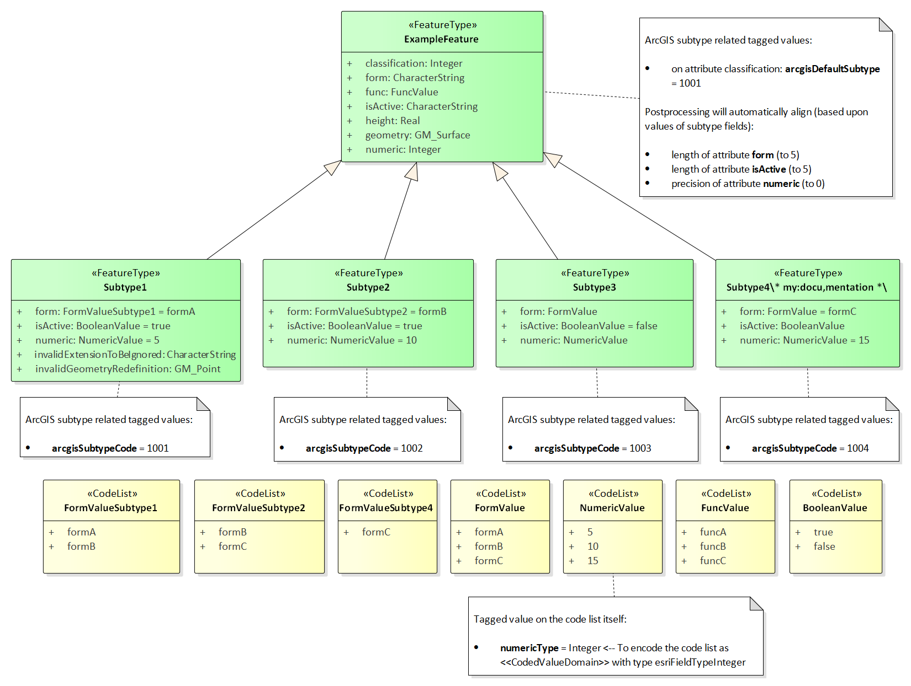

:doctype: book
:encoding: utf-8
:lang: en
:toc: macro
:toc-title: Table of contents
:toclevels: 5

:toc-position: left

:appendix-caption: Annex

:numbered:
:sectanchors:
:sectnumlevels: 5

[[Creating_the_ArcGIS_Workspace_UML_Model]]
= Creating the ArcGIS Workspace UML Model

Once the application schema has been pre-processed (as described
xref:./Pre_Processing_through_Flattening.adoc[here]),
it can be converted to an ArcGIS workspace model using the ShapeChange
ArcGISWorkspace target. The following sections describe how the various
application schema elements are converted into a model that complies
with the ArcGIS workspace metamodel (which is used by the ArcGIS
extension of Enterprise Architect).

[[Conversion_of_Model_Elements]]
== Conversion of Model Elements

[[Package]]
=== Package

Application schema packages are converted as described in the following
table.

[cols="1,3"]
|===
|Application Schema Stereotype |ArcGIS Model Element

|\<<Application Schema>>, \<<applicationSchema>>, \<<schema>> |Package
(with stereotype \<<ArcGIS>>)

|\<<bundle>>, \<<leaf>>, or no stereotype |Package with no stereotype,
except for the package that contains all feature classes – that package
has the stereotype \<<FeatureDataset>>.The package hierarchy is
maintained, even though classes are split into separate package
hierarchies according to their category (features, object classes /
tables, and domains). The package hierarchy is not reflected in the
geodatabase; it is only maintained for better readability of the ArcGIS
UML model.
|===

[[Class]]
=== Class

Application schema classes are converted as described in the following
table.

[width="100%",cols="1,3"]
|===
|Application Schema Stereotype |ArcGIS Model Element

|\<<featureType>> with no geometry property, and \<<type>> | Class (with
stereotype \<<ObjectClass>>)

| \<<featureType>> with one geometry property with value type GM_Point
| Class (with stereotype \<<Point>>)

|  \<<featureType>> with one geometry property with value type
GM_MultiPoint | Class (with stereotype \<<Multipoint)

|  \<<featureType>> with one geometry property with value type GM_Curve
or GM_MultiCurve | Class (with stereotype \<<Polyline>>)

|  \<<featureType>> with one geometry property with value type GM_Surface
or GM_MultiSurface | Class (with stereotype \<<Polygon>>)

|  \<<featureType>> with one geometry property with other value type
| Not supported / will be ignored; schema must be pre-processed.

|  \<<featureType>> with multiple geometry properties | For the first
geometry property, see above; all other geometry properties are ignored.

| \<<dataType>> or \<<union>> in the same application schema | Not
supported / will be ignored; schema must be pre-processed.

| \<<enumeration>> and \<<codeList>> a|
 Class (with stereotype \<<CodedValueDomain>>)

NOTE: The default field type is esriFieldTypeString.

If tagged value 'numericType' is set on the code list / enumeration, the
codes are assumed to be numeric. In that case, the tagged value shall
contain the name of the conceptual type that represents the code values
best, for example 'Number' or 'Integer'. The ArcGIS data type will then
be determined by mapping that type using the map entries defined in the
configuration.

The default value or the one determined through the 'numericType' tagged
value can be overridden per enumeration / code list by setting the
tagged value "fieldType" on that class to the desired field type (e.g.
esriFieldTypeSmallInteger).

|===

[[ArcGIS_Subtypes]]
==== ArcGIS Subtypes

(since v2.6.0)

ArcGIS supports a specific notion of subtypes, which is different to the
general concept of inheritance in UML. ShapeChange supports two ways of
defining ArcGIS subtypes in a conceptual model:

* ArcGIS subtypes defined by a code list or enumeration
* ArcGIS subtypes explicitly modelled in the conceptual model

Before these two approaches are explained in more detail, we give some
more background on ArcGIS subtypes:

* ArcGIS subtypes work by nominating one attribute of a supertype class
to be the subtype field. In the ArcGIS technology, this is implemented
as an integer with a string lookup.
* It is possible to restrict the other fields of a supertype using a
specific \<<CodedValueDomain>> for each subtype.
* A subtype may neither extend the set of properties nor redefine the
geometry type of its supertype.
* It is also possible to specify default values on a field for each
subtype, but not at the supertype level.
* The name of an ArcGIS subtype may include special characters, and thus
would not follow the naming conventions of ISO 19103.
* In Enterprise Architect the subtypes are expressed using distinct
classes with a \<<Subtype>> stereotype, which are related to the parent
class using a generalisation relationship (with \<<Subtype>> stereotype).
* For further details, see the enterprise architect tutorial
http://www.sparxsystems.com/bin/arcgis-enterprise-architect-uml-modeling-tutorial.pdf[Designing
ArcGIS Geodatabases with Enterprise Architect], Appendix D.

[[ArcGIS_subtypes_defined_by_a_code_list_or_enumeration]]
===== ArcGIS subtypes defined by a code list or enumeration

A class in the conceptual model is identified as being the supertype of
a set of ArcGIS subtypes through one of its attributes having:

* a code list or enumeration as type, and
* tagged value _arcgisDefaultSubtype_ with an integer value (identifying
a code of the ArcGIS subtype that shall be used as default).

The names of the codes / enums of this code list / enumeration provide
the names of the ArcGIS subtypes. The tagged value _arcgisSubtypeCode_
on each of these codes / enums defines the integer code of the ArcGIS
subtypes.

Other attributes of the supertype can be relevant for the creation of
the fields of the ArcGIS subtypes:

* An attribute with a code list or enumeration as type may lead to the
creation of subtype specific \<<CodedValueDomain>>s. Each code / enum can
have tagged value _arcgisUsedBySubtypes_. This is a comma-separated list
of all the subtypes which use that particular code / enum. If at least
one of the codes / enums defines a subtype restriction, then for each
ArcGIS subtype, a field that represents the restriction of the attribute
is created. The type of that field is a \<<CodedValueDomain>> that
contains the codes that apply to that subtype. If restrictions are only
defined on some of the subtypes, the other subtypes will have fields
with the original \<<CodedValueDomain>> as type.
** NOTE: Since the names of ArcGIS subtypes may contain special
characters, and tagged value _arcgisUsedBySubtypes_ defines a comma
separated list of subtype names, commas in subtype names (that are
contained in the tagged value) need to be escaped by prepending a
backslash ('\'). A backslash contained in a subtype name then also needs
to be escaped by prepending a backslash.
* An attribute of the supertype can also define default values for
ArcGIS subtypes. This can be modelled by adding tagged value
_arcgisSubtypeInitialValues_ to the attribute. The tagged value is a
comma-separated list of key-value pairs (where key and value are
separated by a colon). The key is the name of a subtype. The value is
the default value for the field that represents the attribute in that
subtype.
* If neither of the above are defined, then the attribute will only be
represented by a field on the supertype, not by fields of its ArcGIS
subtypes.

NOTE: Since the name of an ArcGIS subtype is used in tagged values to
uniquely identify that subtype, this approach assumes that all ArcGIS
subtypes in the model have unique names.

NOTE: Including information for the creation of ArcGIS subtypes in the
conceptual model requires adding certain tagged values. Enterprise
Architect differentiates between tagged values with a maximum length of
255 characters, and tagged values with unlimited length. The former can
be created in EA by just adding a tagged value and typing the value in
the according text field. However, in order to create a tagged value
that has more than 255 characters, you need to create the tagged value
with "<memo>" as value first. EA will recognize this keyword and then
allow you to open a dialog for the tagged value, in which you can type
the actual value (of any size). Use memo-based tagged values for tags
such as _arcgisUsedBySubtypes_ and _arcgisSubtypeInitialValues_, if
their values exceed 255 characters.

The following UML diagram shows a conceptual model structured this way,
containing all the information needed to generate an ArcGIS model (which
is shown in the subsequent figure [click to enlarge]):

image::../../images/ArcGIS_subtypes_from_subtype_set_conceptual_model.png[image]

Here is the resulting ArcGIS workspace UML model:

[NOTE]
======

* The classification code list is not represented by a
\<<CodedValueDomain>> in the ArcGIS workspace model. Instead, it is
represented by the ArcGIS subtypes.
* The ArcGIS workspace UML model does not contain \<<CodedValueDomain>>
elements for the code lists NumericValue and UnusedCodeList from the
conceptual model, since they are not used by any fields in the ArcGIS
workspace model (removal of unused coded value domains is controlled by
xref:./ArcGIS_Workspace.adoc#rule-arcgis-all-removeUnusedCodedValueDomains[rule-arcgis-all-postprocess-removeUnusedCodedValueDomains]).

======

[[ArcGIS_subtypes_explicitly_modelled_in_the_conceptual_model]]
===== ArcGIS subtypes explicitly modelled in the conceptual model

A class in the conceptual model is identified as being the supertype of
a set of explicitly modelled ArcGIS subtypes by:

* having one or more subtypes (each of which represents an ArcGIS
subtype), and
* one of its attributes having tagged value _arcgisDefaultSubtype_ with
an integer value (identifying a code of the ArcGIS subtype that shall be
used as default).
** NOTE: The type of this attribute should be 'Integer'.

Some additional details for modelling ArcGIS subtypes explicitly:

* The subtype code is modelled via tagged value _arcgisSubtypeCode_.
* Any attribute of the supertype that is restricted by an ArcGIS subtype
with a subtype specific code list or enumeration shall be modelled with
a type that represents the field type of the code list or enumeration.
** NOTE: Postprocessing by ShapeChange will ensure that tagged values
(for length, precision, scale, and isNullable) on the supertype and
subtype fields are aligned, based upon the maximum values from the
subtypes. The postprocessing behavior for the determination of length
has a special condition: if the length from the subtype fields is 0 and
the length from the corresponding supertype field is greater than 0 and
smaller than 255, then the supertype field length is applied (to the
subtype fields).
* An ArcGIS subtype shall not extend the set of properties of its
supertype. Also, it may not redefine the geometry type of its supertype.
Any property of the subtype that would cause a violation of one of these
rules will be ignored.
* NOTE: If the subtype name contains special characters and the
ShapeChange configuration contains both the ArcGIS workspace target and
the XML Schema target, an error may be reported while loading the model,
explaining that the name of the subtype contains invalid characters.
This message is caused by
xref:../../application schemas/UML_profile.adoc#Requirements_for_classes1[req-xsd-cls-ncname],
which is always checked if the XML Schema target is included in the
ShapeChange configuration. The only way to avoid the error message is to
create two ShapeChange configurations (one with the XML Schema target
and one with the ArcGIS workspace target).
* NOTE: If tagged value _arcgisDefaultSubtype_ is set on an attribute of
the supertype, then the child classes will be ignored by the ShapeChange
flattener transformation
xref:../../transformations/Flattener.adoc#rule-trf-cls-flatten-inheritance[rule-trf-cls-flatten-inheritance]
if
xref:../../transformations/Flattener.adoc#rule-trf-cls-flatten-inheritance-ignore-arcgis-subtypes[rule-trf-cls-flatten-inheritance-ignore-arcgis-subtypes]
is also included in the transformation rule set of the flattener.

The following UML diagram shows a conceptual model structured this way,
containing all the information needed to generate an ArcGIS model (which
is shown in the subsequent figure [click to enlarge]):

Here is the resulting ArcGIS workspace UML model:

image::../../images/ArcGIS_subtypes_explicitly_modelled_ArcGIS_workspace_model.png[image]

NOTE: Two properties from the conceptual model of Subtype1
(invalidExtensionToBeIgnored and invalidGeometryRedefinition) are not
contained in the ArcGIS workspace UML model. They violate the
requirement that an ArcGIS subtype may neither extend the set of
properties nor redefine the geometry type of its supertype, and are
therefore ignored when encoding the workspace UML model (the ShapeChange
log will inform the user about this situation).

[[Property]]
=== Property

[[Attribute]]
==== Attribute

\<<property>> elements within the application schema that are modelled as
attributes are converted as described in the following table.

[width="100%",cols="1,2"]
|===
|Application Schema Stereotype |ArcGIS Model Element

|\<<property>>, maximum multiplicity > 1, except if value type is
\<<type>> or \<<featureType>> |Not supported / will be ignored; schema
must be pre-processed.

|\<<property>>, value is of geometry type (name starts with "GM_")
|Geometry properties are ignored; the stereotype of a feature class
implies the geometry property and its type.

|\<<property>>, value type is \<<enumeration>> or \<<codeList>> |Attribute
(\<<Field>>), value type is the coded value domain class.

|\<<property>>, value type is other type specified outside of the
application schema a|
Attribute (\<<Field>>), type mapping as defined in the following table

NOTE: If the application schema contains a numeric range constraint for
the property ShapeChange will create an according \<<RangeDomain>> and
set the type accordingly.

|\<<enum>> a|
Attribute (\<<DomainCodedValue>>)

Per default the initial value defined by the \<<enum>> is used as initial
value. Via 
xref:./ArcGIS_Workspace.adoc#rule-arcgis-prop-initialValueByAlias[rule-arcgis-prop-initialValueByAlias]
this behavior can be changed to set the initial value using the alias of
the \<<enum>>.

|\<<property>>, value type is a non-abstract \<<type>> or \<<featureType>>
in the application schema a|
Association (\<<RelationshipClass>>) to the corresponding class and
\<<field>> as described for one to many relationship
xref:./Creating_the_ArcGIS_Workspace_UML_Model.adoc#Mapping_of_1n__n1_Relationship[here].

NOTE: Relationship classes can only be linked to non-abstract classes,
i.e. for such properties on abstract classes, the relationship class has
to be defined on the non-abstract feature or object classes in all
subtype branches of the abstract class.

|===

 

Attributes with stereotype \<<Field>> in the ArcGIS workspace model have
a specific list of tagged values. The tagged values length, precision
and scale are determined as follows:

[cols="1,3,1,1"]

|===

.2+h|FieldType 3+h|TaggedValue name

| length | precision |scale

| string | Following a length constraint defined for the attribute, or
using a default value (currently 255; can be changed via the
configuration parameter
xref:./ArcGIS_Workspace.adoc#defaultLength[defaultLength]).
| 0 | 0

| integer | 0 | 9 | 0

| double | 0 | 10 | 6

| date | 0 | 0 | 0

| coded or range domain | 0 | 0 | 0

|===

However, these characteristics can also be set on a case-by-case basis;
see the documentation of the following conversion rules for further
details:

* xref:./ArcGIS_Workspace.adoc#rule-arcgis-prop-lengthFromTaggedValue[rule-arcgis-prop-lengthFromTaggedValue]
* xref:./ArcGIS_Workspace.adoc#rule-arcgis-all-precision[rule-arcgis-all-precision]
* xref:./ArcGIS_Workspace.adoc#rule-arcgis-all-scale[rule-arcgis-all-scale]

[[Association]]
==== Association

An association in the application schema is converted to an association
with stereotype \<<RelationshipClass>> as follows:

* in case of a 1:n relationship, see description in
<<Mapping_of_1n__n1_Relationship,the 1:n relationship section on this
page>>
* in case of an n:m relationship, see description in
<<Mapping_of_nm_Relationship,the n:m relationship section on this
page>>

[[Mapping_of_ISO_19103_Types]]
==== Mapping of ISO 19103 Types

The basic data types used in the application schema are mapped to ArcGIS
basic data types as follows:

[cols="1,1",options="header"]
|===
|ISO 19103 Type |Esri Type
|CharacterString |esriFieldTypeString
|Integer |esriFieldTypeInteger
|Real |esriFieldTypeDouble
|Date, DateTime |esriFieldTypeDate
|===

NOTE: Other types from ISO 19103, such as Measure and CI_Citation, can
be mapped to the basic types listed in this table during pre-processing
(see type flattening).

[[Mapping_of_Geometry_Types]]
==== Mapping of Geometry Types

Feature classes in an ArcGIS workspace have a level of support for ISO
19107 geometry types similar to that of GML 2.1. The following table
shows how ISO 19107 geometry types are realized:

[cols="1,1",options="header"]
|===
|ISO 19107 Type |Realization in ArcGIS Workspace
|GM_Point |\<<Point>> feature class
|GM_MultiPoint |\<<Multipoint>> feature class
|GM_Curve |\<<Polyline>> feature class
|GM_MultiCurve |
|GM_Surface |\<<Polygon>> feature class
|GM_MultiSurface |
|all other (e.g. GM_Solid, GM_MultiSolid) |NA
|===

[[Mapping_of_1n__n1_Relationship]]
==== Mapping of 1:n / n:1 Relationship

A 1:n /n:1 relationship is converted as follows:

* An association with stereotype \<<RelationshipClass>> is created
between the source and target of the relationship:
** Source: class that represents the "one" end of the relationship
** Source role: name of the property with max cardinality 1
** Source role multiplicity: 1
** Target: class that represents the "many" end of the relationship
** Target role: name of the non-abstract feature or object class (first
character in lower case)
** Target role multiplicity: 0..*
** Tagged value OriginPrimaryKey: OBJECTID property of the non-abstract
feature or object class that represents the source
** Tagged value OriginForeignKey: "<source_role_name>ID" attribute in
the target class (see next list item)
* Attribute (\<<Field>>) in target class with name "<source_role_name>ID"
and type esriFieldTypeInteger (Precision: 9)

[[Mapping_of_nm_Relationship]]
==== Mapping of n:m Relationship

An n:m relationship is converted as follows:

* An association class is created with the following fields (and stored
in a dedicated package within the ArcGIS workspace, named 'Association
Classes'):
** "RID": esriFieldTypeOID
** name of source property (from application schema, if the property is
named there, otherwise the name of the source class) + "ID":
esriFieldTypeInteger (Precision: 9)
** name of target property (from application schema, if the property is
named there, otherwise the name of the target class) + "ID":
esriFieldTypeInteger (Precision: 9)
* An association with stereotype \<<RelationshipClass>> is created
between the source and target of the relationship:
** Source role: name of the target property (from the application
schema), or the name of the target class (from the application schema)
if a name is not provided for the target property
** Source role multiplicity: 0..*
** Target role: name of the source property (from the application
schema), or the name of the source class (from the application schema)
if a name is not provided for the source property
** Target role multiplicity: 0..*
** Tagged value OIDFieldName: "RID"
** Tagged value OriginPrimaryKey: OBJECTID attribute of the source class
** Tagged value OriginForeignKey: attribute with name of target property
(from application schema, if the property is named there, otherwise the
name of the target class) + "ID" in the association class
** Tagged value DestinationPrimaryKey: OBJECTID attribute of the target
class
** Tagged value DestinationForeignKey: attribute with name of source
property (from application schema, if the property is named there,
otherwise the name of the source class) + "ID" in the association class
** NOTE: The tagged values are set both on the association and the
association class.

[[Reflexive_Relationships]]
==== Reflexive Relationships

A reflexive relationship is a relationship from a class that points back
to itself. In most cases the relationship is represented by an
association. In rare cases it can also be an attribute with value type
being the class itself.

The ArcGIS workspace schema does not support reflexive relationships.
Consequently, the default behavior is to ignore such relationships (and
to log a warning whenever a reflexive relationship is encountered in the
application schema). However,
xref:./ArcGIS_Workspace.adoc#rule-arcgis-prop-reflexiveRelationshipAsField[_rule-arcgis-prop-reflexiveRelationshipAsField_]
is one way to at least partially represent a reflexive relationship.

[[RangeDomain_from_OCL]]
==== RangeDomain from OCL

ArcGIS supports range domains for numeric values (classes with
stereotype \<<RangeDomain>>) which allow to set minimum and maximum
values.

The conversion process identifies numeric range constraints defined for
properties of feature and object types in the application schema. It
does so by applying the following regular expressions:

* +++.value\s*(?=>)(.*?)\s*([\+-]?[\.|\d]+)+++
** this pattern detects the occurrence of a boundary comparison with the
value of a property; both the comparison operator (> or >=) as well as
the comparison value are detected
* +++.value\s*(?=<)(.*?)\s*([\+-]?[\.|\d]+)+++
** this pattern detects the occurrence of a boundary comparison with the
value of a property; in this case the pattern detects an upper boundary
comparison; both the comparison operator (< or <=) as well as the
comparison value are detected
* +++(?:self\.|\s)?(\w+)\.[\w\.]*?value(?:[,\s])+++
** this pattern detects the name of the property to which the numeric
range constraint applies

A numeric range constraint can define the lower boundary and/or the
upper boundary for a property value. The following examples demonstrate
valid numeric range constraints:

* +++/* Property marineHabitatDepth - lower value > 0, upper value > 0 */
inv: let v=self.marineHabitatDepth.valueOrReason.value,
vs=v.singleValue, vi=v.intervalValue, vil=vi.lowerValue,
viu=vi.upperValue in v->notEmpty() implies ((vs->notEmpty()
implies(vs.value > 0)) and (vi->notEmpty() implies ((vil->notEmpty()
implies(vil.value > 0)) and (viu->notEmpty() implies(viu.value > 0)))))+++
* +++/* Property vegetationTrafficImpact - lower value >= 0 and <= 100,
upper value >= 0 and <= 100 */ inv: let
v=self.vegetationTrafficImpact.valueOrReason.value, vs=v.singleValue,
vi=v.intervalValue, vil=vi.lowerValue, viu=vi.upperValue in
v->notEmpty() implies ((vs->notEmpty() implies(vs.value >= 0 and
vs.value <= 100)) and (vi->notEmpty() implies ((vil->notEmpty()
implies(vil.value >= 0 and vil.value <= 100)) and (viu->notEmpty()
implies(viu.value >= 0 and viu.value <= 100)))))+++

Whenever a property in the application schema has a numeric range
constraint and maps to a numeric type (esriFieldTypeInteger or
esriFieldTypeDouble), a \<<RangeDomain>> is created and set as the type
of the \<<field>> that represents the property.

Range limits in ArcGIS are inclusive. For cases in which the lower
and/or upper boundary comparison operator is not inclusive, a delta will
be added/subtracted to adjust the range limit in ArcGIS. The delta can
be configured, for example to 0.01. If the numeric range constraint only
defines one boundary of the range, a default value will be set for the
other boundary (currently +/-1000000000).

NOTE: In order for ShapeChange to process and not dismiss OCL
constraints while loading the input model, ensure that the configuration
parameter
xref:../../get started/The_element_input.adoc#checkingConstraints[checkingConstraints]
for the "input" element is not set to 'disabled' (the default value is
'enabled').

NOTE: In most cases it is easier to use tagged values to specify the
range domain. For further details, see
xref:./ArcGIS_Workspace.adoc#rule-arcgis-cls-rangeDomainFromTaggedValues[rule-arcgis-cls-rangeDomainFromTaggedValues].

[[Length_from_OCL]]
==== Length from OCL

Within the application schema, OCL constraints can be used to ensure
that the length of a textual property value does not exceed a specific
limit. If such an OCL constraint follows a specific pattern, ShapeChange
can recognize it and use the information to populate the 'length' tagged
value of the \<<field>> that will represent the property in the ArcGIS
model.

ShapeChange identifies a length constraint for a property by finding the
following regular expression in the OCL (that is defined for the class
that contains that property):
+++(?:self\.|\s)?(\w+)\.[\w\.]*?size\(\)\D*(\d+)+++

The following example demonstrates a valid length constraint: +++inv:
self.propWithSpecialLength->notEmpty() implies
(self.propWithSpecialLength.size() <= 99)+++

NOTE: In order for ShapeChange to process and not dismiss OCL
constraints while loading the input model, ensure that the configuration
parameter
xref:../../get started/The_element_input.adoc#checkingConstraints[checkingConstraints]
for the "input" element is not set to 'disabled' (the default value is
'enabled').

NOTE: In most cases, it is easier to use tagged values to specify the
length. For further details, see
xref:./ArcGIS_Workspace.adoc#rule-arcgis-prop-lengthFromTaggedValue[rule-arcgis-prop-lengthFromTaggedValue].

[[Additional_Aspects]]
== Additional Aspects

[[Names_and_Aliases]]
=== Names and Aliases

In the ArcGIS UML a model element supports the properties:

* Name: A name of the model element
* Alias: An alias, which will usually be shown in user interfaces

The default maximum length of a name is 30 characters. This limit can be
changed via the configuration parameter
xref:./ArcGIS_Workspace.adoc#maxNameLength[maxNameLength].
Another solution is to use the flattener to switch long names with short
codes (e.g. contained in the conceptual model as alias of a model
element).

ShapeChange will clip names that exceed the maximum name length.

[[Documentation]]
=== Documentation

The conversion process handles documentation of application schema
elements as follows:

* If a code list or enumeration has documentation, it will be set in the
'description' tagged value of the resulting CodedValueDomain in the
ArcGIS UML model.
* For all other application schema types and their fields: if the model
element has documentation, it will be set in the notes field of the
resulting element (feature class, object class, field)  in the ArcGIS
UML model.
* If a class from the application schema has a linked document (which
can be loaded using the input parameter
xref:../../get started/The_element_input.adoc#loadLinkedDocuments[_loadLinkedDocuments_]),
then that document will be set as linked document in the element of the
ArcGIS workspace model that represents that class.

Note, however, that most of the textual documentation of ArcGIS UML
model elements will be ignored when the model is exported to an ArcGIS
workspace XML document. Notes for feature and object classes as well as
fields won't be exported. CodedValueDomains support documentation via
the "description" tagged value. If the application schema does not
provide documentation for code lists or enumerations, then the
"description" tagged value in the ArcGIS UML model will show <no
description available> (because an empty description will lead to an
error when validating the ArcGIS UML model in EA).

NOTE: The configuration parameter
xref:./ArcGIS_Workspace.adoc#documentationTemplate[documentationTemplate]
is used to specify which descriptive information of a model element will
be part of the documentation.

[[Setting_the_Spatial_Reference_System]]
=== Setting the Spatial Reference System

ShapeChange currently does not set the spatial reference system used by
the ArcGIS workspace. The SRS is set in the template .qea and can be
changed there (before deriving the ArcGIS workspace model) or after
processing by ShapeChange is complete. The SRS can be set using the
ArcGIS extension. Simply right-click on the \<<SpatialReference>> class
(which can be found in the ArcGIS workspace model under 'Model/ArcGIS
Workspace/Spatial Reference'), then select Extensions > ArcGIS > Set
Coordinate System; in the dialog that opens, choose the SRS you want.

[[Indexes]]
=== Indexes

When the ArcGIS workspace model is exported to an ArcGIS workspace
document via Enterprise Architect, indexes for geometries and internal
object ids are automatically created.

Attribute indexes can be created via
xref:./ArcGIS_Workspace.adoc#rule-arcgis-prop-attIndex[_rule-arcgis-prop-attIndex_].

Additional indexes can be specified as needed via the ArcGIS MDG in
Enterprise Architect or via the ArcGIS environment.

[[Required_vs_Optional]]
=== Required vs. Optional

While it is possible to specify for fields in a geodatabase
feature/object class whether the field is required or not, it is usually
advisable to make it nullable, even if the model would be stricter. An
example is that during data capturing the information may not be
available, but one wants to create the feature already. By default,
non-system fields (that represent the properties of application schema
types and feature types) are therefore all generated with IsNullable =
true. The default behavior can be modified via
xref:./ArcGIS_Workspace.adoc#rule-arcgis-prop-isNullable[rule-arcgis-prop-isNullable].

[[Composition]]
=== Composition

Composition – which is either explicitly set for an association end, or
is implicit for attributes – is currently not modelled in the ArcGIS
workspace model generated by this target.

 
