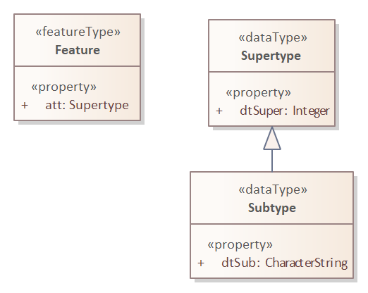

:doctype: book
:encoding: utf-8
:lang: en
:toc: macro
:toc-title: Table of contents
:toclevels: 5

:toc-position: left

:appendix-caption: Annex

:numbered:
:sectanchors:
:sectnumlevels: 5

// :data-uri:

:listing-caption: Listing

[[gfstemplate]]
= gfs Template Target

(available since ShapeChange v2.14.0)

[[gfstemplate_overview]]
== Overview

This target generates gfs template files for application schemas. The files can be used for loading GML data with the https://gdal.org/drivers/vector/gml.html[GDAL GML driver].

NOTE: gfs templates define relevant structures of GML data. The XML encoding of the GML data is defined by a GML application schema, i.e., an XML Schema. That XML Schema has been created from a conceptual model - either in its original form, or in a transformed version. ShapeChange, for example, supports multiple model transformations which may be applied before creating an XML Schema using the XmlSchema target. The gfs target should be supplied with the same UML model that was used for the production of the XML Schema, in order for the UML model elements to match the XML elements as much as possible.

Creating gfs (template) files can be useful, for the following reasons:

* Mapping of GML data is more consistent, and can be more precise, with pre-defined gfs files. If the GDAL GML driver does not find a gfs file which corresponds to a given GML file, then the driver creates his own mapping (and gfs file), purely based upon the content of that GML file. However, additional domain knowledge can lead to a different type-assignment for property definitions, including assignments for width and precision, and may also be more specific about the mapping of XML attributes (e.g. @uom).
* Certain feature data can be suppressed, for example complex metadata, by not encoding according feature properties.
* The GDAL GML driver may not be able to parse all kinds of XML Schema that accompany the GML data. The GML driver documentation (as of 2022-11-28) states several times that parsing of the XSD may fail, and therefore is not guaranteed to succeed. Exact reasons why that may not be the case have not been documented. Trivial reasons could be non-well-formed XSD, invalid XSD, unsupported XML encodings, or network issues when resolving imported or included XSD files.
* The https://gdal.org/drivers/vector/gml.html#schema[documentation of the GDAL GML driver] states the following: __"You can use [the] GML_GFS_TEMPLATE configuration option (or GFS_TEMPLATE open option) set to a path_to_template.gfs in order to unconditionally use a predefined GFS file. This option is really useful when you are planning to import many distinct GML files in subsequent steps [-append] and you absolutely want to preserve a fully consistent data layout for the whole GML set."__

Due to the nature of the GDAL GML driver, there are **limitations** regarding which application schema structures can meaningfully be converted to gfs structures. The main reason is that the GML driver only supports reading GML data that complies to a structure supported by the https://portal.ogc.org/files/?artifact_id=42729[GML simple features profile]. For reading GML data, the GML driver documentation is not specific about a certain compliance level. For writing, GML simple features profile compliance level SF-0 and - in particular cases (see the https://gdal.org/drivers/vector/gml.html#dataset-creation-options[GML driver documentation of 'dataset creation options']) - SF-1 - is supported. For reading, a subset of GML simple features profile compliance level SF-1 is supported. More specifically: compliance level SF-0 is supported, as well as cardinalities greater than 1. An additional feature of GDAL is that features can even be encoded within other features (i.e., inline). However, reading of user defined types with complex content is limited.

NOTE: The https://gdal.org/drivers/vector/gmlas.html#vector-gmlas[GDAL GMLAS driver] supports more complex schemas. Since this ShapeChange target is concerned with creating gfs template files to be used in conjunction with the GDAL GML driver, the GMLAS driver is not discussed in further detail here. The interested reader is referred to the documentation of the GMLAS driver.

The following limitations apply for schemas processed by this target:

* Association classes are not supported.
* Complex data types and unions are only supported to a limited extent.

////
Reasons for why gfs templates are not produced by the XML Schema target:

* Drilling down into the XML encoding of external types in the XML Schema target is not so easy, because typically the XML Schema target stops there (requiring map entries to be set, and not caring about anything beyond the boundary of a mapped model element).
* With a new, dedicated target, we can achieve a separation of concerns; the source code of the XML Schema target already is quite complex.
* The conversion to gfs templates is much easier to understand and implement if we start by supporting GML 3.2 encodings. Supporting additional XML schema conversion rules can be added in the future (potentially relying on XmlEncodingInfos, then).

////

[[gfstemplate_testing]]
== Testing gfs files

A gfs template file produced by this target can be tested with GML data as follows:

* Open a command line, where the command `ogrinfo` is available (for example, open the OSGeo4W Shell). 
** The documentation of `ogrinfo` is available at https://gdal.org/programs/ogrinfo.html
* In the command line, navigate to the directory in which the test instance and the gfs file are located.
** It actually works to have the gfs file in a different directory. In that case, provide an absolute or relative path to the gfs file in the command.
* Execute the following command: `ogrinfo -ro -al -oo WRITE_GFS=NO -oo GFS_TEMPLATE={gfs file} {GML file}`
** Example: `ogrinfo -ro -al -oo WRITE_GFS=NO -oo GFS_TEMPLATE=test.gfs data.gml`
** The GML file may have .gml or .xml as file extension.

NOTE: The GML data must have at least one wrapper element around the feature elements. The GDAL GML driver appears to reject files that contain only a single feature as-is, i.e., encoded as the root of the document. That wrapper can be a FeatureCollection element, but also any other XML element.

NOTE: The features contained in the GML data should have a value for XML attribute `gml:id`. Otherwise, the GML driver will not be able to assign a value for field gml_id.

[[gfstemplate_schemaconversionrules]]
== Schema Conversion Rules

The following subsections describe a number of conversion rules, which define how the contents of application schemas are converted to gfs template files.

NOTE: An encoding rule consists of a set of conversion rules – as required by a community. The <<gfstemplate_encodingrules>> section describes how encoding rules can be defined.

[[gfstemplate_schemaconversionrules_documentation]]
=== Documentation

Descriptive information of model elements is irrelevant in gfs templates. Therefore, no rule is defined to convert model element documentation.

[[gfstemplate_schemaconversionrules_schemapackage]]
=== Schema Packages

Schema packages have the stereotype \<<applicationSchema>>, \<<schema>>, or an alias (e.g. using a specific language, like \<<anwendungsschema>>). An \<<applicationSchema>> package represents an application schema according to ISO 19109. The stereotype \<<schema>> has been introduced for packages that should be treated like application schemas, but do not contain feature types. Such schemas are compliant to ISO 19103; examples are ISO 191xx schemas.

The gfs template target is a normal "ShapeChange Target". It converts all xref:../targets/Output_Targets.adoc#Selecting_the_Schemas_to_Process[schemas selected for processing] separately, rather than handling all of them in one go. The target creates one gfs template file per schema. The name of a template file is the schema name, in all lower case, and non-word characters replaced by '\_'. The target also creates a registry file with a namespace entry for the processed schemas. The namespace uri value is the value of the target namespace assigned to the schema, typically via tagged value __targetNamespace__ on the schema package. The name of the registry file is `{base name of the gfs file}_gml_registry.xml`. The content of that registry file can be added to the gml_registry file used by the application, such as GDAL (for further details, see https://gdal.org/drivers/vector/gml.html#registry-for-gml-application-schemas) and QGIS. 

The gfs template file has root element `<GMLFeatureClassList>`. The child element `<SequentialLayers>` is not encoded, meaning that the default value 'false' for this element applies. Child elements `<GMLFeatureClass>` will be added to the root element, as defined in section <<gfstemplate_schemaconversionrules_types_featureandobjecttype>>. The feature classes are sorted by their `<Name>`.

NOTE: The XML declaration is omitted in the gfs template file on purpose. Otherwise, the GML driver appears to not recognize the file correctly as gfs file. Note that the encoding of the file is UTF-8.

// https://www.w3.org/TR/xml/#sec-prolog-dtd
// https://stackoverflow.com/questions/7007427/does-a-valid-xml-file-require-an-xml-declaration

NOTE: With extra information about the encoding of GML data for a particular schema, that the features belonging to different feature types are [.underline]#always# encoded in the order of `<GMLFeatureClass>` elements defined by the gfs file, `<SequentialLayers>` could be set to 'true'. For further details about that element, see the https://gdal.org/drivers/vector/gml.html#performance-issues-with-large-multi-layer-gml-files[GDAL GML driver documentation]. Setting `<SequentialLayers>` could be achieved with an additional target parameter. However, choosing the default value is the safest approach to start with. Furthermore, for particular setups, where layers are encoded sequentially, the gfs templates can also be edited manually to add SequentialLayers = true.

[[gfstemplate_schemaconversionrules_types]]
=== Types

[[gfstemplate_schemaconversionrules_types_mappings]]
==== Mappings

The gfs template target uses map entries - defined in the target configuration - to map UML types to the types supported in the gfs format for the `<Type>` child element of `<PropertyDefn>` and `<GeomPropertyDefn>` elements.

A map entry for the gfs template target has the following structure:

* @type (required): The unqualified UML type/class name to be mapped. Should be unique within the model (if it is not unique, this can lead to unexpected results).
* @rule (required): The encoding rule to which this mapping applies. May be "*" to indicate that the mapping applies to all encoding rules.
* @targetType (required):
** Target type values that will result in the creation of a `<PropertyDefn>`: 
*** String, 
*** Integer, 
*** Real, 
*** FeatureProperty
**** NOTE: Internally, the GML driver appears to map FeatureProperty to String. However, the behavior for reading data is different, if FeatureProperty is used as type and the property value is an inline encoded feature. In that case, the GML driver adds the inline object to the appropriate layer (if one is defined in the gfs file). If String was used as property type in that case, the inline encoded feature would be ignored. In addition to enabling the recognition of inline encoded features, FeatureProperty is also useful to highlight properties whose conceptual value type is a feature type.
*** NOTE: The *List types (e.g., StringList) are automatically determined by the target, based upon the maximum multiplicity determined for a property definition.
*** NOTE: If @targetType is different to these values (i.e., String, Integer, Real, and FeatureProperty) then the gfs template target assumes that the mapping target is one of the geometry types supported by the gfs format.
** Target type values that will result in the creation of a `<GeomPropertyDefn>`: 
*** a string matching the following regular expression: `((Multi)?(Point|LineString|Polygon|Curve|Surface)|GeometryCollection|CircularString|CurvePolygon|Triangle|PolyhedralSurface|TIN)Z?M?` - Example: MultiPointZ
*** or one of the OGRwkbGeometryType enumeration values (i.e., the integer values); at the time of writing this documentation - 16th of November, 2022 - these are:
**** wkbUnknown = 0
**** wkbPoint = 1
**** wkbLineString = 2
**** wkbPolygon = 3
**** wkbMultiPoint = 4
**** wkbMultiLineString = 5
**** wkbMultiPolygon = 6
**** wkbGeometryCollection = 7
**** wkbCircularString = 8
**** wkbCompoundCurve = 9
**** wkbCurvePolygon = 10
**** wkbMultiCurve = 11
**** wkbMultiSurface = 12
**** wkbCurve = 13
**** wkbSurface = 14
**** wkbPolyhedralSurface = 15
**** wkbTIN = 16
**** wkbTriangle = 17
**** wkbNone = 100
**** wkbLinearRing = 101
**** wkbCircularStringZ = 1008
**** wkbCompoundCurveZ = 1009
**** wkbCurvePolygonZ = 1010
**** wkbMultiCurveZ = 1011
**** wkbMultiSurfaceZ = 1012
**** wkbCurveZ = 1013
**** wkbSurfaceZ = 1014
**** wkbPolyhedralSurfaceZ = 1015
**** wkbTINZ = 1016
**** wkbTriangleZ = 1017
**** wkbPointM = 2001
**** wkbLineStringM = 2002
**** wkbPolygonM = 2003
**** wkbMultiPointM = 2004
**** wkbMultiLineStringM = 2005
**** wkbMultiPolygonM = 2006
**** wkbGeometryCollectionM = 2007
**** wkbCircularStringM = 2008
**** wkbCompoundCurveM = 2009
**** wkbCurvePolygonM = 2010
**** wkbMultiCurveM = 2011
**** wkbMultiSurfaceM = 2012
**** wkbCurveM = 2013
**** wkbSurfaceM = 2014
**** wkbPolyhedralSurfaceM = 2015
**** wkbTINM = 2016
**** wkbTriangleM = 2017
**** wkbPointZM = 3001
**** wkbLineStringZM = 3002
**** wkbPolygonZM = 3003
**** wkbMultiPointZM = 3004
**** wkbMultiLineStringZM = 3005
**** wkbMultiPolygonZM = 3006
**** wkbGeometryCollectionZM = 3007
**** wkbCircularStringZM = 3008
**** wkbCompoundCurveZM = 3009
**** wkbCurvePolygonZM = 3010
**** wkbMultiCurveZM = 3011
**** wkbMultiSurfaceZM = 3012
**** wkbCurveZM = 3013
**** wkbSurfaceZM = 3014
**** wkbPolyhedralSurfaceZM = 3015
**** wkbTINZM = 3016
**** wkbTriangleZM = 3017
**** wkbPoint25D = -2147483647
**** wkbLineString25D = -2147483646
**** wkbPolygon25D = -2147483645
**** wkbMultiPoint25D = -2147483644
**** wkbMultiLineString25D = -2147483643
**** wkbMultiPolygon25D = -2147483642
**** wkbGeometryCollection25D = -2147483641 
*** NOTE: The gfs template target checks that the @targetType value either matches the regular expression given above, or is an integer value. However, the target does not check for specific integer values. That is because these integer values may change - although this should rarely occur - with new GDAL versions. That may also be seen as a warning: it may be more safe / future-proof to use one of the named geometry options as value of @targetType, rather than one of the integer values.
* @param (optional): Defines one or more parameters for the mapping. If no parameter is provided (leaving the 'param' attribute empty) then the map entry contains a straightforward mapping. Each parameter has a name. A list of parameters is separated by commas. Each parameter can also have characteristics defined for it, providing even further information for the conversion. Characteristics for a parameter are provided within curly braces. A characteristic usually is provided by a key-value pair, with the key being the identification of the characteristic.
** Parameter _typeDetails_: Defines further details for the encoding of UML properties whose value type is mapped by the map entry.
*** Characteristic: _subtype_ (optional): Specifies the subtype. The following combinations are allowed:
**** targetType: Integer - subtype: Short, Integer64
**** targetType: Real - subtype: Float
**** targetType: String - subtype: Boolean, Date, Time, Datetime
**** NOTE: If a particular property definition uses the *List type (which, as noted before, is automatically determined by the gfs template target), then particular gfs subtypes may not be allowed. Only the combinations IntegerList/Integer64 and StringList/Boolean are supported by the GML driver. If a particular subtype assignment is not allowed, due to the target applying a *List type, the target will ignore the subtype.
// 2022-12-15 JE: Omitted any log message here, because what good what that actually do? Feels like warnings of a fact that the user can do nothing about would just distract and could even become annoying. Maybe info or debug messages would be useful. Time - and actual use of the target - will tell if log messages are needed.
*** Characteristic: _gmlMeasureType_ (optional): If true, this signifies that the type is represented in GML data using the gml:MeasureType, and thus the XML representation has the (optional) @uom attribute.

NOTE: The GDAL GML driver may ignore a property value that cannot be parsed with the subtype defined for that property. For example, if subtype=Datetime, then the value '2012-01-10T17:23:00Z' is parsed, while a value '20.6' is ignored. That is important for XML elements that have a union of simple types, like in this example dateTime and decimal. That means that if a subtype is defined for a gfs property definition, then the GML data should always use a value which complies with that subtype. Variable simple content for a specific XML element is an issue, if a gfs subtype is defined for a property that addresses that XML element in its `<ElementPath>`. If in doubt, omit the subtype definition, and just use the general type in the property definition.

NOTE: Except for XML elements that represent geometries or features, the GDAL GML driver does not support complex XML structures as property values. Thus, parsing complex GML elements like gml:TimeInstant and gml:TimePeriod is not directly supported. The gfs template target would need to be extended, with information about which property definitions to produce for certain GML elements (e.g. two property definitions for the begin and end of a gml:TimePeriod). That is future work. The necessary information could be added via an element in the advanced process configuration.

[[gfstemplate_schemaconversionrules_types_abstractness]]
==== Abstractness

Abstract types themselves are not converted to `<GMLFeatureClass>` elements. However, their properties are encoded in non-abstract subtypes.

[[gfstemplate_schemaconversionrules_types_inheritance]]
==== Inheritance

When a type, which is subtype of one or more supertypes, is converted, property definitions are created as defined by the gfs encoding rules that apply to these supertypes and their properties.

[[gfstemplate_schemaconversionrules_types_featureandobjecttype]]
==== Feature and Object Type

In the conceptual model, feature and object types represent objects that have identity. That differentiates these types from, for example, data types. Other than that, feature and object types - in the following summarily called types with identity - are encoded as `<GMLFeatureClass>` elements.

NOTE: A feature type typically has stereotype \<<featuretype>>, while an object type has stereotype \<<type>>, \<<interface>>, or no stereotype.

NOTE: If a map entry is defined for the type, it is not encoded in the provider configuration.

The name of the UML type is set as value of the `<Name>` child of the `<GMLFeatureClass>` element, and also for the `<ElementPath>` child element.

If target parameter _srsName_ has a value, it is set as value of the `<SRSName>` child element.

If a `<GMLFeatureClass>` is encoded without any `<GeomPropertyDefn>`, then `<GeometryType>None</GeometryType>` is added to that `<GMLFeatureClass>`, indicating that the class represents a feature without geometry.

`<GeomPropertyDefn>` and `<PropertyDefn>` child elements are added for the UML properties of the type with identity, as described in the <<gfstemplate_schemaconversionrules_properties>> section. The property definition elements are sorted by their `<Name>`.

[[gfstemplate_schemaconversionrules_types_mixin]]
==== Mixin Type

Mixin types are treated like <<gfstemplate_schemaconversionrules_types_abstractness,abstract types>>.

NOTE: ShapeChange supports the notion of mixin type (for further details, see xref:../targets/xml schema/Support_for_Mixin_Classes.adoc[Support for Mixin Classes]). They are primarily used by the XML Schema target and were meant to support multiple inheritance in an encoding for an implementation technology that does not support multiple inheritance - such as XML Schema.

[[gfstemplate_schemaconversionrules_types_datatype]]
==== Data Type

A \<<dataType>> is not converted to a `<GMLFeatureClass>` element. Instead, the type definition for the data type is evaluated whenever a property, whose value type is the data type, is encoded.
 

[[gfstemplate_schemaconversionrules_types_union]]
==== Union

A \<<union>> is not converted to a `<GMLFeatureClass>` element. Instead, the type definition for the union is evaluated whenever a property, whose value type is the union, is encoded.

[[gfstemplate_schemaconversionrules_types_enumeration]]
==== Enumeration

Enumerations themselves are not converted. The encoding of UML attributes that have an enumeration as value type shall use:

* Type: String
* ElementPath: the name of the attribute

[[gfstemplate_schemaconversionrules_types_codelist]]
==== Code List

Code lists themselves are not converted. The encoding of UML attributes that have a code list as value type type shall use:

* Type: String
* ElementPath: If target parameter _gmlCodeListEncodingVersion_ is:
** not set, or "3.2", then the element path is the name of the attribute
** "3.3", and tagged value _asDictionary_ on the code list is:
*** equal to, ignoring case, "false", then the element path is the name of the attribute
*** not set, or equal to, ignoring case, "true", then the element path is: `{name of the attribute}@href`

NOTE: In case of _gmlCodeListEncodingVersion_ = 3.3 and tagged value _asDictionary_ = true on the code list, no "_href" suffix is added to the element name. That is done on purpose, because the xlink:href value in that case constitutes the actual code value, and does not represent an association to another feature object, as would be expected by the https://gdal.org/drivers/vector/gml.html#building-junction-tables[GDAL script for building junction tables], which looks for fields that have the "_href" suffix.

[[gfstemplate_schemaconversionrules_types_basictype]]
==== Basic Type

The gfs template target does not support the conversion of basic types.
 
NOTE: If a direct or indirect supertype of an application schema class is mapped to one of the gfs property types _string_, _integer_, or _real_, then the class would represent a so called _basic type_. Most application schemas do not make use of _basic types_.

[[gfstemplate_schemaconversionrules_properties]]
=== Properties

[[gfstemplate_schemaconversionrules_properties_general]]
==== General considerations

The following sections describe how a UML property from a type with identity is converted by the gfs template target. That includes UML properties inherited from supertypes (including from <<gfstemplate_schemaconversionrules_types_mixin,mixin types>>).

NOTE: In case that a property P1 of a type with identity restricts / overrides a property P2 from a supertype, then P1 is encoded, rather than P2. For example, if P2 had type GM_Object, and P1 had type GM_Point, then the resulting property definition would have the more specific `<Type>` = Point.

The UML property is represented by either a `<GeomPropertyDefn>` or `<PropertyDefn>` element. The former is used if the `<Type>` of the property is determined to be one of the geometric types supported by the GDAL GML driver.

The gfs template target can encode additional property definition elements for a given UML property, for two reasons:

* If the XML encoding of the element that represents the property in GML data has one or more relevant XML attributes, in addition to the textual value of the element, the target creates `<PropertyDefn>` elements for these attributes (if - and only if - their local names are within the value space of target parameter _xmlAttributesToEncode_ - see <<gfstemplate_xmlAttributesToEncode,below>> for further details). Currently, that is done for XML attribute "uom". For example: A UML property "width" may have the ISO 19103 type "Measure" or "Length" as value type, which, in GML data, is typically encoded using an element with type = gml:MeasureType. That type has XML attribute "uom". This UML property would be encoded as a `<PropertyDefn>` with `<Name>width_uom</Name>`, `<ElementPath>width@uom</ElementPath>`, and `<Type>String</Type>`.
* If the UML property has a data type or union as value type, the target attempts to create a representation that is compatible with the capabilities of the GDAL GML driver. Since structured types without identity cannot be represented in a gfs file, data types and unions can only be represented via an on-the-fly flattening of their properties, and only with a specific restriction: the semantics of a complex data type, that it is a set (without identity) of individual property values, will be lost for UML properties that have a data type as value type and a maximum multiplicity greater than 1.

NOTE: That restriction can be taken a step further: A property P1 with a union as value type can also be problematic, in case that the union has a property P2 with a data type as value type. If P1 has max multiplicity > 1, then the datatype semantics can no longer be represented by a gfs template - even if P2 has max multiplicity 1. The reason is that in case that P1 has multiple values with data types in the GML data, all values of the data type properties would, when the GML data is read, be aggregated in plain lists - one per data type property - and thus the information of which of these data type property values belong together would be lost. The situation could be made even more complex, with union properties themselves having data types or unions as values, and so on an so forth. These situations are considered to be edge cases. Typically, unions are used as type discriminators. Choices between options with data type value can be modelled using OCL constraints. In order to keep the complexity of the gfs template target on a reasonable level, recognition of these edge cases is omitted. If support for these edge cases turns out to be required in the future, the target can be enhanced accordingly.

[[gfstemplate_xmlAttributesToEncode]]
A `<PropertyDefn>` that would target an XML attribute in its element path is ONLY encoded, if the attribute name is contained in the value list of target parameter _xmlAttributesToEncode_ (which has a comma-separated list of values; default is: href, uom). That is especially important if "href" is not included in the list of values of this target parameter, because then byReference-encoded properties (whose value type is a type with identity), and code list valued properties (with GML 3.3 encoded code list) would be omitted!

Another special case is a UML property whose value type is a data type, and that type is a supertype of one or more (direct or indirect) subtypes. Actual GML data may use any non-abstract type within that data type hierarchy as value. In such a model situation, property definition elements are encoded for all non-abstract types within the data type hierarchy. The `<ElementPath>` of according `<PropertyDefn>` elements will have to be different - due to the different data type names which may occur in the GML data. Since multiple property definitions for UML properties with same name are encoded in this situation, especially for the properties defined by the supertype data type (which are inherited by, and thus occur in all of its subtypes), the `<Name>`s of these property definitions must be different in order to ensure unique property names in the `<GMLFeatureClass>`. Therefore, the owner type name is included as differentiator in the `<Name>` element. That situation is illustrated in <<img_gfs_template_data_type_supertype_as_value_type>>.

[#img_gfs_template_data_type_supertype_as_value_type,reftext='{figure-caption} {counter:figure-num}']
.Feature with data type valued property, with that type being a supertype

NOTE: If target parameter _alwaysEncodeDataTypeName_ is equal to, ignoring case, "true", then the name of the owner (class) of a property is always included in the `<Name>` element, if the owner is a complex data type. The default parameter value is "false".

NOTE: Properties from enumerations and code lists are not converted by this target.

[[gfstemplate_schemaconversionrules_properties_general_inlineorbyreference]]
IMPORTANT: There is a particular restriction of the GDAL GML driver: In actual GML data, the value of a UML property whose type is a type with identity (that is not implemented as String, Integer, or Real), must either always be encoded inline, or always be encoded by reference. The GML schema may support both types of encodings. In application schemas, this is controlled via tagged value _inlineOrByReference_. If the tagged value is omitted or has value "inlineOrByReference", both encodings are possible, from the GML encoding perspective. The gfs template target requires that a single encoding option be chosen in this case. The choice is made via target parameter _choiceForInlineOrByReference_, with values "inline" and "byReference" (the default value for this target parameter). The target can thus determine an effective value for tag _inlineOrByReference_ (to either "inline" or "byReference") - even if the tag is not defined for a property, or if it has value "inlineOrByReference".

NOTE: If the GML data makes use of xlink:href XML attributes for object references or code references (e.g. in a GML 3.3 based encoding), do NOT invoke the GML driver with the `GML_SKIP_RESOLVE_ELEMS` configuration option. That option actually creates a copy of the GML file, with all xlink:href references resolved by copying the referenced resource into the element that contains the xlink:href XML attribute. A particular use case in which that configuration option would be useful is when parts of geometry elements in the GML data are re-used by other geometry elements, and xlink:href is only used to enable that kind of re-use.

[[gfstemplate_schemaconversionrules_properties_name]]
==== Name

The `<Name>` of a property definition is the name of the UML property. There can be situations in which the name is augmented:

* If the UML property P belongs to a \<<dataType>> or \<<union>> type, then the `<Name>` is the list of names of all the UML properties, beginning with a UML property in a type with identity that is at the start of the path to P, and ending at P. The names are concatenated with the separator that is defined by target parameter _propertyNameSeparator_, which uses the underscore ("_") as default.
* If the value type of a UML property is a \<<dataType>>, and that type is a supertype, the data type is a subtype and the property name occurs multiple times in the whole inheritance hierarchy that the type is a part of, or target parameter _alwaysEncodeDataTypeName_ is equal to, ignoring case, "true", then the paths of the property definitions that are created in that case also include the name of the actual data type that is represented by a given property definition. Examples: `attInTypeWithIdentity_DataTypeOne_attInDatatype`, `attInTypeWithIdentity_DataTypeTwo_attInDatatype`. For further details, see <<gfstemplate_schemaconversionrules_properties_general>>.
* If the property definition actually represents an XML attribute, then the name of the XML attribute is appended to the otherwise constructed name, using the separator defined by target parameter _xmlAttributeNameSeparator_, which has the value of target parameter _propertyNameSeparator_ as default. Example: `width_uom`. The suffix is omitted in certain situations (as described in other sections), for example in case of a code list valued property and GML 3.3 code list encoding with use of the xlink:href XML attribute. For further details, see <<gfstemplate_schemaconversionrules_properties_general>>.
** NOTE: If both _propertyNameSeparator_ and _xmlAttributeNameSeparator_ are undefined in the configuration, the underscore will be used in both cases. If, on the other hand, only _propertyNameSeparator_ is configured, with value "/", then an XML attribute name will also be appended using "/" as separator.
** NOTE: XML namespaces are ignored when evaluating XML attribute names. Differentiating multiple attributes with same name on the same XML element therefore is not possible. However, that is another edge case which is unlikely to occur in GML data, and even more unlikely for the XML attributes supported by the current conversion (which essentially are the XML attributes xlink:href and uom).
* If the value type of a UML property is a type with identity (which is not mapped to String, Integer, or Real), __rule-gfs-prop-inlineEncodingUsesHrefSuffix__ applies to the property, and the <<gfstemplate_schemaconversionrules_properties_general_inlineorbyreference,effective value for tag _inlineOrByReference_>> is "inline", then suffix "_href" is appended to the name. The addition supports the creation of junction tables (for further details, see https://gdal.org/drivers/vector/gml.html#building-junction-tables).
** NOTE: The byReference encoding case is covered by the rules for property definitions that represent XML attributes.

[[gfstemplate_schemaconversionrules_properties_elementpath]]
==== Element Path

The `<ElementPath>` of a property definition is constructed as follows:

* In principal, for any UML property P that is on the property path for which a property definition is constructed, the name of P is appended to the element path. If P is owned by a \<<dataType>> or \<<union>>, then the name of the owning type is put in front of the name of P, using separator "|". Example: `attInTypeWithIdentity|DataType|attInDatatype`.
* If the property definition represents an XML attribute, @{XML attribute name} is appended to the path. Examples: `width@uom`, `buildingPart@href`.

[[gfstemplate_schemaconversionrules_properties_propertytype]]
==== Property Type

The `<Type>` of a property definition - `<PropertyDefn>` or `<GeomPropertyDefn>` - is determined as follows (in descending order of priority):

* If the property definition represents an XML attribute, the type is 'String'.
* If the property definition represents a UML property whose value type is <<gfstemplate_schemaconversionrules_types_mappings,mapped>>, then the type is the value of the 'targetType' defined in the according map entry.
* If the property definition represents a UML property whose value type is a type with identity, the type is 'FeatureProperty'.
* If the property definition represents a UML property whose value type is an enumeration or code list, the type is 'String'.

NOTE: A `<PropertyDefn>` only represents a UML property whose value type is \<<dataType>> or \<<union>> if the value type is mapped to a simple type. Otherwise, the gfs template target will drill down into the value type itself and create property definitions for the properties found there, as described in section <<gfstemplate_schemaconversionrules_properties_general>>.

In addition, if the maximum multiplicity of the represented UML property P is greater than 1, also in case that the property definition is for an XML attribute of an element that encodes the value(s) of P, and taking into account multiplicities along the path to P (if one of these multiplicities is greater than one, then - for the purpose of the gfs template conversion - the maximum multiplicity of the property at the end of the path effectively is greater than 1, too), then:

* In case that the value type of P is mapped to one of the geometry types supported by gfs, ShapeChange will log a warning that the multiplicity of the property is ignored (and that P should be modelled with maximum multiplicity 1 and a multi-geometry type as value type [or a value type that is mapped to a multi-geometry type]).
* Otherwise, 'List' is appended to the type name, i.e., instead of String, Integer, Real, or FeatureProperty, the target would use StringList, IntegerList, RealList, or FeaturePropertyList as `<Type>` value.

A `<Subtype>` element is added to the property definition, if the value type is <<gfstemplate_schemaconversionrules_types_mappings,mapped>>, the map entry defines a particular subtype, and the subtype is allowed for the determined `<Type>` value.

Furthermore:

* If __rule-gfs-prop-width__ applies to the property, the property has a non-blank value for tag _gfsWidth_, and the value determined for `<PropertyDefn>/<Type>` is 'Real', 'Integer', or 'String' (with `<PropertyDefn>/<Subtype>` NOT being 'Boolean', 'Date', 'Time', or 'Datetime'), then the `<PropertyDefn>/<Width>` element is set with the value of the tag.
* If __rule-gfs-prop-precision__ applies to the property, the property has a non-blank value for tag _gfsPrecision_, and the value determined for `<PropertyDefn>/<Type>` is 'Real', then the `<PropertyDefn>/<Precision>` element is set with the value of the tag.
* NOTE: The GML driver does not support `<Width>` and `<Precision>` for *List types.

NOTE: There is no rule to control the value of `<PropertyDefn>/<Unique>`, since the documentation of the `<Unique>` element in the XML Schema of the gfs format states: __"When set to true, indicates that values of that field are unique through all the features of the layer"__. Pay attention to "through *all* the features". So that setting is not scoped to the values of a given property for a single feature, but to all values of the property for all features of the layer. So the semantics are quite different between property uniqueness in UML and in a gfs `<PropertyDefn>`.

// 2022-11-18 JE: relevant GDAL source code is at https://github.com/OSGeo/gdal/blob/master/ogr/ogrsf_frmts/gml/gmlfeatureclass.cpp

[[gfstemplate_schemaconversionrules_properties_nullable]]
==== Nullable

By default, the gfs schema declares all property definitions as nullable. Null / missing values are allowed for any property. No specific conversion behavior is defined for setting `<Nullable>` to "false". If such behavior is required for specific use cases, it can be added in the future.

[[gfstemplate_schemaconversionrules_properties_readonly]]
==== readOnly

Whether a property is defined as read-only or not does not have any impact on the gfs template.

[[gfstemplate_schemaconversionrules_properties_initialvalue]]
==== Initial Value

Initial values do not play a role in gfs templates.

[[gfstemplate_schemaconversionrules_associationclass]]
=== Association Class

There is no native representation for association classes in gfs templates. The GML 3.3 encoding of association classes involves a model transformation, which is implemented by the xref:../transformations/Association_Class_Mapper.adoc[ShapeChange Association Class Mapper]. If one of the schemas selected for processing makes use of association classes, this transformation should be performed on the model before the gfs template target is executed.

[[gfstemplate_schemaconversionrules_constraint]]
=== Constraints

The gfs template target does not support conversion of OCL constraints.

NOTE: OCL constraints can be used to enrich a conceptual model with requirements that cannot be expressed in UML alone.

[[gfstemplate_schemaconversionrules_additionalrules]]
=== Additional rules

If __rule-gfs-all-notEncoded__ applies to an element of the application schema, then that element and all its components are not encoded. This can be useful to suppress the encoding of classes that are primarily meant as feature collections, i.e., containers for objects defined in the application schema as types with identity.

NOTE: How to define the encoding rule that applies to an application schema element is documented in more detail <<gfstemplate_encodingrules,here>>. The https://shapechange.net/resources/config/StandardRules.xml[ShapeChange configuration file StandardRules.xml] defines an encoding rule named "notEncoded", which includes __rule-gfs-all-notEncoded__. When StandardRules.xml is included in the configuration of the gfs template target (typically using an xinclude XML element), then by setting tagged value _gfsEncodingRule_ to "notEncoded", one would achieve that that model element is not encoded in the gfs template files.

NOTE: If a property is encountered whose value type is not encoded (__rule-gfs-all-notEncoded__ applies to the value type), the target will log a warning and ignore the property. 

[[gfstemplate_encodingrules]]
== Encoding Rules

For some application schemas, it is useful to know that different encoding rules can be applied to the sub-packages, classes, and properties defined by the schema. Typically, a single encoding rule applies to all application schema elements. In ShapeChange, that rule is identified by setting the target parameter _defaultEncodingRule_, with the unique name defined for the encoding rule in the target configuration. The target configuration, however, can contain multiple encoding rules (with different names). By setting tagged value _gfsEncodingRule_ on an application schema element, using the name of another encoding rule, the model element will be encoded as defined by that rule.