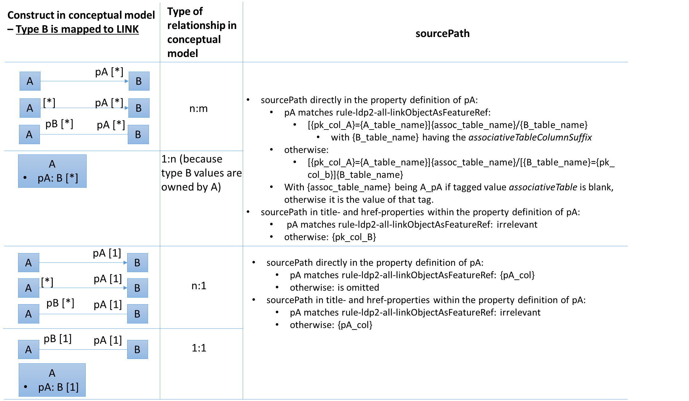
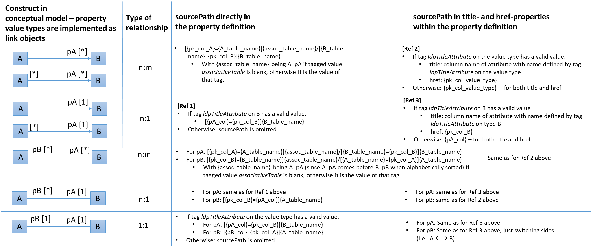

:doctype: book
:encoding: utf-8
:lang: en
:toc: macro
:toc-title: Table of contents
:toclevels: 5

:toc-position: left

:appendix-caption: Annex

:numbered:
:sectanchors:
:sectnumlevels: 5

:listing-caption: Listing

[[ldproxy2]]
= ldproxy Target

(from v2.12.0)

NOTE: This target supports ldproxy versions 3.1.0 and upwards.

[[ldproxy2_overview]]
== Overview

[[ldproxy2_schemaconversionrules]]
== Schema Conversion Rules

The following subsections describe a number of conversion rules, which define how the contents of application schemas are converted to ldproxy configuration files.

NOTE: An encoding rule consists of a set of conversion rules – as required by a community. The <<ldproxy2_encodingrules>> section describes how encoding rules can be defined.

[[ldproxy2_schemaconversionrules_templates]]
=== Configuration file templates

The ldproxy target creates the following folder structure in the output directory:

* data
** store
*** entities
**** codelists (only if a codelist or enumeration is actually encoded)
**** providers
**** services

The target output will be written to these folders. Some configuration data is simply copied using template files. <<table_template_files>> lists the templates that the target uses, with information about:

* The name of the ShapeChange target parameter with which the path to the template file can be provided.
* The default template location, i.e. the path that will be used by the target if no path is given via the target parameter.
* The path within the output folder to which the template file will be copied, if applicable.
* A description of the template file.

[#table_template_files,reftext='{table-caption} {counter:table-num}']
.Configuration file templates
[cols="1,2,1,3a",options="header"]
|====================
| target parameter name | default template location | output folder | description
| cfgTemplatePath | https://shapechange.net/resources/templates/ldproxy2/cfgTemplate.yml | data/cfg.yml | The cfg.yml contains the global configuration for all APIs in the intended API deployment.
| serviceMetadataTemplatePath | #Later on: add URL to online file# | _none_ - will be integrated into the service configuration | The object defined by this template file will be added as value of the `metadata` member within the service configuration.
| serviceApiTemplatePath | #Later on: add URL to online file# | _none_ - will be integrated into the service configuration | The object defined by this template file will be added as value of the `api` member within the service configuration.
||||
|====================

[[ldproxy2_schemaconversionrules_documentation]]
=== Documentation

// The updated ldproxy target uses platform identifier 'ldp2'. It is considered to be the next iteration of the ldproxy target - fullstop. For now, we will keep the old ldproxy target.

With __rule-ldp2-all-documentation__, descriptive information of application schema elements (for ldproxy that primarily means classes and their properties) can be encoded within the ldproxy configuration, more specifically: in _label_ and _description_ members of type definitions.

[NOTE]
======
Descriptive information of a model element in ShapeChange, i.e. properties (attributes and association roles), classes, and packages, includes the pieces of information, called _descriptors_, that are documented xref:../get started/The_element_input.adoc#Descriptor_sources[here].

A model element can have all, a subset, or none of these descriptors.
======

Typically, a community has a preferred way to model and encode this information. For example, one community may want to encode just the description of a property via the "description" member in the provider configuration, while another may prefer to encode the values of multiple descriptors of the property within the "description" member. Therefore,  templates are used to define the (combination of) descriptor(s) that shall be used as value for _label_ and _description_ members:

* target parameter _labelTemplate_:
** default value: \[[alias]]
** explanation: The template for the _label_ member generated for a type definition. The patterns “\[[descriptor]]” will be replaced by the value of the descriptor, or the value of parameter _descriptorNoValue_, if the descriptor has no value for the model element.
* target parameter _descriptionTemplate_:
** default value: \[[definition]]
** explanation: The template for the _description_ member generated for a type definition. The patterns “\[[descriptor]]” will be replaced by the value of the descriptor, or the value of parameter _descriptorNoValue_, if the descriptor has no value for the model element.
* target parameter _descriptorNoValue_:
** default value: "" (i.e., the empty string)
** explanation: If a descriptor is used in a label or description template, but has no value, then the value of this parameter will be used instead.

NOTE: If the resulting value for label or description is blank, i.e. the empty string or only whitespace, then the value will not be encoded.

[[ldproxy2_schemaconversionrules_schemapackage]]
=== Schema Packages

Schema packages have the stereotype \<<applicationSchema>>, \<<schema>>, or an alias (e.g. using a specific language, like \<<anwendungsschema>>). An \<<applicationSchema>> package represents an application schema according to ISO 19109. The stereotype \<<schema>> has been introduced for packages that should be treated like application schemas, but do not contain feature types. Such schemas are compliant to ISO 19103; examples are ISO 191xx schemas.

This ldproxy target is a so-called "ShapeChange Single Target", i.e. it converts all xref:../targets/Output_Targets.adoc#Selecting_the_Schemas_to_Process[schemas selected for processing] in one go, rather than handling each of these schemas separately.

The target creates a single provider configuration (in folder data/store/entities/providers) as well as a single service configuration file (in folder data/store/entities/services). The names of these files are given by the name of the xref:../get started/The_element_input.adoc#mainAppSchema[main schema], in all lower case, and non-word characters replaced by '_'. The resulting name is also used as the id within these files. The encoding details for each of the two configuration files are documented in sections <<ldproxy2_schemaconversionrules_schemapackage_providerconfig>> and <<ldproxy2_schemaconversionrules_schemapackage_serviceconfig>>.

NOTE: If a single API (provider and service configuration) shall be created for each schema, set the xref:../targets/Output_Targets.adoc#Selecting_the_Schemas_to_Process[schema selection parameter] appropriately. If multiple schemas need to be processed, and each shall result in a different API, then either run ShapeChange multiple times (updating the schema selection parameters each time) or define multiple ldproxy targets (each selecting a different schema for processing).

[[ldproxy2_schemaconversionrules_schemapackage_providerconfig]]
==== Provider Configuration

The following information items are added to the provider configuration file:

// source: https://github.com/interactive-instruments/ldproxy/tree/master/docs/de/configuration/providers and https://github.com/interactive-instruments/ldproxy/blob/master/docs/de/configuration/providers/sql.md

* id: the provider name (derived from the main schema, as defined in section <<ldproxy2_schemaconversionrules_schemapackage>>)
* createdAt and lastModified: receive the integer value for an automatically generated unix time stamp (fixed for UnitTests)
* entityStorageVersion: 2
* providerType: FEATURE
* featureProviderType: SQL
* connectionInfo:
** dialect: PGIS 
*** NOTE: A future enhancement of this target may support GeoPackage (dialect: GPKG).
** database: FIXME
** host: FIXME
** user: FIXME
** password: FIXME-base64-encoded
** schemas: "public" - and, if _rule-ldp2-all-schemas_ is active, all values from tags _sqlSchema_ on the package elements of all processed schemas
*** NOTE: This corresponds to the database schema definition mechanism supported by the SqlDdl target in _rule-sql-all-schemas_.
* sourcePathDefaults:
** primaryKey: value of target parameter _primaryKeyColumn_; default: id
*** NOTE: Corresponds to SqlDdl target parameter _idColumnName_
** sortKey: same as primaryKey
* queryGeneration:
** computeNumberMatched: true
* nativeCrs: 
** code: value of target parameter _srid_; default is 4326
*** NOTE: The SqlDdl target has a similar parameter.
** forceAxisOrder: value of target parameter _forceAxisOrder_; default is NONE
* nativeTimeZone: value of target parameter _nativeTimeZone_; default: the default system time zone
** NOTE: The time-zone ID is given as a string like 'Europe/Paris'. Internally, parsing is achieved using the Java ZoneId class and its static `of(String zoneId)` method. The system default time-zone ID is determined via the static `systemDefault()` method. For further information about the allowed formats of the time-zone ID, consult the documentation of the Java ZoneId class and the two methods.
* types: will be populated as described in section <<ldproxy2_schemaconversionrules_types>>

NOTE: Members of the provider configuration, whose value is equal to the default value for that member defined by ldproxy, may not actually be written to the provider configuration file created by the target.

[[ldproxy2_schemaconversionrules_schemapackage_serviceconfig]]
==== Service Configuration

The following information items are added to the service configuration file:

// source: https://github.com/interactive-instruments/ldproxy/tree/master/docs/de/configuration/services

* id: the service name (derived from the main schema, as defined in section <<ldproxy2_schemaconversionrules_schemapackage>>)
* createdAt and lastModified: receive the integer value for an automatically generated unix time stamp (fixed for UnitTests)
* entityStorageVersion: 2
* label: value of target parameter _serviceLabel_; default is 'FIXME'
* description: value of target parameter _serviceDescription_; default is 'FIXME'
* serviceType: OGC_API
* metadata: is provided - in form of a template - via target parameter _serviceMetadataTemplatePath_; metadata information for the actual API is typically not included in the model, therefore the target uses information provided via a separate template file
* api: is provided - in form of a template - via target parameter _serviceApiTemplatePath_; information about the modules implemented by the actual API is typically not included in the model, therefore the target uses information provided via a separate template file
* collections: will be populated as described in section <<ldproxy2_schemaconversionrules_types>>.

NOTE: Members of the service configuration, whose value is equal to the default value for that member defined by ldproxy, may not actually be written to the service configuration file created by the target.

[[ldproxy2_schemaconversionrules_types]]
=== Types

[[ldproxy2_schemaconversionrules_types_mappings]]
==== Mappings

Application schemas typically use types from other schemas, for example the types defined by ISO 19103 and ISO 19107. External types can be used as value types of properties, and as supertypes for types defined in the application schema that is being converted.

Whenever an external type is used, its implementation details are needed. An external type must be implemented as one of the types supported by ldproxy, or as a link. The target type of a map entry must therefore be one of:

* FLOAT, INTEGER, STRING, BOOLEAN, DATETIME and DATE
** Relevant map entry parameter(s): _initialValueEncoding_ (optional, currently only used for mapping of the conceptual type 'Boolean')
* GEOMETRY
** Relevant map entry parameter(s): _geometryInfos_ (required)
* LINK
** NOTE: Types that are mapped to links - more specifically, link objects - are considered to be available as an external resource. Linking to such objects can be useful for integration and re-use of external APIs.
** Relevant map entry parameter(s): _linkInfos_ (required)

// OBJECT mapping may become relevant in the future; such a mapping would define the database implementation, i.e. values of the mapped type would be available in a separate table within the database. However, right now that use case has not been encountered yet.

NOTE: The semantic validation (a pre-processing step executed by ShapeChange upon loading the configuration) of the ldproxy target configuration will ensure that map entries contain required map entry parameters.

Note that while a type mapping typically applies to external types, it can also be applied to a type from the application schema. For example, some identifier datatype (e.g. called 'GUID') could be defined within the application schema, but be implemented within the database and thus also in the resulting ldproxy configuration as a STRING.

A map entry for the ldproxy target has the following structure:

* @type (required): The unqualified UML type/class name to be mapped. Should be unique within the model (if it is not unique, this can lead to unexpected results).
* @rule (required): The encoding rule to which this mapping applies. May be "*" to indicate that the mapping applies to all encoding rules.
* @targetType (required): One of FLOAT, INTEGER, STRING, BOOLEAN, DATETIME, DATE, GEOMETRY, or LINK.
* @param (optional): Defines one or more parameters for the mapping. If no parameter is provided (leaving the 'param' attribute empty) then the map entry contains a straightforward mapping, usually to a simple type. Each parameter has a name. A list of parameters is separated by commas. Each parameter can also have characteristics defined for it, providing even further information for the conversion. Characteristics for a parameter are provided within curly braces. A characteristic usually is provided by a key-value pair, with the key being the identification of the characteristic.
** Parameter _initialValueEncoding_: Defines how initial values of properties whose value type is mapped by the map entry should be encoded. Currently only relevant for mapping of type Boolean to some ldproxy type.
*** Characteristic: _true_ (optional): Specifies the value to represent the Boolean value `true` in the mapping that the parameter applies to. Only relevant for mapping of type `Boolean`. Default is `true`.
*** Characteristic: _false_ (optional): Specifies the value to represent the Boolean value `false` in the mapping that the parameter applies to. Only relevant for mapping of type `Boolean`. Default is `false`.
*** NOTE: Mappings of initial values for type Boolean are especially important if boolean values are represented in the database using a non-boolean datatype. For example, the value `true` could be represented by integer 1, while `false` would be represented by 0.
// IRRELEVANT *** Characteristic: _quoted_ (optional): If set to `true` (ignoring case), this characteristic specifies that the default value shall be quoted. Default is `false`. Typically, this characteristic is set to `true` in map entries for types that map to a textual type, but it can also apply to temporal types. It usually does not apply to numeric types. NOTE: Also applies to the representation of a Boolean value.
** Parameter _geometryInfos_: Indicates that the map entry contains a mapping for a geometry type (specifically from ISO 19107), and provides further information via characteristics.
*** Characteristic _geometryType_ (required): Specify the actual geometry type, using one of the geometry types supported by ldproxy: POINT, MULTI_POINT, LINE_STRING, MULTI_LINE_STRING, POLYGON, MULTI_POLYGON, GEOMETRY_COLLECTION, ANY
// JE - not used right now, maybe later: ** Parameter _temporalInfos_: Indicates that the map entry contains a mapping for a temporal type, and provides further information via characteristics.
** Parameter _linkInfos_: provides information for constructing a link- object.
*** Characteristic: _urlTemplate_ (required): Defines a template for constructing the URL to an actual property value, given an identifier value, which is represented in the template using placeholder `(value)`. The placeholder `(serviceUrl)` can be used as well. It will be replaced by an ldproxy deployment with its base URL. 
**** NOTE: Due to an implementation restriction in the parsing process of map entry parameters and their characteristics, braces are not directly allowed within the value of the _urlTemplate_ characteristic. The target will automatically replace the parentheses ('(' and ')') around the placeholders with braces ('{' and '}') when writing them in the ldproxy configuration.

// The implementation restriction is that we have not defined a grammar for the map entry parameter syntax. Instead we are using regular expressions to parse the parameter value, which have a hard time with, for example, double braces.

////

NOTE: OBJECT mapping not implemented yet; the following could be relevant for such a mapping:

** Parameter _collectionInfos_: 
*** Characteristic: _table_: Name of the table that stores objects of the mapped type. Useful for constructing join statements. 
// *** Characteristic: _primaryKey_: Name of the primary key column in the table that stores objects of the mapped type. Useful for constructing join statements.

////

[NOTE]
======
A future enhancement of this target may include additional configuration elements that provide further details about the database representation of a certain type or property from the application schema, such as table and column names, or even whole source paths for ldproxy. This could go as far as providing such information for a specific combination of class and property (e.g. to support complex datatype conversion rules from the SqlDdl target).

The SqlDdl target could then be enhanced to generate map entries and these additional configuration elements - for subsequent use within the ldproxy target. That would improve overall ShapeChange usability (since manual configuration work would be reduced significantly), as well as the consistency between the SqlDdl and ldproxy targets.

======

[[ldproxy2_schemaconversionrules_types_abstractness]]
==== Abstractness

Abstract types are not converted to individual provider type definitions. 

NOTE: Use the Flattener transformation to flatten inheritance. In some cases, where the abstract type only occurs as value type of a property, mapping the abstract type can also be a solution.

////

Properties from abstract supertypes could be treated via inheritance in non-abstract subtypes - taking overriding properties into account.

////

[[ldproxy2_schemaconversionrules_types_inheritance_and_specialization]]
==== Inheritance and Specialization

Conversion of inheritance relationships is not supported by the target. 

NOTE: Transform such relationships before executing the ldproxy target (e.g. use the Flattener transformation to flatten inheritance).

[[ldproxy2_schemaconversionrules_types_database_table_names]]
==== Database Table Name

Whenever a type from the application schema is encoded within an ldproxy provider configuration, the name of the database table that represents that type is required (especially for constructing source paths).

The name of the database table is determined as follows:

* Basically, the type name is used as table name.
* A suffix can be added to the table name, depending upon the conversion context:
** If the name is used as column name within an associative table (typically for n-to-m relationships), then the value of target parameter _associativeTableColumnSuffix_ (with default value being the value of target parameter _primaryKeyColumn_) is used as suffix. 
*** NOTE: This supports behavior of the SqlDdl target regarding the construction of associative tables.
* In addition, the table name established so far is converted to lower case (using the english locale).
* Finally, the table name is restricted to a substring (starting at the beginning of the name) whose length does not exceed the value of target parameter _maxNameLength_ (whose default value is 63 [characters]).

[NOTE]
======
In the future:

* Conversion rules can be defined to modify the default naming behavior.
* Additional configuration entries can be defined with which the table name for a UML type can explicitly be provided (e.g. as resulting from execution of the SqlDdl target, and the database schema created by it).

======

[[ldproxy2_schemaconversionrules_types_featureandobjecttype]]
==== Feature and Object Type

In the conceptual model, feature and object types represent objects that have identity. That differentiates these types from, for example, data types. Other than that, feature and object types - in the following summarily called types with identity - are encoded as top-level <<ldproxy2_schemaconversionrules_types_featureandobjecttype_providertype,type definitions within the provider configuration>> as well as <<ldproxy2_schemaconversionrules_types_featureandobjecttype_servicecollection,collection definitions in the service configuration>>.

NOTE: A feature type typically has stereotype \<<featuretype>>, while an object type has stereotype \<<type>>, \<<interface>>, or no stereotype.

NOTE: If a map entry is defined for the type, it is not encoded in the provider configuration.

NOTE: A future enhancement of the ldproxy target could introduce mechanisms for suppressing the global type definition within a provider configuration for a type with identity, instead inlining this definition whenever the type is used as property value type. Examples would be BuildingPart (which could be inlined into Building), as well as subtypes of INSPIRE AddressComponent (which could be inlined into Address).

[[ldproxy2_schemaconversionrules_types_featureandobjecttype_providertype]]
===== Provider Type Definition

The name of the type definition is the class name, in lower case.

NOTE: ISO 19109 requires class names to be unique within the scope of a single application schema. Although not recommended, different schemas may define types with same name. The ldproxy target will log an error if it encounters multiple classes (from the schemas selected for processing) that have equal name (ignoring case) and which shall be encoded by the target.

The following information items are encoded for the type definition within the provider configuration:

* type: OBJECT
* objectType: original name of the type 
* sourcePath: "/" + {<<ldproxy2_schemaconversionrules_types_database_table_names,table_name>>}
* label: value as derived using the _labelTemplate_ (see the <<ldproxy2_schemaconversionrules_documentation,documentation>> section for further details)
* description: value as derived using the _descriptionTemplate_ (see the <<ldproxy2_schemaconversionrules_documentation,documentation>> section for further details)
* properties: as documented in section <<ldproxy2_schemaconversionrules_properties>>

// The old ldproxy Target has rule-ldp-cls-oneo-metadata. This would be handled using a model transformation (such as the xref:../transformations/Attribute_Creator.adoc[Attribute Creator]).

[[ldproxy2_schemaconversionrules_types_featureandobjecttype_servicecollection]]
===== Service Collection Definition

The name of the collection definition is the class name, in lower case. It is therefore equal to the name of the provider type definition.

// https://github.com/interactive-instruments/ldproxy/tree/master/docs/de/configuration/services

// https://github.com/interactive-instruments/ldproxy/blob/master/docs/de/configuration/services/building-blocks/README.md

The following information items are encoded for the collection definition within the service configuration:

* id: the collection name
* label: same as id
* api: 
** -buildingBlock: FEATURES_HTML
*** featureTitleTemplate: value of tag _ldpFeatureTitleTemplate_ on the class; no default is defined. The value must define a template with one or more property names from the ldproxy configuration (e.g. `{{title}}`).
*** transformations: an object with members depending upon the conversion of the type properties and their value types (see sections <<ldproxy2_schemaconversionrules_types_enumeration_and_codelist>> and  <<ldproxy2_schemaconversionrules_properties_serviceconfig_featureshtml_transformations>>)

// https://github.com/interactive-instruments/ldproxy/blob/master/docs/de/configuration/services/building-blocks/features-html.md

// https://github.com/interactive-instruments/ldproxy/blob/master/docs/de/configuration/providers/transformations.md

NOTE: Currently, specific api conversion behavior is only defined for the Features HTML API-Module. In the future, the definition of queryables and sortables can be added (using the Features Core and Sorting API-Modules).

[[ldproxy2_schemaconversionrules_types_featureandobjecttype_identifier]]
===== Identifier member

The conceptual model of a type with identity often does not contain a property whose value is used by applications to identify objects of that type. Instead, the according information is added or defined in platform specific encodings. For example, a GML application schema offers the gml:id attribute as well as the gml:identifier element to encode identifying information.

In ldproxy, each provider type definition must have a property that functions as object identifier.

* If _rule-ldp2-cls-identifierStereotype_ applies to the type, and the type has an \<<identifier>> property, then that property will be encoded as such an object identifier.
** NOTE: If the maximum multiplicity of an \<<identifier>> attribute is greater than 1, an error will be logged. Processing will continue, assuming a maximum multiplicity of 1 for the attribute.
* Otherwise, an identifier member is explicitly encoded. The member name is given by target parameter _objectIdentifierName_ (default: "oid"). The value of the sourcePath is the value of target parameter _primaryKeyColumn_ with `type` INTEGER.

The object identifier property will receive member `role` with value ID.

NOTE: If a type has multiple identifier properties, none of them is used as object identifier (because no informed choice can be made). An error will be logged. The target will create an identifier member.

[[ldproxy2_schemaconversionrules_types_primarygeometry]]
===== Primary Geometry

If a type with identity has multiple geometry properties, one of them must be designated as primary geometry in order for ldproxy to a) use this geometry for bbox-queries, and to b) encode this property within the GeoJSON _geometry_ or the JSON-FG _where_ member. 

NOTE: Relevant geometry properties must directly be defined by the type with identity. In other words, the target does not look at geometry properties in inlined (data) types when searching for the primary geometry.

NOTE: If the type only has a single geometry property, ldproxy automatically deduces that it is the primary geometry.

The property that contains the primary geometry is identified by setting tagged value _defaultGeometry_ on the property to the value `true`. If multiple such properties exist, none of them is selected as primary geometry (because no informed choice can be made) and an error will be logged.

The primary geometry property is encoded with `role: PRIMARY_GEOMETRY`.

NOTE: If the primary geometry property has a maximum multiplicity greater than 1, then ShapeChange will log a warning and assume a maximum multiplicity of exactly 1.

NOTE: Additional geometry properties are encoded like all other UML properties.

NOTE: The ldproxy target expects all geometry properties to have a maximum multiplicity of exactly 1. That is because ldproxy supports multi-geometry types (e.g. MULTI_POINT and GEOMETRY_COLLECTION), which are typically used in implementations that rely upon the https://www.ogc.org/standards/sfa[Simple Feature Access standard] (such as spatial databases which typically implement the https://www.ogc.org/standards/sfs[Simple Feature Access - Part 2: SQL Option]), but does not define a transformation of a geometry property with max multiplicity greater than 1 to such a multi-geometry type. An according model transformation could be defined and implemented in ShapeChange as a future enhancement. In any case: If the ldproxy target encounters a geometry property with maximum multiplicity greater than 1, it logs an error and continues processing, assuming a maximum multiplicity of exactly 1.

[[ldproxy2_schemaconversionrules_types_primarytemporalproperties]]
===== Primary Temporal Properties

If a type with identity has multiple temporal properties, i.e. properties whose type is mapped to DATE or DATETIME, then the ldproxy target looks for tagged values _defaultInstant_, _defaultIntervalStart_, and _defaultIntervalEnd_ with value `true` on these properties, in order to determine whether one of them defines the temporal extent of the type.

* Use of _defaultInstant_ and _defaultIntervalStart_ / _defaultIntervalEnd_ are mutually exclusive. If _defaultInstant_ is `true` on one of these properties then the other tags must not be `true`, and vice-versa. An error will be logged if that is not the case.
* If _defaultInstant_ is `true` on one property, then the according property will be encoded with `role: PRIMARY_INSTANT`. If more than one such property was found, an error will be logged.
* If _defaultIntervalStart_ is `true` on one property, then the according property will be encoded with `role: PRIMARY_INTERVAL_START`. If more than one such property was found, an error will be logged.
* If _defaultIntervalEnd_ is `true` on one property, then the according property will be encoded with `role: PRIMARY_INTERVAL_END`. If more than one such property was found, an error will be logged.

NOTE: The search for temporal properties that define primary instant / interval is performed on top-level properties only. I.e., properties of inlined (data) types are not considered by this search.

NOTE: The ldproxy target expects all default temporal properties to have a maximum multiplicity of exactly 1. If a default temporal property with maximum multiplicity greater than 1 is encountered, the target logs an error and continues processing, assuming a maximum multiplicity of exactly 1.

NOTE: A property with value type TM_Period cannot directly be used for the definition of the temporal extent of a feature, at least not with this ShapeChange target, since ldproxy expects the information of a temporal interval to be given via two separate time instants (the interval start and end). In the future, a ShapeChange transformation could be added, to convert a property with value type TM_Period (and some indicator that the property defines the temporal extent of a type with identity) to two properties, with value type TM_Instant, and with the tags _defaultIntervalStart_ / _defaultIntervalEnd_.

NOTE: Additional temporal properties are encoded like all other UML properties.

[[ldproxy2_schemaconversionrules_types_datatype]]
==== Data Type

A \<<dataType>> is not converted to a top-level provider type definition. Instead, the type definition for the data type is encoded whenever a property, whose value type is the data type, is encoded.

The following information items are encoded for the type definition of the \<<dataType>>:

* type: OBJECT or OBJECT_ARRAY (depending on the multiplicity; for further details, see <<ldproxy2_schemaconversionrules_properties_propertytype>>)
* objectType: original name of the data type 
* sourcePath: as defined for datatype valued properties in section <<ldproxy2_schemaconversionrules_properties_sourcepaths>>
// {<<ldproxy2_schemaconversionrules_types_database_table_names,db_table_name>>}
// irrelevant, see note at section end * label: value as derived using the _labelTemplate_ (see the <<ldproxy2_schemaconversionrules_documentation,documentation>> section for further details)
// irrelevant, see note at section end * description: value as derived using the _descriptionTemplate_ (see the <<ldproxy2_schemaconversionrules_documentation,documentation>> section for further details)
* properties: as documented in section <<ldproxy2_schemaconversionrules_properties>>

NOTE: Computation of label and description from the data type descriptors is not relevant. The reason is that a data type will always be inlined in a provider type definition, and then only label and description for the property - which has the data type as value type - are encoded.

NOTE: Although not recommended, data types can have circular dependencies on each other. The ldproxy target does not support such dependencies (because it would lead to an infinite loop of inlined data type definitions). If a circular dependency is detected by the target, it will report an error - and not encode the property that would cause this circular dependency.

[[ldproxy2_schemaconversionrules_types_mixin]]
==== Mixin Type

Since inheritance is not supported by the ldproxy target, mixins are not supported either. Apply a model transformation to flatten inheritance if your model contains mixin types.

NOTE: ShapeChange supports the notion of mixin type (for further details, see xref:../targets/xml schema/Support_for_Mixin_Classes.adoc[Support for Mixin Classes]). They are primarily used by the XML Schema target and were meant to support multiple inheritance in an encoding for an implementation technology that does not support multiple inheritance - such as XML Schema.

[[ldproxy2_schemaconversionrules_types_union]]
==== Union

Conversion of unions is not supported by the ldproxy target. 

NOTE: You can transform unions, either flattening them (using the xref:../transformations/Flattener.adoc#rule-trf-prop-flatten-types[Flattener rule-trf-prop-flatten-types]), or by mapping them (using the xref:../transformations/Type_Converter.adoc#rule-trf-switchValueTypes[Type Converter rule-trf-switchValueTypes], or a map entry defined in the ldproxy target).

[[ldproxy2_schemaconversionrules_types_enumeration_and_codelist]]
==== Enumeration and Code List

// https://github.com/interactive-instruments/ldproxy/tree/master/docs/de/configuration/codelists

Enumerations and code lists are not converted to top-level provider type definitions. Each \<<enumeration>> / \<<codelist>> is converted to a {id}.yml file in the data/store/entities/codelists folder. The ldproxy target thus also converts enumerations to ldproxy code lists. The ID thereby is the enumeration / code list name, with all non-word characters replaced by '_'.

The following information items are encoded within the YAML file:

* id: the enumeration / code list ID
* label: value as derived using the _labelTemplate_ (see the <<ldproxy2_schemaconversionrules_documentation,documentation>> section for further details)
* sourceType: TEMPLATES
* entries: One entry `{code}: {target_value}` per enum / code defined by the enumeration / code list
** An enum / code is represented by an attribute in the UML model.
** If _rule-ldp2-cls-codelist-direct_ applies, then the {code} value is the initial value, and the {target_value} is the enum / code name.
*** NOTE: The ldproxy target will log an error if a code/enum has no initial value, and ignore the code/enum.
** If _rule-ldp2-cls-codelist-targetbytaggedvalue_ applies, then the {code} value is the initial value, if defined, otherwise it is the enum / code name, and the {target_value} is given by tagged value _ldpCodeTargetValue_ on the enum / code attribute.
*** NOTE: The ldproxy target will log an error if a code/enum has no non-blank value for the tag _ldpCodeTargetValue_, and ignore the code/enum.
* fallback: The value is given by tagged value _ldpFallbackValue_ on the enumeration / code list. If the tagged value is blank (missing or empty), then the fallback is omitted. NOTE: The fallback value will be used (as-is) by ldproxy if a value stored in the database does not match any of the entries defined in the ldproxy code list (which can happen if a code list has evolved since the ldproxy code list has been created). An example for a fallback value would be 'unknown'.

NOTE: If both _rule-ldp2-cls-codelist-direct_ and _rule-ldp2-cls-codelist-targetbytaggedvalue_ apply to a code list / enumeration, then _rule-ldp2-cls-codelist-direct_ is chosen.

[NOTE]
======

_rule-ldp2-cls-codelist-targetbytaggedvalue_ is useful in combination with model transformations that populate a code list, e.g. by retrieving the code list definition from some registry. Since the target value of an entity within an ldproxy hosted code list can be all sorts of things - from human readable text, over URL, to some Markdown expression - it is better to rely on model transformations to create the _ldpCodeTargetValue_ tagged value as required for a given API deployment. Such model transformations are future work.

======

In addition, whenever a property, whose value type is the enumeration / code list, is encoded, information is added both to the provider and the service configurations.

The following information items are added to the property encoding in the provider configuration:

* type: default is STRING; if tagged value _numericType_ on the enumeration / code list is not blank, then the type results by mapping the type name given by the tagged value.
* codelist constraint: the codelist ID
* If _rule-ldp2-cls-enumeration-enum-constraint_ applies to an enumeration, an enum constraint is added. If the enums have initial values, these are used within the constraint - otherwise, the enum names are used.

// https://github.com/interactive-instruments/ldproxy/blob/master/docs/de/configuration/providers/constraints.md

NOTE: Depending upon the use case, it may or may not be useful to convert enumerations to code lists before executing the ldproxy target, using the xref:../transformations/Type_Converter.adoc#rule-trf-enumeration-to-codelist[Type Converter rule-trf-enumeration-to-codelist]. An advantage would be that transformations that apply to code lists could then also be applied to enumerations. A disadvantage would be that _rule-ldp2-cls-enumeration-enum-constraint_ would then no longer be applied, since the types that have originally been enumerations would then be code lists.

The following information is added to the collection definition (within the service configuration) of the global type in which the UML property is encoded, API building block FEATURES_HTML, member `transformations`: a member whose name is the '.'-concatenated path to the property within the type definition. The value of the new member is an object, to which a `codelist` member is added, with value being the ID of the enumeration / code list.

// https://github.com/interactive-instruments/ldproxy/blob/master/docs/de/configuration/services/building-blocks/features-html.md

// https://github.com/interactive-instruments/ldproxy/blob/master/docs/de/configuration/providers/transformations.md

[#example_ldproxy2_schemaconversionrules_types_enumeration_and_codelist_serviceconfig_featureshtml_codelist_transformation,reftext='{listing-caption} {counter:listing-num}']
.Addition of codelist transformations for properties in the service configuration
[source,YAML,linenumbers]
----
collections:
  classxyz:
    api:
    - buildingBlock: FEATURES_HTML
      transformations:
        propertya.propertyb.propertyc:
          codelist: MyEnumeration
        propertyd:
          codelist: MyCodelist
----

[[ldproxy2_schemaconversionrules_types_basictype]]
==== Basic Type

NOTE: The ldproxy target does not support the conversion of basic types yet. This section describes how a conversion could look like.
 
If a direct or indirect supertype of an application schema class is mapped to one of the simple types FLOAT, INTEGER, STRING, BOOLEAN, DATETIME, or DATE, then the class would represent a so called _basic type_.

A basic type does not define an object. It represents a simple data value, e.g. a string. The ldproxy encoding of a basic type would just use the simple type to which the direct or indirect supertype is mapped. 

NOTE: In the future, ways to convert restrictions defined by basic types could be defined, using the _constraints_ member (with enum, min, max, or regex). Constraints supported by ldproxy are documented https://github.com/interactive-instruments/ldproxy/blob/master/docs/de/configuration/providers/constraints.md[here].

[[ldproxy2_schemaconversionrules_properties]]
=== Properties

The following sections describe how a property from a type with identity or a data type is converted by the ldproxy target.

NOTE: The conversion of properties from other kinds of classifiers, especially enumerations and code lists, is described in the according subsections of the <<ldproxy2_schemaconversionrules_types>> section.

[[ldproxy2_schemaconversionrules_properties_sourcepaths]]
==== Source Paths

// https://github.com/interactive-instruments/ldproxy/blob/master/docs/de/configuration/providers/sql.md#sql-pfad-syntax

The type definition within an ldproxy feature provider configuration describes the full encoding of a particular object type. Inlined property values can lead to a complex structure, especially when the type of a property is a complex \<<dataType>>. In order to extract the values for populating the information items of an actual object, ldproxy needs to know the so called source paths. Such a path starts with the name of a database table at the top-level provider type definition. For the properties within a given type definition, the source path construction then depends on the actual representation of the property and its value type within the database. 

A crucial aspect of the property representation in the database is the name of the according table column. Section <<ldproxy2_schemaconversionrules_properties_sourcepaths_columnname>> defines how that name is constructed.

With the column name, a statement can be created to access the value(s) of the property. That statement may include table joins. The necessary conversion behavior is defined in section <<ldproxy2_schemaconversionrules_properties_sourcepaths_accesspropertyvalues>>.

[[ldproxy2_schemaconversionrules_properties_sourcepaths_columnname]]
===== Database Column Name

Whenever a property from the application schema is encoded within an ldproxy provider configuration, the name of the database column that represents that property is required for constructing source paths.

The name is determined as follows:

* Basically, the property name is used as column name.
* A suffix can be added to the column name, depending upon the property value type. If the value type is a:
** type with identity (i.e. feature or object type), then the value of target parameter _foreignKeyColumnSuffix_ (with default value being the empty string) is used as suffix
** data type, then the value of target parameter _foreignKeyColumnSuffixDatatype_ (with default value being the empty string) is used as suffix
* In addition, the column name established so far is converted to lower case (using the english locale).
* Finally, the column name is restricted to a substring (starting at the beginning of the name) whose length does not exceed the value of target parameter _maxNameLength_ (whose default value is 63 [characters]).

[NOTE]
======
In the future:

* Conversion rules can be defined to modify the default naming behavior.
* Additional configuration entries can be defined with which the column name for a UML property can explicitly be provided (e.g. as resulting from execution of the SqlDdl target, and the database schema created by it).

======

[[ldproxy2_schemaconversionrules_properties_sourcepaths_accesspropertyvalues]]
===== Accessing Property Values

Constructing the source path within a property definition for accessing the property value(s) must consider the type of relationship between the property and its value type, the category of the property value type, the representation of the property value(s) in the database, and type mappings defined in the configuration. 

If the property value type is mapped to a simple type or a geometry type, or if the value type is an enumeration or code list, source paths are constructed as shown in <<img_ldproxy2_property_access_simpletypes_default>>.

[#img_ldproxy2_property_access_simpletypes_default,reftext='{figure-caption} {counter:figure-num}']
.Default source path construction for value types that are mapped to simple and geometry types
image::../images/ldp2_simple_types_default_source_path_encoding.png[align="center"]

The abbreviations used in <<img_ldproxy2_property_access_simpletypes_default>> (as well as in <<img_ldproxy2_property_access_mapped_types_default>>, <<img_ldproxy2_property_access_datatypes_default>>, and <<img_ldproxy2_property_access_types_with_identity_default>>) thereby mean the following:

* `{pk_col_A}` - Primary key column in the table that represents type A. The primary key column is defined (in descending order of priority):
** via the \<<identifier>> property of type A (as described <<ldproxy2_schemaconversionrules_types_featureandobjecttype_identifier,here>>), or 
** as the value of target parameter _primaryKeyColumn_
* `{A_table_name}` - Table name for type A, as defined in section  <<ldproxy2_schemaconversionrules_types_database_table_names>>.
* `{pX_col}` - The name of the column that represents the property pX, as defined in section <<ldproxy2_schemaconversionrules_properties_sourcepaths_columnname>>.

NOTE: If defined at all, tag _associativeTable_ is typically found on an attribute or an association.

Otherwise, if the property value type is mapped to LINK, the target assumes that the property representation in the database is an identifier, with which a reference to the actual object can be constructed. That reference will be encoded as a link-object (for further details, see section <<ldproxy2_schemaconversionrules_properties_propertytype>>). If the maximum multiplicity is greater than 1, the target assumes that an associative table exists in the database. Source paths are then constructed as shown in <<img_ldproxy2_property_access_mapped_types_default>>.

[#img_ldproxy2_property_access_mapped_types_default,reftext='{figure-caption} {counter:figure-num}']
.Default source path construction for value types that are mapped to LINK

Otherwise, if the property value type is a data type, source paths are constructed as shown in <<img_ldproxy2_property_access_datatypes_default>>.

[#img_ldproxy2_property_access_datatypes_default,reftext='{figure-caption} {counter:figure-num}']
.Default source path construction for value types that are data types
image::../images/ldp2_data_types_default_source_path_encoding.png[align="center"]

Otherwise, if the property value type is a type with identity, source paths are constructed as shown in <<img_ldproxy2_property_access_types_with_identity_default>>.

[#img_ldproxy2_property_access_types_with_identity_default,reftext='{figure-caption} {counter:figure-num}']
.Default source path construction for value types that are types with identity

NOTE: The default source path construction behavior makes assumptions about the naming and structure (e.g. the columns) of associative tables in the database. If different naming or structure applies for associative tables, additional configuration (via tagged values in the model and/or configuration items [target parameters, conversion rules, map entry parameters and characteristics]) would be needed. The ldproxy target can be enhanced accordingly, if necessary.

//// 

NOTE: TEMPLATE for later.

[#example_jsonschema_properties_general,reftext='{listing-caption} {counter:listing-num}']
.Encoding UML properties in JSON Schema
[source,json,linenumbers]
----
{
  "$schema": "http://json-schema.org/draft-07/schema#",
  "definitions": {
    "TypeX": {
      "type": "object",
      "properties": {
        "property1": { ... },
        "property2": { ... },
        ...
      }
    }
  },
  "$ref": "#/definitions/TypeX"
}
----

////

[[ldproxy2_schemaconversionrules_properties_propertytype]]
==== Property Type

The `type` member of a property definition depends upon the value type of the property, as well as its multiplicity.

* If the maximum multiplicity of the property is greater than 1, and:
** the value type is mapped to or implemented by a simple type, then the `type` is VALUE_ARRAY, and an additional `valueType` member is added, with the name of the simple type as value.
*** NOTE: The ldproxy target does not support geometry properties with multiplicity greater than 1. Such cases should be modeled as property with max multiplicity 1 and a multi-geometry (e.g. GM_MultiPoint) or geometry collection (GM_Aggregate) as value type. If the ldproxy target encounters a geometry property with max multiplicity greater than 1, it will log an error and continue processing, assuming max multiplicity equal to 1 for the property.
** the value type is mapped to or implemented as LINK, then the `type` is OBJECT_ARRAY, and a link object is created in the property definition as defined <<link_object,below>>.
* Otherwise, i.e. the maximum multiplicity of the property is equal to 1:
** If the value type is mapped to a simple ldproxy type, then `type` is the target type defined by the map entry.
** Otherwise, if the value type is mapped to a geometry type, then `type` is GEOMETRY and an additional `geometryType` member is added, with value as defined by the map entry (via the according characteristic of map entry parameter _geometryInfos_).
** Otherwise, if the value type is an enumeration or code list, then `type` is STRING or a numeric type, as explained in the <<ldproxy2_schemaconversionrules_types_enumeration_and_codelist>> section.
** Otherwise, if the value type is implemented as OBJECT but is not a type with identity (so most likely it is a data type), `type` simply is OBJECT.
** Otherwise, if the value type is mapped to LINK, or a type with identity that itself is implemented as OBJECT, `type` is OBJECT and a link object is created in the property definition, as defined <<link_object,below>>.

[[link_object]]
The definition of a link object within a property definition is as follows:

* `objectType: LINK` 
* `sourcePath`: As defined for the property (for details, see section <<ldproxy2_schemaconversionrules_properties_sourcepaths>>); omitted if the maximum multiplicity of the property is (assumed to be) equal to 1.
* `properties`:
** `title`: 
*** `label`: {value_type_name}-ID
*** `sourcePath`: As defined for the property (for details, see section <<ldproxy2_schemaconversionrules_properties_sourcepaths>>)
*** `type`: STRING
** `href`:
*** `label`: {value_type_name}-ID
*** `sourcePath`: As defined for the property (for details, see section <<ldproxy2_schemaconversionrules_properties_sourcepaths>>)
*** `type`: STRING
*** `transformations`:
**** `stringFormat`: Either the URL template from the map entry, if one is defined for the property value type, or '{{serviceUrl}}/collections/{value_type_name}/items/{{value}}', where value_type_name is the name of the value type, in lower case (and {{serviceUrl}} as well as {{value}} will automatically be replaced by ldproxy).

// https://github.com/interactive-instruments/ldproxy/blob/master/docs/de/configuration/providers/README.md

NOTE: The _inlineOrByReference_ tagged value of the property is ignored by the ldproxy target.

[[ldproxy2_schemaconversionrules_properties_multiplicity_voidable]]
==== Multiplicity and Voidable

The behavior for encoding the `type` member of a property definition in a provider type configuration, depending on the maximum multiplicity of the property, is already defined in the <<ldproxy2_schemaconversionrules_properties_propertytype>> section.

Additional constraints may be added to the provider configuration, based upon the multiplicity and voidability of the property: 

* Constraint `required` is added, with value true, unless the minimum multiplicity of the property is 0 or the property is voidable. 
** NOTE: A voidable property is a UML property with stereotype \<<voidable>>, or with tagged value _nillable_ = true.
* If the maximum multiplicity of the property is greater than 1:
** Constraint `minOccurrence` is added, with value being the minimum multiplicity defined for the property. However, if the property is voidable, then the value is set to 0.
** Constraint `maxOccurrence` is added, with value being the maximum multiplicity defined for the property. However, the constraint will not be added if the maximum multiplicity is '*'.

// https://github.com/interactive-instruments/ldproxy/blob/master/docs/de/configuration/providers/constraints.md

[[ldproxy2_schemaconversionrules_properties_readonly]]
==== readOnly

With __rule-ldp2-prop-readOnly__, the ldproxy representation of a UML property that is read-only will include the initial value (if set) within the `constantValue` member. The `constantValue` member then replaces the `sourcePath` in the property definition.

[[ldproxy2_schemaconversionrules_properties_initialvalue]]
==== Initial Value

Initial values are only relevant for 'normal' attributes (i.e. attributes that do not represent enums or codes), in combination with readOnly (for further details, see the <<ldproxy2_schemaconversionrules_properties_readonly>> section). ldproxy does not (yet) have any specific configuration item to represent initial values of 'normal' attributes that are not readOnly.

[[ldproxy2_schemaconversionrules_properties_serviceconfig]]
==== Additional Service Configuration Items

This section documents how additional items may be defined in the service configuration, based upon conversion of a UML property.

NOTE: Currently, the only items covered are transformations within the Features HTML API-Module. In the future, additional API-Modules can be covered as well.

[[ldproxy2_schemaconversionrules_properties_serviceconfig_featureshtml_transformations]]
===== Features HTML API-Module, Property Transformations

The service configuration contains a collection definition of the global type in which a UML property is encoded. Within the API building block FEATURES_HTML, member `transformations` exists. If one or more of the following conditions are met by the UML property, an additional member is created in the `transformations` object value. The name of the new member is the '.'-concatenated path to the property within the type definition. The value of the new member is an object, which will contain one or more members that define the transformations to execute for this property.

* If the property has tag _ldpRemove_ with value IN_COLLECTION, ALWAYS or NEVER, then a `remove` member is added, with the tagged value as value.
* If the property value type is mapped to DATE, and the _dateFormat_ target parameter (without default value) has a non-blank value, then a `dateFormat` member is added, with the parameter value as value.
* If the property value type is mapped to DATETIME, and the _dateTimeFormat_ target parameter (without default value) has a non-blank value, then a `dateFormat` member is added, with the parameter value as value.

[#example_ldproxy2_schemaconversionrules_properties_serviceconfig_featureshtml_transformations,reftext='{listing-caption} {counter:listing-num}']
.Addition of transformations for a property in the service configuration
[source,YAML,linenumbers]
----
collections:
  classxyz:
    api:
    - buildingBlock: FEATURES_HTML
      transformations:
        propertya.propertyb.propertyc:
          remove: IN_COLLECTION
        propertyd:
          dateFormat: dd.MM.yyyy
----

[[ldproxy2_schemaconversionrules_associationclass]]
=== Association Class

There is no native represention for association classes in ldproxy. For schemas that include association classes, a transformation of association classes as defined by GML 3.3 and implemented by the xref:../transformations/Association_Class_Mapper.adoc[ShapeChange Association Class Mapper] should be used.

[[ldproxy2_schemaconversionrules_constraint]]
=== Constraints

OCL constraints can be used to enrich a conceptual model with requirements that cannot be expressed in UML alone. The ldproxy target does not support conversion of these constraints.

[[ldproxy2_schemaconversionrules_additionalrules]]
=== Additional rules

If __rule-ldp2-all-notEncoded__ applies to an element of the application schema, then that element and all its components are not encoded.

NOTE: How to define the encoding rule that applies to an application schema element is documented in more detail <<applying_specific_encoding_rule_to_model_element,here>>. The https://shapechange.net/resources/config/StandardRules.xml[ShapeChange configuration file StandardRules.xml] defines an encoding rule named "notEncoded", which includes __rule-ldp2-all-notEncoded__. When StandardRules.xml is included in the configuration of the ldproxy target (typically using an xinclude XML element), then by setting tagged value _ldp2EncodingRule_ to "notEncoded", one would achieve that that model element is not encoded in the ldproxy configuration files.

NOTE: If a property is encountered whose value type is not encoded (__rule-ldp2-all-notEncoded__ applies to the value type), the ldproxy target will log an error and ignore the property. 

[[ldproxy2_encodingrules]]
== Encoding Rules

[[applying_specific_encoding_rule_to_model_element]]
For some application schemas, it is useful to know that different encoding rules can be applied to the subpackages, classes, and properties defined by the schema. Typically, a single encoding rule applies to all application schema elements. In ShapeChange, that rule is identified by setting the target parameter _defaultEncodingRule_, with the unique name defined for the encoding rule in the target configuration. The target configuration, however, can contain multiple encoding rules (with different names). By setting tagged value _ldp2EncodingRule_ on an application schema element, using the name of another encoding rule, the model element will be encoded as defined by that rule.