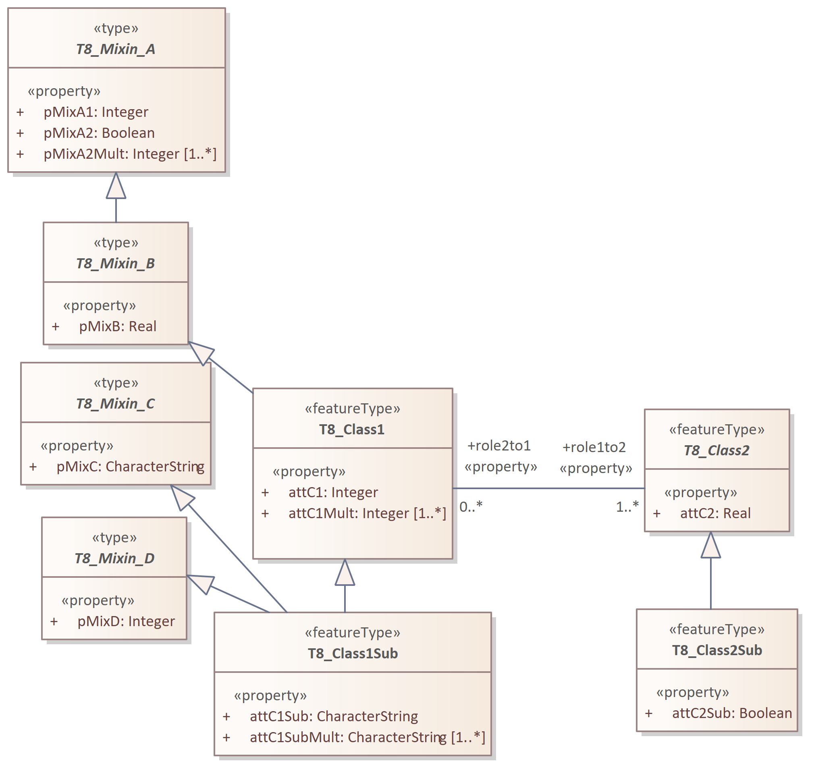
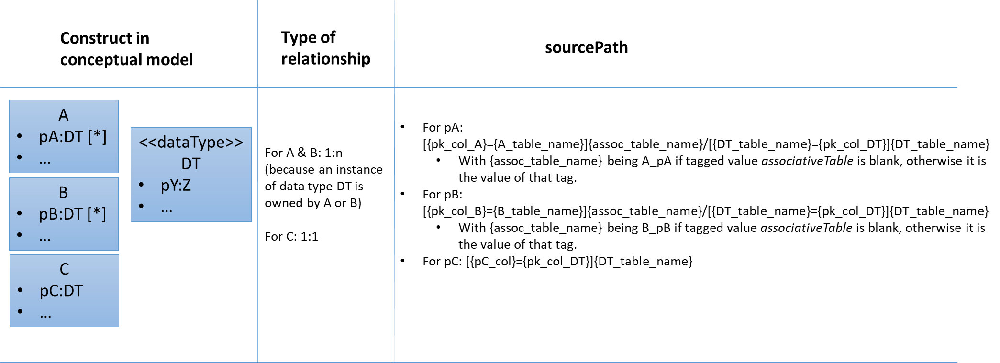
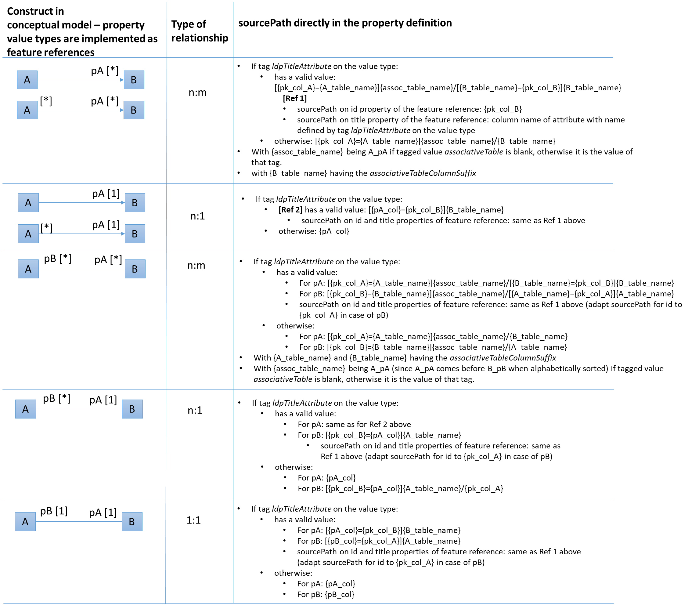
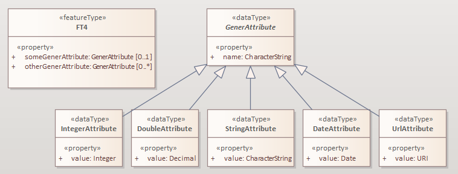

:doctype: book
:encoding: utf-8
:lang: en
:toc: macro
:toc-title: Table of contents
:toclevels: 5

:toc-position: left

:appendix-caption: Annex

:numbered:
:sectanchors:
:sectnumlevels: 5

:listing-caption: Listing

[[ldproxy2]]
= ldproxy Target

(from v2.12.0)

NOTE: This target supports ldproxy versions 3.1.0 and upwards.

[[ldproxy2_overview]]
== Overview

[[ldproxy2_schemaconversionrules]]
== Schema Conversion Rules

The following subsections describe a number of conversion rules, which define how the contents of application schemas are converted to ldproxy configuration files.

NOTE: An encoding rule consists of a set of conversion rules – as required by a community. The <<ldproxy2_encodingrules>> section describes how encoding rules can be defined.

[[ldproxy2_schemaconversionrules_templates]]
=== Configuration file templates

The ldproxy target creates the following folder structure in the output directory:

* data
** store
*** entities
**** codelists (only if a codelist or enumeration is actually encoded)
**** providers
**** services

The target output will be written to these folders. 

CAUTION: Make sure that when copying the output files, you end up with this folder structure! Do not, for example, forget to create the 'entities' folder by just copying the 'codelists', 'providers', and 'services' folders to a 'store' folder. Otherwise, ldproxy will just assume that the store is empty.

Some configuration data can simply be copied using template files. <<table_template_files>> lists the templates that the target uses, with information about:

* The name of the ShapeChange target parameter with which the path to the template file can be provided.
* If applicable: The default template location, i.e. the path that will be used by the target if no path is given via the target parameter.
* If applicable: The path within the output folder to which the template file will be copied.
* A description of the template file.

[#table_template_files,reftext='{table-caption} {counter:table-num}']
.Configuration file templates
[cols="1,2,1,3a",options="header"]
|====================
| target parameter name | default template location | output folder | description
| cfgTemplatePath | https://shapechange.net/resources/templates/ldproxy2/cfgTemplate.yml | data/cfg.yml | The cfg.yml contains the global configuration for all APIs in the intended API deployment.
| serviceConfigTemplatePath | _none_ - Nevertheless, an example is provided at https://shapechange.net/resources/templates/ldproxy2/serviceConfigTemplate.yml | _none_ - will be integrated into the service configuration | The object defined by this template file will be patched into the service configuration. This is useful to, for example, define service metadata.
||||
|====================

[[ldproxy2_schemaconversionrules_documentation]]
=== Documentation

// The updated ldproxy target uses platform identifier 'ldp2'. It is considered to be the next iteration of the ldproxy target - fullstop. For now, we will keep the old ldproxy target.

With __rule-ldp2-all-documentation__, descriptive information of application schema elements (for ldproxy that primarily means classes and their properties) can be encoded within the ldproxy configuration, more specifically: in _label_ and _description_ members of type definitions.

[NOTE]
======
Descriptive information of a model element in ShapeChange, i.e. properties (attributes and association roles), classes, and packages, includes the pieces of information, called _descriptors_, that are documented xref:../get started/The_element_input.adoc#Descriptor_sources[here].

A model element can have all, a subset, or none of these descriptors.
======

Typically, a community has a preferred way to model and encode this information. For example, one community may want to encode just the description of a property via the "description" member in the provider configuration, while another may prefer to encode the values of multiple descriptors of the property within the "description" member. Therefore,  templates are used to define the (combination of) descriptor(s) that shall be used as value for _label_ and _description_ members:

* target parameter _labelTemplate_:
** default value: \[[alias]]
** explanation: The template for the _label_ member generated for a type definition. The patterns "\[[descriptor]]" will be replaced by the value of the descriptor, or the value of parameter _descriptorNoValue_, if the descriptor has no value for the model element.
* target parameter _descriptionTemplate_:
** default value: \[[definition]]
** explanation: The template for the _description_ member generated for a type definition. The patterns "\[[descriptor]]" will be replaced by the value of the descriptor, or the value of parameter _descriptorNoValue_, if the descriptor has no value for the model element.
* target parameter _descriptorNoValue_:
** default value: "" (i.e., the empty string)
** explanation: If a descriptor is used in a label or description template, but has no value, then the value of this parameter will be used instead.

NOTE: If the resulting value for label or description is blank, i.e. the empty string or only whitespace, then the value will not be encoded.

[[ldproxy2_schemaconversionrules_schemapackage]]
=== Schema Packages

Schema packages have the stereotype \<<applicationSchema>>, \<<schema>>, or an alias (e.g. using a specific language, like \<<anwendungsschema>>). An \<<applicationSchema>> package represents an application schema according to ISO 19109. The stereotype \<<schema>> has been introduced for packages that should be treated like application schemas, but do not contain feature types. Such schemas are compliant to ISO 19103; examples are ISO 191xx schemas.

This ldproxy target is a so-called "ShapeChange Single Target", i.e. it converts all xref:../targets/Output_Targets.adoc#Selecting_the_Schemas_to_Process[schemas selected for processing] in one go, rather than handling each of these schemas separately.

The target creates a single provider configuration (in folder data/store/entities/providers) as well as a single service configuration file (in folder data/store/entities/services). The names of these files are given by the name of the xref:../get started/The_element_input.adoc#mainAppSchema[main schema], in all lower case, and non-word characters replaced by '_'. The resulting name is also used as the id within these files. The encoding details for each of the two configuration files are documented in sections <<ldproxy2_schemaconversionrules_schemapackage_providerconfig>> and <<ldproxy2_schemaconversionrules_schemapackage_serviceconfig>>.

NOTE: If a single API (provider and service configuration) shall be created for each schema, set the xref:../targets/Output_Targets.adoc#Selecting_the_Schemas_to_Process[schema selection parameter] appropriately. If multiple schemas need to be processed, and each shall result in a different API, then either run ShapeChange multiple times (updating the schema selection parameters each time) or define multiple ldproxy targets (each selecting a different schema for processing).

[[ldproxy2_schemaconversionrules_schemapackage_providerconfig]]
==== Provider Configuration

The following information items are added to the provider configuration file:

// source: https://github.com/interactive-instruments/ldproxy/tree/master/docs/de/configuration/providers and https://github.com/interactive-instruments/ldproxy/blob/master/docs/de/configuration/providers/sql.md

* id: the provider name (derived from the main schema, as defined in section <<ldproxy2_schemaconversionrules_schemapackage>>)
* createdAt and lastModified: receive the integer value for an automatically generated unix time stamp (fixed for UnitTests)
* entityStorageVersion: 2
* providerType: FEATURE
* featureProviderType: SQL
* connectionInfo:
** dialect: PGIS 
*** NOTE: A future enhancement of this target may support GeoPackage (dialect: GPKG).
** database: FIXME
** host: FIXME
** user: FIXME
** password: FIXME-base64-encoded
** schemas: "public" - and, if _rule-ldp2-all-schemas_ is active, all values from tags _sqlSchema_ on the package elements of all processed schemas
*** NOTE: This corresponds to the database schema definition mechanism supported by the SqlDdl target in _rule-sql-all-schemas_.
* sourcePathDefaults:
** primaryKey: value of target parameter _primaryKeyColumn_; default: id
*** NOTE: Corresponds to SqlDdl target parameter _idColumnName_
** sortKey: same as primaryKey
* queryGeneration:
** computeNumberMatched: true
* nativeCrs: 
** code: value of target parameter _srid_; default is 4326
*** NOTE: The SqlDdl target has a similar parameter.
** forceAxisOrder: value of target parameter _forceAxisOrder_; default is NONE
* nativeTimeZone: value of target parameter _nativeTimeZone_; default: NONE
** NOTE: The time-zone ID is given as a string like 'Europe/Paris'. Internally, parsing is achieved using the Java ZoneId class and its static `of(String zoneId)` method. The system default time-zone ID is determined via the static `systemDefault()` method. For further information about the allowed formats of the time-zone ID, consult the documentation of the Java ZoneId class and the two methods.
* types: will be populated as described in section <<ldproxy2_schemaconversionrules_types>>
* fragments: will be generated if target parameter _enableFragments_ is set to true. For further details, see section <<ldproxy2_schemaconversionrules_types_inheritance_and_specialization>>.

NOTE: Members of the provider configuration, whose value is equal to the default value for that member defined by ldproxy, may not actually be written to the provider configuration file created by the target.

NOTE: The deployment-specific values of the `connectionInfo` member - i.e. the database, host, user, and password - should either be set via environment variables, or via an overriding configuration file. The override would be placed in folder store/overrides/providers and carry the same name as the provider configuration whose connection infos shall be overridden.

[[ldproxy2_schemaconversionrules_schemapackage_serviceconfig]]
==== Service Configuration

The following information items are added to the service configuration file:

// source: https://github.com/interactive-instruments/ldproxy/tree/master/docs/de/configuration/services

* id: the service name (derived from the main schema, as defined in section <<ldproxy2_schemaconversionrules_schemapackage>>)
* createdAt and lastModified: receive the integer value for an automatically generated unix time stamp (fixed for UnitTests)
* entityStorageVersion: 2
* label: value of target parameter _serviceLabel_; default is 'FIXME'
* description: value of target parameter _serviceDescription_; default is 'FIXME'
* serviceType: OGC_API
* metadata: can be provided - in form of a template - via target parameter _serviceConfigTemplatePath_; metadata information for the actual API is typically not included in the model, therefore the target uses information provided via a separate template file
* api: can be provided - in form of a template - via target parameter _serviceConfigTemplatePath_; information about the modules implemented by the actual API is typically not included in the model, therefore the target uses information provided via a separate template file
* collections: will be populated as described in section <<ldproxy2_schemaconversionrules_types>>.
* If target parameter _enableGmlOutput_ is 'true' (default being 'false'), then API building blocks 
as described in subsection <<ldproxy2_building_block_features_gml>> are added to the service configuration.

NOTE: Members of the service configuration, whose value is equal to the default value for that member defined by ldproxy, may not actually be written to the service configuration file created by the target.

[[ldproxy2_building_block_features_gml]]
===== Features - GML

Version 3.3.0 of ldproxy supports encoding data as GML. The documentation of 
ldproxy building block Features - GML describes relevant configuration items.
By setting target parameter __enableFeaturesGml__ to 'true', 
ShapeChange will add ldproxy building block 
https://docs.ldproxy.net/services/building-blocks/features_-_gml.html[Features - GML]
to the service configuration as enabled.

NOTE: The initial name of the target parameter was _enableGmlOutput_. For backwards compatibility of existing ShapeChange configurations, the old parameter name is supported 
as an alias for _enableFeaturesGml_.

The target thereby needs to know how application schema elements shall be represented in 
XML. In other words, it needs to know how the desired XML encoding looks like. This 
information can be generated by the xref:./xml schema/XML_Schema.adoc[XmlSchema target], 
if parameter _writeXmlEncodingInfos_ is set to 'true' there. The format of the XML 
encoding infos generated by the XmlSchema target is documented xref:./xml schema/XML_Encoding_Infos.adoc[here]. The XML encoding infos need to be placed within the `advancedProcessConfigurations` 
element of the ldproxy target configuration. The ShapeChange workflow may thus need to be 
run twice - first, to generate XML schemas and their XML encoding infos, and then to 
derive the ldproxy configuration files, using the XML encoding infos in the configuration 
of the ldproxy target. The following example shows how this is done:

[source,xml,linenumbers]
----------
<Target class="de.interactive_instruments.ShapeChange.Target.Ldproxy2.Ldproxy2Target" mode="enabled" inputs="TRF_END">
  <advancedProcessConfigurations>
    <XmlEncodingInfos>
      <modelElementEncodings>
        <ModelElementXmlEncoding applicationSchemaName="Cross Schema A" modelElementName="FeatureTypeA" xmlName="AbstractFeatureTypeA" xmlNamespace="http://shapechange.net/test/a"/>
        <ModelElementXmlEncoding applicationSchemaName="Cross Schema A" modelElementName="FeatureTypeA::attMeasure" xmlName="attMeasure" xmlNamespace="http://shapechange.net/test/a"/>
        <ModelElementXmlEncoding applicationSchemaName="Cross Schema A" modelElementName="FeatureTypeA::ftAtoTA" xmlName="ftAtoTA" xmlNamespace="http://shapechange.net/test/a"/>
        <ModelElementXmlEncoding applicationSchemaName="Cross Schema A" modelElementName="FeatureTypeA::geom" xmlName="geom" xmlNamespace="http://shapechange.net/test/a"/>
        <ModelElementXmlEncoding applicationSchemaName="Cross Schema A" modelElementName="DataTypeA" xmlName="DataTypeA" xmlNamespace="http://shapechange.net/test/a"/>
        <ModelElementXmlEncoding applicationSchemaName="Cross Schema A" modelElementName="DataTypeA::att1" xmlName="att1" xmlNamespace="http://shapechange.net/test/a"/>
        <ModelElementXmlEncoding applicationSchemaName="Cross Schema A" modelElementName="DataTypeA::att2" xmlAttribute="true" xmlName="att2" xmlNamespace="http://shapechange.net/test/a"/>
        <ModelElementXmlEncoding applicationSchemaName="Cross Schema A" modelElementName="TypeA" xmlName="TypeA" xmlNamespace="http://shapechange.net/test/a"/>
        <ModelElementXmlEncoding applicationSchemaName="Cross Schema A" modelElementName="TypeA::attCodelistA" xmlName="attCodelistA" xmlNamespace="http://shapechange.net/test/a"/>
      </modelElementEncodings>
      <namespaces>
        <XmlNamespace ns="http://shapechange.net/test/a" nsabr="a"/>
      </namespaces>
    </XmlEncodingInfos>
    <XmlEncodingInfos>
      <modelElementEncodings>
        <ModelElementXmlEncoding applicationSchemaName="Cross Schema B" modelElementName="FeatureTypeB" xmlName="FeatureTypeB" xmlNamespace="http://shapechange.net/test/b"/>
        <ModelElementXmlEncoding applicationSchemaName="Cross Schema B" modelElementName="FeatureTypeB::att1" xmlAttribute="true" xmlName="att1" xmlNamespace="http://shapechange.net/test/b"/>
        <ModelElementXmlEncoding applicationSchemaName="Cross Schema B" modelElementName="FeatureTypeB::att2" xmlName="att2" xmlNamespace="http://shapechange.net/test/b"/>
        <ModelElementXmlEncoding applicationSchemaName="Cross Schema B" modelElementName="FeatureTypeB::att3" xmlName="att3" xmlNamespace="http://shapechange.net/test/b"/>
      </modelElementEncodings>
      <namespaces>
        <XmlNamespace ns="http://shapechange.net/test/b" nsabr="b"/>
      </namespaces>
    </XmlEncodingInfos>
  </advancedProcessConfigurations>
  <targetParameter name="outputDirectory" value="results/ldproxy2/gmlOutput"/>
  <!-- ... other configuration items omitted for brevity ... -->
</Target>
----------

The ldproxy target attempts to identify the XML encoding of a particular model element as follows:

* First, it is necessary to understand the concept that a schema which has been transformed 
can be significantly different to the one from which the XML schema has been derived. The schema 
and class to which a property belonged in the input model can be changed by flattening inheritance 
and flattening complex types. The same applies to the property name - it may also be changed by a 
transformation. If inheritance or complex types have been flattened, the original class, schema, as 
well as property name can be documented in tagged values _originalSchemaName_, _originalInClassName_, 
and _originalPropertyName_. For further details as to which properties exactly are tagged this 
way, see the documentation of the Tagged Value transformation rule 
xref:../transformations/Tagged_Value_Transformer.adoc#rule-trf-taggedValue-createOriginalSchemaInformationTags[rule-trf-taggedValue-createOriginalSchemaInformationTags], as well as the Flattener transformation rules 
xref:../transformations/Flattener.adoc#rule-trf-cls-flatten-inheritance[rule-trf-cls-flatten-inheritance] 
and xref:../transformations/Flattener.adoc#rule-trf-prop-flatten-types[rule-trf-prop-flatten-types]. 
If these tags are set, they are used when looking up the XML namespace and XML name of a model element. 
Otherwise, the name of the model element, in case of a property also the class that owns it, as 
well as the schema are taken directly from the model.
* For a model element - classes and properties -, the XML namespace in which it is XML 
encoded needs to be known. 
If no `ModelElementXmlEncoding` element defines that namespace, then ShapeChange 
uses the target namespace of the schema the model element belongs to in the model. The target 
namespace is either defined by tag `targetNamespace` on the schema package, or via `PackageInfo` 
elements in the ShapeChange configuration. If no namespace can be identified this way, either, 
then a value of 'fixme' with a counter is assigned to the schema package.
* The XML namespace abbreviation to use for the XML namespace is determined in a similar manner.
First, namespace definitions in the XML encoding infos are checked. If they do not contain a
definition for the namespace, the model is checked (tag `xmlns` of the schema package, and 
subsequently `PackageInfo` elements of the ShapeChange configuration). If all else fails, a value 
of 'fixme' plus a counter is assigned.
* The XML name of the model element is looked up in the XML encoding infos, taking into 
account tags _originalSchemaName_, _originalInClassName_, and _originalPropertyName_, if set. 
If the XML name was not found this way, the model element name is used - unless, for a property, 
tag _originalPropertyName_ has a value; in that case, that value is used.

The target creates a general GML API building block in the service configuration. It contains 
the following members:

* The XML namespaces and their abbreviations of model elements that are processed by the target 
are encoded within the `applicationNamespaces` member.
* The XML namespace abbreviation of the main application schema is assigned as value of the
`defaultNamespace` member.
** NOTE: The ldproxy target can process multiple application schemas at once, and the result are single 
provider and service configuration files (among others, like codelist definitions). Here, the 
xref:../get started/The_element_input.adoc#mainAppSchema[_mainAppSchema_] (input) parameter and 
concept comes into play. If multiple schemas are processed, the one that shall be used as the default 
namespace is defined by the _mainAppSchema_ input parameter. If the parameter is not set, ShapeChange 
acts as follows: if there is only a single schema to process, it is selected as main schema. Otherwise, 
a warning is issued and the first schema that is processed by the target is chosen as main schema.
* The `schemaLocations` member is populated as follows:
** For the XML namespace of the main application schema, the schema location from the XML 
encoding infos is used. If no location can be found this way, it is assumed that the XML schema 
for this namespace shall be hosted by ldproxy itself. In that case, API building block RESOURCES 
is enabled, and the schema location value will be `{{serviceUrl}}/resources/` + the value of tag 
_xsdDocument_ of the main application schema. Example: `{{serviceUrl}}/resources/myschema.xsd`
** For all other XML namespaces that apply to the model elements processed by the ldproxy target, 
if the namespace definitions in the XML encoding infos define schema locations, then they are added.
* The `objectTypeNamespaces` member is populated with the names of the object types which occur in the 
provider configuration AND whose XML namespace is different to the default namespace. The name of 
such an object type is used as key, while the XML namespace abbreviation is used as value.
* If target parameter _gmlIdPrefix_ is set, its value is used as value of the `gmlIdPrefix` member.
* If target parameter _gmlSfLevel_ is set (to one of the allowed values 0, 1, and 2), its value 
is set as the value of the `gmlSfLevel` member.
* Likewise, if target parameter _featureCollectionElementName_ is set, its value is used in the 
corresponding member. The same applies for the value of target parameters _featureMemberElementName_
and _supportsStandardResponseParameters_.

For each collection, the target generates a GML building block entry in the service configuration, 
if at least one of the following situations applies:

* If the XML name or XML namespace of a property (on any level within the type definition) is 
different to the name used in the provider configuration, or the default XML namespace, a `rename`
transformation is applied to that property, using the XML QName as value (the XML namespace prefix 
is omitted, if the XML namespace is the same as the default namespace).
* If a property is encoded as an XML attribute, the property path is added as value to the 
`xmlAttributes` member.

Example (from one of the ShapeChange unit tests):

[source,yml,linenumbers]
----------
collections:
  featuretypeb:
    id: featuretypeb
    label: featuretypeb
    enabled: true
    api:
    - buildingBlock: GML
      transformations:
        att2.att1:
        - rename: a:att1
        att2.att2:
        - rename: a:att2
      conformance: NONE
      xmlAttributes:
      - att1
      - att2.att2
----------

[[ldproxy2_building_block_features_geojson]]
===== Features - GeoJSON

By setting target parameter _enableFeaturesGeoJson_ to 'true', 
ShapeChange will add ldproxy building block 
https://docs.ldproxy.net/de/services/building-blocks/features_-_geojson.html[Features - GeoJSON]
to the service configuration as enabled.

Currently, specific configuration items for this building block are added
through the <<ldproxy2_schemaconversionrules_specificrules_genericvaluetypes>>.
In the future, generation of additional configuration items for this
building block can be supported.

[[ldproxy2_building_block_features_jsonfg]]
===== Features - JSON-FG

By setting target parameter _enableFeaturesJsonFg_ to 'true', 
ShapeChange will add ldproxy building block 
https://docs.ldproxy.net/de/services/building-blocks/features_-_json-fg.html[Features - JSON-FG]
to the service configuration as enabled.

Currently, specific configuration items for this building block are added
through the <<ldproxy2_schemaconversionrules_specificrules_genericvaluetypes>>.
In the future, generation of additional configuration items for this
building block can be supported.

[[ldproxy2_queryables]]
===== Queryables

If the main application schema matches `rule-ldp2-all-queryables`, 
the target creates a QUERYABLES building block in the service configuration. 
It just contains the member `enabled: true`.

For each collection, whose represented type matches `rule-ldp2-all-queryables`, 
the target checks which, if any, of the properties have a name - current or original - equal 
to one of the names provided by target parameter `queryables` (the parameter value is a 
comma-separated list of property names; no default value is defined). If at least one such property 
was found, the target creates a `queryables` member in the QUERYABLES building block 
in the service configuration of the collection (adding that building block if necessary), with:

* member `included` and an array of the names of all queryable properties. If a queryable association role does NOT match _rule-ldp2-all-linkObjectAsFeatureRef_, then `.title` is added to 
the role name (meaning that queries will be 
performed on the `title`-value of the link object that is encoded for an association role).
* member `pathSeparator` and value DOT. 

NOTE: The differentiation between 'current' and 'original' property name is important when the 
ldproxy target shall encode a model which has been flattened (flattening inheritance and/or complex types). When inheritance or complex types are flattened, property names can be modified. 
When this happens (in the mentioned flattening cases), the original property name is documented in tagged value _originalPropertyName_. The ldproxy target checks this tag when matching
properties of a value type against the configured list of queryables.

NOTE: The definition of queryable properties using the global target configuration parameter
`queryables` can be enhanced in the future. For example, it would be possible to introduce a
specific tag, to be set on a type, which would provide the names of queryable properties of that type.

Example (from one of the ShapeChange unit tests):

[source,yml,linenumbers]
----------
collections:
  featuretype:
    id: featuretype
    label: featuretype
    enabled: true
    api:
    - buildingBlock: QUERYABLES
      included:
      - attDate
      - attInt
      - attPoint
      - roleFTtoT_Subtype.title
      - roleFTtoT_Type.title
      pathSeparator: DOT
----------

[[ldproxy2_schemaconversionrules_types]]
=== Types

[[ldproxy2_schemaconversionrules_types_mappings]]
==== Mappings

Application schemas typically use types from other schemas, for example the types defined by ISO 19103 and ISO 19107. External types can be used as value types of properties, and as supertypes for types defined in the application schema that is being converted.

Whenever an external type is used, its implementation details are needed. An external type must be implemented as one of the types supported by ldproxy, or as a link / feature reference. The target type of a map entry must therefore be one of:

* FLOAT, INTEGER, STRING, BOOLEAN, DATETIME and DATE
** Relevant map entry parameter(s): _initialValueEncoding_ (optional, currently only used for mapping of the conceptual type 'Boolean')
* GEOMETRY
** Relevant map entry parameter(s): _geometryInfos_ (required)
* LINK
** NOTE: Types that are mapped to links - more specifically, link objects - are considered to be available as an external resource. Linking to such objects can be useful for integration and re-use of external APIs.
** Relevant map entry parameter(s): _linkInfos_ (required)

// OBJECT mapping may become relevant in the future; such a mapping would define the database implementation, i.e. values of the mapped type would be available in a separate table within the database. However, right now that use case has not been encountered yet.

NOTE: The semantic validation (a pre-processing step executed by ShapeChange upon loading the configuration) of the ldproxy target configuration will ensure that map entries contain required map entry parameters.

Note that while a type mapping typically applies to external types, it can also be applied to a type from the application schema. For example, some identifier datatype (e.g. called 'GUID') could be defined within the application schema, but be implemented within the database and thus also in the resulting ldproxy configuration as a STRING.

A map entry for the ldproxy target has the following structure:

* @type (required): The unqualified UML type/class name to be mapped. Should be unique within the model (if it is not unique, this can lead to unexpected results).
* @rule (required): The encoding rule to which this mapping applies. May be "*" to indicate that the mapping applies to all encoding rules.
* @targetType (required): One of FLOAT, INTEGER, STRING, BOOLEAN, DATETIME, DATE, GEOMETRY, or LINK.
* @param (optional): Defines one or more parameters for the mapping. If no parameter is provided (leaving the 'param' attribute empty) then the map entry contains a straightforward mapping, usually to a simple type. Each parameter has a name. A list of parameters is separated by commas. Each parameter can also have characteristics defined for it, providing even further information for the conversion. Characteristics for a parameter are provided within curly braces. A characteristic usually is provided by a key-value pair, with the key being the identification of the characteristic.
** Parameter _initialValueEncoding_: Defines how initial values of properties whose value type is mapped by the map entry should be encoded. Currently only relevant for mapping of type Boolean to some ldproxy type.
*** Characteristic: _true_ (optional): Specifies the value to represent the Boolean value `true` in the mapping that the parameter applies to. Only relevant for mapping of type `Boolean`. Default is `true`.
*** Characteristic: _false_ (optional): Specifies the value to represent the Boolean value `false` in the mapping that the parameter applies to. Only relevant for mapping of type `Boolean`. Default is `false`.
*** NOTE: Mappings of initial values for type Boolean are especially important if boolean values are represented in the database using a non-boolean datatype. For example, the value `true` could be represented by integer 1, while `false` would be represented by 0.
// IRRELEVANT *** Characteristic: _quoted_ (optional): If set to `true` (ignoring case), this characteristic specifies that the default value shall be quoted. Default is `false`. Typically, this characteristic is set to `true` in map entries for types that map to a textual type, but it can also apply to temporal types. It usually does not apply to numeric types. NOTE: Also applies to the representation of a Boolean value.
** Parameter _geometryInfos_: Indicates that the map entry contains a mapping for a geometry type (specifically from ISO 19107), and provides further information via characteristics.
*** Characteristic _geometryType_ (required): Specify the actual geometry type, using one of the geometry types supported by ldproxy: POINT, MULTI_POINT, LINE_STRING, MULTI_LINE_STRING, POLYGON, MULTI_POLYGON, GEOMETRY_COLLECTION, ANY
// JE - not used right now, maybe later: ** Parameter _temporalInfos_: Indicates that the map entry contains a mapping for a temporal type, and provides further information via characteristics.
** Parameter _linkInfos_: provides information for constructing a link- object.
*** Characteristic: _urlTemplate_ (required): Defines a template for constructing the URL to an actual property value, given an identifier value, which is represented in the template using placeholder `(value)`. The placeholder `(serviceUrl)` can be used as well. It will be replaced by an ldproxy deployment with its base URL. 
**** NOTE: Due to an implementation restriction in the parsing process of map entry parameters and their characteristics, braces are not directly allowed within the value of the _urlTemplate_ characteristic. The target will automatically replace the parentheses ('(' and ')') around the placeholders with braces ('{' and '}') when writing them in the ldproxy configuration.
*** Characteristic: _tableName_ (optional): Name of the database table that represents the mapped type. Is used to construct source paths, for cases in which a property with the mapped type as value type has a maximum multiplicity greater than one (which typically results in the use of an associative table, in which the mapped type must be represented with a foreign key field). The characteristic reflects the xref:./SQL_DDL.adoc#Parameter_table[map entry parameter table] of the SQL DDL target. If the database schema has been created with such a mapping, then a corresponding mapping is likely required for the ldproxy target.
*** Characteristic: _representedCategory_ (optional): The value identifies the category of the conceptual type that is identified by the map entry. Recognized values are: `datatype` and `codelist`. Primarily required for correctly creating source paths.

// The implementation restriction is that we have not defined a grammar for the map entry parameter syntax. Instead we are using regular expressions to parse the parameter value, which have a hard time with, for example, double braces.

////

NOTE: OBJECT mapping not implemented yet; the following could be relevant for such a mapping:

** Parameter _collectionInfos_: 
*** Characteristic: _table_: Name of the table that stores objects of the mapped type. Useful for constructing join statements. 
// *** Characteristic: _primaryKey_: Name of the primary key column in the table that stores objects of the mapped type. Useful for constructing join statements.

////

[[ldproxy2_schemaconversionrules_types_abstractness]]
==== Abstractness

Abstract types are not converted to individual provider type definitions. 
However, if target parameter _enableFragments_ is set to `true`, then 
abstract types will be converted to fragment definitions.

[[ldproxy2_schemaconversionrules_types_inheritance_and_specialization]]
==== Inheritance and Specialization

Since v2.14.0, conversion of inheritance relationships is supported by the target,
if target parameter _enableFragments_ is set to `true`. 

NOTE: Before v2.14.0, such relationships had to be transformed,
before executing the ldproxy target 
(e.g. use the Flattener transformation to flatten inheritance).

With fragments enabled, the provider configuration contains type definitions 
as well as fragment definitions. The fragment definitions thereby define the 
structure of a type in detail: object type, documentation, properties, etc.
However, source path information is only contained for cases in which the path
is a simple column name within the source table of the current context (e.g.,
a type definition). For other cases, the source path is
encoded within the type definition.

If a type has supertypes, then the fragment definition of the type merges 
the fragment definitions of these supertypes, as well as the schema of the 
properties directly owned by the type. If a class only has a single
supertype, then a direct `schema` reference (to the fragment definition 
of the supertype) is used. If the class has multiple
supertypes, the `merge` keyword is used to encode the necessary references.

[WARNING]
======
Multiple inheritance is only supported if no (direct or indirect) 
supertype of the class uses multiple inheritance! This is currently a
restriction of ldproxy regarding the `merge` keyword.

The `merge` keyword results in a shallow merge, where property override
applies. That reflects the property override in UML, i.e., a property 
defined in a subclass overrides the definition of a property with same
name that is defined in a (direct or indirect) superclass. Be aware,
though, that the `schema` reference results in a deep merge. Property
overrides in the application schema may lead to unexpected results there.

======

In case of multiple inheritance, the merge items are encoded in a way
that reflects the order in which the XML Schema target encodes supertype
properties (also taking into account mixin encoding). This is an important
aspect when <<ldproxy2_building_block_features_gml>> shall be supported by the resulting
ldproxy configuration.

A type definition references the according fragment definition via a `schema` member.
The type definition encodes the source path to identify the objects of that type.
It also provides source paths for all properties directly owned or inherited
by the type, for non-simple cases (as described before, simple cases are encoded
in the fragment definition). Furthermore, if the value(s) of a property can be 
encoded in the database in multiple ways - for example because of 
multiplicity being flattened (like a property with max multiplicity 2),
and the property values thus being SQL encoded by multiple separate columns,
or because the property value type has subtypes, and each subtype is SQL encoded
in a separate table - the property is typically encoded (in the type definition) 
as a FEATURE_REF using the ldproxy keyword `concat` or `coalesce`. The former is used
if the maximum multiplicity of the property is greater than one, the latter if it is 
equal to one. Further details on the encoding of a FEATURE_REF are given <<feature_ref,here>>.

NOTE: The following example is from one of the ShapeChange unit tests.
The ShapeChange configuration and results of that test are available https://github.com/ShapeChange/ShapeChange/tree/master/src/test/resources/ldproxy2/fragmentsConcatCoalesce[here], 
while the model is available
https://github.com/ShapeChange/ShapeChange/tree/master/src/test/resources/sql/sqlEncodingInfos[here].
The example only shows an extract of the whole unit test.

[#img_ldproxy2_inheritance_and_specialization_example,reftext='{figure-caption} {counter:figure-num}']
.Example schema with inheritance structures, to illustrate fragment encoding

[source,yml,linenumbers]
----------
collections:
  t8_class1:
    sourcePath: /t8_class1
    type: OBJECT
    label: T8_Class1
    properties:
      pMixA2Mult:
        sourcePath: "[_id=t8_class1_id]t8_class1_pmixa2mult/pmixa2mult"
        type: VALUE_ARRAY
        valueType: INTEGER
      attC1Mult:
        sourcePath: "[_id=t8_class1_id]t8_class1_attc1mult/attc1mult"
        type: VALUE_ARRAY
        valueType: INTEGER
      role1to2:
        sourcePath: "[_id=t8_class1_id]t8_class1_role1to2_t8_class2sub/t8_class2sub_id"
        type: FEATURE_REF_ARRAY
        valueType: INTEGER
        refType: t8_class2sub
    schema: '#/fragments/t8_class1'
  t8_class1sub:
    sourcePath: /t8_class1sub
    type: OBJECT
    label: T8_Class1Sub
    properties:
      pMixA2Mult:
        sourcePath: "[_id=t8_class1sub_id]t8_class1sub_pmixa2mult/pmixa2mult"
        type: VALUE_ARRAY
        valueType: INTEGER
      attC1Mult:
        sourcePath: "[_id=t8_class1sub_id]t8_class1sub_attc1mult/attc1mult"
        type: VALUE_ARRAY
        valueType: INTEGER
      role1to2:
        sourcePath: "[_id=t8_class1sub_id]t8_class1sub_role1to2_t8_class2sub/t8_class2sub_id"
        type: FEATURE_REF_ARRAY
        valueType: INTEGER
        refType: t8_class2sub
      attC1SubMult:
        sourcePath: "[_id=t8_class1sub_id]t8_class1sub_attc1submult/attc1submult"
        type: VALUE_ARRAY
        valueType: STRING
    schema: '#/fragments/t8_class1sub'
  t8_class2sub:
    sourcePath: /t8_class2sub
    type: OBJECT
    label: T8_Class2Sub
    properties:
      role2to1:
        type: FEATURE_REF_ARRAY
        concat:
        - sourcePath: "[_id=t8_class2sub_id]t8_class1_role1to2_t8_class2sub/t8_class1_id"
          type: FEATURE_REF_ARRAY
          valueType: INTEGER
          refType: t8_class1
        - sourcePath: "[_id=t8_class2sub_id]t8_class1sub_role1to2_t8_class2sub/t8_class1sub_id"
          type: FEATURE_REF_ARRAY
          valueType: INTEGER
          refType: t8_class1sub
    schema: '#/fragments/t8_class2sub'
fragments:
  t8_class1:
    type: OBJECT
    objectType: T8_Class1
    label: T8_Class1
    properties:
      oid:
        sourcePath: _id
        type: INTEGER
        role: ID
      attC1:
        sourcePath: attc1
        type: INTEGER
        label: attC1
        constraints:
          required: true
      attC1Mult:
        type: VALUE_ARRAY
        valueType: INTEGER
        label: attC1Mult
        constraints:
          required: true
          minOccurrence: 1
      role1to2:
        type: FEATURE_REF_ARRAY
        label: role1to2
        constraints:
          required: true
          minOccurrence: 1
    schema: '#/fragments/t8_mixin_b'
  t8_class1sub:
    type: OBJECT
    objectType: T8_Class1Sub
    label: T8_Class1Sub
    merge:
    - schema: '#/fragments/t8_class1'
    - schema: '#/fragments/t8_mixin_c'
    - schema: '#/fragments/t8_mixin_d'
    - properties:
        attC1Sub:
          sourcePath: attc1sub
          type: STRING
          label: attC1Sub
          constraints:
            required: true
        attC1SubMult:
          type: VALUE_ARRAY
          valueType: STRING
          label: attC1SubMult
          constraints:
            required: true
            minOccurrence: 1
  t8_class2:
    type: OBJECT
    objectType: T8_Class2
    label: T8_Class2
    properties:
      oid:
        sourcePath: _id
        type: INTEGER
        role: ID
      attC2:
        sourcePath: attc2
        type: FLOAT
        label: attC2
        constraints:
          required: true
      role2to1:
        type: FEATURE_REF_ARRAY
        label: role2to1
        constraints:
          minOccurrence: 0
  t8_class2sub:
    type: OBJECT
    objectType: T8_Class2Sub
    label: T8_Class2Sub
    properties:
      attC2Sub:
        sourcePath: attc2sub
        type: BOOLEAN
        label: attC2Sub
        constraints:
          required: true
    schema: '#/fragments/t8_class2'
  t8_mixin_a:
    type: OBJECT
    objectType: T8_Mixin_A
    label: T8_Mixin_A
    properties:
      pMixA1:
        sourcePath: pmixa1
        type: INTEGER
        label: pMixA1
        constraints:
          required: true
      pMixA2:
        sourcePath: pmixa2
        type: BOOLEAN
        label: pMixA2
        constraints:
          required: true
      pMixA2Mult:
        type: VALUE_ARRAY
        valueType: INTEGER
        label: pMixA2Mult
        constraints:
          required: true
          minOccurrence: 1
  t8_mixin_b:
    type: OBJECT
    objectType: T8_Mixin_B
    label: T8_Mixin_B
    properties:
      pMixB:
        sourcePath: pmixb
        type: FLOAT
        label: pMixB
        constraints:
          required: true
    schema: '#/fragments/t8_mixin_a'
  t8_mixin_c:
    type: OBJECT
    objectType: T8_Mixin_C
    label: T8_Mixin_C
    properties:
      pMixC:
        sourcePath: pmixc
        type: STRING
        label: pMixC
        constraints:
          required: true
  t8_mixin_d:
    type: OBJECT
    objectType: T8_Mixin_D
    label: T8_Mixin_D
    properties:
      pMixD:
        sourcePath: pmixd
        type: INTEGER
        label: pMixD
        constraints:
          required: true
----------

[[ldproxy2_sql_encoding_infos]]
The representation of certain model elements in the underlying database 
can vary significantly. It is therefore highly recommended to 
provide the ldproxy target with 
xref:./SQL_DDL.adoc#SQL_Encoding_Infos[SQL encoding infos] (available since v2.14.0). 
They can be produced by the SQL DDL target. The encoding infos can be 
provided via the `advancedProcessConfigurations` element of the ldproxy target configuration. 
The following example shows how that can be done:

[source,xml,linenumbers]
----------
<Target class="de.interactive_instruments.ShapeChange.Target.Ldproxy2.Ldproxy2Target" mode="enabled" inputs="TRF_END">
  <advancedProcessConfigurations>
    <xi:include href="./config/SqlEncodingInfos.xml"/>
    <!-- ... -->
----------

NOTE: The ShapeChange workflow may need to be 
run twice - first, to generate the database schema and the SQL encoding infos, 
and then to derive the ldproxy configuration files, using the SQL encoding infos 
in the configuration of the ldproxy target.

NOTE: The `advancedProcessConfigurations` element may contain multiple includes, 
for example one for the SQL encoding infos, and one for the XML encoding infos.

CAUTION: Only provide SQL encoding infos that match the underlying database schema!
If additional SQL encoding infos are provided for schema elements, with tables and 
source paths that simply do not exist in the database schema, the resulting ldproxy
configuration may be incorrect. Concat or coalesce members may have been created
erroneously. A use case where this is important is profiling: if multiple profiles
are created for the same application schema, and an individual database schema is
created for each profile, then do NOT configure a single ldproxy target with the
according profile models as inputs, and the SQL encoding info XML files from all profiles
included in that target configuration! Instead, configure one ldproxy target for 
each profile - only including the SQL encoding infos generated for the corresponding
database schema.

[[ldproxy2_schemaconversionrules_types_database_table_names]]
==== Database Table Name

Whenever a type from the application schema is encoded within an ldproxy provider configuration, the name of the database table that represents that type is required (especially for constructing source paths).

The name of the database table is determined as follows:

* If <<ldproxy2_sql_encoding_infos,SQL encoding infos>> are configured, the target looks 
up the table name there.
* Otherwise, the target constructs a table name itself:
** Basically, the type name is used as table name.
** A suffix can be added to the table name, depending upon the conversion context:
*** If the name is used as column name within an associative table (typically for n-to-m relationships), which does NOT represent a reflexive relationship, then the value of target parameter _associativeTableColumnSuffix_ (with default value being the value of target parameter _primaryKeyColumn_) is used as suffix. 
**** NOTE: This supports behavior of the SqlDdl target regarding the construction of associative tables.
** In addition, the table name established so far is converted to lower case (using the english locale).
** Finally, the table name is restricted to a substring (starting at the beginning of the name) whose length does not exceed the value of target parameter _maxNameLength_ (whose default value is 63 [characters]).

[NOTE]
======
In the future, conversion rules can be defined to modify the default naming behavior.

======

[[ldproxy2_schemaconversionrules_types_featureandobjecttype]]
==== Feature and Object Type

In the conceptual model, feature and object types represent objects that have identity. That differentiates these types from, for example, data types. Other than that, feature and object types - in the following called _types with identity_ - are encoded as top-level <<ldproxy2_schemaconversionrules_types_featureandobjecttype_providertype,type (and potentially also fragment) definitions within the provider configuration>> as well as <<ldproxy2_schemaconversionrules_types_featureandobjecttype_servicecollection,collection definitions in the service configuration>>.

NOTE: A feature type typically has stereotype \<<featuretype>>, while an object type has stereotype \<<type>>, \<<interface>>, or no stereotype.

NOTE: If a map entry is defined for the type, it is not encoded in the provider configuration.

NOTE: A future enhancement of the ldproxy target could introduce mechanisms for suppressing the global type definition within a provider configuration for a type with identity, instead inlining this definition whenever the type is used as property value type. Examples would be BuildingPart (which could be inlined into Building), as well as subtypes of INSPIRE AddressComponent (which could be inlined into Address).

[[ldproxy2_schemaconversionrules_types_featureandobjecttype_providertype]]
===== Provider Type Definition

The name of the definition is the class name. The name can be formatted, as defined by
target parameter _collectionIdFormat_ (default value is 'lowerCase'). Supported parameter
values are:

[[collectionIdFormat]]

* none - no formatting is applied; can be useful for the <<ldproxy2_schemaconversionrules_specificrules_coretable>>.
* lowerCase - The name is converted to lower case, using the English locale.

NOTE: ISO 19109 requires class names to be unique within the scope of a single application schema. Although not recommended, different schemas may define types with same name. The ldproxy target will log an error if it encounters multiple classes (from the schemas selected for processing) that have equal name (ignoring case) and which shall be encoded by the target.

The following information items are encoded within the provider configuration:

* type: OBJECT
* objectType: original name of the type (taken from tagged value _originalClassName_, if present, otherwise it is the class name as found in the - potentially transformed and thus altered - model)
* sourcePath: "/" + {<<ldproxy2_schemaconversionrules_types_database_table_names,table_name>>}
* label: value as derived using the _labelTemplate_ (see the <<ldproxy2_schemaconversionrules_documentation,documentation>> section for further details)
* description: value as derived using the _descriptionTemplate_ (see the <<ldproxy2_schemaconversionrules_documentation,documentation>> section for further details)
* properties: as documented in section <<ldproxy2_schemaconversionrules_properties>>

// The old ldproxy Target has rule-ldp-cls-oneo-metadata. This would be handled using a model transformation (such as the xref:../transformations/Attribute_Creator.adoc[Attribute Creator]).

NOTE: If target parameter _enableFragments_ is set to `true`, type AND fragment 
definitions are encoded. For further details, see section <<ldproxy2_schemaconversionrules_schemapackage_providerconfig>>.

[[ldproxy2_schemaconversionrules_types_featureandobjecttype_servicecollection]]
===== Service Collection Definition

The name of the collection definition is the class name, formatted according to 
target parameter <<collectionIdFormat>>. It is therefore equal to the name of 
the provider type definition.

// https://github.com/interactive-instruments/ldproxy/tree/master/docs/de/configuration/services

// https://github.com/interactive-instruments/ldproxy/blob/master/docs/de/configuration/services/building-blocks/README.md

The following information items are encoded for the collection definition within the service configuration:

* id: the collection name
* label: same as id
* api: 
** -buildingBlock: FEATURES_HTML
*** featureTitleTemplate: value of tag _ldpFeatureTitleTemplate_ on the class; no default is defined. The value must define a template with one or more property names from the ldproxy configuration (e.g. `{{title}}`).
*** transformations: an object with members depending upon the conversion of the type properties and their value types (see sections <<ldproxy2_schemaconversionrules_types_enumeration_and_codelist>> and  <<ldproxy2_schemaconversionrules_properties_serviceconfig_featureshtml_transformations>>)

// https://github.com/interactive-instruments/ldproxy/blob/master/docs/de/configuration/services/building-blocks/features-html.md

// https://github.com/interactive-instruments/ldproxy/blob/master/docs/de/configuration/providers/transformations.md

NOTE: Currently, specific API conversion behavior is only defined for the Features HTML API-Module. In the future, the definition of queryables and sortables can be added.

[[ldproxy2_schemaconversionrules_types_featureandobjecttype_identifier]]
===== Identifier member

The conceptual model of a type with identity often does not contain a property whose value is used by applications to identify objects of that type. Instead, the according information is added or defined in platform specific encodings. For example, a GML application schema offers the gml:id attribute as well as the gml:identifier element to encode identifying information.

In ldproxy, each provider type definition must have a property that functions as object identifier.

* If _rule-ldp2-cls-identifierStereotype_ applies to the type, and the type - or one of its supertypes - 
has an \<<identifier>> property, then that property will be encoded as such an object identifier.
** NOTE: If the maximum multiplicity of an \<<identifier>> attribute is greater than 1, an error will be logged. Processing will continue, assuming a maximum multiplicity of 1 for the attribute.
* Otherwise, an identifier member is explicitly encoded. The member name is given by target parameter _objectIdentifierName_ (default: "oid"). The value of the sourcePath is the value of target parameter _primaryKeyColumn_ with `type` INTEGER.

The object identifier property will receive member `role` with value ID.

NOTE: If a type has multiple identifier properties (directly owned and/or inherited), 
none of them is used as object identifier (because no informed choice can be made). 
An error will be logged. The target will create an identifier member.

[[ldproxy2_schemaconversionrules_types_primarygeometry]]
===== Primary Geometry

If a type with identity has multiple geometry properties, one of them must be designated as primary geometry in order for ldproxy to a) use this geometry for bbox-queries, and to b) encode this property within the GeoJSON _geometry_ or the JSON-FG _where_ member. 

NOTE: Relevant geometry properties must directly be defined by the type with identity (or one of its supertypes). 
In other words, the target does not look at geometry properties in inlined (data) types when searching for the primary geometry.

NOTE: If the type only has a single geometry property, ldproxy automatically deduces that it is the primary geometry.

The property that contains the primary geometry is identified by setting tagged value _defaultGeometry_ on the property to the value `true`. If multiple such properties exist, none of them is selected as primary geometry (because no informed choice can be made) and an error will be logged.

The primary geometry property is encoded with `role: PRIMARY_GEOMETRY`.

NOTE: If the primary geometry property has a maximum multiplicity greater than 1, then ShapeChange will log a warning and assume a maximum multiplicity of exactly 1.

NOTE: Additional geometry properties are encoded like all other UML properties.

NOTE: The ldproxy target expects all geometry properties to have a maximum multiplicity of exactly 1. That is because ldproxy supports multi-geometry types (e.g. MULTI_POINT and GEOMETRY_COLLECTION), which are typically used in implementations that rely upon the https://www.ogc.org/standards/sfa[Simple Feature Access standard] (such as spatial databases which typically implement the https://www.ogc.org/standards/sfs[Simple Feature Access - Part 2: SQL Option]), but does not define a transformation of a geometry property with max multiplicity greater than 1 to such a multi-geometry type. An according model transformation could be defined and implemented in ShapeChange as a future enhancement. In any case: If the ldproxy target encounters a geometry property with maximum multiplicity greater than 1, it logs an error and continues processing, assuming a maximum multiplicity of exactly 1.

[[ldproxy2_schemaconversionrules_types_primarytemporalproperties]]
===== Primary Temporal Properties

If a type with identity has multiple temporal properties, i.e. properties whose type is mapped to DATE or DATETIME, then the ldproxy target looks for tagged values _defaultInstant_, _defaultIntervalStart_, and _defaultIntervalEnd_ with value `true` on these properties, in order to determine whether one of them defines the temporal extent of the type.

* Use of _defaultInstant_ and _defaultIntervalStart_ / _defaultIntervalEnd_ are mutually exclusive. If _defaultInstant_ is `true` on one of these properties, then the other tags must not be `true`, and vice-versa. An error will be logged if that is not the case.
* If _defaultInstant_ is `true` on one property, then the according property will be encoded with `role: PRIMARY_INSTANT`. If more than one such property was found, an error will be logged.
* If _defaultIntervalStart_ is `true` on one property, then the according property will be encoded with `role: PRIMARY_INTERVAL_START`. If more than one such property was found, an error will be logged.
* If _defaultIntervalEnd_ is `true` on one property, then the according property will be encoded with `role: PRIMARY_INTERVAL_END`. If more than one such property was found, an error will be logged.

WARNING: If none of the temporal properties of the type with identity is marked as PRIMARY_INSTANT, PRIMARY_INTERVAL_START, or PRIMARY_INTERVAL_END, then the first temporal property (following the order in which the properties are encoded in the provider type definition) will automatically be marked as PRIMARY_INSTANT. This reflects the behavior of ldproxy. If this is not desirable for a given type, then define which of the temporal properties should be used as primary instant or interval start / end.

NOTE: The search for temporal properties that define primary instant / interval is performed on top-level properties only. I.e., properties of inlined (data) types are not considered by this search.

NOTE: The ldproxy target expects all default temporal properties to have a maximum multiplicity of exactly 1. If a default temporal property with maximum multiplicity greater than 1 is encountered, the target logs an error and continues processing, assuming a maximum multiplicity of exactly 1.

NOTE: A property with value type TM_Period cannot directly be used for the definition of the temporal extent of a feature, at least not with this ShapeChange target, since ldproxy expects the information of a temporal interval to be given via two separate time instants (the interval start and end). In the future, a ShapeChange transformation could be added, to convert a property with value type TM_Period (and some indicator that the property defines the temporal extent of a type with identity) to two properties, with value type TM_Instant, and with the tags _defaultIntervalStart_ / _defaultIntervalEnd_.

NOTE: Additional temporal properties are encoded like all other UML properties.

[[ldproxy2_schemaconversionrules_types_datatype]]
==== Data Type

By default, a \<<dataType>> is not converted to a top-level provider type definition. Instead, 
the data type will be encoded as a fragment definition (if fragments are enabled,
i.e. target parameter _enableFragments_ = `true`), and the type definition for the 
data type is encoded whenever a property, whose value type is the data type, is encoded.

The following information items are encoded for the type definition of the \<<dataType>>:

* type: OBJECT or OBJECT_ARRAY (depending on the multiplicity; for further details, see <<ldproxy2_schemaconversionrules_properties_propertytype>>)
* objectType: original name of the data type (taken from tagged value _originalClassName_, if present, otherwise it is the class name as found in the - potentially transformed and thus altered - model)
* sourcePath: as determined from configured <<ldproxy2_sql_encoding_infos,SQL encoding infos>>, 
or as defined for data type valued properties in section <<ldproxy2_schemaconversionrules_properties_sourcepaths>>
// {<<ldproxy2_schemaconversionrules_types_database_table_names,db_table_name>>}
* In fragment definitions:
** label: value as derived using the _labelTemplate_ (see the <<ldproxy2_schemaconversionrules_documentation,documentation>> section for further details)
** description: value as derived using the _descriptionTemplate_ (see the <<ldproxy2_schemaconversionrules_documentation,documentation>> section for further details)
* properties: as documented in section <<ldproxy2_schemaconversionrules_properties>>

NOTE: Although not recommended, data types can have circular dependencies on each other. The ldproxy target does not support such dependencies (because it can lead to an infinite loop of inlined data type definitions). If a circular dependency is detected by the target, it will report an error - and not encode the property that would cause this circular dependency.

[[ldproxy2_schemaconversionrules_types_mixin]]
==== Mixin Type

Since v2.14.0, mixins are supported, if target parameter _enableFragments_ is set to `true`. 
For further details, see section <<ldproxy2_schemaconversionrules_types_inheritance_and_specialization>>. 

NOTE: ShapeChange supports the notion of mixin type (for further details, see xref:../targets/xml schema/Support_for_Mixin_Classes.adoc[Support for Mixin Classes]). They are primarily used by the XML Schema target and were meant to support multiple inheritance in an encoding for an implementation technology that does not support multiple inheritance - such as XML Schema.

[[ldproxy2_schemaconversionrules_types_union]]
==== Union

Conversion of unions is not supported by the ldproxy target. 

NOTE: You can transform unions, either flattening them (using the xref:../transformations/Flattener.adoc#rule-trf-prop-flatten-types[Flattener rule-trf-prop-flatten-types]), or by mapping them (using the xref:../transformations/Type_Converter.adoc#rule-trf-switchValueTypes[Type Converter rule-trf-switchValueTypes], or a map entry defined in the ldproxy target).

[[ldproxy2_schemaconversionrules_types_enumeration_and_codelist]]
==== Enumeration and Code List

// https://github.com/interactive-instruments/ldproxy/tree/master/docs/de/configuration/codelists

Enumerations and code lists are not converted to top-level provider type definitions. Each \<<enumeration>> / \<<codelist>> that a) is not mapped, b) is not marked to not be encoded, and c) belongs to the schemas selected for processing, is converted to a {id}.yml file in the data/store/entities/codelists folder. The ldproxy target thus also converts enumerations to ldproxy code lists. The ID thereby is the enumeration / code list name, with all non-word characters replaced by '_'.

The following information items are encoded within the YAML file:

* id: the enumeration / code list ID
* label: value as derived using the _labelTemplate_ (see the <<ldproxy2_schemaconversionrules_documentation,documentation>> section for further details)
* sourceType: TEMPLATES
* entries: One entry `{code}: {target_value}` per enum / code defined by the enumeration / code list
** An enum / code is represented by an attribute in the UML model.
** If _rule-ldp2-cls-codelist-direct_ applies, then the {code} value is the initial value, and the {target_value} is the enum / code name.
*** NOTE: The ldproxy target will log a warning if a code/enum has no initial value, and proceed by using the enum / code name as {code} value.
** If _rule-ldp2-cls-codelist-targetbytaggedvalue_ applies, then the {code} value is the initial value, if defined, otherwise it is the enum / code name, and the {target_value} is given by tagged value _ldpCodeTargetValue_ on the enum / code attribute.
*** NOTE: The name of the tag can be configured using target parameter _codeTargetTagName_ (having default value _ldpCodeTargetValue_). If you choose a different tag name, and that name is not one of the well-known tag names (as listed xref:../application schemas/UML_profile.adoc#Tagged_Values[here]), make sure that you set input parameter xref:../get started/The_element_input.adoc#addTaggedValues[addTaggedValues] with either the tag name or value `*`. If the tag is used as alias in a xref:../get started/The_element_input.adoc#Tag_aliases[tag mapping], and thus mapped to a different tag name, either remove that mapping or choose a different tag.
*** NOTE: The ldproxy target will log a warning if a code/enum has a blank value for the tag, and proceed by using the enum / code name as {target_value}.
** Otherwise, i.e. neither of the two conversion rules applies, the ldproxy target will encode both {code} and {target_value} with the name of the enum / code. So this will result in a one to one mapping of the enum / code.
** The resulting {target_value} can be modified:
*** If _rule-ldp2-cls-codelist-append-code_ applies to the enumeration or code list, then the following suffix is appended to the {target_value}: ´' (' + {code} + ')'´. For example, if {code} = ´1000´ and {target_value} = ´ABC´, then the new {target_value} will be ´ABC (1000)´. This addition can be useful for constructing queries, since a query for code value ´ABC´ would in fact have to be written as a query with value ´1000´. The suffix of the {target_value} then shows which value needs to be used in a query.
* fallback: The value is given by tagged value _ldpFallbackValue_ on the enumeration / code list. If the tagged value is blank (missing or empty), then the fallback is omitted. NOTE: The fallback value will be used (as-is) by ldproxy if a value stored in the database does not match any of the entries defined in the ldproxy code list (which can happen if a code list has evolved since the ldproxy code list has been created). An example for a fallback value would be 'unknown'.

NOTE: If both _rule-ldp2-cls-codelist-direct_ and _rule-ldp2-cls-codelist-targetbytaggedvalue_ apply to a code list / enumeration, then _rule-ldp2-cls-codelist-direct_ is chosen.

[NOTE]
======

_rule-ldp2-cls-codelist-targetbytaggedvalue_ is useful in combination with model transformations that populate a code list, e.g. by retrieving the code list definition from some registry. Since the target value of an entity within an ldproxy hosted code list can be all sorts of things - from human readable text, over URL, to some Markdown expression - it is better to rely on model transformations to create the _ldpCodeTargetValue_ tagged value as required for a given API deployment. Such model transformations are future work.

======

In addition, whenever a property, whose value type is the enumeration / code list, information is added both to the provider and the service configurations.

The following information items are added to the property encoding in the provider configuration:

* type: default is STRING; if tagged value _numericType_ on the enumeration / code list is not blank, then the type results by mapping the type name given by the tagged value.
* codelist constraint: the codelist ID
* If _rule-ldp2-cls-enumeration-enum-constraint_ applies to an enumeration, an enum constraint is added. If the enums have initial values, these are used within the constraint - otherwise, the enum names are used.

// https://github.com/interactive-instruments/ldproxy/blob/master/docs/de/configuration/providers/constraints.md

NOTE: If the enumeration / code list itself is not encoded, is mapped, or does not belong to the schemas selected for processing, ShapeChange will log a warning, informing the user that this situation is an issue unless an ldproxy codelist with corresponding ID has already been or will be established for the desired deployment by other means (e.g. by manually creating it).

NOTE: Depending upon the use case, it may or may not be useful to convert enumerations to code lists before executing the ldproxy target, using the xref:../transformations/Type_Converter.adoc#rule-trf-enumeration-to-codelist[Type Converter rule-trf-enumeration-to-codelist]. An advantage would be that transformations that apply to code lists could then also be applied to enumerations. A disadvantage would be that _rule-ldp2-cls-enumeration-enum-constraint_ would then no longer be applied, since the types that have originally been enumerations would then be code lists.

The following information is added to the collection definition (within the service configuration) of the global type in which the UML property is encoded, API building block FEATURES_HTML, member `transformations`: a member whose name is the '.'-concatenated path to the property within the type definition. The value of the new member is an object, to which a `codelist` member is added, with value being the ID of the enumeration / code list.

// https://github.com/interactive-instruments/ldproxy/blob/master/docs/de/configuration/services/building-blocks/features-html.md

// https://github.com/interactive-instruments/ldproxy/blob/master/docs/de/configuration/providers/transformations.md

[#example_ldproxy2_schemaconversionrules_types_enumeration_and_codelist_serviceconfig_featureshtml_codelist_transformation,reftext='{listing-caption} {counter:listing-num}']
.Addition of codelist transformations for properties in the service configuration
[source,YAML,linenumbers]
----
collections:
  classxyz:
    api:
    - buildingBlock: FEATURES_HTML
      transformations:
        propertya.propertyb.propertyc:
          codelist: MyEnumeration
        propertyd:
          codelist: MyCodelist
----

[[ldproxy2_schemaconversionrules_types_basictype]]
==== Basic Type

NOTE: The ldproxy target does not support the conversion of basic types yet. This section describes how a conversion could look like.
 
If a direct or indirect supertype of an application schema class is mapped to one of the simple types FLOAT, INTEGER, STRING, BOOLEAN, DATETIME, or DATE, then the class would represent a so called _basic type_.

A basic type does not define an object. It represents a simple data value, e.g. a string. The ldproxy encoding of a basic type would just use the simple type to which the direct or indirect supertype is mapped. 

NOTE: In the future, ways to convert restrictions defined by basic types could be defined, using the _constraints_ member (with enum, min, max, or regex). Constraints supported by ldproxy are documented https://docs.ldproxy.net/providers/details/constraints.html[here].

[[ldproxy2_schemaconversionrules_properties]]
=== Properties

The following sections describe how a property from a type with identity, mixin, or data type is converted by the ldproxy target.

NOTE: The order in which the properties are encoded in the provider definition(s) is defined by the _sequenceNumber_ tagged values of these properties.

NOTE: The conversion of properties from other kinds of classifiers, especially enumerations and code lists, is described in the according subsections of the <<ldproxy2_schemaconversionrules_types>> section.

[[ldproxy2_schemaconversionrules_properties_sourcepaths]]
==== Source Paths

// https://github.com/interactive-instruments/ldproxy/blob/master/docs/de/configuration/providers/sql.md#sql-pfad-syntax

The type definition within an ldproxy feature provider configuration (including any fragment definitions) describes the full encoding of a particular object type. Inlined property values can lead to a complex structure, especially when the type of a property is a complex \<<dataType>>. In order to extract the values for populating the information items of an actual object, ldproxy needs to know the so called source paths. Such a path starts with the name of a database table at the top-level provider type definition. For the properties within a given type definition, the source path construction then depends on the actual representation of the property and its value type within the database. 

The target first tries to look up the source path for a given property in 
configured <<ldproxy2_sql_encoding_infos,SQL encoding infos>>. 
If no encoding infos are available, the target constructs the path itself.
A crucial aspect thereby is the name of the table column that represents the 
property in the database. Section <<ldproxy2_schemaconversionrules_properties_sourcepaths_columnname>> defines how that name is constructed by the target. With the column name, a statement can be created to access the value(s) of the property. That statement may include table joins. The necessary conversion behavior is defined in section <<ldproxy2_schemaconversionrules_properties_sourcepaths_accesspropertyvalues>>.

[[ldproxy2_schemaconversionrules_properties_sourcepaths_columnname]]
===== Database Column Name

Whenever a property from the application schema is encoded within an ldproxy provider configuration, the name of the database column that represents that property is required for constructing source paths.

NOTE: The target will first attempt to identify the source path from <<ldproxy2_sql_encoding_infos,SQL encoding infos>>.

The name is determined as follows:

* Basically, the property name is used as column name.

* A suffix can be added to the column name, depending upon the property value type:
** If the value type is not mapped to or implemented as an ldproxy simple or geometry type, and is a:
*** type with identity (i.e. feature or object type), and:
**** the property belongs to a reflexive association, and the column belongs to an associative table, then the value of target parameter _associativeTableColumnSuffix_ (with default value being the value of target parameter _primaryKeyColumn_) is used as suffix;
**** otherwise, if the property belongs to a reflexive association, and target parameter _reflexiveRelationshipFieldSuffix_ has a non-blank value (with default being the empty string), then that value is used as suffix;
**** otherwise, the value of target parameter _foreignKeyColumnSuffix_ (with default value being the empty string) is used as suffix
*** data type, then the value of target parameter _foreignKeyColumnSuffixDatatype_ (with default value being the empty string) is used as suffix
** Otherwise, if the value type is a code list (which is typically mapped to or implemented as an ldproxy simple type), and the code list matches __rule-ldp2-cls-codelist-byTable__ (indicating that the code list is represented in the SQL database by a table), then the value of target parameter _foreignKeyColumnSuffixCodelist_ (with default value being the empty string) is used as suffix.
* In addition, the column name established so far is converted to lower case (using the english locale).
* Finally, the column name is restricted to a substring (starting at the beginning of the name) whose length does not exceed the value of target parameter _maxNameLength_ (whose default value is 63 [characters]).

[NOTE]
======
In the future, conversion rules can be defined to modify the default naming behavior.

======

[[ldproxy2_schemaconversionrules_properties_sourcepaths_accesspropertyvalues]]
===== Accessing Property Values

Constructing the source path within a property definition for accessing the property value(s) must consider the type of relationship between the property and its value type, the category of the property value type, the representation of the property value(s) in the database, and type mappings defined in the configuration. 

NOTE: Since v2.14.0, the target first attempts to look up the source path 
for a property in the <<ldproxy2_sql_encoding_infos,SQL encoding infos>>, 
taking into account the current encoding context (especially the table that 
represents the type for which the property is encoded). If no source
path was found that way, the target constructs a source path itself, 
as described in this section.

If the property value type is mapped to a simple type or a geometry type, or if the value type is an enumeration or code list (that does NOT match __rule-ldp2-cls-codelist-byTable__), source paths are constructed as shown in <<img_ldproxy2_property_access_simpletypes_default>>.

[#img_ldproxy2_property_access_simpletypes_default,reftext='{figure-caption} {counter:figure-num}']
.Default source path construction for value types that are mapped to simple and geometry types
image::../images/ldp2_simple_types_default_source_path_encoding.png[align="center"]

The abbreviations used in <<img_ldproxy2_property_access_simpletypes_default>> (as well as in the following figures) thereby mean the following:

* `{pk_col_A}` - Primary key column in the table that represents type A. The primary key column is defined (in descending order of priority):
** via the \<<identifier>> property of type A (as described <<ldproxy2_schemaconversionrules_types_featureandobjecttype_identifier,here>>), or 
** as the value of target parameter _primaryKeyColumn_
* `{A_table_name}` - Table name for type A, as defined in section  <<ldproxy2_schemaconversionrules_types_database_table_names>>.
* `{pX_col}` - The name of the column that represents the property pX, as defined in section <<ldproxy2_schemaconversionrules_properties_sourcepaths_columnname>>.

NOTE: If defined at all, tag _associativeTable_ is typically found on an attribute or an association.

NOTE: By default, the SqlDdl target encodes associative tables without a 
separate primary key column. Instead, the primary key is a combination of 
multiple columns (e.g. the two columns in a table which represents a 1:n relationship for a property with a value type that is mapped to a simple 
type). When addressing such tables with a source path, a sort key must 
explicitly be stated, since the default sort key (stated in the `sourcePathDefaults` of the provider configuration) does not apply there. However, if these 
tables are encoded by the SqlDdl target with __rule-sql-all-associativeTablesWithSeparatePkField__, 
then the combined primary key in these associative tables is replaced by 
a separate primary key field, whose name is the value of SqlDdl target 
parameter _idColumnName_. As stated in section <<ldproxy2_schemaconversionrules_schemapackage_providerconfig>>, 
that parameter value corresponds to the ldproxy target parameter _primaryKeyColumn_, 
which is also the default sort key (in `sourcePathDefaults`). Thus, with such 
a structure for associative tables, there is no need to explicitly define 
the sort key within the source path. To inform the ldproxy target that 
associative tables always have a separate primary key column, add __rule-ldp2-all-associativeTablesWithSeparatePkField__ 
to the encoding rule.

Otherwise, if the property value type is a code list that does match __rule-ldp2-cls-codelist-byTable__, the target assumes that the code list is represented in the SQL database by a table. In that case, source paths are constructed as shown in <<img_ldproxy2_property_access_codelist_bytable>>.

[#img_ldproxy2_property_access_codelist_bytable,reftext='{figure-caption} {counter:figure-num}']
.Source path construction for code list value types that match __rule-ldp2-cls-codelist-byTable__ 
image::../images/ldp2_codelist_bytable_source_path_encoding.png[align="center"]

Otherwise, if the property value type is mapped to LINK, the target assumes that the property representation in the database is an identifier, with which a reference to the actual object can be constructed. That reference will be encoded as a link-object (for further details, see section <<ldproxy2_schemaconversionrules_properties_propertytype>>). If the maximum multiplicity is greater than 1, the target assumes that an associative table exists in the database. Source paths are then constructed as shown in <<img_ldproxy2_property_access_mapped_types_default>>.

[#img_ldproxy2_property_access_mapped_types_default,reftext='{figure-caption} {counter:figure-num}']
.Default source path construction for value types that are mapped to LINK
image::../images/ldp2_mapped_types_default_source_path_encoding.png[align="center"]

Otherwise, if the property value type is a data type, and:

* the data type matches __rule-ldp2-cls-data-types-oneToMany-severalTables__, then source paths are constructed as shown in <<img_ldproxy2_property_access_datatypes_onetomany_severaltables>>;
* otherwise, source paths are constructed as shown in <<img_ldproxy2_property_access_datatypes_default>>

[#img_ldproxy2_property_access_datatypes_onetomany_severaltables,reftext='{figure-caption} {counter:figure-num}']
.Source path construction for value types that are data types and match __rule-ldp2-cls-data-types-oneToMany-severalTables__
image::../images/ldp2_data_types_source_path_encoding_onetomany_severaltables.png[align="center"]

[#img_ldproxy2_property_access_datatypes_default,reftext='{figure-caption} {counter:figure-num}']
.Default source path construction for value types that are data types

Otherwise, if the property value type is a type with identity, which are implemented as link objects, and the property does NOT match rule-ldp2-all-linkObjectAsFeatureRef, source paths are constructed as shown in <<img_ldproxy2_property_access_types_with_identity_default>> and <<img_ldproxy2_property_access_reflexive_association_type_with_identity_default>>.

[#img_ldproxy2_property_access_types_with_identity_default,reftext='{figure-caption} {counter:figure-num}']
.Default source path construction for value types that are types with identity
image::../images/ldp2_types_with_identity_default_source_path_encoding.png[align="center"]

[#img_ldproxy2_property_access_reflexive_association_type_with_identity_default,reftext='{figure-caption} {counter:figure-num}']
.Default source path construction for reflexive associations for a type with identity
image::../images/ldp2_reflexive_association_source_path_encoding.png[align="center"]

NOTE: The default source path construction behavior makes assumptions about the naming and structure (e.g. the columns) of associative tables in the database. If different naming or structure applies for associative tables, additional configuration (via tagged values in the model and/or configuration items [target parameters, conversion rules, map entry parameters and characteristics]) would be needed. The ldproxy target can be enhanced accordingly, if necessary.

Otherwise, if the property value type is a type with identity, which are implemented as feature references, i.e., the property DOES match rule-ldp2-all-linkObjectAsFeatureRef, source paths are constructed as shown in <<img_ldproxy2_property_access_types_with_identity_feature_ref>> and <<img_ldproxy2_property_access_reflexive_association_type_with_identity_feature_ref>>.

[#img_ldproxy2_property_access_types_with_identity_feature_ref,reftext='{figure-caption} {counter:figure-num}']
.Feature reference source path construction for value types that are types with identity

[#img_ldproxy2_property_access_reflexive_association_type_with_identity_feature_ref,reftext='{figure-caption} {counter:figure-num}']
.Feature reference source path construction for reflexive associations for a type with identity

//// 

NOTE: TEMPLATE for later.

[#example_jsonschema_properties_general,reftext='{listing-caption} {counter:listing-num}']
.Encoding UML properties in JSON Schema
[source,json,linenumbers]
----
{
  "$schema": "http://json-schema.org/draft-07/schema#",
  "definitions": {
    "TypeX": {
      "type": "object",
      "properties": {
        "property1": { ... },
        "property2": { ... },
        ...
      }
    }
  },
  "$ref": "#/definitions/TypeX"
}
----

////

[[ldproxy2_schemaconversionrules_properties_propertytype]]
==== Property Type

The `type` member of a property definition depends upon the value type of the property, as well as its multiplicity.

* If the maximum multiplicity of the property is greater than 1, and:
** the value type is mapped to or implemented by a simple type, then the `type` is VALUE_ARRAY, and an additional `valueType` member is added, with the name of the simple type as value.
*** NOTE: The ldproxy target does not support geometry properties with multiplicity greater than 1. Such cases should be modeled as property with max multiplicity 1 and a multi-geometry (e.g. GM_MultiPoint) or geometry collection (GM_Aggregate) as value type. If the ldproxy target encounters a geometry property with max multiplicity greater than 1, it will log an error and continue processing, assuming max multiplicity equal to 1 for the property.
** the value type is mapped to LINK or a type with identity, and:
*** the property matches _rule-ldp2-all-linkObjectAsFeatureRef_, the value type is encoded as a feature reference, the `type` is FEATURE_REF_ARRAY, and either `refUriTemplate` is added, or a `refType` with the identifier of the value type. Further details on the encoding of a FEATURE_REF are given <<feature_ref,here>>.
*** otherwise, the value type is implemented as a link object, the `type` is OBJECT_ARRAY, and a link object is created in the property definition as defined <<link_object,below>>.
* Otherwise, i.e. the maximum multiplicity of the property is equal to 1:
** If the value type is mapped to a simple ldproxy type, then `type` is the target type defined by the map entry.
** Otherwise, if the value type is mapped to a geometry type, then `type` is GEOMETRY and an additional `geometryType` member is added, with value as defined by the map entry (via the according characteristic of map entry parameter _geometryInfos_).
** Otherwise, if the value type is an enumeration or code list, then `type` is STRING or a numeric type, as explained in the <<ldproxy2_schemaconversionrules_types_enumeration_and_codelist>> section.
** Otherwise, if the value type is implemented as OBJECT but is not a type with identity (so most likely it is a data type), `type` simply is OBJECT.
** Otherwise, if the value type is mapped to LINK, or a type with identity, and:
*** the property matches _rule-ldp2-all-linkObjectAsFeatureRef_, the value type is encoded as a feature reference, the `type` is FEATURE_REF, and either `refUriTemplate` is added, or a `refType` with the identifier of the value type. Further details on the encoding of a FEATURE_REF are given <<feature_ref,here>>.
*** otherwise, the value type is implemented as a link object, the `type` is OBJECT, and a link object is created in the property definition as defined <<link_object,below>>.

[[link_object]]
The definition of a link object within a property definition is as follows:

* `objectType: Link` 
* `sourcePath`: As defined for the property (for details, see section <<ldproxy2_schemaconversionrules_properties_sourcepaths>>)
* `properties`:
** `title`: 
*** `label`: {value_type_name}-title
*** `sourcePath`: as defined for the property (for details, see section <<ldproxy2_schemaconversionrules_properties_sourcepaths>>)
**** NOTE: If tag _ldpTitleAttribute_ on the value type has a valid value (i.e., it 
contains the name of an attribute of the value type), and that attribute of the value type
is optional (i.e., it has a minimum multiplicity of 0), then: a) `sourcePaths` is used instead of `sourcePath`, and b) the name of the primary key column for (the table representing the) value type is added as another source path value - to be used as fallback in case that the title attribute on the value type has no value.
**** NOTE: If tag _ldpTitleAttribute_ is defined on a supertype, and the ShapeChange workflow includes the xref:../transformations/Flattener.adoc#rule-trf-cls-flatten-inheritance[Flattener for transforming inheritance], then the workflow should also include the xref:../transformations/Tagged_Value_Transformer.adoc[tagged value transformer], with xref:../transformations/Tagged_Value_Transformer.adoc#rule-trf-taggedValue-inheritance[rule-trf-taggedValue-inheritance] to ensure that tag _ldpTitleAttribute_ is copied to all subtypes - before inheritance hierarchies are flattened. That will ensure that the ldproxy target can find the tag on all subtypes, even though inheritance hierarchies have been flattened.
*** `type`: STRING
** `href`:
*** `label`: {value_type_name}-ID
*** `sourcePath`: as defined for the property (for details, see section <<ldproxy2_schemaconversionrules_properties_sourcepaths>>)
*** `type`: STRING
*** `transformations`:
**** `stringFormat`: Either the URL template from the map entry, if one is defined for the property value type, or '{{serviceUrl}}/collections/{value_type_name}/items/{{value}}', where value_type_name is the name of the value type (formatted according to target parameter <<collectionIdFormat>>) (and {{serviceUrl}} as well as {{value}} will automatically be replaced by ldproxy).

[[feature_ref]]
The definition of a FEATURE_REF within a property definition is as follows:

* If only a single source path was determined: `sourcePath`, as defined for 
the property (for details, 
see section <<ldproxy2_schemaconversionrules_properties_sourcepaths>>)
** NOTE: If a specific title is defined for the value type, then the source path 
is for the actual value of the FEATURE_REF. Otherwise, it is the identifier of the
referenced feature (which can be a foreign key column).
* `type: FEATURE_REF`, if the maximum multiplicity of the property is 1, 
otherwise `type: FEATURE_REF_ARRAY`
* If the value type is mapped to LINK: `refUriTemplate` is added, 
with the template value being determined like the stringFormat-transformation 
of a <<link_object,link object href-member>>.
* Otherwise, i.e., the value type is NOT mapped to LINK, it depends:
** If a single source path was determined for the FEATURE_REF:
*** `refType` is added, with the identifier of the value type as value.
*** If tag _ldpTitleAttribute_ on the value type has a valid value (i.e., it 
contains the name of an attribute of the value type), then `properties` with two members
is added:
**** Member `id`, with: 
***** `sourcePath`: path for the ID member of the value type
***** `type`: ldproxy type which corresponds to the type of the identifier
**** Member `title`: 
***** `sourcePath`: path for the title attribute of the value type
****** NOTE: If tag _ldpTitleAttribute_ on the value type has a valid value (i.e., it 
contains the name of an attribute of the value type), and that attribute of the value type
is optional (i.e., it has a minimum multiplicity of 0), then: 
a) `sourcePaths` is used instead of `sourcePath`, and 
b) the name of the primary key column for (the table representing the) 
value type is added as another source path value - to be used as 
fallback in case that the title attribute on the value type has no value.
***** `type`: ldproxy type which corresponds to the type of the title attribute.
***** `label`: {value type name} + "-title"
*** Otherwise, i.e., we have a single source path and tag _ldpTitleAttribute_ 
on the value type does NOT have a valid value: 
**** `valueType` is added, with the ldproxy type of the ID member in the value type definition.
** Otherwise, i.e., multiple source paths were determined for the FEATURE_REF:
*** If the source paths all have the same value - which can happen 
in cases where features are stored in the same place, and an additional type 
discriminator field exists in the data store - like in 
the <<ldproxy2_schemaconversionrules_specificrules_coretable>>, or if tag _ldpTypeAttribute_
on the the value type has a valid value: 
**** `properties` with a `type` member is added:
***** The `sourcePath` of that `type` member is the path to the type discriminator field.
***** Another `type` member defines the type of the discriminator value (typically STRING).
***** An enum constraint is added, with one value per relevant type identifier.
**** If tag _ldpTitleAttribute_ on the value type has a valid value, `id` and `title` 
members are also encoded within the `properties` member, as described before.
*** Otherwise, i.e. multiple source paths with different value were determined:
**** `concat` or `coalesce` is used to encode the individual source 
path options. The former is used if the maximum multiplicity of 
the property is greater than one, the latter if it is equal to one. 
An example is shown in section 
<<ldproxy2_schemaconversionrules_types_inheritance_and_specialization>>.
**** Per case within `concat` or `coalesce`:
***** `sourcePath`: One of the source path values.
***** `refType` is added, with value being the identifier of the actual 
(value) type that is targeted by the source path.
***** If tag _ldpTitleAttribute_ on the value type has a valid value, `id` and `title` 
members are encoded within a `properties` member, as described before.

// https://github.com/interactive-instruments/ldproxy/blob/master/docs/de/configuration/providers/README.md

NOTE: The _inlineOrByReference_ tagged value of the property is ignored by the ldproxy target.

[[ldproxy2_schemaconversionrules_properties_multiplicity_voidable]]
==== Multiplicity and Voidable

The behavior for encoding the `type` member of a property definition in a provider type configuration, depending on the maximum multiplicity of the property, is already defined in the <<ldproxy2_schemaconversionrules_properties_propertytype>> section.

Additional constraints may be added to the provider configuration, based upon the multiplicity and voidability of the property: 

* Constraint `required` is added, with value true, unless the minimum multiplicity of the property is 0 or the property is voidable. 
** NOTE: A voidable property is a UML property with stereotype \<<voidable>>, or with tagged value _nillable_ = true.
* If the maximum multiplicity of the property is greater than 1:
** Constraint `minOccurrence` is added, with value being the minimum multiplicity defined for the property. However, if the property is voidable, then the value is set to 0.
** Constraint `maxOccurrence` is added, with value being the maximum multiplicity defined for the property. However, the constraint will not be added if the maximum multiplicity is '*'.

// https://github.com/interactive-instruments/ldproxy/blob/master/docs/de/configuration/providers/constraints.md

[[ldproxy2_schemaconversionrules_properties_readonly]]
==== readOnly

With __rule-ldp2-prop-readOnly__, the ldproxy representation of a UML property that is read-only will include the initial value (if set) within the `constantValue` member. The `constantValue` member then replaces the `sourcePath` in the property definition.

[[ldproxy2_schemaconversionrules_properties_initialvalue]]
==== Initial Value

Initial values are only relevant for 'normal' attributes (i.e. attributes that do not represent enums or codes), in combination with readOnly (for further details, see the <<ldproxy2_schemaconversionrules_properties_readonly>> section). ldproxy does not (yet) have any specific configuration item to represent initial values of 'normal' attributes that are not readOnly.

[[ldproxy2_Unit_of_Measure]]
==== Unit of Measure

If target parameter _uomTaggedValueName_ (without default value) is set, the target looks for a tagged value
with that name on each property whose value type maps to the ldproxy FLOAT or INTEGER type. If the tag 
exists and has a non-blank value, the member `unit` is added to the property definition in the provider 
configuration, with the tag value as value.

[[ldproxy2_schemaconversionrules_properties_serviceconfig]]
==== Additional Service Configuration Items

This section documents how additional items may be defined in the service configuration, based upon conversion of a UML property.

NOTE: Currently, the only items covered are transformations within the Features HTML API-Module. In the future, additional API-Modules can be covered as well.

[[ldproxy2_schemaconversionrules_properties_serviceconfig_featureshtml_transformations]]
===== Features HTML API-Module, Property Transformations

The service configuration contains a collection definition of the global type in which a UML property is encoded. Within the API building block FEATURES_HTML, member `transformations` exists. If one or more of the following conditions are met by the UML property, an additional member is created in the `transformations` object value. The name of the new member is the '.'-concatenated path to the property within the type definition. The value of the new member is an object, which will contain one or more members that define the transformations to execute for this property.

* If the property has tag _ldpRemove_ with value IN_COLLECTION, ALWAYS or NEVER, then a `remove` member is added, with the tagged value as value.
* If the property value type is mapped to DATE, and the _dateFormat_ target parameter (without default value) has a non-blank value, then a `dateFormat` member is added, with the parameter value as value.
* If the property value type is mapped to DATETIME, and the _dateTimeFormat_ target parameter (without default value) has a non-blank value, then a `dateFormat` member is added, with the parameter value as value.

[#example_ldproxy2_schemaconversionrules_properties_serviceconfig_featureshtml_transformations,reftext='{listing-caption} {counter:listing-num}']
.Addition of transformations for a property in the service configuration
[source,YAML,linenumbers]
----
collections:
  classxyz:
    api:
    - buildingBlock: FEATURES_HTML
      transformations:
        propertya.propertyb.propertyc:
          remove: IN_COLLECTION
        propertyd:
          dateFormat: dd.MM.yyyy
----

[[ldproxy2_schemaconversionrules_associationclass]]
=== Association Class

There is no native representation for association classes in ldproxy. For schemas that include association classes, a transformation of association classes as defined by GML 3.3 and implemented by the xref:../transformations/Association_Class_Mapper.adoc[ShapeChange Association Class Mapper] should be used.

[[ldproxy2_schemaconversionrules_constraint]]
=== Constraints

OCL constraints can be used to enrich a conceptual model with requirements that cannot be expressed in UML alone. The ldproxy target does not support conversion of these constraints.

[[ldproxy2_schemaconversionrules_additionalrules]]
=== Additional rules

If __rule-ldp2-all-notEncoded__ applies to an element of the application schema, then that element and all its components are not encoded.

NOTE: How to define the encoding rule that applies to an application schema element is documented in more detail <<applying_specific_encoding_rule_to_model_element,here>>. The https://shapechange.net/resources/config/StandardRules.xml[ShapeChange configuration file StandardRules.xml] defines an encoding rule named "notEncoded", which includes __rule-ldp2-all-notEncoded__. When StandardRules.xml is included in the configuration of the ldproxy target (typically using an xinclude XML element), then by setting tagged value _ldp2EncodingRule_ to "notEncoded", one would achieve that that model element is not encoded in the ldproxy configuration files.

NOTE: If a property is encountered whose value type is not encoded (__rule-ldp2-all-notEncoded__ applies to the value type), the ldproxy target will log an error and ignore the property. 

[[ldproxy2_schemaconversionrules_specificrules]]
=== Specific rules

[[ldproxy2_schemaconversionrules_specificrules_genericvaluetypes]]
==== Conversion of generic value types

(since v2.14.0)

Some domains use constructs like the one shown in 
<<img_ldproxy2_specific_rules_generic_value_types>> 
to add extension points to their feature types. The generic attributes
shown in this example contain a name and a (simple) value. They provide
a specific place for adding further information in a key-value-pair based fashion.

[#img_ldproxy2_specific_rules_generic_value_types,reftext='{figure-caption} {counter:figure-num}']
.Example schema with generic value types

There is a specific solution for supporting such structures with ldproxy.

The according conversion is enabled using __rule-ldp2-cls-genericValueType__.
The conversion rule is applied for a \<<dataType>> whose name is contained in the
(comma-separated) value of target parameter _genericValueTypes_. The subtypes will
automatically be taken into account (so do not list them in the parameter value). 
For the example, `genericValueTypes=GenerAttribute` would thus suffice.

////

kept out for the time being; could be introduced in future

NOTE: The conversion rule assumes that only the generic value types are used as
value type by properties of other classes. If a property uses one of the generic
value type subtypes, an error will be logged and the property is not encoded.

////

The provider configuration for FT4 would contain the definitions listed in 
<<example_ldproxy2_specific_rules_generic_value_types_provider>>.

[#example_ldproxy2_specific_rules_generic_value_types_provider,reftext='{listing-caption} {counter:listing-num}']
.Generic value type encoding in the provider configuration
[source,YAML,linenumbers]
----
  someGenerAttribute:
    type: OBJECT
    objectType: GenerAttribute
    label: GenerAttribute
    description: The description of type GenerAttribute.
    properties:
      name:
        sourcePath: name
        type: STRING
        label: name
        description: Description of attribute 'name'.
        constraints:
          required: true
      dataType:
        sourcePath: datatype
        type: STRING
        label: data type
        constraints:
          required: true
          enum:
          - IntegerAttribute
          - DoubleAttribute
          - StringAttribute
          - DateAttribute
          - UrlAttribute
      value:
        type: VALUE
        label: value
        coalesce:
        - sourcePath: value_integer
          valueType: INTEGER
        - sourcePath: value_double
          valueType: FLOAT
        - sourcePath: value_string
          valueType: STRING
        - sourcePath: value_date
          valueType: DATE
        - sourcePath: value_uri
          valueType: STRING
  otherGenerAttribute:
    type: OBJECT_ARRAY
    objectType: GenerAttribute
    label: GenerAttribute
    description: The description of type GenerAttribute.
    properties:
      name:
        sourcePath: name
        type: STRING
        label: name
        description: Description of attribute 'name'.
        constraints:
          required: true
      dataType:
        sourcePath: datatype
        type: STRING
        label: data type
        constraints:
          required: true
          enum:
          - IntegerAttribute
          - DoubleAttribute
          - StringAttribute
          - DateAttribute
          - UrlAttribute
      value:
        type: VALUE
        label: value
        coalesce:
        - sourcePath: value_IntegerAttribute
          valueType: INTEGER
        - sourcePath: value_double
          valueType: FLOAT
        - sourcePath: value_string
          valueType: STRING
        - sourcePath: value_DateAttribute
          valueType: DATE
        - sourcePath: value_UrlAttribute
          valueType: STRING
----

The `sourcePath` values within value.coalesce are constructed using the template
`{attribute name} + "_" + {suffix}` - where the suffix default is the name of the attribute
value type. That default can be overwritten by setting tagged value 
__ldpGenericValueTypeSuffix__ on the attribute. In the example, that is the case for 
the attributes StringAttribute.value as well as DoubleAttribute.value.

NOTE: If fragments are enabled (target parameter `enableFragments = true`), a single
fragment definition for GenerAttribute would be created, and referenced in the
definitions of someGenerAttribute and otherGenerAttribute.

The `sourcePath` for someGenerAttribute and otherGenerAttribute is not shown in 
<<example_ldproxy2_specific_rules_generic_value_types_provider>>. The path would 
be constructed as usual for any data type valued property. For further details,
see <<ldproxy2_schemaconversionrules_properties_sourcepaths>>.

NOTE: __rule-ldp2-cls-genericValueType__ only looks for a single attribute that
is common to all subtypes of the classes identified by target 
parameter _genericValueTypes_. Additional properties of these subtypes are ignored!
Also, if multiple common properties exist, all will be ignored (and an error logged)!

The primary purpose of the `dataType` property is to support compliant GML output.
The enumeration is constructed with the names of the subtypes of the generic value
type.
If building block <<ldproxy2_building_block_features_gml>> is enabled, 
then the service configuration
would declare `variableObjectElementNames` (one per generic value type) 
for building block GML, as shown in the following example.

[source,YAML,linenumbers]
----
- buildingBlock: GML
  enabled: true
  variableObjectElementNames:
    GenerAttribute:
      property: dataType
      mapping:
        IntegerAttribute: ns:IntegerAttribute
        DoubleAttribute: ns:DoubleAttribute
        StringAttribute: ns:StringAttribute
        DateAttribute: ns:DateAttribute
        UrlAttribute: ns:UrlAttribute
----

NOTE: The namespace prefixes in the mappings are automatically determined by ShapeChange.

Furthermore, in the <<ldproxy2_building_block_features_geojson>> and 
<<ldproxy2_building_block_features_jsonfg>> building blocks, if enabled, 
a transformation is added to remove property `dataType` from the according output. Example:

[source,YAML,linenumbers]
----
  ft4:
    id: ft4
    label: ft4
    enabled: true
    api:
    - buildingBlock: GEO_JSON
      transformations:
        otherGenerAttribute.dataType:
        - remove: ALWAYS
        someGenerAttribute.dataType:
        - remove: ALWAYS
    - buildingBlock: JSON_FG
      transformations:
        otherGenerAttribute.dataType:
        - remove: ALWAYS
        someGenerAttribute.dataType:
        - remove: ALWAYS
----

[[ldproxy2_schemaconversionrules_specificrules_coretable]]
==== Coretable Approach

(since v2.14.0)

Application schemas can be quite extensive, and can have classes with 
quite complex structure. Managing data for that schema in a relational database
can be a daunting and demanding task - especially if the database schema
is also complex (lots of tables, lots of columns, lots of foreign key and
other constraints). Furthermore, changes in the application schema structure,
during application schema development, or between application schema versions,
require complex database updates. The _coretable approach_ is a way to mitigate the level
of complexity. In this approach, the database schema only consists of two tables:
a coretable with one entry per object (each object MUST have a globally unique identifier), 
and a separate references table, where the object references are managed.

To signal that the coretable approach applies, include 
__rule-ldp2-all-coretable__ in the encoding rule.

The coretable is defined as follows:

* The table name is given by target parameter _coretable_ (default value is 'features').
* The table must have a separate primary key column (integer valued). The column
name is given by target parameter _coretablePkColumn_ (default value is 'pk').
* The table has a column with the object identifiers. The identifiers are used 
in object references, and must be unique (at least within the coretable; UUIDs would be
suitable, for example). The column name is given by target parameter _coretableIdColumn_ 
(default value is the value of target parameter _primaryKeyColumn_). The ldproxy type
of the column is defined via target parameter _coretableIdColumnLdproxyType_ (default
is 'INTEGER').
* The table also has a column in which the name of the feature type of an object is 
encoded. The name is equal to the ldproxy collection ID for that feature type. 
The column name is defined via
target parameter _coretableFeatureTypeColumn_ (default value is 'featuretype').
* The table must have a `properties` column with JSON-encoded value. This column
is used to encode all object properties, including object references from data types, but
typically not object references from or between types with identity.
** If a data type is encoded, then any object reference it may have is encoded within
the JSON properties as well - NOT in the high priority reference column of the coretable
or within the references table. The encoding follows the rules for FEATURE_REFs laid out
<<feature_ref,here>>. However, the source path is just the name of the property that
represents the object reference.
*** NOTE: This encoding does NOT take into account all possibilities of the JSON encoding
with xref:./JSON_Schema.adoc#rule-json-all-featureRefs[rule-json-all-featureRefs], 
JSON Schema target parameters `featureRelProfiles=rel-as-key``, and (potentially also) 
`featureRefWithAnyCollectionId=true`. The source path would need to be followed by `/featureId` 
if either multiple collections are targeted by the property value type (i.e., the 
value type is a supertype, with multiple non-abstract types in the subtype hierarchy), 
or some target parameter that reflected the JSON Schema target parameter
_featureRefWithAnyCollectionId_ was set to true. The encoding of `/featureId` may be
added in a future version of the ldproxy target.
** NOTE: The JSON object does not have an additional
level of nesting, like in the case of a GeoJSON-encoded feature. The object properties
are directly encoded as members of the JSON object (data type values would of course
lead to some level of nesting).
* The table has a column to store the 
<<ldproxy2_schemaconversionrules_types_primarygeometry,primary geometry>> of the object.
The column name is given by target parameter _coretableGeometryColumn_ (default value
is 'geom').
* The table may have additional columns (for example, to identify the application schema version), 
which will be ignored by ldproxy.

The references table is defined as follows:

* The table name is given by target parameter _coretableRelationsTable_ 
(default value is 'references').
* The table must have a separate primary key column, whose name 
is given by target parameter _coretablePkColumn_ (like in the coretable itself, see above).
* The table has two columns with the identifiers of the objects that participate 
in an object-object relationship. The object-object relationship is typically 
modeled as an association. For a uni-directional association, the direction 
of the association is unimportant. The owner of the navigable association role
automatically is identified as the source of the relationship, and the association role
automatically is seen as the target role. However, for a bi-directional 
association, the direction in which the association was modeled does matter, 
because source and target must be encoded in separate and distinct columns within the references table. 
In the bi-directional case, the class that is the source of the association is the source
of the relationship, and the other class is the target. The association role that is navigable
from the source is the target role, and the other association role is the source role.
** The column that contains the identifier of the source object is defined by target parameter
_coretableIdColumn_ (like in the coretable itself, see above). 
** The column that contains the identifier of the target object is defined by target parameter
_coretableRefColumn_ (default value is 'ref').
** The ldproxy type of both columns is defined by target parameter _coretableIdColumnLdproxyType_
(like in the coretable itself, see above).
* The references table also has two columns in which the names of the 
target and the source roles are encoded (for a uni-directional association, 
only the target role name is provided):
** The name of the column with the target role is defined by target parameter 
_coretableRelationNameColumn_ (default value is 'rel').
** The name of the column with the source role is defined by target parameter 
_coretableInverseRelationNameColumn_ (default value is 'rel_inv').
** The ldproxy type of both columns is 'STRING'.

The ldproxy target will create appropriate configurations for this particular database schema.

The coretable approach supports object references whose sources are data types.
However, such references MUST be encoded within the JSON-properties. They cannot be 
represented in the references table.

[[ldproxy2_encodingrules]]
== Encoding Rules

[[applying_specific_encoding_rule_to_model_element]]
For some application schemas, it is useful to know that different encoding rules can be applied to the subpackages, classes, and properties defined by the schema. Typically, a single encoding rule applies to all application schema elements. In ShapeChange, that rule is identified by setting the target parameter _defaultEncodingRule_, with the unique name defined for the encoding rule in the target configuration. The target configuration, however, can contain multiple encoding rules (with different names). By setting tagged value _ldp2EncodingRule_ on an application schema element, using the name of another encoding rule, the model element will be encoded as defined by that rule.