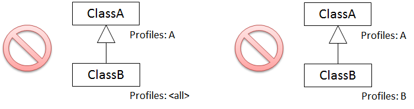
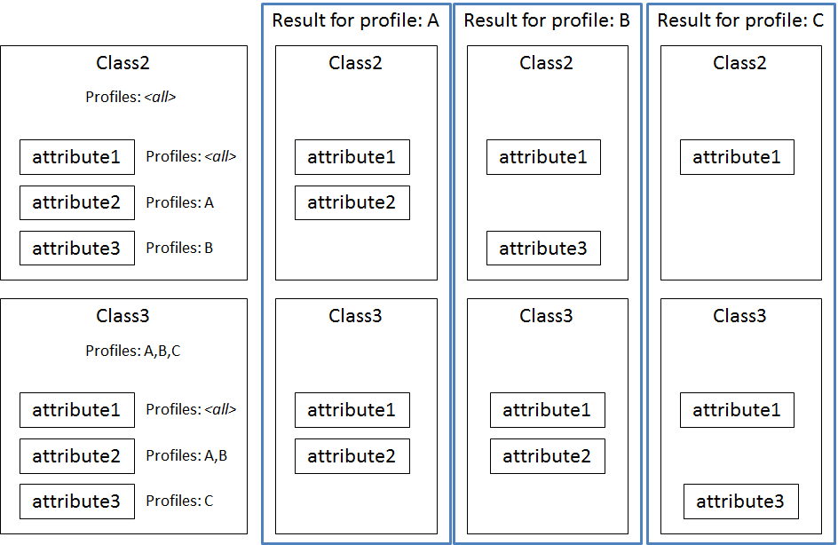
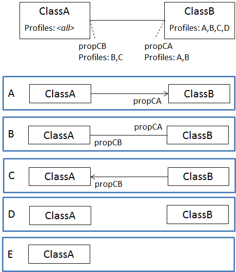
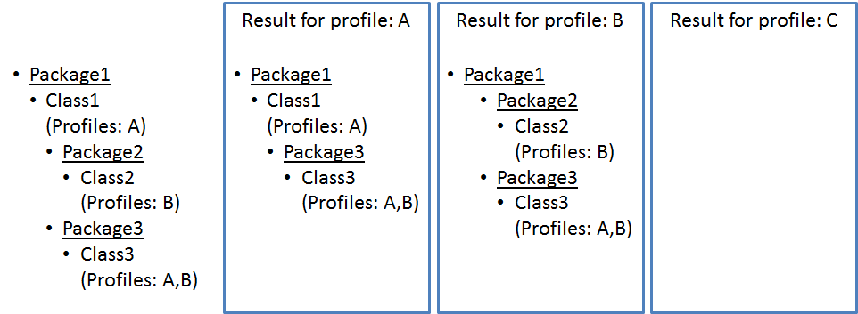
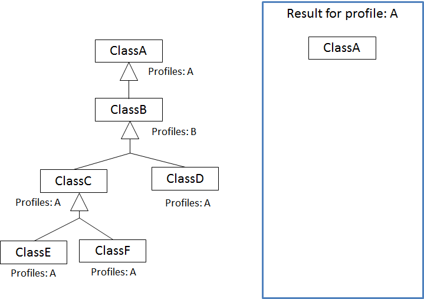

:doctype: book
:encoding: utf-8
:lang: en
:toc: macro
:toc-title: Table of contents
:toclevels: 5

:toc-position: left

:appendix-caption: Annex

:numbered:
:sectanchors:
:sectnumlevels: 5
:nofooter:

[[Profiler]]
= Profiler

[[Introduction]]
== Introduction

The Profiler creates a subset of a given model. It does so by comparing
the profile information of a given model element with the profiles
provided via a configuration parameter (called
xref:./Profiler.adoc#profiles[_profiles_]).

NOTE: This corresponds to the first way of creating a profile, as
documented xref:./Profiling.adoc[here.]

Profiling is supported for classes (also association classes), and
properties (attributes and association roles). Profile information for
packages and on a generalization relationship is not considered.
However, the Profiler can remove packages from the model in case they
are empty after profiling of model elements has been completed.

NOTE: In case that the transformation process defined by the ShapeChange
configuration includes both profiling and flattening (see
xref:../../transformations/Flattener.adoc[Flattener]) of a
model, profiling should be applied first. The reverse order may lead to
unexpected results. The reason for this is that the Flattener currently
does not support specific handling of profile information (e.g. when
flattening types).

The following sections describe how profiling works by default, and
specifies the configuration of a Profiler.

NOTE: The default profiling behavior with respect to model elements that
do not have profile information can be altered by including the rule
_rule-trf-profiling-explicit-profile-settings_. How profiling works with
this rule enabled is described on a
xref:./Profiling_with_explicit_profile_settings_rule_enabled.adoc[separate
page].

[[Description]]
== Description

[[Profile_Identifier]]
=== Profile Identifier

A model element can belong to one or more profiles. The identifier of a
profile is structured as follows: profile name, followed by an optional
version indicator and optional profile parameters. If a model element
belongs to multiple profiles, the profile identifiers are defined in a
comma-separated list.

Example: ProfileA[1-](parameterX[value1,value2],parameterY[value3]),
ProfileB, ProfileC(parameterX[value4],parameterZ)

[[Profile_Name]]
==== Profile Name

The regular expression for a profile name is: (\w|-)+ 

Examples: A, Core, X-Y

[[Version_Indicator]]
==== Version Indicator

The profiler distinguishes between two types of version indicators:
strict and loose. The strict type is used for the profile parameter in
the Profiler configuration. It is used to identify exactly one version
of a profile. The loose type can be used in the profile information of a
model element, to define to which specific version or version ranges the
element belongs.

The regular expressions for strict and loose version indicators are as
follows:

* strict (with a single version number): +++\[[0-9]+(\.[0-9]+)*\]+++
* loose (with a list of version numbers, closed version ranges, or open
version ranges):
+++\[(-[0-9]+(\.[0-9]+)*|[0-9]+(\.[0-9]+)*-[0-9]+(\.[0-9]+)*|[0-9]+(\.[0-9]+)*-|[0-9]+(\.[0-9]+)*)(;(-[0-9]+(\.[0-9]+)*|[0-9]+(\.[0-9]+)*-[0-9]+(\.[0-9]+)*|[0-9]+(\.[0-9]+)*-|[0-9]+(\.[0-9]+)*))*\]+++

Examples: [4.7], [1-2;4-5.5], [-3;4], [5-]

Some definitions regarding version indicators:

* The start of a version range is inclusive, while the end is exclusive.
[4-5.5], for example, specifies that the model element belongs to all
versions from version 4.0 up to version 5.5.
* Version indicators are treated like time instants/periods including
the computation of relative position (see ISO 19108
TM_RelativePosition). A single version number thereby can in fact be
treated like a version range. For example, the version indicator [1.1.3]
has a single version number. The Profiler treats this like the version
range [1.1.3-1.1.4].
* The profile range [1.1-1.1.3] is treated like the range [1.1.0-1.1.3].
* If the begin of a version range is undefined (example: [-3]) then it
is assumed to be 0, i.e. "zero" or "null".
* If the end of a version range is undefined (example: [1-]) then it is
assumed to be unlimited (more specifically, java.lang.Integer.MAX_VALUE)
* The version ranges [1.1.1-1.1], [1.1-1.1], [2-1], [1.2-1.1] are
invalid because the begin of each version range is not before its end.

[[Profile_Parameter]]
==== Profile Parameter

Profile parameters influence the way that a model element is defined in
a profile.

The regular expression for a profile parameter is:
+++\(\w+(\[.*?\])?(,\w+(\[.*?\])?)*\)+++

Examples:

* (parameterX[value1,value2],parameterY[value3])
* (parameterX[value4],parameterZ)
* (geometry[P,S],multiplicity[1])

The following profile parameters have been defined so far:

* _geometry_ – If the _geometry_ profile parameter is set for a feature
type, the profiler checks if the feature type has a tagged value
_geometry_. If it does, then the profiler checks that the profile
parameter defines a subset of the geometry types that are allowed via
the tagged value. If it does not, a warning is issued. Then, the
intersection of geometry types allowed via the tagged value and the
profile parameter is stored in the tagged value. If the feature type
initially did not have a _geometry_ tagged value, then the value of the
profile parameter is set as tagged value _geometry_ on the feature type.
This tagged value can be used in subsequent processing steps, for
example flattening (see
xref:../../transformations/Flattener.adoc#rule-trf-prop-flatten-homogeneousgeometries[_rule-trf-prop-flatten-homogeneousgeometries_]).
* _multiplicity_ – The profiler restricts the multiplicity of a property
(e.g. from 0..* to 1..*) as defined via this profile parameter. If the
parameter value would lead to an extension of the multiplicity range, a
warning is issued and the intersection of the multiplicity ranges is set
as new multiplicity of the property.
* _isNavigable_ – The profiler sets the navigability of an association
role to false if this parameter does not equal 'true'. If the whole
association would no longer be navigable, the profiler will issue a
warning – and remove the association.

All unknown profile parameters are simply set as tagged value of the
model element. The tagged values can then be used in subsequent
processing steps.

[[Model_Requirements]]
=== Model Requirements

Profile information is read from model files as follows:

* Typically (for all model types other than SCXML), profile information
is given via the tagged value "profiles". The value is a comma-separated
list of profile identifiers.
* For a model in SCXML format (see
xref:../../targets/Model_Export.adoc[_Model Export_] target),
profile information is stored in specific elements, not the "profiles"
tagged value of that model element (which facilitates handling of
profile information by the
https://github.com/ShapeChange/ProfileManagementTool[_ShapeChange
Profile Management Tool_]).

If no profiles are defined for a property (attribute or association
role), then the property "inherits" the profile information from the
class it belongs to. If no profiles are defined for a class then the
class is assumed to belong to all possible profiles. This will be
explained via examples later on.

[[How_Profiling_Works]]
=== How Profiling Works

[[Containment_of_Profile_Identifiers]]
==== Containment of Profile Identifiers

To determine whether the profile information of a model element contains
a given (set of) profile information, the profiler first determines if
all profile names of the given profile information are contained in the
profile information of the model element. "A,B", for example, contains
"A", "B", and "A,B" but not "C".

Then the Profiler determines if the version indicators for each profile
identifier match up. In order to do so, the profiler checks the relative
position of the version ranges that the two version indicators
represent. The Profiler uses an OR combination of ISO 19108 BegunBy,
Contains and EndedBy: self.begin \<= other.begin AND self.end >=
other.end. If this relationship is true, then the version indicators
match up, i.e. the given version indicator (other) is contained in this
version indicator (self).

Examples:

* {blank}
+
P[0-MAX_INTEGER] contains P[1-2]: true
* {blank}
+
P[1-2] contains P[0-MAX_INTEGER] : false
* {blank}
+
P[1-2] contains P[2-3]: false
* {blank}
+
P[1-2] contains P[1.1-1.2]: true
* {blank}
+
P[1.2-5] contains P[1.1.9-3]: false
* {blank}
+
P[1.2-5] contains P[2-5]: true

As described before, a version indicator can contain a list of version
numbers and version ranges. The Profiler automatically merges this
information into disjoint version ranges. Example: [1-2.0;1.5-2;0.4-10]
is automatically converted to [0.4-10].

[[Profiling_of_Model_Elements]]
==== Profiling of Model Elements

The following subsections describe how the Profiler handles different
model elements: generalization relationships, attributes, associations,
and association classes. For a better understanding, the profile
identifiers in these examples do not contain version indicators. This is
explained via a separate example at the end of this section.

[[Inheritance]]
===== Inheritance

The following figure shows how the Profiler handles a generalization
relationship between two model classes.

image::../../images/profiler-inheritance.png[image]

The following diagram shows invalid profile configurations. They are
invalid because the profile set of ClassA does not contain the profile
set of ClassB.

This can cause unexpected behavior, when the subtype remains in the
model but its supertype has been removed by the profiler. ShapeChange
reports an error when it encounters such invalid profile configurations.

 

[[Attributes]]
===== Attributes

The following two figures show how the Profiler handles attributes.

image::../../images/profiler-attributes.png[image]

The next diagram shows invalid profile configurations. They are invalid
because the profile set of ClassA does not contain the (complete)
profile set of attribute3.

image::../../images/profiler-attributes-invalid.png[image]

When ShapeChange encounters such an invalid profile configuration, it
logs a warning.

[[Associations]]
===== Associations

The following figure shows how the Profiler handles associations.

The next diagram shows an invalid profile configuration. It is invalid
because the profile set of ClassA does not contain the (complete)
profile set of propCA.

image::../../images/profiler-associations-invalid.png[image]

When ShapeChange encounters such an invalid profile configuration, it
logs a warning.

[[Association_Classes]]
===== Association Classes

The following figure shows how the Profiler handles association classes.

NOTE: If an association is removed, the association class is removed as
well – and vice versa.

[[Taking_Into_Account_Version_Indicators]]
===== Taking Into Account Version Indicators

The following figure shows how the Profiler handles version indicator
information. The example is for attributes and classes but the same
mechanism applies for other model elements.

The next diagram shows an invalid profile configuration. It is invalid
because the profile set of Class1 does not contain the (complete)
profile set of attribute3 (where B is unlimited, while for the class it
is not).

image::../../images/profiler-version-indicator-invalid.png[image]

[[Additional_Behavior]]
=== Additional Behavior

The Profiler supports a number of optional processing tasks. They are
described in the following sections.

[[Constraint_Handling]]
==== Constraint Handling

The profiler can remove class constraints from the model during the
profiling process. The following behaviors are defined:

[cols=","]
|===
|*_constraintHandling Parameter Value_* |*_Resulting Behavior_*

|*keep*(this is the default behavior) |Keep all class constraints.

|*remove* |Remove all class constraints.

|*removeByPropertyNameInConstraintName* |Remove a class constraint if
its name contains the name of a property (with the suffix "_Type") that
is being removed through profiling. For example, if the attribute "att"
is removed from a class during profiling, then any constraint of that
class whose name contains "att_Type" is removed by the Profiler.
|===

[[Removal_of_Residual_Types]]
==== Removal of Residual Types

Profiling may result in object, data and union type classes to no longer
be used as the type of a feature type property. The Profiler can remove
such residual classes from the model.

[[Removal_of_Empty_Packages]]
==== Removal of Empty Packages

Profiling can result in all classes of a package to be removed. The
Profiler can remove such empty packages. It can also check if a parent
package only contains empty packages and remove such (parent) packages
as well.

The following diagram shows an example how this works.

[[Removal_of_a_Class_and_all_its_Subtypes]]
==== Removal of a Class and all its Subtypes

A class can be part of an inheritance hierarchy. Profiling may result in
the removal of such a class. If the class is not a leaf in the
inheritance tree, the model semantics could be broken. By default the
profiler simply removes the class, which leads to a disconnect in the
inheritance tree. By enabling
xref:./Profiler.adoc#rule-trf-profiling-processing-classRemovalIncludesAllSubtypes[_rule-trf-profiling-processing-classRemovalIncludesAllSubtypes_]
the profiler can be instructed to not only remove the class but also all
its (direct and indirect) subtypes. The following figure illustrates
this behavior:

[[Removing_profile_information_after_profiling]]
==== Removing profile information after profiling

By enabling
xref:./Profiler.adoc#rule-trf-profiling-postprocessing-removeProfileInfos[_rule-trf-profiling-postprocessing-removeProfileInfos_],
all profile information (including the "profiles" tagged value) will be
removed in the processed model. This can be useful for cleaning up the
model for subsequent processing steps where profile information shall
not be included, like writing the model back into an Enterprise
Architect repository.

[[Keeping_an_Association_As_Is]]
=== Keeping an Association As Is

The profiler processes properties not only in case they are modelled as
class attributes but also if modelled as association roles. If a
property represented by an association role is removed by the profiler,
the default profiling behavior would lead to a modification or even to
the removal of the association. In specific circumstances this may not
be desired; instead, associations should be kept as-is. This can be
achieved by enabling
xref:./Profiler.adoc#rule-trf-profiling-processing-keepAssociationAsIs[_rule-trf-profiling-processing-keepAssociationAsIs_].
The following figure illustrates the changed profiling behavior under
this rule:

NOTE: If a class is removed then all associations that have this class
as source or as target are still removed during profiling.

[[Configuration]]
== Configuration

The following sections specifiy the configuration options for a
Profiler.

[[Class]]
=== Class

The class for the Profiler implementation is
_de.interactive_instruments.ShapeChange.Transformation.Profiling.Profiler._

[[Transformation_Rules]]
=== Transformation Rules

[[rule-trf-profiling-preprocessing-modelConsistencyCheck]]
==== rule-trf-profiling-preprocessing-modelConsistencyCheck

Checks that the profile information of a model element is consistent
regarding the model (i.e., the profile sets of a class contains the
profile sets of all its subclasses and properties). If an invalid
profile configuration is found, an error or warning will be logged.

[[rule-trf-profiling-processing-classRemovalIncludesAllSubtypes]]
==== rule-trf-profiling-processing-classRemovalIncludesAllSubtypes

If this rule is enabled, the profiler does not only remove individual
classes if their profiles do not match, but also all their (direct and
indirect) subclasses.

[[rule-trf-profiling-processing-explicitProfileSettings]]
==== rule-trf-profiling-processing-explicitProfileSettings

If this rule is enabled, model elements without profile information are
treated as if they belonged to no profile (which overrides the default
behavior that classes belong to all profiles and properties inherit
profiles from their class).The profiling behavior under this rule is
described on a
xref:./Profiling_with_explicit_profile_settings_rule_enabled.adoc[separate
page].

[[rule-trf-profiling-processing-keepAssociationAsIs]]
==== rule-trf-profiling-processing-keepAssociationAsIs

If this rule is enabled, the profiler ignores association roles while
profiling individual properties. If profiling would normally result in
an association role to be removed (and thus the association modified or
also removed), it will be kept as is. Note that associations with
association class are still removed if the association class is removed.

[[rule-trf-profiling-postprocessing-removeEmptyPackages]]
==== rule-trf-profiling-postprocessing-removeEmptyPackages

The Profiler removes all empty packages from the model (including parent
packages whose child packages are empty).

[[rule-trf-profiling-postprocessing-removeProfileInfos]]
==== rule-trf-profiling-postprocessing-removeProfileInfos

(since v2.4.0)

If this rule is enabled, all profile information (including the
"profiles" tagged value) will be removed in the processed model. This
can be useful for cleaning up the model for subsequent processing steps
where profile information shall not be included, like writing the model
back into an Enterprise Architect repository.

[[rule-trf-profiling-postprocessing-removeResidualTypes]]
==== rule-trf-profiling-postprocessing-removeResidualTypes

The Profiler removes all non feature type classes from the model that
are not used directly or indirectly by feature types of the model. More
specifically, the Profiler looks for data types, object types, unions
etc.: any of these non feature types that is not directly (through
attributes, associations, and supertypes) or indirectly (e.g. through
other non feature type classes of the model) used by model feature types
is removed. Subtypes of non feature types that are not directly or
indirectly used are also removed, unless the parameter
xref:./Profiler.adoc#residualTypeRemoval_includeSubtypesFor[_residualTypeRemoval_includeSubtypesFor_]
is set accordingly.

[[Parameters]]
=== Parameters

[[constraintHandling]]
==== constraintHandling

Required / Optional: optional

Type: Enumeration, one of:

* keep
* remove
* removeByPropertyNameInConstraintName

Default Value: keep

Explanation: Specifies how the Profiler should handle class constraints.
See xref:./Profiler.adoc#Constraint_Handling[Constraint Handling] for further
information.

Applies to Rule(s): _none_ - default behavior

[[profiles]]
==== profiles

Required / Optional: required

Type: String (comma-separated list of profile identifiers)

Default Value: _none_

Explanation: The Profiler will check if a model element contains the
list of profile identifiers given via this parameter, and remove the
element if this is not the case.

Applies to Rule(s): _none_ - default behavior

[[residualTypeRemoval_includeSubtypesFor]]
==== residualTypeRemoval_includeSubtypesFor

Required / Optional: optional

Type: string with regular expression (using the
https://docs.oracle.com/javase/8/docs/api/java/util/regex/Pattern.html[syntax
supported by Java])

Default Value: _none_

Explanation: Regular expression that identifies the non feature type
classes of the model for which - if used (directly or indirectly) by
feature types - direct subtypes shall not be removed during residual
type removal (a postprocessing step available for the profiler).

For example, if feature type FT_A has an attribute of type T_B, and T_B
has the specializations / subtypes T_B1 and T_B2, which are never used
as type in the model, then usually residual type removal would remove
T_B1 and T_B2. However, if this parameter is set to "T_B", then T_B1 and
T_B2 are not removed. Their subtypes would be removed. If that shall not
happen, the regular expression needs to be constructed accordingly, for
example: "^T_B\w*"

Applies to
Rule(s): xref:./Profiler.adoc#rule-trf-profiling-postprocessing-removeResidualTypes[_rule-trf-profiling-postprocessing-removeResidualTypes_]

[[Map_Entries]]
=== Map Entries

At the moment no map entries are defined for the Profiler.

[[Sample_Configuration]]
== Sample Configuration

[source,xml,linenumbers]
----------
<Transformer class="de.interactive_instruments.ShapeChange.Transformation.Profiling.Profiler" mode="enabled" id="A">
    <parameters>
        <ProcessParameter name="profiles" value="A"/>
        <ProcessParameter name="constraintHandling" value="remove"/>
    </parameters>
    <rules>
        <ProcessRuleSet name="profiler">    
            <rule name="rule-trf-profiling-preprocessing-modelConsistencyCheck"/>
            <rule name="rule-trf-profiling-postprocessing-removeEmptyPackages"/>
        </ProcessRuleSet>
    </rules>
</Transformer>
----------
