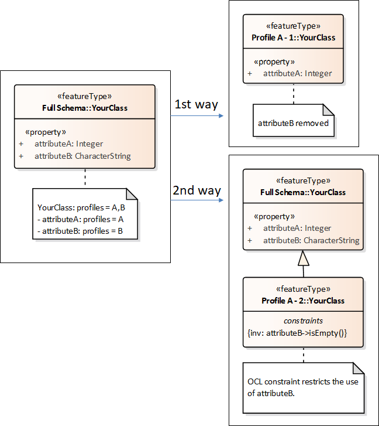
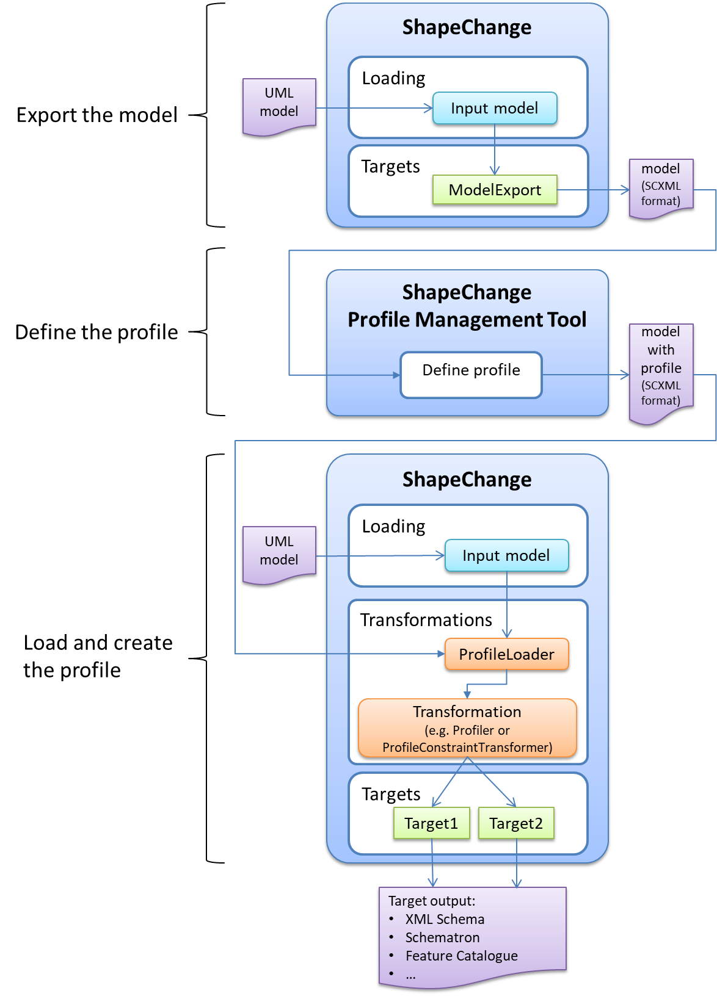

:doctype: book
:encoding: utf-8
:lang: en
:toc: macro
:toc-title: Table of contents
:toclevels: 5

:toc-position: left

:appendix-caption: Annex

:numbered:
:sectanchors:
:sectnumlevels: 5

[[Profiling]]
= Profiling

An application schema defines semantics of content and the logical
structures of geographic data. The schema thereby supports the
information requirements of one or more use cases. The more use cases
the schema supports, the higher the complexity of fully implementing it
typically is. A specific application often only needs to support a
specific subset of these use cases. Therefore, a typical goal is to
restrict the full application schema to just the information that is
required by the application, thereby reducing the implementation cost
and complexity. Such a restriction is what we call a "schema profile"
(also just "profile", or "profile schema"). The process of creating a
schema profile is called profiling.

There are two ways to create a schema profile:

. Subsetting the full application schema, i.e. removing schema elements
that do not belong to the profile. The resulting profile is a new
application schema, typically in a profile specific namespace. You can
derive an implementation schema from this profile, for example a
database schema or an XML Schema.
* NOTE: An XML Schema of the schema profile would contain a subset of
the elements that are contained in the XML Schema of the full
application schema, and be in a different namespace. The restrictions
defined by the schema profile are fully represented by its XML Schema,
and can be checked by validating XML encoded data against this XML
Schema.
* This way of creating a schema profile is supported by the _Profiler_
* Use this approach if you can – and are allowed to – directly modify
the full application schema, and if you can – and are allowed to -
ignore the implementation schemas that have been derived from the full
application schema.
. Creating an additional application schema that defines the
restrictions of the full application schema via OCL constraints. These
constraints would be modelled on classes that belong to the additional
schema, which then defines a schema profile. This schema profile also
typically belongs to a unique namespace, and you can derive
implementation schemas from it.
* NOTE: The derivation of implementation schemas has a different goal
when compared to the other way of profiling. Here, a database schema or
XML Schema of the profile would not represent the restrictions. In fact,
the XML Schema of the profile would import the XML Schema of the full
application schema as-is, and could define extensions. However: A
Schematron Schema derived from the OCL constraints in the profile schema
would provide the means to validate XML encoded data, and ensure that
the restrictions defined by the profile are met.
* NOTE: This way of creating a profile is compliant to creating metadata
profiles as defined by ISO 19115/19139.
* The
xref:./Profile_Constraint_Transformer.adoc[_ProfileConstraintTransformer_]
has transformation rules that support this way of profiling.
* Use this approach if you are not allowed to directly modifiy the full
application schema, and if you are not allowed to ignore the
implementation schemas derived from the full application schema. You can
enforce the restrictions defined by the profile through specific
implementation schemas derived from the profile – like a Schematron
Schema.

The following sections provide a brief overview of the transformations
that support different aspects of profiling. Each section also contains
a reference to the detailed documentation of the respective
transformation.

[[ProfileLoader]]
== ProfileLoader

Whether or not a class or property belongs to a particular profile is
typically modelled via the tagged value "profiles". You can set this
tagged value in your model, and ShapeChange would read the profile
information when loading the model.

However, modelling a profile this way can become quite complex. The
https://github.com/ShapeChange/ProfileManagementTool[ShapeChange
_Profile Management Tool_ (PMT)] was developed to support a user in
defining profiles. Profiles defined with the PMT can be loaded into the
model using the _ProfileLoader_ transformation (for further details, see
xref:./Profile_Loader.adoc[here]),
and then be used by subsequent transformation. The following picture
illustrates this workflow.

The detailed documentation of the ProfileLoader can be found
xref:./Profile_Loader.adoc[here].

[[Profiler]]
== Profiler

The Profiler transformation uses profile information in the schemas
selected for processing to create a subset, i.e., a "profile", of these
schemas. The detailed documentation of the Profiler can be found
xref:./Profiler.adoc[here].

NOTE: Schemas are selected for processing via specific parameters,
either on the configuration of the transformation or the input (for
further details, see
xref:../../transformations/Common_Transformer_Functionality.adoc#Selecting_the_Schemas_to_Process[here]).

[[ProfileConstraintTransfomer]]
== ProfileConstraintTransfomer

This transformer creates restrictions of the model elements in specific
application schemas by creating OCL constraints in subtypes of the
corresponding classes (of the application schema) in a separate profile
schema. The constraints encode the restrictions. They can be used, for
example, to derive a Schematron Schema. The detailed documentation of
the ProfileConstraintTransformer can be found
xref:./Profile_Constraint_Transformer.adoc[here].
