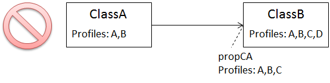

:doctype: book
:encoding: utf-8
:lang: en
:toc: macro
:toc-title: Table of contents
:toclevels: 5

:toc-position: left

:appendix-caption: Annex

:numbered:
:sectanchors:
:sectnumlevels: 5

[[Profiling_with_explicit_profile_settings_rule_enabled]]
= Profiling with explicit profile settings rule enabled

The default behavior for profiling can be altered by including the rule
_rule-trf-profiling-processing-explicitProfileSettings_ in the
configuration of the Profiler. The following sections describe the
behavior of the profiler under this rule.

[[Profile_Identifier]]
== Profile Identifier

Same as described
xref:./Profiler.adoc#Profile_Identifier[here].

[[Model_Requirements]]
== Model Requirements

Profile information for a model element is given via the tagged value
"profiles". The value is a comma-separated list of profile identifiers.
If the tagged value is missing or empty, then the model element will be
removed by the Profiler. This will be explained via examples later on.

[[How_Profiling_Works]]
== How Profiling Works

[[Containment_of_Profile_Identifiers]]
=== Containment of Profile Identifiers

Same as described
xref:./Profiler.adoc#Containment_of_Profile_Identifiers[here].

[[Profiling_of_Model_Elements]]
=== Profiling of Model Elements

The following subsections describe how the Profiler handles different
model elements when the rule
_rule-trf-profiling-processing-explicitProfileSettings_ is enabled:
generalization relationships, attributes, associations, and association
classes. For a better understanding, the profile identifiers in these
examples do not contain version indicators. Version indicators are
handled  the same way as in the default profiling behavior (further
details:
xref:./Profiler.adoc#How_Profiling_Works[here]
- last subsection titled 'Taking Into Account Version Indicators').

[[Inheritance]]
==== Inheritance

The following figure shows how the Profiler handles a generalization
relationship between two model classes.

The following diagram shows an invalid profile configuration. It is
invalid because the profile set of ClassA does not contain the profile
set of ClassB.

WARNING: If a class without profile information is part of an
inheritance hierarchy, profiling under the specific behavior documented
on this page will cause the inheritance tree to be interrupted - unless
rule-profiling-processing-classRemovalIncludesAllSubtypes is enabled!
ShapeChange will log an error if it detects such an interruption during
pre-processing, more specifically while executing
rule-trf-profiling-preprocessing-modelConsistencyCheck. Instead of an
error message ShapeChange will log an info message, if the interruption
will be prevented because
rule-profiling-processing-classRemovalIncludesAllSubtypes is enabled.

[[Attributes]]
==== Attributes

The following two figures show how the Profiler handles attributes.

The next diagram shows an invalid profile configuration. It is invalid
because the profile set of ClassA does not contain the (complete)
profile set of attribute3.

When ShapeChange encounters such an invalid profile configuration, it
logs a warning.

[[Associations]]
==== Associations

The following two figures show how the Profiler handles associations.

The next diagram shows an invalid profile configuration. It is invalid
because the profile set of ClassA does not contain the (complete)
profile set of propCA.

When ShapeChange encounters such an invalid profile configuration, it
logs a warning.

[[Association_Classes]]
==== Association Classes

The following two figures show how the Profiler handles association
classes.

NOTE: If an association is removed, the association class is removed as
well – and vice versa.

[[Additional_Behavior]]
== Additional Behavior

Same as described
xref:./Profiler.adoc#Additional_Behavior[here].

 
